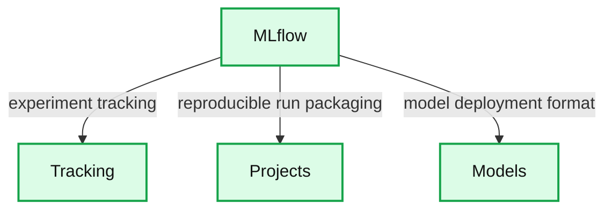

# Kicking Off 2019 with an MLflow User Survey

- Source: https://www.databricks.com/blog/2019/01/08/kicking-off-2019-with-an-mlflow-user-survey.html
- Published: 2019-01-08
- Authors: Matei Zaharia
- Categories: solutions, engineering, open-source, data-science-machine-learning
- Images: 1 total, 1 extracted as architecture

It’s been six months since we launched [MLflow](https://www.databricks.com/blog/2018/06/05/introducing-mlflow-an-open-source-machine-learning-platform.html), an open source platform to manage the machine learning lifecycle, and the project has been moving quickly since then. MLflow fills a role that hasn’t been served well in the open source community so far: managing the *development lifecycle* for ML, including tracking experiments and metrics, building reproducible production pipelines, and deploying ML applications. Although many companies build custom internal platforms for these tasks, there was no open source ML platform before MLflow, and we discovered that the community was excited to build one: since last June, 66 developers from over 30 different companies have contributed to MLflow.

Given the [feedback](https://github.com/mlflow/mlflow/issues) from open source and Databricks users so far, we already have several goals for MLflow in 2019, including stabilizing the API in MLflow 1.0 and improving existing components. However, we are always very keen to hear more user input, so we’re starting this year with our first [MLflow user survey](https://docs.google.com/forms/d/e/1FAIpQLSfBSfnUnwL49ELrG35nYnQJEXzUfuYYukbYFHPdZh8AGJrbJA/viewform?usp=send_form). If you’ve tried MLflow or thought about what you’d like in an ML development platform, we’d love to hear your feedback. As a token of our appreciation, all survey respondents will have a chance to win an MLflow T-shirt or a ticket to [Data + AI Summit](https://www.databricks.com/dataaisummit).

In this post, we’ll briefly describe what MLflow is and some of our ongoing work for 2019. We hope this gives you a sense of what we have in mind, but we’d love to [hear your feedback](https://docs.google.com/forms/d/e/1FAIpQLSfBSfnUnwL49ELrG35nYnQJEXzUfuYYukbYFHPdZh8AGJrbJA/viewform?usp=send_form).

## What is MLflow?

MLflow is a platform to manage the machine learning lifecycle, making it faster to build and maintain ML applications. Unlike traditional software development, ML development requires managing large numbers of data sets, experiments and models and updating the resulting models continuously to optimize a prediction metric. MLflow provides three simple tools that can be used with any ML library or framework to manage this process:

**Summary:** MLflow connects to Tracking, Projects, and Models components.

**Components:**

- MLflow: machine learning lifecycle platform
- Tracking: records and queries experiment code, data, configuration, and results
- Projects: packages reproducible runs for any platform
- Models: provides a general format for sending models to diverse deployment tools

**Flows:**

- MLflow -> Tracking: experiment tracking
- MLflow -> Projects: reproducible run packaging
- MLflow -> Models: model deployment format

**Numbers:** none

source image: https://www.databricks.com/wp-content/uploads/2018/10/mlflow.png

- [MLflow Tracking](https://mlflow.org/docs/latest/tracking.html): a REST API to log parameters, code versions, metrics and other results from experiments, along with a UI to search, share and compare these results. This component adds structure to the experimentation phase of model building, where users can quickly compare past results, and also provides a powerful means to track the performance of models in production as they are periodically retrained.
- [MLflow Projects](https://mlflow.org/docs/latest/projects.html): a packaging format for reproducible runs that allows users to get another developer’s code running rapidly with the right library dependencies, or submit remote runs to a cloud platform such as Databricks.
- [MLflow Models](https://mlflow.org/docs/latest/models.html): a format for packaging *models* so they can be deployed to various ML scoring environments, such as REST serving or batch inference. MLflow Models allow ML developers to package models from any ML framework, or custom code, behind a consistent interface for deployment.

These components are designed to work well either together or separately, letting users adopt the most useful ones incrementally. For example, many of our early users on Databricks started with MLflow Tracking for experiment management, then began using MLflow Models to package their custom inference code together with their models for deployment. Other customers started with MLflow Projects to run their training jobs in the cloud, and then picked up Tracking to manage results from these runs.

## What’s Coming Next in MLflow

For 2019, we’re already working on four categories of features to improve MLflow, which cover both improving the existing components and adding new ones. The major efforts are:

**API Stabilization in MLflow 1.0:** We believe heavily in providing stable, forward-compatible APIs so that users can build on our software.  Therefore, one of our key goals for the first half of 2019 is to stabilize the MLflow API in MLflow 1.0. After 1.0, MLflow will follow [semantic versioning](https://semver.org), and clearly mark any experimental APIs in a similar manner to [Apache Spark](https://spark.apache.org/versioning-policy.html). The good news is that users are already fairly satisfied with our beta API, but we want to smooth any rough edges in 1.0. We’d love to hear your feedback about these in [our survey](https://docs.google.com/forms/d/e/1FAIpQLSfBSfnUnwL49ELrG35nYnQJEXzUfuYYukbYFHPdZh8AGJrbJA/viewform?usp=send_form).

**Improving the existing components:** There’s a lot of exciting ongoing work on the existing components. For example, we recently merged a patch to add a [database backend](https://github.com/mlflow/mlflow/pull/756) for the MLflow tracking server to improve scalability, and there is also a patch to add [Docker](https://github.com/mlflow/mlflow/pull/555) as a format for packaging projects. The other major area where we want to invest is model packaging -- for example, by adding a way to specify the data schema of a model.

**New components:** We designed MLflow as a set of modular APIs to allow adding new components that work with existing ones. For 2019, two major components we are considering at are a *model registry* for managing multiple versions of models, and a *telemetry API* to record metrics from deployed models in a consistent way regardless of where they are running. We’d love to hear your feedback on these ideas.

**General availability of hosted MLflow:** Last year, Databricks launched a private beta of hosted MLflow that is already available to our customers. We are working to make this product generally available for anyone who wants a hosted MLflow server.

Of course, we would love your feedback on all these initiatives and on other obstacles you see to production ML. Please [take a few minutes to fill our survey](https://docs.google.com/forms/d/e/1FAIpQLSfBSfnUnwL49ELrG35nYnQJEXzUfuYYukbYFHPdZh8AGJrbJA/viewform?usp=send_form) to help shape our roadmap.

## Where to Go From Here

If you’d like to learn more about MLflow, the [official documentation](https://mlflow.org/docs/latest/index.html) provides a thorough starting point. We also have a [newsletter](https://www.databricks.com/product/managed-mlflow) for updates on MLflow and a [Slack channel](https://mlflow-users.slack.com/join/shared_invite/enQtMzkxMTAwNTcyODM5LTNkNTc5YWZlNDNjMzZiYWJhOTQwMjYwYWE3NDU2YTgzMDViYjJhNWI1MGI4NjViNTA0M2FhMzNhZTVkODE2NmU) for real-time question answering from other users.
