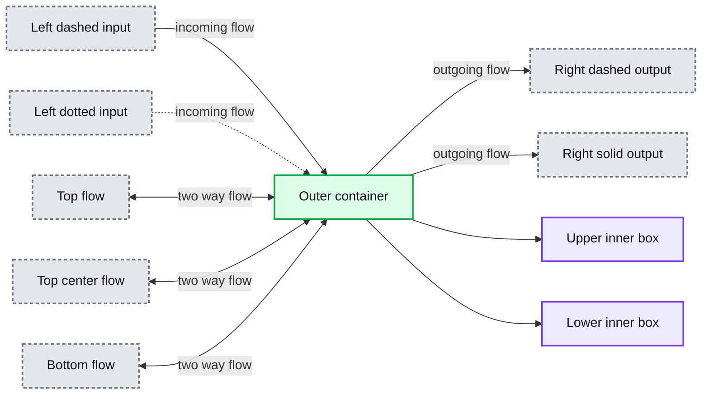

# A Guide to Data Engineering Talks at Spark + AI Summit 2019

- Source: https://www.databricks.com/blog/2019/02/25/a-guide-to-data-engineering-talks-at-spark-ai-summit-2019.html
- Published: 2019-02-25
- Authors: Singh Garewal
- Categories: announcements, open-source, company, events
- Images: 1 total, 1 extracted as architecture

## Selected highlights from the new track

Big data practitioners grapple with data quality issues and data pipeline complexities—it's the bane of their existence. Whether you are chartered with advanced analytics, developing new machine learning models, providing operational reporting or managing the data infrastructure, the concern with data quality is a common theme. Data engineers, in particular, strive to design and deploy robust data pipelines that serve reliable data in a performant manner so that their organizations can make the most of their valuable corporate data assets.

**Summary:** An unlabeled outer container encloses two unlabeled inner horizontal boxes with directional inputs and outputs.

**Components:**

- Unlabeled outer container
- Unlabeled upper inner box
- Unlabeled lower inner box

**Flows:**

- Left dashed input -> outer container: incoming flow
- Left dotted input -> outer container: incoming flow
- Outer container -> right dashed output: outgoing flow
- Outer container -> right solid output: outgoing flow
- Top bidirectional flow <-> outer container: two-way flow
- Top center bidirectional flow <-> outer container: two-way flow
- Bottom bidirectional flow <-> outer container: two-way flow

**Numbers:** none

source image: https://www.databricks.com/wp-content/uploads/2019/02/DETrackSummit2019.png

Recognizing the importance of data engineering, this year the [Spark + AI Summit](https://www.databricks.com/sparkaisummit/north-america) includes a new track dedicated to data engineering where presenters will be talking about data engineering and sharing their experience with Apache Spark as applied to their use cases.

In the talk [Lessons Learned Using Apache Spark for Self-Service Data Prep in SaaS World](https://www.databricks.com/session/lessons-learned-using-apache-spark-for-self-service-data-prep-in-saas-world), Pavel Hardak and Jianneng Li of Workday will describe their journey in building Workday’s new analytics product, Workday Prism Analytics sharing the challenges faced along with real-life war stories caused by customers stretching product boundaries.

Apache Spark is held by many to now be the defacto big data processing engine. In his talk [Migrating to Apache Spark at Netflix](https://www.databricks.com/session/migrating-to-apache-spark-at-netflix), Ryan Blue from Netflix will talk about the mass migration to Spark from Pig and other MR engines.

Data governance is a must today. With an eye towards that, in his talk [Apache Spark Data Governance Best Practices—Lessons Learned from Centers for Medicare and Medicaid Services](https://www.databricks.com/session/apache-spark-data-governance-best-practices-lessons-learned-from-centers-for-medicare-and-medicaid-services), Donghwa Kim from NewWave (a technology partner for Centers for Medicare and Medicaid Services which serves nearly 90 million American) will cover best data governance practices including data security, data stewardship and data quality management.

Concern about production at scale is never far from a data engineer’s heart. In their talk [Scaling Apache Spark on Kubernetes at Lyft](https://www.databricks.com/session/scaling-apache-spark-on-kubernetes-at-lyft), Li Gao and Rohit Menon from Lyft will discuss challenges the Lyft team faced and solutions they developed to support Apache Spark on Kubernetes in production and at scale.

Matthew Powers from Prognos will address another key concern: performance. In his talk [Optimizing Delta/Parquet Data Lakes for Apache Spark](https://www.databricks.com/session/optimizing-delta-parquet-data-lakes-for-apache-spark) he will outline [data lake](https://www.databricks.com/discover/data-lakes/introduction) design patterns that can yield massive performance gains.

Apache Spark is a living and thriving project which can present opportunities for upgrading as new versions are released so that newer capabilities can be used. Hao Wan and Liyin Tang in their talk [Apache Spark at Airbnb](https://www.databricks.com/session/apache-spark-at-airbnb), share their major production use cases including both streaming and batch applications, the lessons learned and tips for migrating to 2.x.

Making decisions fast and accurately is key to success for a data-driven company like Zalando, Europe’s biggest online fashion retailer. In their talk, [Continuous Applications at Scale of 100 Teams with Databricks Delta and Structured Streaming](https://www.databricks.com/session/continuous-applications-at-scale-of-100-teams-with-databricks-delta-and-structured-streaming), Viacheslav Inozemtsev and Max Schultze describe the use of a data lake to hold company data and share their experience in productionizing and operating Databricks at scale and in making data-driven continuous applications feasible out of the box.

And the last talk that I want to highlight here is [Understanding Query Plans and Spark UIs](https://www.databricks.com/session/understanding-query-plans-and-spark-uis), by Xiao Li Apache Spark Committer and PMC member at Databricks. His talk will address how to read and tune the query plans for enhanced performance. It will also cover the major related features in the recent and upcoming releases of Apache Spark.

## Active Learning

If you are someone who learns best by doing, don’t forget to consider the Building Robust Production Data Pipelines with Databricks Delta tutorial, a 90-minute session with an expert-led talk designed to introduce the next-generation unified analytics engine, followed by hands-on exercises allowing attendees to learn by doing.

In a related vein, you should consider the valuable [Apache Spark Programming + Delta](https://www.databricks.com/sparkaisummit/north-america-2020/apache-spark-training) and as well as the several other [training courses](https://www.databricks.com/sparkaisummit/north-america-2020/apache-spark-training) being offered on Tuesday, April 23, the day before the conference.

## What’s Next

You can also peruse and pick sessions from the schedule, too.
 If you have not registered yet, use the code **JulesPicks** and get 15% discount.

## Read More

- [A Guide to Developer, Deep Dive, and Continuous Streaming Applications Talks at Spark + AI Summit](https://www.databricks.com/blog/2019/02/19/a-guide-to-developer-deep-dive-and-continuous-streaming-applications-talks-at-spark-ai-summit.html)
- [A Guide to AI, Machine Learning, and Deep Learning Talks at Spark + AI Summit](https://www.databricks.com/blog/2018/12/18/a-guide-to-ai-machine-learning-and-deep-learning-talks-at-spark-ai-2019.html)
