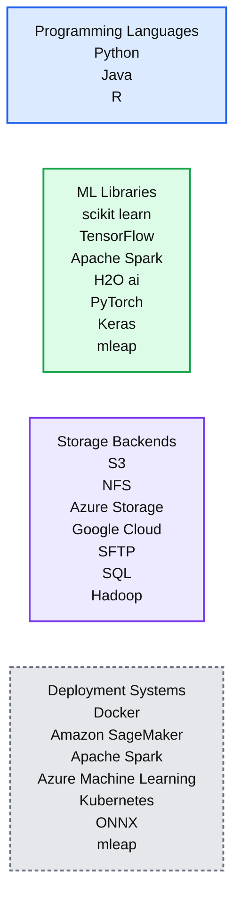

# Announcing General Availability of Managed MLflow on Databricks

- Source: https://www.databricks.com/blog/2019/04/25/announcing-general-availability-of-managed-mlflow-on-databricks.html
- Published: 2019-04-25
- Authors: Clemens Mewald, Matei Zaharia, Cyrielle Simeone
- Categories: platform, solutions, product, announcements, engineering, data-science-machine-learning, company
- Images: 2 total, 1 extracted as architecture

[Try this tutorial in Databricks](https://docs.databricks.com/applications/mlflow/quick-start.html)

[MLflow](https://mlflow.org/) is an open source platform to help manage the complete machine learning lifecycle. With MLflow, data scientists can track and share experiments locally or in the cloud, package and share models across frameworks, and deploy models virtually anywhere.

Today at the Spark + AI Summit, we announced the General Availability of Managed MLflow on Databricks: a fully managed version of MLflow integrated into Databricks. You can read more about the specific integrations on our [previous blog on Managed MLflow](https://www.databricks.com/blog/2019/03/06/managed-mlflow-on-databricks-now-in-public-preview.html).

Since we unveiled MLflow last June at the previous Spark + AI Summit, the development community around it has rapidly grown, with 85 contributors from over 40 companies. These contributors rapidly added support for multiple programming languages and integrations with popular ML libraries and frameworks.

*Supported Integrations with MLflow*

**Summary:** Supported MLflow integrations are organized across programming languages, ML libraries, storage backends, and deployment systems.

**Components:**

- Programming Languages: Python, Java, R
- ML Libraries: scikit-learn, TensorFlow, Apache Spark, H2O.ai, PyTorch, Keras, mleap
- Storage Backends: S3, NFS, Azure Storage, Google Cloud, SFTP, SQL, Hadoop
- Deployment Systems: Docker, Amazon SageMaker, Apache Spark, Azure Machine Learning, Kubernetes, ONNX, mleap

**Flows:**

- none

**Numbers:** 0, 1

source image: https://www.databricks.com/wp-content/uploads/2019/04/mlflow-integrations.jpg

Supported Integrations with MLflow

Commercial support for MLflow has also rapidly matured, with Microsoft [announcing](https://azure.microsoft.com/en-us/blog/spark-ai-summit-developing-for-the-intelligent-cloud-and-intelligent-edge/) that they will become an active contributor to MLflow.

[Managed MLflow on Databricks](https://www.databricks.com/product/managed-mlflow) offers a hosted version of MLflow fully integrated with Databricks’ security model and interactive workspace. Today, Managed MLflow is GA on both AWS and Azure.

## New in Managed MLflow: Notebook Sidebar

Tight integrations with Databricks make Managed MLflow more seamless to use. In the new GA version, one such integration is the ability to track runs from a sidebar in each Databricks notebook. Databricks also automatically captures a snapshot of your notebook every time you use MLflow, and from this sidebar, you can rapidly see the corresponding version of the notebook.

https://www.youtube.com/watch?v=BkRjMxuAVSI
 MLflow tracking integration with the notebook sidebar in Databricks

Other powerful integrations include the ability to [launch MLflow Project runs remotely](https://docs.databricks.com/applications/mlflow/projects.html) on Databricks clusters, and integrations with Databricks’s [security model](https://docs.databricks.com/administration-guide/access-control/workspace-acl.html) to add access-control to MLflow, as described in our [Managed MLflow documentation](https://docs.databricks.com/applications/mlflow/index.html).

## What's Next with Open Source MLflow?

We also have an aggressive roadmap for open source MLflow, and are excited to work with the community to expand the project. The community is working to release MLflow 1.0, which will provide API stability guarantees and also a set of new features like better search UI & API, HDFS support, simplified shell commands, and Windows support.

Watch Matei Zaharia's Keynote at Spark + AI Summit to find out more and stay tuned on our blog for more information:

## Get Started with Managed MLflow on Databricks

If you’re an existing Databricks user you can start using Managed MLflow right now. Visit the Databricks MLflow guide [[AWS](https://docs.databricks.com/applications/mlflow/index.html)][[Azure](https://docs.microsoft.com/en-us/azure/databricks/applications/mlflow/)] and the Quick Start notebook [[AWS](https://docs.databricks.com/applications/mlflow/quick-start.html)][[Azure](https://docs.microsoft.com/en-us/azure/databricks/applications/mlflow/quick-start)] to get started. If you’re not yet a Databricks user, visit [databricks.com/product/managed-mlflow](https://www.databricks.com/product/managed-mlflow) to learn more and start a free trial of Databricks and Managed MLflow.

To learn more about open source MLflow, visit [www.mlflow.org](https://www.mlflow.org) and join the community!

Finally, don’t miss our upcoming webinar – [Managing the Machine Learning Lifecycle: What's new with MLflow](https://pages.databricks.com/201906-US-WB-New-with-MLflow_Reg.html?utm_source=website&utm_medium=blog&utm_campaign=whats-new-mlflow) – with Clemens Mewald, Director of Product Management for Machine Learning and Data Science at Databricks.
