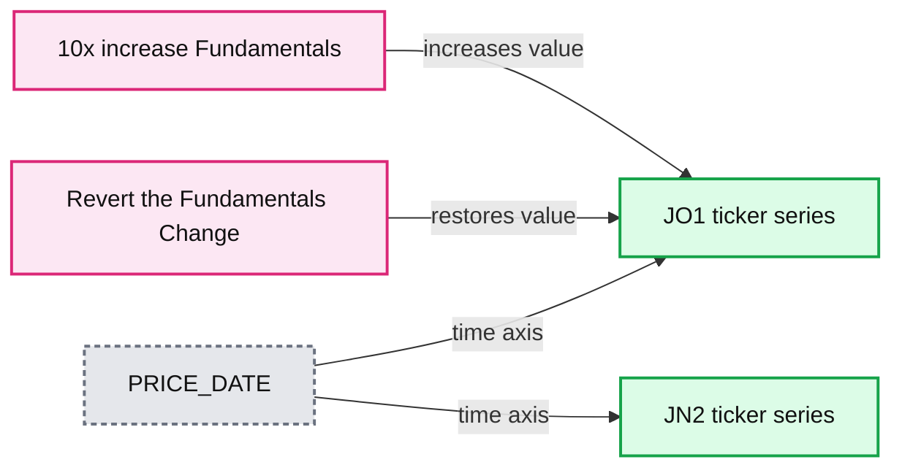
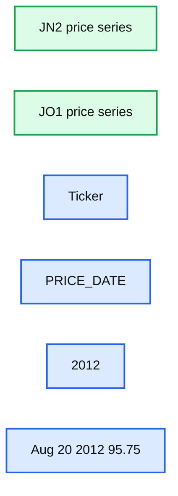
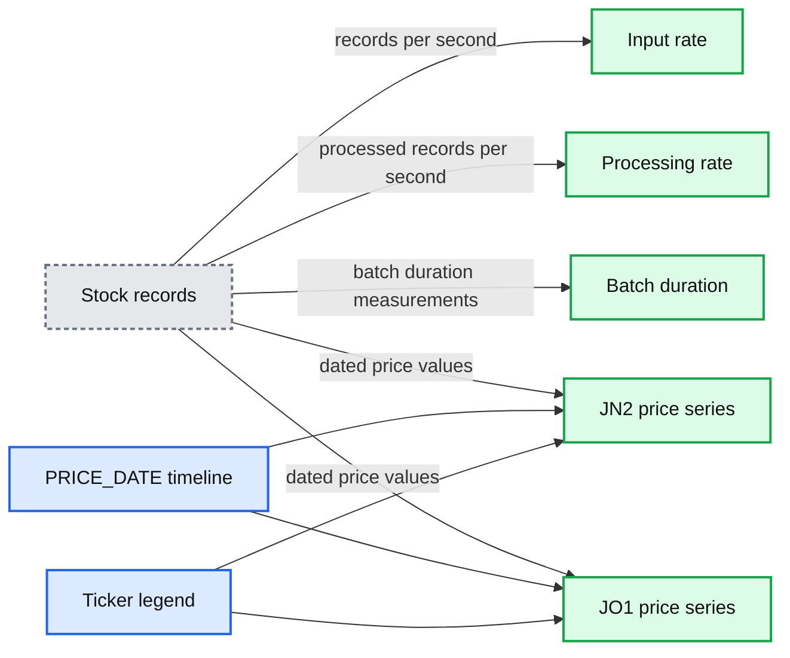
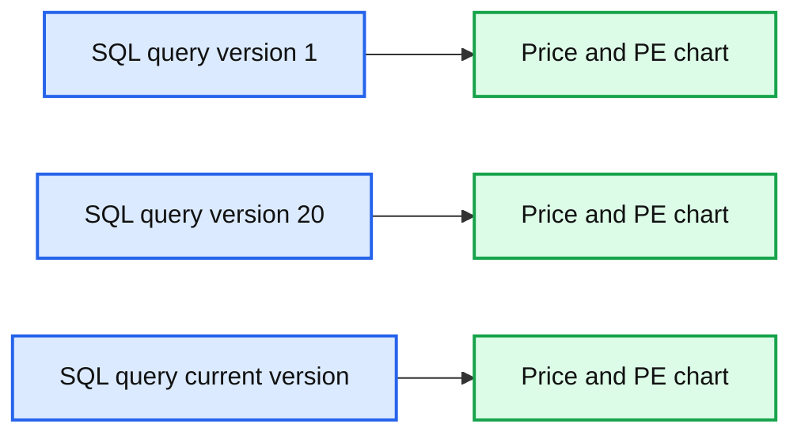

# Simplifying Streaming Stock Analysis using Delta Lake and Apache Spark: On-Demand Webinar and FAQ Now Available!

- Source: https://www.databricks.com/blog/2019/06/18/simplifying-streaming-stock-analysis-using-delta-lake-and-apache-spark-on-demand-webinar-and-faq-now-available.html
- Published: 2019-06-18
- Authors: John O'Dwyer, Navin Albert, Denny Lee
- Categories: product, engineering, open-source, data-engineering, data-streaming, company, news
- Images: 5 total, 4 extracted as architecture

[Get an early preview of O'Reilly's new ebook](https://www.databricks.com/resources/ebook/delta-lake-running-oreilly?itm_data=simplifyingstreamingstockanalysisdeltalakeapachespark-blog-oreillydlupandrunning) for the step-by-step guidance you need to start using Delta Lake.

---

On June 13th, we hosted a live webinar — Simplifying Streaming Stock Analysis using Delta Lake and Apache Spark — with Junta Nakai, Industry Leader - Financial Services at Databricks, John O’Dwyer, Solution Architect at Databricks, and Denny Lee, Technical Product Marketing Manager at Databricks. This is the first webinar in a series of financial services webinars from Databricks and is an extension of the blog post [Simplify Streaming Stock Data Analysis Using Delta Lake](https://www.databricks.com/blog/2018/07/19/simplify-streaming-stock-data-analysis-using-databricks-delta.html).

Analyzing trading and stock data? Traditionally, real-time analysis of stock data was a complicated endeavor due to the complexities of maintaining a streaming system and ensuring transactional consistency of legacy and streaming data concurrently. Delta Lake helps solve many of the pain points of building a streaming system to analyze stock data in real-time.

In this webinar, we will review:

- The current problems of running such a system.
- How Delta Lake addresses these problems.
- How to implement the system in Databricks.

Delta Lake helps solve these problems by combining the scalability, streaming, and access to advanced analytics of Apache Spark with the performance and ACID compliance of a data warehouse.

During the webinar, we showcased Streaming Stock Analysis with a Delta Lake notebook.  To run it yourself, please download the following notebooks:

- [Streaming Stock Analysis with Delta Lake: Setup](https://pages.databricks.com/rs/094-YMS-629/images/streaming-stock-data-analysis-setup.html) - First run this notebook so it can automatically download the generated source data and starts loading data into a file location.
- [Streaming Stock Analysis with Delta Lake](https://pages.databricks.com/rs/094-YMS-629/images/streaming-stock-data-analysis-main.html) - This is the main notebook that showcases Delta Lake within the context of streaming stock analysis including *unified streaming, batch sync* and *time travel*.

We also showcase the update of data in real-time with streaming and batch stock analysis data joined together as noted in the following image.

**Summary:** The chart shows two ticker data series, JN2 and JO1, with annotated changes to fundamentals over time.

**Components:**

- JN2 ticker series
- JO1 ticker series
- PRICE_DATE time axis
- 10x increase Fundamentals annotation
- Revert the Fundamentals Change annotation

**Flows:**

- 10x increase Fundamentals -> JO1: increases the plotted fundamentals value
- Revert the Fundamentals Change -> JO1: restores the plotted value

**Numbers:** 10x, 60, 40, 20, 2013

source image: https://www.databricks.com/wp-content/uploads/2019/06/stock-streaming-analysis-updates-to-fundamentals.png

Toward the end, we also held a Q&A, and below are the questions and their answers.

 

**Q: What is the difference between Delta Lake and Apache Parquet?**

Delta Lake is an open-source storage layer that brings ACID transactions to Apache Spark™ and big data workloads.  While the Delta Lake stores data in Apache Parquet format, it includes features that allow [data lakes](https://www.databricks.com/discover/data-lakes/introduction) to be reliable at scale.   These features include:

- *ACID Transactions*: Delta Lake ensures data integrity and provides serializability.
- *Scalable Metadata Handling*: For Big Data systems,  the metadata itself is often “big”  enough to slow down any system that tries to make sense of it, let alone making sense of the actual underlying data.  Delta Lake treats metadata like regular data and leverages Apache Spark’s distributed processing power. As a result, Delta Lake can handle petabyte-scale tables with billions of partitions and files at ease.
- *Time Travel (data versioning)*: Creates snapshots of data, allowing you to access and revert to earlier versions of data for audits, rollbacks or to reproduce experiments.
- *Open Format*: All data in Delta Lake is stored in Apache Parquet format enabling Delta Lake to leverage the efficient compression and encoding schemes that are native to Parquet.
- *Unified Batch and Streaming Source and Sink*: A table in Delta Lake is both a batch table, as well as a streaming source and sink. Streaming data ingest, batch historic backfill, and interactive queries all just work out of the box.
- *Schema Enforcement*: Delta Lake provides the ability to specify your schema and enforce it. This helps ensure that the data types are correct and required columns are present, preventing bad data from causing data corruption.
- *Schema Evolution*: Big data is continuously changing. Delta Lake enables you to make changes to a table schema that can be applied automatically, without the need for cumbersome DDL.
- *100% Compatible with [Apache Spark API](https://www.databricks.com/glossary/spark-api)*: Developers can use Delta Lake with their existing data pipelines with minimal change as it is fully compatible with Spark, the commonly used big data processing engine.

 

**Q: How can you view the Delta Lake table for both streaming and batch near the beginning of the notebook?**

As noted in the [Streaming Stock Analysis with Delta Lake](https://pages.databricks.com/rs/094-YMS-629/images/streaming-stock-data-analysis-main.html) notebook, in cell 8 we ran the following batch query:

**Summary:** Line chart comparing JN2 and JO1 ticker prices across 2012, ending with JN2 at 95.75 on Aug 20, 2012.

**Components:**

- JN2 price series
- JO1 price series
- Ticker legend
- PRICE_DATE horizontal axis

**Flows:**

- none

**Numbers:** 60, 70, 80, 90, 100, 110, 2012, Aug 20, 2012, 95.75

source image: https://www.databricks.com/wp-content/uploads/2019/06/streaming-stock-analysis-batch.png

Notice that we ran this query earlier in the cycle with data up until August 20th, 2012.  Using the same folder path (`deltaPricePath`), we also created a structured streaming DataFrame via the following code snippet in cell 4:

We can then run the following real-time Spark SQL query that will continuously refresh.

**Summary:** The image shows streaming input and processing rates, batch duration metrics, and stock price histories for JN2 and JO1.

**Components:**

- Input rate chart, technology not specified
- Processing rate chart, technology not specified
- Batch duration chart, technology not specified
- JN2 stock price series
- JO1 stock price series
- PRICE_DATE timeline
- Ticker legend

**Flows:**

- Stock records -> Input rate chart: records per second
- Stock records -> Processing rate chart: processed records per second
- Stock records -> Batch duration chart: batch duration measurements
- Stock records -> JN2 stock price series: dated price values
- Stock records -> JO1 stock price series: dated price values

**Numbers:** 0 rec/s, 5.7 s, 0.1 s, 15, 10, 5, 0, 21:45, 21:50, Jun 16, 60, 80, 100, 120, 140, Jan 2012, Jul, Aug 20 2012, 95.75

source image: https://www.databricks.com/wp-content/uploads/2019/06/streaming-stock-analysis-streaming.png

Notice that, even though the batch query executed earlier (and ended at August 20th, 2012), the structured streaming query continued to process data long past that date (the small blue dot denotes where August 20th, 2012 is on the streaming line chart).    As you can see from the preceding code snippets, both the batch and structured streaming DataFrames query off of the same folder path of `deltaPricePath`.

 

**Q: With the "mistake" that you had entered into the data, can I go back and find it and possibly correct it for auditing purposes?  **

Delta Lake has a data versioning feature called *Time Travel*.  It provides snapshots of data, allowing you to access and revert to earlier versions of data for audits, rollbacks or to reproduce experiments.  To visualize this, note cells 36 onwards in the [Streaming Stock Analysis with Delta Lake](https://pages.databricks.com/rs/094-YMS-629/images/streaming-stock-data-analysis-main.html) notebook.   The following screenshot shows three different queries using the `VERSION AS OF` syntax allowing you to view your data by version (or by timestamp using the `TIMESTAMP` syntax).

**Summary:** Three Databricks SQL queries compare stock price and P/E data from table versions 1, 20, and the current version using time travel.

**Components:**

- Databricks SQL queries
- `priceWithFundamentalsHistory` table
- Version 1 snapshot
- Version 20 snapshot
- Current table snapshot
- Stock price and P/E line charts
- J01 ticker data

**Flows:**

- SQL query -> Version 1 chart: reads historical price and P/E data
- SQL query -> Version 20 chart: reads historical price and P/E data
- SQL query -> Current chart: reads current price and P/E data

**Numbers:** 1, 20, J01, 2012, 2013, 20, 30, 40, 50, 60, 70, 80, approximately 90

source image: https://www.databricks.com/wp-content/uploads/2019/06/stock-streaming-analysis_time-travel.png

With this capability, you can know what changes to your data were made and when those transactions had occurred.

 

**Q: I saw that the stock streaming data update was accomplished via a view; I wonder if updates can be done on actual data files themselves. For instance, do we need to refresh the whole partition parquet files to achieve updates? What is the solution under Delta Lake?**

While the changes were done to a Spark SQL view, the changes are actually happening to the underlying files on storage.  Delta Lake itself determines which Parquet files need to be updated to reflect the new changes.

**Q: Can we query Delta Lake Tables in [Apache Hive](https://www.databricks.com/glossary/apache-hive)**

Currently (as of version 0.1.0) it is not possible to query Delta Lake tables with Apache Hive nor is the Hive metastore supported (though this feature is on the roadmap).  For the latest on this particular issue, please refer to the GitHub issue [#18](https://github.com/delta-io/delta/issues/18).

**Q: Is there any guide that covers detailed usage of Delta Lake?**

For the latest guidance on Delta Lake, please refer to the [delta.io](https://delta.io) as well as the [Delta Lake documentation](https://docs.delta.io/latest/index.html).  Join the Delta Lake Community to communicate with fellow Delta Lake users and contributors through our [Slack channel](https://delta-users.slack.com/join/shared_invite/enQtNTY1NDg0ODcxOTI1LWE3YjMxOTM4MmM0YWNhNjE2YmI2OGI4N2Y3MTRhOWQ1YzE3MTMyYTM5YzRiZWZlYzMwYzk0M2JiZmJhY2Q4NWI) or [Google Groups](https://groups.google.com/forum/#!forum/delta-users).

## Additional Resources

- [Delta Lake: Reliable Data Lakes at Scale](https://delta.io/)
- [Delta Lake - Open Source Reliability for Data Lakes](https://vimeo.com/338100834)
