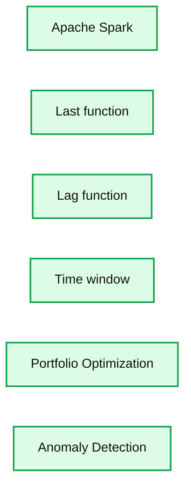

# Scaling Financial Time Series Analysis Beyond PCs and Pandas: On-Demand Webinar, Slides and FAQ Now Available!

- Source: https://www.databricks.com/blog/2019/10/18/scaling-financial-time-series-analysis-beyond-pcs-and-pandas-on-demand-webinar-and-faq-now-available.html
- Published: 2019-10-18
- Authors: Ricardo Portilla, Junta Nakai, Navin Albert
- Categories: engineering, open-source
- Images: 2 total, 2 extracted as architecture

On Oct 9th, 2019, we hosted a live webinar —[Scaling Financial Time Series Analysis Beyond PCs and Pandas](https://pages.databricks.com/201910-US-WB-FS-Time-Series-Analysis_03.On-demandpage.html) — with Junta Nakai, Industry Leader Financial Services at Databricks, and Ricardo Portilla, Solution Architect at Databricks. This was a live webinar showcasing the content in this blog- [Democratizing Financial Time Series Analysis with Databricks.](https://www.databricks.com/blog/2019/10/09/democratizing-financial-time-series-analysis-with-databricks.html)

**Summary:** The slide shows Apache Spark time-series operations using `last` and `lag`, alongside portfolio optimization and anomaly detection outputs.

**Components:**

- Apache Spark using PySpark SQL functions
- `last` time-series function
- `lag` time-series function
- Time window
- Portfolio Optimization chart
- Anomaly Detection chart

**Flows:**

- none

**Numbers:** 23:33; chart axis values and timestamp labels are visible but too small to read reliably.

source image: https://www.databricks.com/wp-content/uploads/2019/10/Time-Series-video-1.png

Please find the[slide deck for this webinar here](https://www.slideshare.net/NavinAlbert/scaling-financial-time-series-analysis-beyond-pcs-and-pandas).

Fundamental economic data, financial stock tick data and [alternative data](https://www.databricks.com/glossary/alternative-data) sets such as geospatial or transactional data are all indexed by time, often at irregular intervals. Solving business problems in finance such as investment risk, fraud, transaction costs analysis and compliance ultimately rests on being able to analyze millions of time series in parallel. Older technologies, which are RDBMS-based, do not easily scale when analyzing trading strategies or conducting regulatory analyses over years of historical data.

In this webinar we reviewed:

- How to build time series functions on hundreds of thousands of tickers in parallel using Apache Spark™.
- Lastly, if you are a[Pandas (Python Data Analysis Library)](https://pandas.pydata.org/) user looking to scale data preparation which feeds into financial anomaly detection or other statistical analyses, we used a market manipulation example to show how Koalas makes scaling transparent to the typical data science workflow.

We demonstrated these concepts using [this notebook in Databricks](https://pages.databricks.com/rs/094-YMS-629/images/Democratizing%20Financial%20Time%20Series%20Analysis.html)

If you’d like free access to the [Unified Data Analytics Platform](https://www.databricks.com/product/data-lakehouse) and try our notebooks on it, you can access [a free trial here](https://www.databricks.com/try-databricks).

Toward the end, we held a Q&A and below are the questions and answers.

 

**Q: BI Tools traditionally query data warehouses, can they now connect to Databricks?**

A: Great question. There are two approaches to this. Yes, you can connect your BI tools to Databricks directly to query the data lake. Let’s look at this slide below.

**Summary:** End-to-end Databricks architecture showing financial data sources flowing through Spark-based engineering, feature engineering, machine learning, and BI or AI applications.

**Components:**

- Geospatial Data using Amazon S3 and Microsoft Azure Blob Storage
- News and Sentiment data
- Trades, NBBO, and Order Data
- Reference Data
- Data Engineering using Apache Spark and Koalas
- Transformations using Apache Spark
- Enrichments using Apache Spark
- Feature Engineering using Apache Spark
- Model Training using MLflow, PyTorch, Keras, XGBoost, LightGBM, scikit-learn, and Spark MLlib
- AI Applications and Reporting
- BI Tools

**Flows:**

- Geospatial Data -> Amazon S3: geospatial data
- Geospatial Data -> Microsoft Azure Blob Storage: geospatial data
- News and Sentiment -> Data Engineering: news and sentiment data
- Trades NBBO and Order Data -> Reference Data: trade and order data
- Trades NBBO and Order Data -> Data Engineering: trade and order data
- Reference Data -> Data Engineering: reference data
- Data Engineering -> Transformations: source data
- Transformations -> Enrichments: transformed data
- Enrichments -> Feature Engineering: enriched data
- Feature Engineering -> Model Training: engineered features
- Data Engineering -> AI Applications and Reporting: processed data
- Model Training -> AI Applications and Reporting: trained models
- AI Applications and Reporting -> BI Tools: reports and visualizations

**Numbers:** none

```mermaid
%% Financial data flows through Databricks engineering and machine learning to applications and BI
flowchart LR
    S[Data Sources] -->|source data| E[Data Engineering]
    E -->|raw data| T[Transformations]
    T -->|transformed data| N[Enrichments]
    N -->|enriched data| F[Feature Engineering]
    F -->|engineered features| M[Model Training]
    E -->|processed data| A[AI Applications and Reporting]
    M -->|trained models| A
    A -->|reports and visualizations| B[BI Tools]

    classDef client fill:#dbeafe,stroke:#2563eb,stroke-width:2px,color:#111
    classDef service fill:#dcfce7,stroke:#16a34a,stroke-width:2px,color:#111
    classDef store fill:#ede9fe,stroke:#7c3aed,stroke-width:2px,color:#111
    classDef cache fill:#fef3c7,stroke:#d97706,stroke-width:2px,color:#111
    classDef queue fill:#cffafe,stroke:#0891b2,stroke-width:2px,color:#111
    classDef critical fill:#fee2e2,stroke:#dc2626,stroke-width:4px,color:#111
    classDef external fill:#e5e7eb,stroke:#6b7280,stroke-width:2px,color:#111,stroke-dasharray:4 3
    classDef decision fill:#fce7f3,stroke:#db2777,stroke-width:2px,color:#111

    class S external
    class E,T,N,F,M service
    class A,B client
```

source image: https://www.databricks.com/wp-content/uploads/2019/10/BI-Slide.png

If you look at the diagram, BI tools are pointed to one of the managed tables created by Apache Spark. If you have an aggregate table that is specific to a line business (let’s say you created a table with aggregated trade windows throughout the day), this can be queried with a BI tool such as Tableau, Looker, etc. If you need very low latency, for example, say you need to create dashboards for the C-level, then you can query a data warehouse.

 

**Q: Is there a way to effectively distribute the modeling of time series, or is this only distributed pandas based data manipulation to prepare the data set. Specifically, I use quite a bit of SARIMAX. I am trying to figure out how to distribute cross-validation of candidate SARIMAX models.**

A: This presentation was more focused on the manipulation aspect, but Spark can absolutely distribute things like hyperparameter tuning and cross-validation. So if you have a grid defined or you want to do a random bayesian search, what you need to do is, define independent problems or partitioning of your problems. So a good example is forecasting. Let's say, I want to iterate through a 100 different combinations, where I want to change whether we specify daily seasonality or yearly seasonality, and multiply that by all the different parameters that I am using for an ARIMA model. Then all I need to do is define that grid and Spark can basically execute one task per different input vector parameter. So effectively you are running up to 1000 or 5000 forecasts all in parallel. This would be the go-to method to actually parallelize things like forecasting.

 

**Q: Is Koala open source? Do Koalas works with [scikit-learn](https://scikit-learn.org/stable/)?**

Yes, Koalas is open-source software. Koalas definitely works with [scikit-learn](https://scikit-learn.org/stable/). If you go through the notebook in the [blog here](https://www.databricks.com/blog/2019/10/09/democratizing-financial-time-series-analysis-with-databricks.html), you can effectively convert any of those data structures and can feed it directly into scikit-learn. The only difference is you may have to convert the structure directly before you put it into a machine learning model .ie you may have to convert to pandas in the final step. But it should work otherwise. The two numpy data structures act as the bridge.

 

**Q: As a team how can we do code review or version control, if we work on Databricks?**

The blog article actually points out the mechanism to do that. If you want to leverage Databricks for the performance aspect, compute aspect, MLFlow and all of that. We released something called Databricks Connect. It allows you to work on your local IDE. If you do that, you can always check in your code to version control using your standard tools and then deploy using Jenkins as you usually do. The second option is Databricks notebooks themselves integrate with Git, so you can directly save the work, as you are going along, in a notebook as well.

 

**Q: Any resources, demo, tutorial to handle geospatially oriented time series data? For example, something that could look at the past 5 years of real estate data and combine that with traffic data to show how housing density affects traffic patterns.**

A:  The techniques that were highlighted here were multi-purpose. For the AS-OF join,  you can certainly use the data sets you are describing. It is a matter of just aligning the right time stamps and then choosing a partitioning column. We will consider having subsequent blogs on geospatial in particular, that will likely go deeper into the techniques or libraries that can be used to effectively join geospatial data. But right now AS-OF join should work for any data set you want to use, as long as you are just trying to merge them to get contextual AS-OF data.

## Additional Resources

- [Democratizing Financial Time Series Analysis with Databricks](https://www.databricks.com/blog/2019/10/09/democratizing-financial-time-series-analysis-with-databricks.html)
- [Koalas: Easy Transition from pandas to Apache Spark](https://www.databricks.com/blog/2019/04/24/koalas-easy-transition-from-pandas-to-apache-spark.html)
