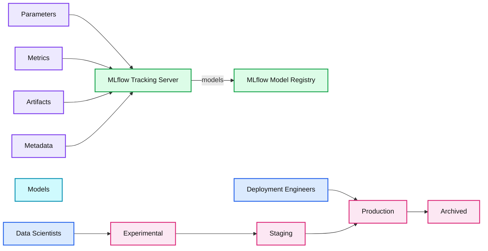
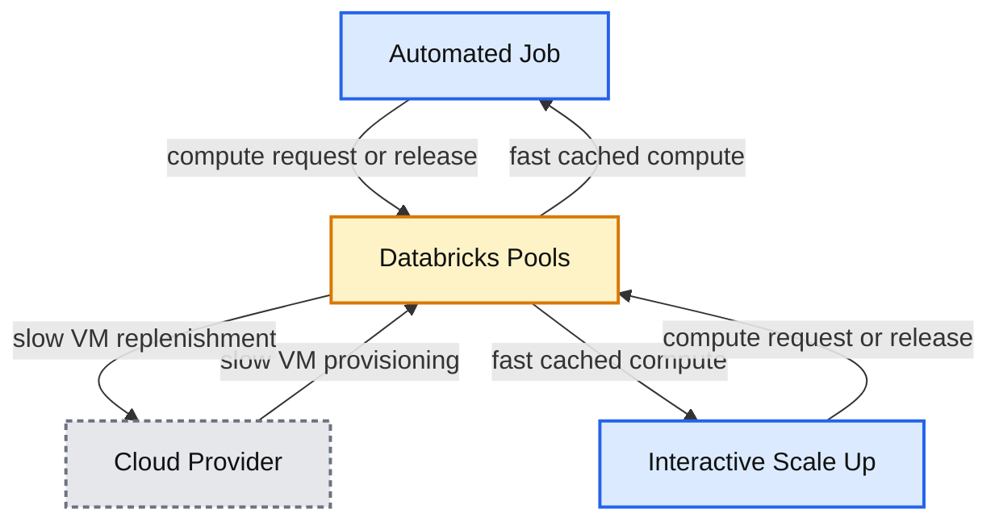
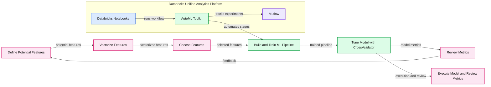

# Solving the World’s Toughest Problems with the Growing Open Source Ecosystem and Databricks

- Source: https://www.databricks.com/blog/2020/01/23/2019-databricks-year-in-review-solving-worlds-toughest-problems.html
- Published: 2020-01-23
- Authors: Reynold Xin
- Categories: platform, announcements, product, solutions, engineering, open-source, data-engineering, data-science-machine-learning, company, culture
- Images: 9 total, 4 extracted as architecture

*Free Edition has replaced Community Edition, offering enhanced features at no cost. Start using *[*Free Edition *](https://login.databricks.com/?intent=SIGN_UP&amp;signup_experience_step=EXPRESS&amp;provider=DB_FREE_TIER&amp;dbx_source=www)*today.*
 

We started Databricks in 2013 in a tiny little office in Berkeley with the belief that data has the potential to solve the world’s toughest problems. We entered 2020 as a global organization with over 1000 employees and a customer base spanning from two-person startups to Fortune 10s.

In this blog post, let’s take a moment to look back and reflect on what we have achieved together in 2019.  We will elaborate on the following themes: Solving the World’s Toughest Data Problems, New Developments in the Open Source Ecosystem, and how we are bridging the two with Databricks Data + AI Platform enhancements.

- Solving the World's Toughest Problems
- New Developments in the Open Source Ecosystem
  - Open Source Delta Lake Project
  - Easily Scale pandas with Koalas!
  - Simplifying Machine Learning Workflows
- Databricks Unified Data Analytics Platform
  - Optimizing Storage
  - Databricks Pools
  - Databricks Runtime and Databricks Runtime for Machine Learning
  - Automatic Logging for Managed MLflow
  - Augmenting Machine Learning with Databricks Labs’ AutoML Toolkit
- Closing Thoughts

 

## Solve the World’s Toughest Problems

As every year goes by, we encounter more use cases that reinforce our belief that leveraging data effectively is having a profound impact across all industries and disciplines, and we are proud of our part in this journey.

Thousands of organizations have entrusted Databricks with their mission-critical workloads, and have presented their progress at various conferences to disseminate best practices. Some great examples in 2019 include:

- [Regeneron](https://www.databricks.com/customers/regeneron) is able to analyze a massive corpus of genomics data and through machine learning was able to identify a portion of the genome that is responsible for chronic liver disease. By being able to process all of this data quickly, they are now able to create and test a potentially life-saving drug to fight chronic liver disease. To continue this momentum, Databricks and Regeneron teamed up earlier this year to launch [Glow](https://www.databricks.com/blog/2019/10/18/introducing-glow-an-open-source-toolkit-for-large-scale-genomic-analysis.html), an open-source toolkit for large-scale genomic analysis.
- [FINRA](https://www.databricks.com/blog/2019/06/05/customer-spotlight-finra.html)is able to combat fraud by building a multi-petabyte graph using GraphFrames and then use machine learning to determine which part of graphs have clicks that point to market manipulation.
- [Quby](https://www.databricks.com/company/newsroom/press-releases/quby-relies-on-databricks-for-collaborative-approach-to-analysis-of-internet-of-things-data): Using Europe’s largest energy dataset, consisting of petabytes of IoT data, Quby has developed AI-powered products that are used by hundreds of thousands of users on a daily basis. To learn more about how Quby is conserving the planet, check out [Saving Energy in Homes with a Unified Approach to Data and AI](https://www.databricks.com/session_eu19/saving-energy-in-homes-with-a-unified-approach-to-data-and-ai).

 

## New Developments in the Open Source Ecosystem

At Spark + AI Summit EU 2019 in Amsterdam, we were excited to preview Apache Spark 3.0, the upcoming major version expected to be released in 2020, along with other major projects in the ecosystem: [New Developments in the Open Source Ecosystem: Apache Spark 3.0, Delta Lake, and Koalas](https://www.databricks.com/session_eu19/new-developments-in-the-open-source-ecosystem-apache-spark-3-0-delta-lake-and-koalas).

 

## Open Source Delta Lake Project

Delta Lake is an open-source storage layer that brings reliability to data lakes. Delta Lake provides ACID transactions, scalable metadata handling, and unifies streaming and batch data processing. Delta Lake runs on top of your existing data lake and is fully compatible with Apache Spark APIs.

The project has been deployed at thousands of organizations and processes more **exabytes of data each week**, becoming an indispensable pillar in data and AI architectures.  More than 75% of the data scanned on the Databricks Data + AI Platform is on Delta Lake!

Earlier in 2019, we announced that we were [open sourcing](https://www.databricks.com/blog/2019/04/24/open-sourcing-delta-lake.html) the Delta Lake project as noted in the [Spark + AI Summit 2019 keynote](https://www.databricks.com/session/ali-ghodsi-michael-armbrust-delta-lake). Throughout the year, we quickly progressed from version 0.1.0 (April 2019) to [version 0.5.0](https://github.com/delta-io/delta/releases/tag/v0.5.0)(December 2019).

https://www.youtube.com/watch?v=R4f6SKOetB4

Some highlights include:

- Make Apache Spark™ Better with Delta Lake Webinar with Michael Armbrust
- [Simple, Reliable Upserts and Deletes on Delta Lake Tables using Python APIs](https://www.databricks.com/blog/2019/10/03/simple-reliable-upserts-and-deletes-on-delta-lake-tables-using-python-apis.html)
- [Diving Into Delta Lake: Unpacking The Transaction Log](https://www.databricks.com/blog/2019/08/21/diving-into-delta-lake-unpacking-the-transaction-log.html)
- [Delta Lake Now Hosted by the Linux Foundation to Become the Open Standard for Data Lakes](https://www.databricks.com/blog/2019/10/16/delta-lake-now-hosted-by-the-linux-foundation-to-become-the-open-standard-for-data-lakes.html)

For a more comprehensive list of how-to blogs, webinars, and meetups and events, refer to the Delta Lake Newsletter (October 2019 edition).

 

## Easily Scale pandas with Koalas!

For data scientists who love working with the pandas but need to scale, we [announced the Koalas open source project](https://www.databricks.com/session/official-announcement-of-koalas-open-source-project). Koalas allows data scientists to [easily transition from small datasets to big data](https://www.databricks.com/blog/2019/04/24/koalas-easy-transition-from-pandas-to-apache-spark.html) by providing a pandas API on Apache Spark.

Even though this project started in early 2019, koalas now has [**20,000 downloads per day**](https://pypistats.org/packages/koalas)**!  **

As highlighted in the blog post [How Virgin Hyperloop One reduced processing time from hours to minutes with Koalas](https://www.databricks.com/blog/2019/08/22/guest-blog-how-virgin-hyperloop-one-reduced-processing-time-from-hours-to-minutes-with-koalas.html):

> By making changes to less than 1% of our pandas lines, we were able to run our code with Koalas and Spark. We were able to reduce the execution times by more than 10x, from a few hours to just a few minutes, and since the environment is able to scale horizontally, we’re prepared for even more data.

 

## Simplifying Machine Learning Workflows

Introduced in 2018, the MLflow project has the ability to [track metrics, parameters, and artifacts](https://www.mlflow.org/docs/latest/tracking.html#)as part of experiments, [package models and reproducible ML projects](https://www.mlflow.org/docs/latest/projects.html), and [deploy models to batch or real-time serving platforms](https://www.mlflow.org/docs/latest/models.html).

In 2019, the MLflow project has [**over 1 million downloads per month**](https://pypistats.org/packages/mlflow)!

To help simplify machine learning model workflows, in Fall 2019, we [introduced the MLflow Model Registry](https://www.databricks.com/blog/2019/10/17/introducing-the-mlflow-model-registry.html) which builds on MLflow’s existing capabilities to provide organizations with one central place to share ML models, collaborate on moving them from experimentation to testing and production, and implement approval and governance workflows.

**Summary:** MLflow Tracking Server records experiment information and sends models to a centralized MLflow Model Registry for lifecycle management.

**Components:**

- MLflow Tracking Server using MLflow
- Parameters
- Metrics
- Artifacts
- Metadata
- Models
- MLflow Model Registry using MLflow
- Data Scientists
- Deployment Engineers
- Experimental stage
- Staging stage
- Production stage
- Archived stage

**Flows:**

- MLflow Tracking Server -> MLflow Model Registry: models

**Numbers:** none

source image: https://www.databricks.com/wp-content/uploads/2020/01/2019-Year-in-Review-06.png

 

## Databricks Unified Analytics Platform

The [Databricks Unified Analytics Platform](https://www.databricks.com/product/data-lakehouse) is a cloud platform for massive scale data engineering and collaborative data science.

In 2019, the Databricks Unified Data Analytics Platform has created more than** one million virtual machines (VMs) every day!**

**Summary:** The chart shows virtual machine creation increasing over time from 2017 through 2019, with gray observations and a blue fitted trend line.

**Components:**

- VM creation observations shown as gray scatter points
- Fitted growth trend shown as a blue line
- Time axis labeled by year

**Flows:**

- Time axis -> VM creation observations: chronological progression
- VM creation observations -> Fitted growth trend: growth pattern

**Numbers:** 2017, 2018, 2019

source image: https://www.databricks.com/wp-content/uploads/2020/01/VMs-created-over-time.png

We expanded the Databricks platform with many new features! The full list is quite extensive and can be found in the Databricks Data + AI Platform Release Notes ([AWS | Azure](https://docs.databricks.com/release-notes/product/index.html)).
 

## Optimizing Storage

In Databricks Runtime 6.0, we enhanced the FUSE mount that enables local file APIs to significantly improve read and write speed as well as support files that are larger than 2 GB. If you need faster and more reliable reads and writes such as for distributed model training, you would find this enhancement particularly useful. For example, as noted in this Spark+AI Summit 2019 session [Simplify Distributed TensorFlow Training for Fast Image Categorization at Starbucks](https://www.databricks.com/session/simplify-distributed-tensorflow-training-for-fast-image-categorization-at-starbucks), the training of a simple CNN model improved by more than 10x (from 2.62min down to 14.65s).
 

## Databricks Pools

Recently, we launched Databricks pools to [speed up your data pipelines and scale clusters quickly](https://www.databricks.com/blog/2019/11/11/databricks-pools-speed-up-data-pipelines.html). Databricks pools is a managed cache of VM instances that allow you to achieve a reduction in cluster start and auto-scaling times from minutes to seconds!

**Summary:** Databricks Pools cache VM instances from a cloud provider to accelerate automated jobs and interactive cluster scale-up.

**Components:**

- Automated Job - job workload
- Interactive Scale Up - interactive workload
- Databricks Pools - managed VM instance cache
- Cloud Provider - cloud VM infrastructure

**Flows:**

- Cloud Provider -> Databricks Pools: VM instances, slow provisioning
- Databricks Pools -> Cloud Provider: VM instance replenishment, slow
- Databricks Pools -> Automated Job: cached compute, fast allocation
- Automated Job -> Databricks Pools: compute release or request
- Databricks Pools -> Interactive Scale Up: cached compute, fast allocation
- Interactive Scale Up -> Databricks Pools: compute release or request

**Numbers:** none

source image: https://www.databricks.com/wp-content/uploads/2020/01/2019-Year-in-Review-07.png

As well, in 2019 we introduced more regions that are available to use Databricks. As of the end of 2019, there are 29 regions available in [Azure](https://azure.microsoft.com/en-us/global-infrastructure/services/?products=databricks&regions=all) and 13 regions in [AWS](https://docs.databricks.com/administration-guide/cloud-configurations/aws/regions.html) with more coming in 2020!
 

## Databricks Runtime and Databricks Runtime for Machine Learning

In 2019, Databricks Runtime (DBR) for Machine Learning became generally available! As of December 2019, there is [DBR 6.2 GA](https://docs.databricks.com/release-notes/runtime/6.2.html), [DBR 6.2 ML](https://docs.databricks.com/release-notes/runtime/6.2ml.html), and [DBR 6.2 for Genomics](https://docs.databricks.com/release-notes/runtime/6.2genomics.html). Every DBR release has been tested and verified for version compatibility thus simplifying the management of the different versions of TensorFlow, TensorBoard, PyTorch, Horovod, XGBoost, MLflow, Hyperopt, MLeap, etc.

To simplify Python library and environment management, we also introduced [Databricks Runtime with Conda](https://www.databricks.com/blog/2019/06/04/introducing-databricks-runtime-5-4-with-conda-beta.html) (Beta) Many of our Python users prefer to manage their Python environments and libraries with Conda, which quickly is emerging as a standard. Conda takes a holistic approach to package management by enabling:

- The creation and management of environments
- Installation of Python packages
- Easily reproducible environments
- Compatibility with pip

*Databricks Runtime with Conda* ([AWS](https://docs.databricks.com/runtime/conda.html) | [Azure](https://docs.microsoft.com/en-us/azure/databricks/runtime/conda)) provides an updated and optimized list of default packages and a flexible Python environment for advanced users who require maximum control over packages and environments.
 

## Automatic Logging for Managed MLflow

[Managed MLflow on Databricks](https://www.databricks.com/blog/2019/04/25/announcing-general-availability-of-managed-mlflow-on-databricks.html) offers a hosted version of MLflow fully integrated with Databricks’ security model, interactive workspace, and [MLflow Sidebar](https://www.databricks.com/blog/2019/04/30/introducing-mlflow-run-sidebar-in-databricks-notebooks.html) for Databricks Enterprise Edition and [Databricks Community Edition](https://www.databricks.com/blog/2019/10/17/managed-mlflow-now-available-on-databricks-community-edition.html).

https://www.youtube.com/watch?v=DFn3hS-s7OA

With [Managed MLflow](https://www.databricks.com/blog/2019/04/25/announcing-general-availability-of-managed-mlflow-on-databricks.html), it is now even easier for data scientists to track their machine learning training sessions for Apache Spark MLlib, Hyperopt, Keras, and Tensorflow without having to change any of their training code.

- [Hyperparameter Tuning with MLflow, Apache Spark MLlib and Hyperopt](https://www.databricks.com/blog/2019/06/07/hyperparameter-tuning-with-mlflow-apache-spark-mllib-and-hyperopt.html)
- [Scaling Hyperopt to Tune Machine Learning Models in Python](https://www.databricks.com/blog/2019/10/29/scaling-hyperopt-to-tune-machine-learning-models-in-python.html)
- [Automatic logging from Keras and TensorFlow](https://www.databricks.com/blog/2019/08/19/mlflow-tensorflow-open-source-show.html)

 

## Augmenting Machine Learning with Databricks Labs’ AutoML Toolkit

 

> Note: The [Databricks Labs'](https://github.com/databrickslabs) AutoML Toolkit is a labs project to accelerate use cases on the Databricks Unified Analytics Platform.

As mentioned in the Spark+AI Summit Europe 2019 session [Augmenting Machine Learning with Databricks Labs AutoML Toolkit](https://www.databricks.com/session_eu19/augmenting-machine-learning-with-databricks-labs-automl-toolkit), you can significantly streamline the process to build, evaluate, and optimize Machine Learning models by using the [Databricks Labs AutoML Toolkit](https://github.com/databrickslabs/automl-toolkit). Using the AutoML Toolkit also allows you to deliver results significantly faster because it allows you to automate the various Machine Learning pipeline stages.

**Summary:** The diagram shows how the Databricks Labs AutoML Toolkit streamlines feature engineering, model training, evaluation, tuning, and experiment tracking within Databricks.

**Components:**

- Databricks Unified Analytics Platform
- Databricks Notebooks
- AutoML Toolkit
- MLflow
- Define Potential Features
- Vectorize Features
- Choose Features
- Build and Train ML Pipeline
- Tune Model with CrossValidator
- Review Metrics
- Databricks benefits: Advanced Analytics, Data Democratization, Integrated Workspace, Elastic Scalability, Support

**Flows:**

- Define Potential Features -> Vectorize Features: potential features
- Vectorize Features -> Choose Features: vectorized features
- Choose Features -> Build and Train ML Pipeline: selected features
- Build and Train ML Pipeline -> Tune Model with CrossValidator: trained pipeline
- Tune Model with CrossValidator -> Review Metrics: model metrics
- Review Metrics -> Define Potential Features: feedback for feature definition
- Tune Model with CrossValidator -> Execute Model and Review Metrics: model execution and metric review
- AutoML Toolkit -> MLflow: experiment tracking

**Numbers:** none

source image: https://www.databricks.com/wp-content/uploads/2020/01/2019-Year-in-Review-11.jpg

We further simplified the AutoML Toolkit by releasing the AutoML FamilyRunner allowing you to test with a family of different ML algorithms as noted in [Using AutoML Toolkit’s FamilyRunner Pipeline APIs to Simplify and Automate Loan Default Predictions](https://www.databricks.com/blog/2019/11/05/using-automl-toolkits-familyrunner-pipeline-apis-to-simplify-and-automate-loan-default-predictions.html).
 

## Closing Thoughts

2019 has been a great year at Databricks! In November 2019, we hired our 1,000th full-time employee. A lot has changed since our first year (2013), you can read more about it in [Celebrating Growth at Databricks and 1,000 Employees](https://www.databricks.com/blog/2019/11/04/celebrating-growth-at-databricks-and-1000-employees.html)!

[As part of our amazing growth in 2019, we had both our](https://www.databricks.com/wp-content/uploads/2020/01/2019-Year-in-Review-12.jpg)[Series E Funding](https://www.databricks.com/company/newsroom/press-releases/databricks-250-million-funding-supports-explosive-growth-and-global-demand-for-unified-analytics-brings-valuation-to-2-75-billion) (February 5th, 2019) and Series F Funding (October 22nd, 2019) with a $6.2 billion valuation! We are setting aside a €100 million ($110 million) slice of the Series F to expand the Amsterdam-based European development center. And at the end of the year, we announced that we were opening up our [Databricks engineering office in Toronto](https://twitter.com/matei_zaharia/status/1212074509219647488?s=20) in 2020!

This year (2020) will be an even more exciting year with the upcoming Apache Spark 3.0 release and our continued enhancements to [Delta Lake](https://delta.io/), [MLflow](https://mlflow.org/), Koalas, AutoML, and more! If you’re interested, [find your place in Databricks](https://www.databricks.com/company/careers)!
