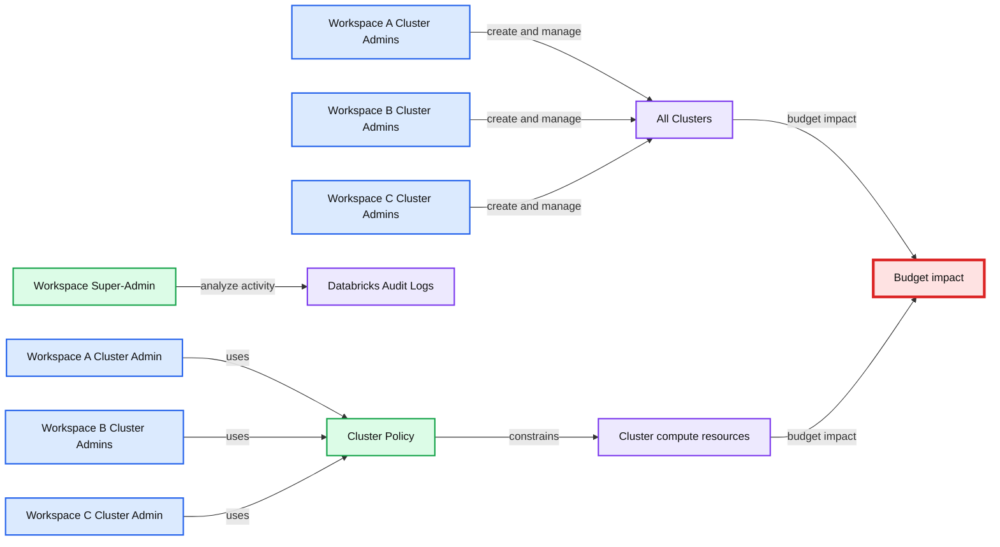

# Trust but Verify with Databricks

- Source: https://www.databricks.com/blog/2020/03/25/trust-but-verify-with-databricks.html
- Published: 2020-03-25
- Authors: Anna Shrestinian, Abhinav Garg, Sajith Appukuttan
- Categories: platform, solutions, security-and-trust, engineering
- Images: 5 total, 4 extracted as architecture

As enterprises modernize their data infrastructure to make data-driven decisions, teams across the organization become consumers of that platform. The data workloads grow exponentially, where cloud data lake becomes the centralized storage for enterprise-wide functions and different tools & technologies are used to gain insights out of it. For cloud security teams, the addition of more services and more users means the potential of additional vulnerabilities and security threats. They need to ensure that any data access adheres to enterprise governance controls, which could be easily monitored and audited. Organizations are faced with the challenge of balancing broader access to data in order to make better business decisions, by following a myriad number of controls and regulations to prevent unauthorized access and data leaks. Databricks helps to address this security challenge by providing visibility into all platform activities through Audit Logs, which when combined with cloud provider activity logging becomes a powerful tracking tool in the hands of security and admin teams.

## Databricks Audit Logs

Audit Logging allows enterprise security and admins to monitor all access to data and other cloud resources, which helps to establish an increased level of trust with the users. Security teams gain insight into a host of activities occurring within or from a Databricks workspace, like:

- Cluster administration
- Permission management
- Workspace access via the Web Application or the API
- And much more…

**Summary:** Databricks Control Plane manages workspace resources and sends audit logs to Azure Monitor or Amazon S3 within the customer cloud environment.

**Components:**

- Databricks Control Plane
- Webapp and Notebooks
- Object ACLs
- Workspace Accounts
- Jobs
- Audit Logs Service
- Customer Azure Subscription or AWS Account
- Azure Data Lake Store Logs
- Azure NSG Flow Logs
- S3 Access Logs
- AWS VPC Flow Logs
- VNET or VPC
- ETL Clusters
- Data Science Clusters
- Azure Monitor
- Amazon S3

**Flows:**

- Databricks Control Plane -> Customer Azure Subscription or AWS Account: workspace control and cluster management
- Audit Logs Service -> Azure Monitor: Databricks audit logs
- Audit Logs Service -> Amazon S3: Databricks audit logs
- Azure Data Lake Store -> Azure Data Lake Store Logs: access logs
- Azure NSG -> Azure NSG Flow Logs: network flow logs
- Amazon S3 -> S3 Access Logs: access logs
- AWS VPC -> AWS VPC Flow Logs: network flow logs

**Numbers:** none

```text
%% mermaid failed to render; kept as text
%% Databricks control plane and customer cloud audit log flows
flowchart LR
    CP[Databricks Control Plane]
    WA[Webapp and Notebooks]
    ACL[Object ACLs]
    ACC[Workspace Accounts]
    JOB[Jobs]
    ALS[Audit Logs Service]
    CLOUD[Customer Azure Subscription or AWS Account]
    VPC[VNET or VPC]
    ETL[ETL Clusters]
    DS[Data Science Clusters]
    AZ[Azure Monitor]
    S3[Amazon S3]
    AZLOG[Azure Data Lake Store Logs]
    NSG[Azure NSG Flow Logs]
    S3LOG[S3 Access Logs]

    CP -->|manages| CLOUD
    CP -->|contains| WA
    CP -->|contains| ACL
    CP -->|contains| ACC
    CP -->|contains| JOB
    CP -->|provides| ALS
    CLOUD -->|hosts| VPC
    VPC -->|runs| ETL
    VPC -->|runs| DS
    ALS -->|audit logs| AZ
    ALS -->|audit logs| S3
    CLOUD -->|produces| AZLOG
    CLOUD -->|produces| NSG
    CLOUD -->|produces| S3LOG

    classDef client fill:#dbeafe,stroke:#2563eb,stroke-width:2px,color:#111
    classDef service fill:#dcfce7,stroke:#16a34a,stroke-width:2px,color:#111
    classDef store fill:#ede9fe,stroke:#7c3aed,stroke-width:2px,color:#111
    classDef cache fill:#fef3c7,stroke:#d97706,stroke-width:2px,color:#111
    classDef queue fill:#cffafe,stroke:#0891b2,stroke-width:2px,color:#111
    classDef critical fill:#fee2e2,stroke:#dc2626,stroke-width:4px,color:#111
    classDef external fill:#e5e7eb,stroke:#6b7280,stroke-width:2px,color:#111,stroke-dasharray:4 3
    classDef decision fill:#fce7f3,stroke:#db2777,stroke-width:2px,color:#111
    client = clients edge gateway LB, service = stateless compute, store = databases durable storage, cache = Redis CDN or anything losable, queue = Kafka streams or async pipes, critical = bottleneck or SPOF, external = third party, decision = trade off point

    class CP,ALS,ETL,DS service
    class WA,ACL,ACC,JOB client
    class CLOUD,VPC external
    class AZ,S3,AZLOG,NSG,S3LOG store
```

<sub>source image: https://www.databricks.com/wp-content/uploads/2020/03/audit-log-architecture.png</sub>

Audit logs can be configured to be delivered to your cloud storage ([Azure](https://docs.microsoft.com/en-us/azure/databricks/administration-guide/account-settings/azure-diagnostic-logs) / [AWS](https://docs.databricks.com/administration-guide/account-settings/audit-logs.html)). From there, Databricks or any other log analysis service could be used to find anomalies of interest, and integrated with cloud-based notification services to create a seamless alerting workflow. We’ll discuss some scenarios where Databricks audit logs could prove to be a critical security solution asset.

### Workspace Access Control

**Issue**: An admin accidentally adds a new user to a group that has an elevated access level that the user should not have been granted. They realize the mistake a few days later and remove the user from the relevant group.

**Vulnerability:** The admin is worried that the user may have used the workspace in a way s/he was not entitled to, during the period of elevated access level. This particular group has the ability to grant permissions across Workspace objects. The admin needs to ensure that this user did not share clusters or jobs with other users, which would cause cascading security issues in terms of access control.

**Summary:** Databricks Control Plane manages workspace resources and sends audit logs to Azure Monitor or Amazon S3 within a customer cloud account.

**Components:**

- Databricks Control Plane
- Webapp and notebooks
- Object ACLs
- Workspace accounts
- Jobs
- Audit Logs Service
- Customer Azure subscription or AWS account
- VNET or VPC
- Azure Data Lake Storage logs
- Azure NSG flow logs
- S3 access logs
- AWS VPC flow logs
- ETL clusters
- Data Science clusters
- Azure Databricks Audit Logs to Azure Monitor
- AWS Databricks Audit Logs to S3

**Flows:**

- Databricks Control Plane -> Customer Azure subscription or AWS account: workspace control and management
- Audit Logs Service -> Azure Databricks Audit Logs to Azure Monitor: audit logs
- Audit Logs Service -> AWS Databricks Audit Logs to S3: audit logs
- ETL clusters -> VNET or VPC: cluster execution within network
- Data Science clusters -> VNET or VPC: cluster execution within network

**Numbers:** none

```text
%% mermaid failed to render; kept as text
%% Shows Databricks control plane management and audit log flows into a customer cloud account
flowchart LR
    CP[Databricks Control Plane]
    WA[Webapp and notebooks]
    ACL[Object ACLs]
    WS[Workspace accounts]
    JOB[Jobs]
    ALS[Audit Logs Service]
    CCA[Customer Azure subscription or AWS account]
    NET[VNET or VPC]
    ETL[ETL clusters]
    DS[Data Science clusters]
    AZ[Azure Databricks Audit Logs to Azure Monitor]
    AWS[AWS Databricks Audit Logs to S3]
    AZL[Azure Data Lake Storage logs]
    NSG[Azure NSG flow logs]
    S3[S3 access logs]
    VPC[AWS VPC flow logs]

    CP --- WA
    CP --- ACL
    CP --- WS
    CP --- JOB
    CP -->|Workspace control and management| CCA
    CCA --- NET
    NET --- ETL
    NET --- DS
    ALS -.->|Audit logs| AZ
    ALS -.->|Audit logs| AWS
    CCA --- AZ
    CCA --- AWS
    CCA --- AZL
    CCA --- NSG
    CCA --- S3
    CCA --- VPC

    classDef client fill:#dbeafe,stroke:#2563eb,stroke-width:2px,color:#111
    classDef service fill:#dcfce7,stroke:#16a34a,stroke-width:2px,color:#111
    classDef store fill:#ede9fe,stroke:#7c3aed,stroke-width:2px,color:#111
    classDef cache fill:#fef3c7,stroke:#d97706,stroke-width:2px,color:#111
    classDef queue fill:#cffafe,stroke:#0891b2,stroke-width:2px,color:#111
    classDef critical fill:#fee2e2,stroke:#dc2626,stroke-width:4px,color:#111
    classDef external fill:#e5e7eb,stroke:#6b7280,stroke-width:2px,color:#111,stroke-dasharray:4 3
    classDef decision fill:#fce7f3,stroke:#db2777,stroke-width:2px,color:#111

    class CP,ALS service
    class WA,ACL,WS,JOB,ETL,DS client
    class CCA,NET external
    class AZ, AWS, AZL, NSG, S3, VPC store
```

<sub>source image: https://www.databricks.com/wp-content/uploads/2020/03/audit-log-sec-measure.png</sub>

**Solution:** The admin can use Databricks Audit Logs to see the exact amount of time that the user was in the wrong group. They can analyze every activity the user made during that time period to see if they had taken advantage of the higher privileges in the workspace. In this case, if the user had not behaved maliciously, it could be proved by Audit Logs.

### Workspace Budget Control

**Issue:** Databricks admins want to ensure that teams are using the service within allocated budgets. But a few workspace admins have given many of their users broad controls to create and manage clusters.

**Vulnerability:** The admin is worried that large clusters are being created or existing clusters are being resized due to elevated cluster provisioning controls. This could put relevant teams over their allocated budgets.

**Summary:** The diagram contrasts broad cluster-management access before Databricks Audit Logs and restricted workspace-specific access after Cluster Policies are applied.

**Components:**

- Workspace A Cluster Admins
- Workspace B Cluster Admins
- Workspace C Cluster Admins
- All Clusters
- Workspace Super-Admin
- Databricks Audit Logs
- Workspace A Cluster Admin
- Workspace B Cluster Admins
- Workspace C Cluster Admin
- Cluster Policy
- Cluster compute resources
- Budget impact

**Flows:**

- Workspace A Cluster Admins -> All Clusters: create and manage clusters
- Workspace B Cluster Admins -> All Clusters: create and manage clusters
- Workspace C Cluster Admins -> All Clusters: create and manage clusters
- Workspace Super-Admin -> Databricks Audit Logs: analyze cluster activity
- Workspace A Cluster Admin -> Cluster Policy: operate under policy
- Workspace B Cluster Admins -> Cluster Policy: operate under policy
- Workspace C Cluster Admin -> Cluster Policy: operate under policy
- Cluster Policy -> Cluster compute resources: constrain cluster configuration
- Cluster compute resources -> Budget impact: affects allocated budgets

**Numbers:** none



<sub>source image: https://www.databricks.com/wp-content/uploads/2020/03/audit-log-cluster-access.png</sub>

**Solution:** The admin can use Audit Logs to watch over cluster activities. They can see when cluster creation or resizing occurs. This enables them to notify their users to keep within allocated budget for respective teams. Additionally, the admin can create [Cluster Policies](https://docs.databricks.com/administration-guide/clusters/policies.html) to address this concern in the future.

## Cloud Provider Infrastructure Logs

Databricks logging allows security and admin teams to demonstrate conformance to data governance standards within or from a Databricks workspace. Customers, especially in the regulated industries, also need records on activities like:

- User access control to cloud data storage
- Cloud Identity and Access Management roles
- User access to cloud network and compute
- And much more...

Databricks audit logs and integrations with different cloud provider logs provide the necessary proof to meet varying degrees of compliance. We’ll now discuss some of the scenarios where such integrations could be useful.

### Data Access Security Controls

**Issue:** A healthcare company wants to ensure that only verified or allowed users access their sensitive data. This data is in cloud storage and a group of verified users have access to this bucket. An issue could occur if the verified user shares the Databricks notebook and the cluster that are used to access this data, with a non-verified user.

**Vulnerability:** The non-verified user could access the sensitive data and potentially use it for nefarious purposes. Administrators need to ensure that there are no loopholes in the data access security controls and verify this with an audit of who is accessing the cloud storage.

**Solution:** The admin could enforce that Databricks users access the cloud storage only from a passthrough-enabled ([Azure](https://docs.microsoft.com/en-us/azure/databricks/security/credential-passthrough/adls-passthrough) / [AWS](https://www.databricks.com/blog/2019/03/26/introducing-databricks-aws-iam-credential-passthrough.html)) cluster. This will ensure that even if a user accidentally shares access to this cluster with a non-verified user, that user will not be able to access the underlying data. Audit of which user is accessing which file/folder can be delivered using the cloud storage access logs capability ([Azure](https://docs.microsoft.com/en-us/azure/storage/common/storage-analytics-logging) / [AWS](https://docs.aws.amazon.com/AmazonS3/latest/userguide/ServerLogs.html)). These logs will prove that only verified users are accessing the classified data which could be used to meet compliance.

### Data Exfiltration Controls

**Issue:** A group of admins are allowed elevated permissions in the cloud account / subscription to provision Databricks workspaces and manage related cloud infrastructure like security groups, subnets etc. One of these admins updates the outbound security group rules to allow for extra egress locations.

**Vulnerability:** Users can now access the Databricks workspace and exfiltrate data to this new location that was added to the outbound security group rules.

**Summary:** The diagram shows how Databricks workspace and cloud administrators control notebook cluster access to storage and public networks before and after monitoring and restricting cloud entitlements.

**Components:**

- Data User X - Databricks data user
- Notebook - Databricks notebook
- Cluster - Databricks compute cluster
- Workspace Admin - Databricks workspace administrator
- Azure Activity Logs - Azure audit logging
- AWS CloudTrail - AWS audit logging
- Unauthorized Cloud Admin - unauthorized cloud administrator
- AWS Security Group - AWS network access control
- NSG - Azure network security group
- ADLS - Azure Data Lake Storage
- S3 - Amazon Simple Storage Service
- Public Network - external network

**Flows:**

- Data User X -> Notebook: submits notebook workloads
- Notebook -> Cluster: runs workloads
- Workspace Admin -> Azure Activity Logs: monitors Azure activity
- Workspace Admin -> AWS CloudTrail: monitors AWS activity
- Unauthorized Cloud Admin -> AWS Security Group: attempts to modify cloud security rules
- AWS Security Group -> Cluster: controls network access
- NSG -> Cluster: controls network access
- Cluster -> ADLS: accesses cloud storage
- Cluster -> S3: accesses cloud storage
- Cluster -> Public Network: permits potential data exfiltration before restriction
- Unauthorized Cloud Admin -> AWS Security Group: blocked after monitoring and control
- Cluster -> Public Network: restricted after control

**Numbers:** none

```text
%% mermaid failed to render; kept as text
%% Shows Databricks access, cloud audit monitoring, and network restriction before and after control
flowchart LR
    user[Data User X]
    notebook[Notebook]
    cluster[Cluster]
    workspace[Workspace Admin]
    azure[Azure Activity Logs]
    cloudtrail[AWS CloudTrail]
    admin[Unauthorized Cloud Admin]
    sg[AWS Security Group]
    nsg[NSG]
    adls[ADLS]
    s3[S3]
    public[Public Network]

    user -->|submits workloads| notebook
    notebook -->|runs workloads| cluster
    workspace -->|monitors activity| azure
    workspace -->|monitors activity| cloudtrail
    admin -.->|attempts rule change| sg
    sg -->|controls access| cluster
    nsg -->|controls access| cluster
    cluster -->|accesses| adls
    cluster -->|accesses| s3
    cluster -->|potential exfiltration before restriction| public
    admin -.->|blocked after monitoring| sg
    cluster -.->|restricted after control| public

    classDef client fill:#dbeafe,stroke:#2563eb,stroke-width:2px,color:#111
    classDef service fill:#dcfce7,stroke:#16a34a,stroke-width:2px,color:#111
    classDef store fill:#ede9fe,stroke:#7c3aed,stroke-width:2px,color:#111
    classDef cache fill:#fef3c7,stroke:#d97706,stroke-width:2px,color:#111
    classDef queue fill:#cffafe,stroke:#0891b2,stroke-width:2px,color:#111
    classDef critical fill:#fee2e2,stroke:#dc2626,stroke-width:4px,color:#111
    classDef external fill:#e5e7eb,stroke:#6b7280,stroke-width:2px,color:#111,stroke-dasharray:4 3
    classDef decision fill:#fce7f3,stroke:#db2777,stroke-width:2px,color:#111
    user,notebook client
    cluster,workspace,azure,cloudtrail service
    adls,s3 store
    public external
    admin,sg,nsg critical
```

<sub>source image: https://www.databricks.com/wp-content/uploads/2020/03/audit-log-access-control.png</sub>

**Solution:** Admins should always follow the best practices of shared responsibility model in cloud and assign elevated cloud account/subscription permissions only to a minimum set of authorized superusers. In this case, one could monitor if such changes are being made and by whom using cloud provider activity logs ([Azure](https://docs.microsoft.com/en-us/azure/azure-monitor/essentials/activity-log) / [AWS](https://aws.amazon.com/premiumsupport/knowledge-center/cloudtrail-event-history-changed/)). Additionally, admins should also configure appropriate access control in the Databricks workspace ([Azure](https://docs.microsoft.com/en-us/azure/databricks/administration-guide/access-control/) / [AWS](https://docs.databricks.com/administration-guide/access-control/index.html)) and can monitor that access in Databricks Audit Logs.

## Getting started with workspace auditing

Tracking workspace activity using Databricks audit logs and various cloud provider logs provides security and admin teams the insights they need to allow their users access the required data while conforming to enterprise governance controls. Databricks users are also comfortable with the understanding that everything that needs to be audited is, and they are working in a safe and secure cloud environment. This enables more and better data-driven decisions throughout the organization. We’ll do a recap of different types of logs worth looking into:

- Databricks Audit Logs ([Azure](https://docs.microsoft.com/en-us/azure/databricks/administration-guide/account-settings/azure-diagnostic-logs) / [AWS](https://docs.databricks.com/administration-guide/account-settings/audit-logs.html))
- Cloud Storage Access Logs ([Azure](https://docs.microsoft.com/en-us/azure/storage/common/storage-analytics-logging)/ [AWS](https://docs.aws.amazon.com/AmazonS3/latest/userguide/ServerLogs.html))
- Cloud Provider Activity Logs / CloudTrail ([Azure](https://docs.microsoft.com/en-us/azure/azure-monitor/essentials/activity-log) / [AWS](https://aws.amazon.com/premiumsupport/knowledge-center/cloudtrail-event-history-changed/))
- Virtual Network Traffic Flow Logs ([Azure](https://docs.microsoft.com/en-us/azure/network-watcher/network-watcher-nsg-flow-logging-overview) / [AWS](https://docs.aws.amazon.com/vpc/latest/userguide/flow-logs.html))

We plan to publish deep dives into how to analyze the above types of logs in the near future. Until then, please feel free to reach out to your Databricks account team for any questions.
