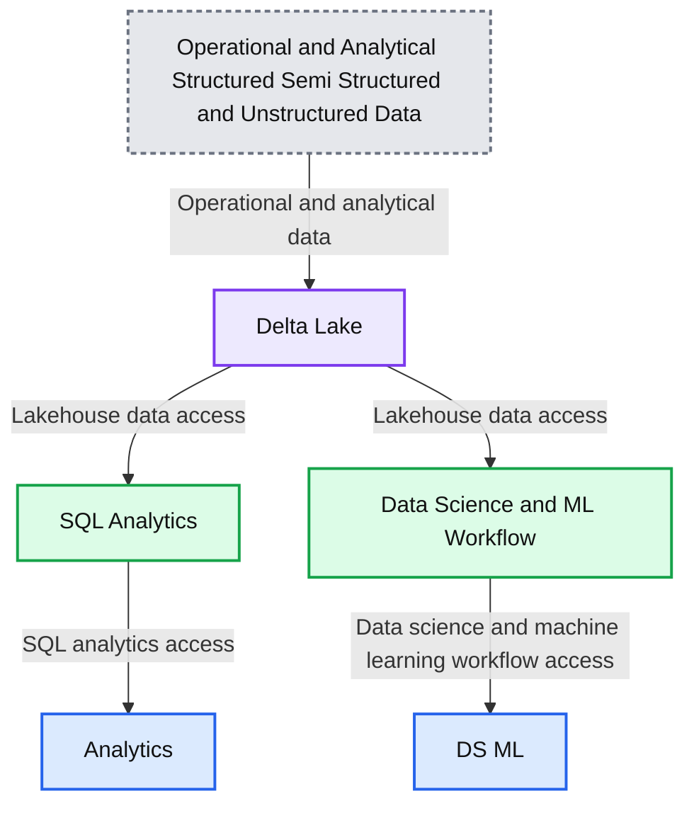

# Announcing the Launch of Databricks SQL

*Data warehousing workloads at data lake economics with lakehouse architecture*

- Source: https://www.databricks.com/blog/2020/11/12/announcing-the-launch-of-databricks-sql.html
- Published: 2020-11-12
- Authors: Joel Minnick
- Categories: platform, announcements, data-warehousing
- Images: 5 total, 1 extracted as architecture

[Databricks SQL](https://www.databricks.com/product/databricks-sql) is now generally available on AWS and Azure.

 

Today, we announced the new Databricks SQL service to provide Databricks customers with a first-class experience for performing BI and SQL workloads directly on the data lake. This launch brings to life a new experience within Databricks that data analysts and data engineers are going to love. The service provides a dedicated SQL-native workspace, built-in connectors to let analysts query data lakes with the BI tools they already use, query performance innovations that deliver fast results on larger and fresher data sets than analysts traditionally have access to, and new governance and administration capabilities. With this launch, we are the first to realize the complete vision of lakehouse architecture, combining data warehousing performance with data lake economics.

**Summary:** The diagram shows Databricks SQL and data science workflows accessing a Delta Lake over operational and analytical data.

**Components:**

- Analytics
- SQL Analytics
- Delta Lake
- DS/ML
- Data Science & ML Workflow
- Operational and Analytical Structured, Semi-Structured, and Unstructured Data

**Flows:**

- SQL Analytics -> Analytics: SQL analytics access
- Data Science & ML Workflow -> DS/ML: Data science and machine learning workflow access
- Operational and Analytical Structured, Semi-Structured, and Unstructured Data -> Delta Lake: Operational and analytical data
- Delta Lake -> SQL Analytics: Lakehouse data access
- Delta Lake -> Data Science & ML Workflow: Lakehouse data access

**Numbers:** 1 and 0 binary digits

source image: https://www.databricks.com/wp-content/uploads/2020/11/sql-analytics-1.png

## The enemy is complexity

Most customers routinely operate their business with a complex data architecture in the cloud that combines data warehouses and data lakes. As a result, customers’ data is moved around the organization through data pipelines that create a multitude of data silos. A large amount of time is spent maintaining these pipelines and systems rather than creating new value from data, and the downstream consumers of the data struggle to get a single source of truth due to the inherent data silos that get created. The situation becomes very expensive, both financially and operationally, and decision-making speed and quality are negatively affected.

Arriving at this problem was a gradual progression. It began with customers moving data from relational databases to data warehouses to do business intelligence 40 years ago. Then, data lakes began to emerge about 10 years ago because data warehouses couldn’t handle raw, video, audio, image, and natural language data, as well as very large scale structured data.

Data lakes in the cloud have high durability, low cost, and unbounded scale, and they provide good support for the data science and machine learning use cases that many enterprises prioritize today. But, all the traditional analytics use cases still exist. Therefore, customers generally have, and pay for, two copies of their data, and they spend a lot of time engineering processes to keep them in sync. This has a knock-on effect of slowing down decision making, because analysts and line-of-business teams only have access to data that’s been sent to the data warehouse rather than the freshest, most complete data in the data lake.

Finally, as multi-cloud becomes an increasingly common reality for enterprises, all of this data movement is getting repeated across several cloud platforms.

The whole situation is a mess.

The complexity from intertwined data lakes and data warehouses is not desirable, and our customers have told us that they want to be able to consolidate and simplify their data architecture. Advanced analytics and machine learning on unstructured and large-scale data are one of the most strategic priorities for enterprises today, - and the growth of unstructured data is going to increase exponentially - therefore it makes sense for customers to think about positioning their data lake as the center of data infrastructure. However, for this to be achievable, the data lake needs a way to adopt the strengths of data warehouses.

## The lakehouse combines the best of data warehouses and data lakes

The answer to this complexity is the lakehouse, a platform architecture that combines the best elements of data lakes and data warehouses. The lakehouse is enabled by a new system design that implements similar data structures and data management features to those in a data warehouse directly on the low-cost storage used for cloud data lakes. The architecture is what you would get if you had to redesign data warehouses in the modern world, now that cheap and highly reliable storage (in the form of object stores) is available. You can read more about the characteristics of a lakehouse in this [blog](https://www.databricks.com/blog/2020/01/30/what-is-a-data-lakehouse.html).

The foundation of the lakehouse is [Delta Lake](https://www.databricks.com/product/delta-lake-on-databricks). Delta Lake has brought reliability, performance, governance, and quality to data lakes, which is necessary to enable analytics on the data lake. Now, with the right data structures and data management features in place, the last mile to make the lakehouse complete was to solve for how data analysts actually query a data lake.

## Introducing Databricks SQL

Databricks SQL allows customers to perform BI and SQL workloads on a multi-cloud lakehouse architecture. This new service consists of four core components: A dedicated SQL-native workspace, built-in connectors to common BI tools, query performance innovations, and governance and administration capabilities.

### A SQL-native workspace

Databricks SQL provides a new, dedicated workspace for data analysts that uses a familiar SQL-based environment to query Delta Lake tables on data lakes. Because Databricks SQL is a completely separate workspace, data analysts can work directly within the Databricks platform without the distraction of notebook-based data science tools (although we find data scientists really like working with the SQL editor too). However, since the data analysts and data scientists are both working from the same data source, the overall infrastructure is greatly simplified and a single source of truth is maintained.

The workspace allows analysts to easily explore schemas, save regularly used code as snippets for quick reuse, and cache query results to keep subsequent run times short. Additionally, query updates can be scheduled to automatically refresh, as well as to issue automatic alerts on refresh, via email or Slack, when meaningful changes occur in the data.

SQL-native query editor

The workspace also allows analysts to make sense of data through rich visualizations, and to organize those visualizations into drag-and-drop dashboards. Once built, dashboards can be easily shared with stakeholders to make sharing data insights ubiquitous across an organization.

Visualizations and dashboards

### Built-in connectors to existing BI tools and broad partner support

For production BI, many customers have made investments in BI software like Tableau and Microsoft Power BI. To allow those tools to have the best possible experience querying the freshest, most complete data in the data lake, Databricks SQL includes built-in connectors for all major BI tools available today.

Across the data lifecycle, the launch of Databricks SQL is supported by the 500+ partners in the Databricks ecosystem. We’re very pleased to have the following partners investing above and beyond with us in this launch to enable customers to use their favorite analytics tools with Databricks SQL and lakehouse architecture:

- BI Partners: [Tableau](https://www.databricks.com/blog/2020/11/11/analytics-on-the-data-lake-with-tableau-and-the-lakehouse-architecture.html), [Power BI](https://powerbi.microsoft.com/en-us/blog/announcing-power-bi-connector-to-azure-databricks-public-preview/), [Qlik](https://www.qlik.com/blog/qlik-and-databricks-expand-strategic-partnership-with-new-sql-analytics-integration-to-help-clients-increase-value-across-the-entire-data-and-analytics-lifecycle), [Looker](https://cloud.google.com/blog/products/data-analytics), [Thoughtspot](https://www.thoughtspot.com/thoughtspot-blog/bridging-data-science-business-divide-thoughtspot-databricks)
- Ingest Partners: [Fivetran](https://www.businesswire.com/news/home/20201112005437/en/), [Fishtown Analytics](https://blog.getdbt.com/analyticsengineeringwithdbtanddatabricks//), [Matillion](https://www.matillion.com/resources/blog/matillion-and-databricks-partner-to-address-rising-demand-for-lakehouse-architecture), [Talend](https://www.talend.com/blog/), [Qlik](https://www.qlik.com/blog/qlik-and-databricks-expand-strategic-partnership-with-new-sql-analytics-integration-to-help-clients-increase-value-across-the-entire-data-and-analytics-lifecycle)
- Catalog Partners: [Collibra](https://www.collibra.com/us/en/blog/collibra-and-databricks-taking-the-partnership-to-the-next-level-with-sql-analytics), [Alation](https://www.alation.com/blog/bringing-more-people-databricks-lakehouse/)
- Consulting Partners: [Slalom](https://medium.com/slalom-data-analytics/the-evolution-of-the-databricks-lakehouse-paradigm-71f613c6533a), [Thorogood](https://www.thorogood.com/perspectives/blog/databricks-sql-analytics/), [Advancing Analytics,](https://www.advancinganalytics.co.uk/blog/2020/11/10/introducingdatabrickssqlanalytics) [Avanade](https://www.avanade.com/en/blogs/techs-and-specs/data-and-analytics/databricks-unifies-data-teams)

### Fast query performance

A big part of enabling analytics workloads on the data lake is solving for performance. There are two core challenges to solve to deliver great performance: query throughput and user concurrency.

Earlier this year, we announced [Photon Engine](https://docs.databricks.com/runtime/photon.html), our polymorphic query execution engine. Photon Engine accelerates the performance of Delta Lake for both SQL and data frame workloads through three components: an improved query optimizer, a caching layer that sits between the execution layer and the cloud object storage, and a polymorphic vectorized execution engine that’s written in C++. With Photon, customers have observed query execution times up to 10x faster than Apache Spark 3.0.

With throughput handled, we turned our attention to user concurrency. Historically, data lakes have struggled to maintain fast performance under high user counts. To solve this, Databricks SQL adds new SQL-optimized compute clusters that auto-scale in response to user load to provide consistent performance as the number of data analysts querying the data lake increases. Setting up these clusters is fast and easy through the console, and Photon Engine is built-in to ensure the highest level of query throughput. External BI clients can connect to the clusters via dedicated endpoints.

### Governance and administration

Finally, in the Databricks SQL console, we allow admins to apply SQL data access controls ([AWS](https://docs.databricks.com/security/access-control/table-acls/object-privileges.html), [Azure](https://docs.microsoft.com/en-us/azure/databricks/security/access-control/table-acls/object-privileges)) onto your tables to gain much greater control over how data in the data lake is used for analytics. Additionally, we provide deep visibility into the history of all executed queries, allowing you to explore the who, when, and where of each query along with the executed code to assist you in compliance and auditing. The query history also allows you to understand the performance of each phase of query execution to assist with troubleshooting.

On the administrative side, you can aggregate details for query runtimes, concurrent queries, peak queued queries per hour, etc. to help you better optimize your infrastructure over time. You can also set controls around runtime limits to prevent bad actors and runaway queries, enqueued query limits, and more.

## Getting started

Databricks SQL completes the final step in moving lakehouse architecture from vision to reality, and Databricks is proud to be the first to bring a complete lakehouse solution to market. All members of the data team, from data engineers and architects to data analysts to data scientists, are collaborating more than ever. The unified approach of the Databricks platform makes it easy to work together and innovate with a single source of truth that substantially simplifies data infrastructure and lower costs.

Databricks SQL is available in preview today. Existing customers can reach out to their account team to gain access. Additionally, you can request access via the [Databricks SQL product page](https://www.databricks.com/product/databricks-sql).

[Sign-up for access to Databricks SQL](https://www.databricks.com/p/event/sql-analytics-waitlist)

**Lakehouse Architecture:**
**From Vision to Reality.**
Implement one simplified platform for data analytics, data science and ML.

[Register Now](https://www.databricks.com/p/webinar/lakehouse-architecture-from-vision-to-reality?itm_data=blog-link-lakehousearchitecture)
