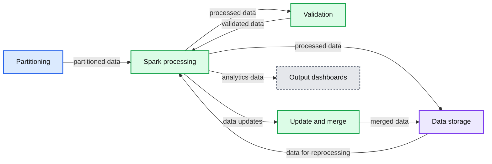

# Delta vs. Lambda: Why Simplicity Trumps Complexity for Data Pipelines

*Get orders of magnitude performance gains for ETL pipelines by switching from Lambda to Delta architecture*

- Source: https://www.databricks.com/blog/2020/11/20/delta-vs-lambda-why-simplicity-trumps-complexity-for-data-pipelines.html
- Published: 2020-11-20
- Authors: Hector Leano
- Categories: company, product, data-streaming
- Images: 2 total, 2 extracted as architecture

>  “Everything should be as simple as it can be, but not simpler” - [Albert Einstein](https://quoteinvestigator.com/2011/05/13/einstein-simple/)

Generally, a simple data architecture is preferable to a complex one. Code complexity increases points of failure, requires more compute to run jobs, adds latency, and increases the need for support. As a result, data pipeline performance degrades over time, increasing costs while decreasing productivity as your data engineers spend more time troubleshooting and downstream users wait longer for data refreshes.

Complexity was perceived as a necessary evil for the automated data pipelines feeding business reporting, SQL analytics, and data science because the traditional approach for bringing together batch and streaming data required a [lambda architecture](https://www.databricks.com/glossary/lambda-architecture). While a lambda architecture can handle large volumes of batch and streaming data, it increases complexity by requiring different code bases for batch and streaming, along with its tendency to cause data loss and corruption. In response to these data reliability issues, the traditional data pipeline architecture adds even more complexity by adding steps like validation, reprocessing for job failures, and manual update & merge.

While you can fine-tune the cost or performance of individual services, you cannot make significant (orders of magnitude) improvements in cost or performance for the total job in this architecture.

**Summary:** The diagram shows a traditional Lambda data pipeline with Spark processing, validation, reprocessing, updating and merging, storage, and output dashboards.

**Components:**

- Partitioning
- Reprocessing
- Spark processing
- Validation
- Update and merge
- Data storage
- Output dashboards

**Flows:**

- Partitioning -> Spark processing: partitioned data
- Spark processing -> Data storage: processed data
- Data storage -> Spark processing: data for reprocessing
- Spark processing -> Validation: processed data
- Validation -> Spark processing: validated data
- Spark processing -> Update and merge: data updates
- Update and merge -> Data storage: merged data
- Spark processing -> Output dashboards: analytics data

**Numbers:** 2-arch

source image: https://www.databricks.com/wp-content/uploads/2020/11/blog-delta-auto-1.png

*Typical data pipeline architecture requiring additional functions like validation, reprocessing, and updating & merging, adding latency, cost, and points of failure. *

However, the Delta Architecture on Databricks is a completely different approach to ingesting, processing, storing, and managing data focused on simplicity. All the processing and enrichment of data from Bronze (raw data) to Silver (filtered) to Gold (fully ready to be used by analytics, reporting, and data science) happens within Delta Lake, requiring less data hops.

Lambda is complicated, requiring more to set up and maintain, whereas batch + streaming just work on Delta tables right out of the box. Once you’ve built a Bronze table for your raw data and converted existing tables to Delta Lake format, you’ve already solved the data engineer’s first dilemma: combining batch and streaming data. From there, data flows into Silver tables, where it is cleaned and filtered (e.g., via schema enforcement). By the time it reaches our Gold tables it receives final purification and stringent testing to make it ready for consumption for creating reports, business analytics, or ML algorithms. You can learn more about simplifying lambda architectures in our virtual session, [*Beyond Lambda: Introducing Delta Architecture*](https://www.databricks.com/discover/getting-started-with-delta-lake-tech-talks/beyond-lambda-introducing-delta-architecture).

Read [Rise of the Data Lakehouse](https://www.databricks.com/resources/ebook/rise-data-lakehouse?itm_data=deltavslambdablog-textpromo-riselakehousebook) to explore why lakehouses are the data architecture of the future with the father of the data warehouse, Bill Inmon.

**Summary:** The diagram shows a Delta Architecture data flow from raw ingestion through cleaned and business-level data layers to streaming analytics and AI reporting.

**Components:**

- Data Lake using Kafka, Kinesis, CSV, JSON, TXT, and Apache Spark
- Bronze layer for raw ingestion
- Silver layer for filtered, cleaned, and augmented data
- Gold layer for business-level aggregates
- Streaming Analytics
- AI and Reporting

**Flows:**

- Data Lake -> Bronze: raw data ingestion
- Bronze -> Silver: filtered, cleaned, and augmented data
- Silver -> Gold: business-level aggregation
- Gold -> Streaming Analytics: analytical data
- Gold -> AI and Reporting: reporting and AI data

**Numbers:** none

```mermaid
%% Delta Architecture flow from ingestion to downstream use
flowchart LR
    DL[Data Lake<br/>Kafka Kinesis<br/>CSV JSON TXT<br/>Apache Spark]
    B[Bronze<br/>Raw Ingestion]
    S[Silver<br/>Filtered Cleaned<br/>Augmented]
    G[Gold<br/>Business Level<br/>Aggregates]
    SA[Streaming Analytics]
    AR[AI and Reporting]

    DL -->|raw data ingestion| B
    B -->|filtered cleaned augmented data| S
    S -->|business level aggregation| G
    G -->|analytical data| SA
    G -->|reporting and AI data| AR

    classDef client fill:#dbeafe,stroke:#2563eb,stroke-width:2px,color:#111
    classDef service fill:#dcfce7,stroke:#16a34a,stroke-width:2px,color:#111
    classDef store fill:#ede9fe,stroke:#7c3aed,stroke-width:2px,color:#111
    classDef cache fill:#fef3c7,stroke:#d97706,stroke-width:2px,color:#111
    classDef queue fill:#cffafe,stroke:#0891b2,stroke-width:2px,color:#111
    classDef critical fill:#fee2e2,stroke:#dc2626,stroke-width:4px,color:#111
    classDef external fill:#e5e7eb,stroke:#6b7280,stroke-width:2px,color:#111,stroke-dasharray:4 3
    classDef decision fill:#fce7f3,stroke:#db2777,stroke-width:2px,color:#111

    class DL queue
    class B,S,G store
    class SA,AR service
```

source image: https://www.databricks.com/wp-content/uploads/2020/11/blog-delta-auto-2.png

*The simplicity of the Delta Architecture on Databricks from ingest to downstream use. This simplicity is what lowers cost while increasing the reliability of automated data pipelines.*

These are the advantages that the simplified Delta Architecture brings for these automated data pipelines:

1. **Lower costs to run your jobs reliably: **By reducing 1) the number of data hops, 2) the amount of time to complete a job, 3) the number of job fails, and 4) the cluster spin-up time, the simplicity of the Delta architecture cuts the total cost of ETL data pipelines. While we certainly run our own benchmarks, the best benchmark is your data running your queries. To understand how to evaluate benchmark tests for automated data pipelines, read [our case study](https://www.databricks.com/blog/2020/11/13/how-to-evaluate-data-pipelines-for-cost-to-performance.html) for how Germany’s #1 weather portal, wetter.com, evaluated different pipeline architectures, or  reach out to [sales@databricks.com](mailto:sales@databricks.com) to get your own custom analysis.
2. **Single source of truth for all downstream users:** In order to have data in a useful state for reporting and analytics, enterprises will often take the raw data from their data lake and then copy and process a small subset into a data warehouse for downstream consumption. These multiple copies of the data create versioning and consistency issues that can make it difficult to trust the correctness and freshness of your data. Databricks however serves as a [unified data service](https://www.databricks.com/product/unified-data-service), providing a single source of consumption feeding downstream users directly or through your preferred data warehousing service. As new use cases are tested and rolled out for the data, instead of having to build new, specialized ETL pipelines, you can simply query from the same Silver or Gold tables.
3. **Less code to maintain:** In order to ensure all data has been ingested and processed correctly, the traditional data pipeline architecture approach needs additional data validation and reprocessing functions. Lambda architecture isn’t transactional, so if your data pipeline write job fails halfway through, now you have to manually figure out what happened / fix it / deal with partial write or corrupted data. With Delta on Databricks however you ensure data reliability with [ACID transactions](https://www.databricks.com/blog/2019/08/21/diving-into-delta-lake-unpacking-the-transaction-log.html) and data quality guarantees. As a result, you end up with a more stable architecture, making troubleshooting much easier and more automated. When [Guosto](https://www.gousto.co.uk/) rebuilt their ETL pipelines on Databricks, [they noted that](https://medium.com/gousto-engineering-techbrunch/creating-a-spark-streaming-etl-pipeline-with-delta-lake-at-gousto-6fcbce36eba6), “a good side effect was the reduction in our codebase complexity. We went from 565 to 317 lines of Python code. From 252 lines of YML configuration to only 23 lines. We also don't have a dependency on Airflow anymore to create clusters or submit jobs, making it easier to manage.”
4. **Merge new data sources with ease: **While we have seen an increase in alternative data sources (e.g., IoT or geospatial), the traditional way of building pipelines makes them highly rigid. Layering in new data sources to, for example, [better understand how new digital media ads impact foot traffic to brick & mortar locations](https://www.databricks.com/blog/2020/10/05/measuring-advertising-effectiveness-with-sales-forecasting-and-attributing.html), typically means several weeks or months of re-engineering. Delta Lake’s [schema evolution](https://www.databricks.com/blog/2020/05/19/schema-evolution-in-merge-operations-and-operational-metrics-in-delta-lake.html) makes merging new data sources (or handling changes in formats of existing data sources) simple.

In the end, what the simplicity of Delta Architecture means for developers is less time spent stitching technology together and more time actually using it.

To see how Delta can help simplify your data engineering, drop us a line at [sales@databricks.com](mailto:sales@databricks.com).
