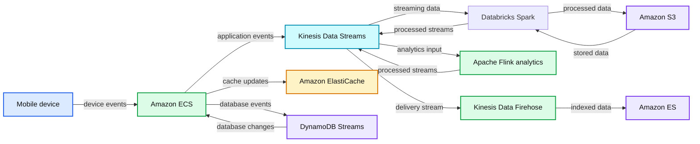

# Learn How Disney+ Built Their Streaming Data Analytics Platform With Databricks and AWS to Improve the Customer Experience

- Source: https://www.databricks.com/blog/2020/12/14/learn-how-disney-built-their-streaming-data-analytics-platform-with-databricks-and-aws-to-improve-the-customer-experience.html
- Published: 2020-12-14
- Authors: Hector Leano
- Categories: data-streaming, company, events
- Images: 1 total, 1 extracted as architecture

https://youtu.be/WAOrqsHpJuM

Martin Zapletal, Software Engineering Director at Disney+, is presenting at re:Invent 2020 with the session "How Disney+ uses fast data ubiquity to improve the customer experience".

In this breakout session, Martin showcases Disney+’s architecture using Databricks on AWS for processing and analyzing millions of real-time streaming events.

## Abstract:

*Disney+ uses Amazon Kinesis to drive real-time actions like providing title recommendations for customers, sending events across microservices, and delivering logs for operational analytics to improve the customer experience. In this session, you learn how Disney+ built real-time data-driven capabilities on a unified streaming platform. This platform ingests billions of events per hour in Amazon Kinesis Data Streams, processes and analyzes that data in Amazon Kinesis Data Analytics for Apache Flink, and uses Amazon Kinesis Data Firehose to deliver data to destinations without servers or code. Hear how these services helped Disney+ scale its viewing experience to tens of millions of customers with the required quality and reliability.*

**Summary:** The diagram shows Disney+ data management using Amazon ECS, Kinesis, Databricks Spark, Amazon S3, ElastiCache, DynamoDB Streams, Kinesis Data Firehose, Amazon ES, and Apache Flink.

**Components:**

- Amazon ECS for containerized services.
- Amazon DynamoDB Streams for database change streams.
- Kinesis Data Streams for event streaming.
- Amazon ElastiCache for caching.
- Mobile device as an event source.
- Databricks Spark for stream processing.
- Amazon S3 for durable storage.
- Amazon Kinesis Data Analytics for Apache Flink for stream analytics.
- Kinesis Data Firehose for delivery.
- Amazon ES as an analytics destination.

**Flows:**

- Amazon ECS -> Amazon DynamoDB Streams: database events.
- Amazon DynamoDB Streams -> Amazon ECS: streamed database changes.
- Amazon ECS -> Kinesis Data Streams: application events.
- Kinesis Data Streams -> Amazon ECS: streamed events.
- Amazon ECS -> Amazon ElastiCache: cache updates.
- Mobile device -> Amazon ECS: device events.
- Amazon ECS -> Kinesis Data Streams: device event ingestion.
- Kinesis Data Streams -> Amazon ECS: streamed device events.
- Kinesis Data Streams -> Databricks Spark: streaming data.
- Databricks Spark -> Amazon S3: processed data.
- Amazon S3 -> Databricks Spark: stored data for processing.
- Kinesis Data Streams -> Databricks Spark: additional streaming data.
- Databricks Spark -> Amazon S3: processed output.
- Databricks Spark -> Kinesis Data Streams: processed streaming data.
- Kinesis Data Streams -> Kinesis Data Firehose: delivered stream data.
- Kinesis Data Firehose -> Amazon ES: indexed data.
- Kinesis Data Streams -> Amazon Kinesis Data Analytics for Apache Flink: analytics input.
- Amazon Kinesis Data Analytics for Apache Flink -> Kinesis Data Streams: processed stream data.

**Numbers:** none

source image: https://www.databricks.com/wp-content/uploads/2020/12/screen-og.png

You can also check out the Databricks [Quality of Service blog/notebook](https://www.databricks.com/blog/2020/05/06/how-to-build-a-quality-of-service-qos-analytics-solution-for-streaming-video-services.html) based on a similar architecture if you want to see how to process streaming and batch data at scale for video/audio streaming services. This solution demonstrates how to process playback events and quickly identify, flag, and remediate audience experience issues.
