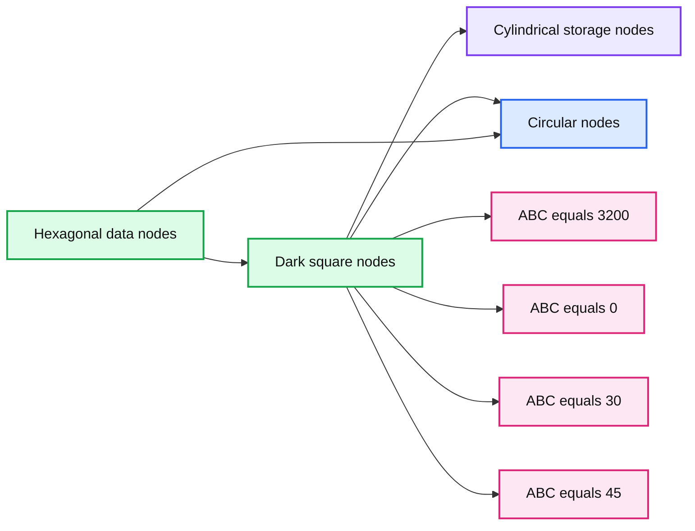
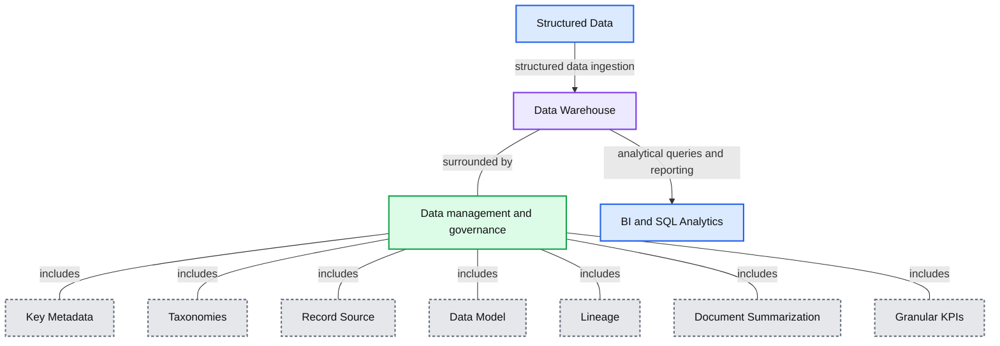
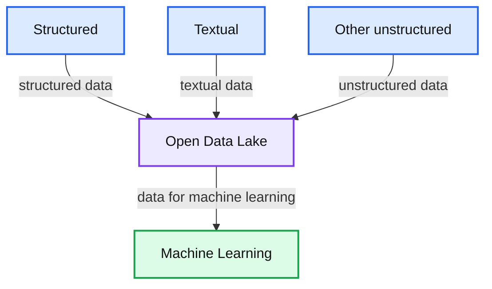
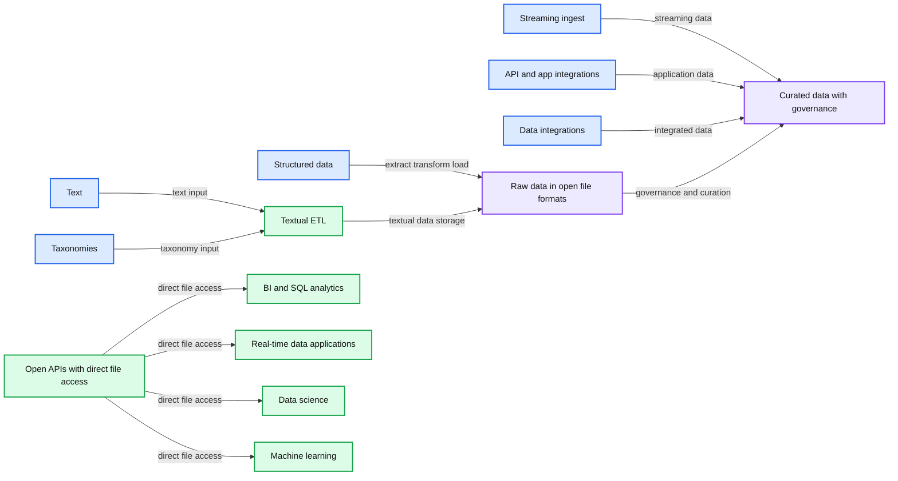

# Evolution to the Data Lakehouse

- Source: https://www.databricks.com/blog/2021/05/19/evolution-to-the-data-lakehouse.html
- Published: 2021-05-19
- Authors: Bill Inmon, Mary Levins
- Categories: data-warehousing, data-strategy, industry-insights
- Images: 6 total, 5 extracted as architecture

This is a guest authored article by the data team at Forest Rim Technology. We thank Bill Inmon, CEO, and Mary Levins, Chief Data Strategy Officer, of Forest Rim Technology for their contributions.

Dive deeper into the evolution of the Data Lakehouse & read [Rise of the Data Lakehouse](https://www.databricks.com/resources/ebook/rise-data-lakehouse?itm_data=evolutiondatalakehouse-blog-riselakehousebook ) by the father of the data warehouse, Bill Inmon.

## The Original Data Challenge

With the proliferation of applications came the problem of data integrity. The problem with the advent of large numbers of applications was that the same data appeared in many places with different values. In order to make a decision, the user had to find WHICH version of the data was the right one to use among the many applications. If the user did not find and use the right version of data, incorrect decisions might be made.

**Summary:** The diagram shows multiple connected data components producing different values for the same data item, ABC.

**Components:**

- ABC = 3200 label, technology unspecified.
- ABC = 0 label, technology unspecified.
- ABC = 30 label, technology unspecified.
- ABC = 45 label, technology unspecified.
- Hexagonal nodes, technology unspecified.
- Dark square nodes, technology unspecified.
- Cylindrical storage nodes, technology unspecified.
- Circular nodes, technology unspecified.

**Flows:**

- Hexagonal nodes -> dark square nodes: visible connections.
- Dark square nodes -> cylindrical storage nodes: visible connections.
- Dark square nodes -> circular nodes: visible connections.
- Hexagonal nodes -> circular nodes: visible connections.
- Connected nodes -> ABC labels: associated data values.

**Numbers:** 3200, 0, 30, 45

source image: https://www.databricks.com/wp-content/uploads/2021/05/edl-blog-img-1-1024x486.png

People discovered that they needed a different architectural approach to find the right data to use for decision making. Thus, the data warehouse was born.

## The data warehouse

The data warehouse caused disparate application data to be placed in a separate physical location. The designer had to build an entirely new infrastructure around the data warehouse.

**Summary:** The diagram shows structured data flowing into a data warehouse surrounded by data management and governance, then supporting BI and SQL analytics.

**Components:**

- Structured Data, technology not specified
- Data Warehouse, technology not specified
- Data management and governance, technology not specified
- Key Metadata, technology not specified
- Taxonomies, technology not specified
- Record Source, technology not specified
- Data Model, technology not specified
- Lineage, technology not specified
- Document Summarization, technology not specified
- Granular KPIs, technology not specified
- BI and SQL Analytics, technology not specified

**Flows:**

- Structured Data -> Data Warehouse: structured data ingestion
- Data Warehouse -> BI and SQL Analytics: analytical queries and reporting

**Numbers:** none

source image: https://www.databricks.com/wp-content/uploads/2021/05/edl-blog-img-2.png

The analytical infrastructure surrounding the data warehouse contained such things as:

- Metadata – a guide to what data was located where
- A data model – an abstraction of the data found in the data warehouse
- Data lineage – the tale of the origins and transformations of data in the warehouse
- Summarization – a description of the algorithmic work designed to create the data
- KPIs – where are key performance indicators found
- ETL – enabled application data to be transformed into corporate data

The limitations of data warehouses became evident with the increasing variety of data (text, IoT, images, audio, videos etc) in the enterprise. In addition, the rise of machine learning (ML) and AI introduced iterative algorithms that required direct data access and were not based on SQL.

## All the data in the corporation

As important and useful as data warehouses are, for the most part, data warehouses centered around structured data. But now there are many other data types in the corporation. In order to see what data resides in a corporation, consider a simple graph:

**Summary:** The diagram categorizes corporate data into structured, textual, and other unstructured data.

**Components:**

- Structured data - technology not specified
- Textual data - technology not specified
- Other unstructured data - technology not specified

**Flows:**

- none

**Numbers:** none

source image: https://www.databricks.com/wp-content/uploads/2021/05/edl-blog-img-3-1024x124.png

*Structured data* is typically transaction-based data that is generated by an organization to conduct day-to-day business activities. *Textual data* is data that is generated by letters, email and conversations that take place inside the corporation. *Other unstructured data* is data that has other sources, such as IoT data, image, video and analog-based data.

## The data lake

The data lake is an amalgamation of ALL of the different kinds of data found in the corporation. It has become the place where enterprises offload all their data, given its low-cost storage systems with a file API that hold data in generic and open file formats, such as Apache Parquet and ORC. The use of open formats also made data lake data directly accessible to a wide range of other analytics engines, such as machine learning systems.

**Summary:** The diagram shows structured, textual, and other unstructured data flowing into an open data lake, which feeds machine learning.

**Components:**

- Structured: structured data
- Textual: textual data
- Other unstructured: unstructured data
- Open Data Lake: open data lake storage
- Machine Learning: machine learning system

**Flows:**

- Structured -> Open Data Lake: structured data
- Textual -> Open Data Lake: textual data
- Other unstructured -> Open Data Lake: unstructured data
- Open Data Lake -> Machine Learning: data for machine learning

**Numbers:** none

source image: https://www.databricks.com/wp-content/uploads/2021/05/edl-blog-img-4-1024x847.png

When the data lake was first conceived, it was thought that all that was required was that data should be extracted and placed in the data lake. Once in the data lake, the end user could just dive in and find data and do analysis. However, corporations quickly discovered that using the data in the data lake was a completely different story than merely having the data placed in the lake.

Many of the promises of the data lakes have not been realized due to the lack of some critical features: no support for transactions, no enforcement of data quality or governance and poor performance optimizations. As a result, most of the data lakes in the enterprise have become *data swamps*.

## Challenges with current data architecture

Due to the limitations of data lakes and warehouses, a common approach is to use multiple systems – a data lake, several data warehouses and other specialized systems, resulting in three common problems:

**1. Lack of openness: **Data warehouses lock data into proprietary formats that increase the cost of migrating data or workloads to other systems. Given that data warehouses primarily provide SQL-only access, it is hard to run any other analytics engines, such as machine learning systems. Moreover, it is very expensive and slow to directly access data in the warehouse with SQL, making integrations with other technologies difficult.

**2. Limited support for machine learning:** Despite much research on the confluence of ML and data management, none of the leading machine learning systems, such as TensorFlow, PyTorch and XGBoost, work well on top of warehouses. Unlike BI, which extracts a small amount of data, ML systems process large datasets using complex non-SQL code. For these use cases, warehouse vendors recommend exporting data to files, which further increases complexity and staleness.

**3. Forced trade-off between data lakes and data warehouses:** More than 90% of enterprise data is stored in data lakes due to its flexibility from open direct access to files and low cost, as it uses cheap storage. To overcome the lack of performance and quality issues of the data lake, enterprises ETLed a small subset of data in the data lake to a downstream data warehouse for the most important decision support and BI applications. This dual system architecture requires continuous engineering to ETL data between the lake and warehouse. Each ETL step risks incurring failures or introducing bugs that reduce data quality, while keeping the data lake and warehouse consistent is difficult and costly. Apart from paying for continuous ETL, users pay double the storage cost for data copied to a warehouse.

## Emergence of the data lakehouse

We are seeing the emergence of a new class of data architecture called [data lakehouse](https://www.databricks.com/blog/2021/08/30/frequently-asked-questions-about-the-data-lakehouse.html), which is enabled by a new open and standardized system design: implementing similar data structures and data management features to those in a data warehouse, directly on the kind of low cost storage used for data lakes.

**Summary:** The diagram shows a data lakehouse combining structured, textual, and other unstructured data with open formats, governance, integrations, and analytics workloads.

**Components:**

- Structured data
- Textual data
- Other unstructured data
- Extract, transform, and load
- Text
- Taxonomies
- Textual ETL
- Raw data in open file formats
- Curated data with governance
- Metadata
- Record source
- Taxonomies
- Model
- Key performance indicators
- Lineage
- Granular
- Document summarization
- Transaction
- Streaming ingest
- API and app integrations
- Data integrations
- Open APIs with direct file access
- BI and SQL analytics
- Real-time data applications
- Data science
- Machine learning
- SQL
- R
- Python

**Flows:**

- Structured data -> Extract transform and load: structured data processing
- Text -> Textual ETL: text input
- Taxonomies -> Textual ETL: taxonomy input
- Textual ETL -> Raw data in open file formats: textual data storage
- Extract transform and load -> Raw data in open file formats: loaded data
- Streaming ingest -> Curated data with governance: streaming data
- API and app integrations -> Curated data with governance: integrated application data
- Data integrations -> Curated data with governance: integrated data
- Raw data in open file formats -> Curated data with governance: governed and curated data
- Open APIs with direct file access -> BI and SQL analytics: direct file access
- Open APIs with direct file access -> Real-time data applications: direct file access
- Open APIs with direct file access -> Data science: direct file access
- Open APIs with direct file access -> Machine learning: direct file access

**Numbers:** none

source image: https://www.databricks.com/wp-content/uploads/2021/05/edl-blog-img-5-832x1024.png

The data lakehouse architecture addresses the key challenges of current data architectures discussed in the previous section by:

- enabling open direct-access by using open formats, such as Apache Parquet
- providing native class support for data science and machine learning
- offering best-in-class performance and reliability on low cost storage

Here are the various features that enable the key benefits of the lakehouse architecture:

**Openness:**

- **Open File Formats:** Built on open and standardized file formats, such as Apache Parquet and ORC
- **Open API:** Provides an open API that can efficiently access the data directly without the need for proprietary engines and vendor lock-in
- **Language Support:** Supports not only SQL access, but also a variety of other tools and engines, including machine learning and Python/R libraries

**Machine learning support:**

- **Support for diverse data types:** Store, refine, analyze and access data for many new applications, including images, video, audio, semi-structured data and text.
- **Efficient non-SQL direct reads:** Direct efficient access of large volumes of data for running machine learning experiments using R and Python libraries.
- **Support for DataFrame API:** Built-in declarative DataFrame API with query optimizations for data access in ML workloads since ML systems such as TensorFlow, PyTorch and XGBoost have adopted DataFrames as the main abstraction for manipulating data.
- **Data Versioning for ML experiments:** Providing snapshots of data enabling data science and machine learning teams to access and revert to earlier versions of data for audits and rollbacks or to reproduce ML experiments.

**Best-in-class performance and reliability at low cost**:

- **Performance optimizations**: Enable various optimization techniques, such as caching, multi-dimensional clustering and data skipping, by leveraging file statistics and data compaction to right-size the files.
- **Schema enforcement and governance:** Support for DW schema architectures like star/snowflake-schemas and provide robust governance and auditing mechanisms.

- **Transaction support:** Leverage ACID transactions to ensure consistency as multiple parties concurrently read or write data, typically using SQL.
- **Low cost storage:** Lakehouse architecture is built using low cost object storage such Amazon S3, Azure Blob Storage or Google Cloud Storage.

## Comparing data warehouse and data lake with data lakehouse

|  | **Data warehouse** | **Data lake** | **Data lakehouse** |
|---|---|---|---|
| **Data format** | Closed, proprietary format | Open format | Open format |
| **Types of data** | Structured data, with limited support for semi-structured data | All types: Structured data, semi-structured data, textual data, unstructured (raw) data | All types: Structured data, semi-structured data, textual data, unstructured (raw) data |
| **Data access** | SQL-only, no direct access to file | Open APIs for direct access to files with SQL, R, Python and other languages | Open APIs for direct access to files with SQL, R, Python and other languages |
| **Reliability** | High quality, reliable data with ACID transactions | Low quality, data swamp | High quality, reliable data with ACID transactions |
| **Governance and security** | Fine-grained security and governance for row/columnar level for tables | Poor governance as security needs to be applied to files | Fine-grained security and governance for row/columnar level for tables |
| **Performance** | High | Low | High |
| **Scalability** | Scaling becomes exponentially more expensive | Scales to hold any amount of data at low cost, regardless of type | Scales to hold any amount of data at low cost, regardless of type |
| **Use case support** | Limited to BI, SQL applications and decision support | Limited to machine learning | One data architecture for BI, SQL and machine learning |

## Impact of the lakehouse

We believe that the data lakehouse architecture presents an opportunity comparable to the one we saw during early years of the data warehouse market. The unique ability of the lakehouse to manage data in an open environment, blend all varieties of data from all parts of the enterprise and combine the data science focus of the data lake with the end-user analytics of the data warehouse will unlock incredible value for organizations.

---

**Building the Data Lakehouse.**
 Explore the next generation of data architecture with the father of the data warehouse, Bill Inmon.

[Download Now](https://www.databricks.com/p/ebook/building-the-data-lakehouse?itm_data=blog-link-buildingthelakehouse)

 

Want to learn more? Join [Data + AI Summit](https://www.databricks.com/dataaisummit/north-america-2021), the global event for the data community, for a fireside chat with Bill Inmon and Databricks Co-founder & CEO Ali Ghodsi. This free virtual event features data + AI visionaries, thought leaders and experts – check out the full speaker lineup here.

[Forest Rim Technology](https://www.forestrimtech.com/) was founded by Bill Inmon and is the world leader in converting textual unstructured data to a structured database for deeper insights and meaningful decisions.
