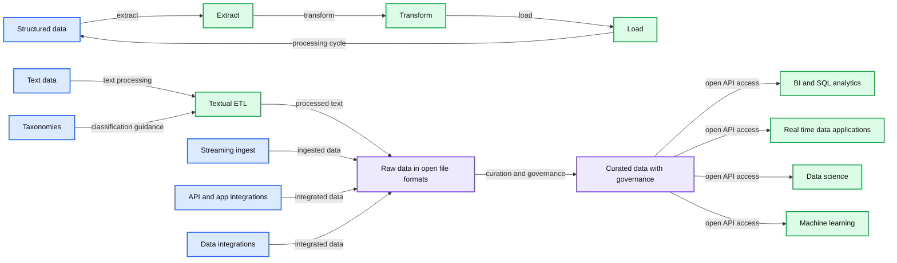
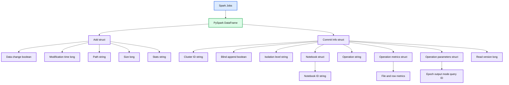
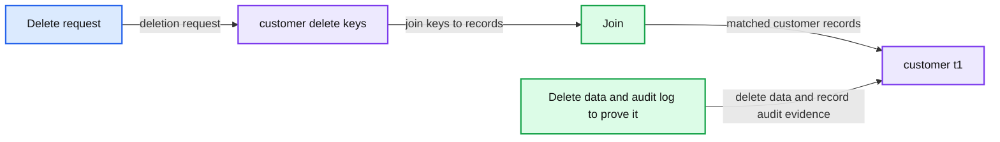

# Get Your Free Copy of Delta Lake: The Definitive Guide (Early Release)

- Source: https://www.databricks.com/blog/2021/06/22/get-your-free-copy-of-delta-lake-the-definitive-guide-early-release.html
- Published: 2021-06-22
- Authors: Tathagata Das, Ryan Boyd, Denny Lee, Vini Jaiswal
- Categories: engineering, open-source
- Images: 5 total, 4 extracted as architecture

At the Data + AI Summit, we were thrilled to announce the [early release of Delta Lake: The Definitive Guide](https://www.databricks.com/p/ebook/delta-lake-the-definitive-guide-by-oreilly” with “https://www.databricks.com/p/ebook/delta-lake-the-definitive-guide-by-oreilly?itm_data=blog-promo-deltalakeoreilly), published by O’Reilly. The guide teaches how to build a [modern lakehouse architecture](https://www.databricks.com/blog/2020/01/30/what-is-a-data-lakehouse.html) that combines the performance, reliability and data integrity of a warehouse with the flexibility, scale and support for unstructured data available in a data lake. It also shows how to use Delta Lake as a key enabler of the lakehouse, providing ACID transactions, time travel, schema constraints and more on top of the open Parquet format. Delta Lake enhances Apache Spark and makes it easy to store and manage massive amounts of complex data by supporting data integrity, data quality, and performance.

---

 Get an early preview of [O'Reilly's new ebook](https://www.databricks.com/resources/ebook/delta-lake-running-oreilly?itm_data=dldefinitiveguide-blog-oreillydlupandrunning) for the step-by-step guidance you need to start using Delta Lake.

---

What can you expect from reading this guide? Learn about all the buzz around bringing transactionality and reliability to data lakes using the **Delta Lake**. You will gain an understanding about the evolution of the big data technology landscape -- from[data warehousing to the data lakehouse](https://www.databricks.com/blog/2021/05/19/evolution-to-the-data-lakehouse.html).

*Source: Evolution to the Data Lakehouse*

**Summary:** The diagram shows a data lakehouse that ingests structured, textual, and other unstructured data into governed open-format storage for analytics, real-time applications, data science, and machine learning.

**Components:**

- Structured data with extract, transform, and load processing
- Text data
- Taxonomies
- Textual ETL
- Other unstructured data
- Streaming ingest
- API and app integrations
- Data integrations
- Raw data in open file formats
- Curated data with governance
- Open APIs with direct file access using SQL, R, Python, and other languages
- BI and SQL analytics
- Real-time data applications
- Data science
- Machine learning
- Governance metadata including keys, metadata, record, lineage, taxonomies, source, model, document, summarization, transaction, KPI, and granular data

**Flows:**

- Structured data -> Extract: data is extracted
- Extract -> Transform: extracted data is transformed
- Transform -> Load: transformed data is loaded
- Load -> Structured data: processing cycle continues
- Text -> Textual ETL: text is processed
- Taxonomies -> Textual ETL: taxonomies guide textual ETL
- Textual ETL -> Raw data in open file formats: processed text is stored
- Streaming ingest -> Raw data in open file formats: streaming data is ingested
- API and app integrations -> Raw data in open file formats: integrated data is ingested
- Data integrations -> Raw data in open file formats: integrated data is ingested
- Raw data in open file formats -> Curated data with governance: raw data is curated and governed
- Curated data with governance -> BI and SQL analytics: governed data is accessed
- Curated data with governance -> Real-time data applications: governed data is accessed
- Curated data with governance -> Data science: governed data is accessed
- Curated data with governance -> Machine learning: governed data is accessed

**Numbers:** none

source image: https://www.databricks.com/wp-content/uploads/2021/06/dlake-guide-blog-img-1.jpg

Source: Evolution to the Data Lakehouse

There is no shortage of challenges associated with building data pipelines, and this guide walks through how to tackle them and make data pipelines robust and reliable so that downstream users both realize significant value and rely on their data to make critical data driven decisions.

While many organizations have standardized on [Apache Spark™](https://spark.apache.org/) as the big data processing engine, we need to add transactionality to our data lakes to ensure a high quality end-to-end data pipeline. This is where Delta Lake comes in. Delta Lake enhances [Apache Spark](https://www.databricks.com/spark/about) and makes it easy to store and manage massive amounts of complex data by supporting data integrity, data quality and performance. And with the recent announcements by [Michael Armbrust](https://www.linkedin.com/in/michaelarmbrust/) and [Matei Zaharia](https://www.linkedin.com/in/mateizaharia/), Databricks recently released [Delta Lake 1.0](https://github.com/delta-io/delta/releases/tag/v1.0.0) on Apache Spark 3.1, with added experimental support for [Google Cloud Storage](https://cloud.google.com/storage), [Oracle Cloud Storage](https://www.oracle.com/cloud/storage/) and [IBM Cloud Object Storage](https://www.ibm.com/cloud/object-storage). In relation to this release, we also introduced [Delta Sharing](https://www.databricks.com/blog/2021/05/26/introducing-delta-sharing-an-open-protocol-for-secure-data-sharing.html), an [open protocol](https://delta.io/sharing/) for secure real-time exchange of large datasets, which enables organizations to share data in real-time regardless of which computing platforms they use. We will cover the step-by-step guide on all these releases in a future release of the book.

This guide is designed to walk data engineers, data scientists and data practitioners through how to build reliable data lakes and data pipelines at scale using Delta Lake. Additionally, you will:

- Understand key data reliability challenges and how to tackle them
- Learn how to use Delta Lake to realize data reliability improvements
- Learn how to concurrently run streaming and batch jobs against a data lake
- Explore how to execute update, delete and merge commands against a data lake
- Dive into using time travel to roll back and examine previous versions of a data

**Summary:** The image shows the nested schema of a Delta Lake transaction log DataFrame.

**Components:**

- Spark Jobs using PySpark
- DataFrame field `add` using a struct
- Add metadata including data change, modification time, path, size, and stats
- DataFrame field `commitInfo` using a struct
- Commit metadata including cluster ID, blind append status, isolation level, notebook, operation, metrics, parameters, and read version
- Notebook metadata with notebook ID
- Operation metrics with file and row counts
- Operation parameters with epoch ID, output mode, and query ID

**Flows:**

- none

**Numbers:**

- 1
- 0
- `readVersion` uses type long
- `modificationTime` uses type long
- `size` uses type long

source image: https://www.databricks.com/wp-content/uploads/2021/06/dlake-guide-blog-img-2.png

Reviewing the transaction log structure

- Learn best practices to build effective, high-quality end-to-end data pipelines for real-world use cases
- Integrate with other data technologies like Presto, Athena, Redshift and other BI tools and programming languages
- Learn about different use cases in which transaction log can be an absolute lifesaver, such as with data governance ([GDPR/CCPA](https://www.youtube.com/watch?v=tCPslvUjG1w)):

**Summary:** The diagram shows a three-step governance workflow that joins deletion keys with customer records, then deletes data and records an audit log.

**Components:**

- Delete request: source of deletion requests, technology unspecified
- customer_delete_keys: table containing customer surrogate and customer IDs, technology unspecified
- Join: data operation joining deletion keys to customer records
- customer_t1: customer table containing customer and current dimension keys, technology unspecified
- Delete data and audit log to prove it: deletion and auditing process, technology unspecified

**Flows:**

- Delete request -> customer_delete_keys: deletion request
- customer_delete_keys -> customer_t1: join keys to customer records
- Delete data and audit log to prove it -> customer_t1: delete data and record audit evidence

**Numbers:** 1, 2, 3

source image: https://www.databricks.com/wp-content/uploads/2021/06/dlake-guide-blog-img-3.png

Simplified governance use case with time travel

## Book reader personas

This guide doesn’t require any prior knowledge of the [modern lakehouse architecture](https://www.databricks.com/research/delta-lake-high-performance-acid-table-storage-overcloud-object-stores), however, some knowledge of big data, data formats, cloud architectures and Apache Spark is helpful. While we invite anyone with an interest in data architectures and machine learning to check our guide, it’s especially useful for:

- **Data engineers** with Apache Spark or big data backgrounds
- **Machine learning engineers** who are involved in day-to-day data engineering
- **Data scientists** who are interested in learning behind-the-scenes data engineering for the curated data
- **DBAs** (or other operational folks) who know SQL and DB concepts and want to apply their knowledge the new world of data lakes
- **University students** who are learning all things possible in CS, Data and AI

The early release of the digital book is available now from [Databricks](https://www.databricks.com/p/ebook/delta-lake-the-definitive-guide-by-oreilly?itm_data=blog-promo-deltalakeoreilly)and O’Reilly. You get to read the ebook in its earliest form—the authors’ raw and unedited content as they write—so you can take advantage of these technologies long before the official release of these titles. The final digital copy is expected to be released at the end of 2021, and the printed copies will be available in April 2022. Thanks to [Gary O’Brien](https://www.linkedin.com/in/gary-o-brien-64b9752/), [Jess Haberman](https://www.linkedin.com/in/jhaberman/) and [Chris Faucher](https://www.linkedin.com/in/christopher-faucher-1032a3120/) from O’reilly who have been helping us with the book publication.

Early Release of Delta Lake: The Definitive Guide

**To provide you a sneak peek, here is an excerpt from Chapter 2 describing what Delta Lake is.**

## What is Delta Lake?

As previously noted, over time, there have been different storage solutions built to solve this problem of data quality - from databases to data lakes. The transition from databases to data lakes allows for the decoupling of business logic from storage as well as the ability to independently scale compute and storage. But lost in this transition was ensuring data reliability. Providing data reliability to data lakes led to the development of Delta Lake.
 Built by the original creators of Apache Spark, Delta Lake was designed to combine the best of both worlds for online analytical workloads (i.e., OLAP style): *the transactional reliability of databases with the horizontal scalability of data lakes*.

Delta Lake is a file-based, open-source storage format that provides ACID transactions, scalable metadata handling, and unifies streaming and batch data processing. It runs on top of your existing data lakes and is compatible with Apache Spark and other processing engines. Specifically, it provides the following features:

- **ACID guarantees: **Delta Lake ensures that all data changes written to storage are committed for durability and made visible to readers atomically. In other words, no more partial or corrupted files! We will discuss more on the acid guarantees as part of the transaction log later in this chapter.
- **Scalable data and metadata handling:** Since Delta Lake is built on data lakes, all reads and writes using Spark or other distributed processing engines are inherently scalable to petabyte-scale. However, unlike most other storage formats and query engines, Delta Lake leverages Spark to scale out all the metadata processing, thus efficiently handling metadata of billions of files for petabyte-scale tables. We will discuss more on the transaction log later in this chapter.
- **Audit History and Time travel:** The Delta Lake transaction log records details about every change made to data providing a full audit trail of the changes. These data snapshots enable developers to access and revert to earlier versions of data for audits, rollbacks, or to reproduce experiments. We will dive further into this topic in Chapter 3: Time Travel with Delta.
- **Schema enforcement and schema evolution:** Delta Lake automatically prevents the insertion of data with an incorrect schema, i.e. not matching the table schema. And when needed, it allows the table schema to be explicitly and safely evolved to accommodate ever-change data. We will dive further into this topic in Chapter 4 focusing on schema enforcement and evolution.
- **Support for deletes, updates, and merge**: Most distributed processing frameworks do not support atomic data modification operations on data lakes. Delta Lake supports merge, update, and delete operations to enable complex use cases including but not limited to change-data-capture (CDC), slowly-changing-dimension (SCD) operations, and streaming upserts. We will dive further into this topic in Chapter 5: Data modifications in Delta.
- **Streaming and batch unification:** A Delta Lake table has the ability to work both in batch and as a streaming source and sink. The ability to work across a wide variety of latencies ranging from streaming data ingestion to batch historic backfill to interactive queries all just work out of the box. We will dive further into this topic in Chapter 6: Streaming Applications with Delta.

**Summary:** The diagram compares a pipeline using separate message queue, Parquet, and data warehouse storage with a Delta Lake pipeline using cloud object storage for streaming and table storage.

**Components:**

- MySQL change log
- Sensor data source
- ETL Job 1
- Message queue
- ETL Job 2
- ETL Job 3
- Streaming Analytics
- Cloud Object Store with Parquet Tables 1, 2, and 3
- Cloud Object Store with Delta Lake Tables 1, 2, and 3
- Data warehouses
- BI Users
- Data Scientists

**Flows:**

- MySQL Change Log -> ETL Job 1: change events
- Sensor Data -> ETL Job 1: sensor records
- ETL Job 1 -> Message Queue: streaming events
- Message Queue -> ETL Job 2: queued events
- ETL Job 2 -> Streaming Analytics: streaming data
- ETL Job 1 -> Parquet Table 1: writes data
- Parquet Table 1 -> ETL Job 3: reads data
- ETL Job 3 -> Parquet Table 2: transforms and writes data
- Parquet Table 2 -> Data Warehouse: table data
- ETL Job 3 -> Parquet Table 3: transforms and writes data
- Parquet Table 3 -> Data Warehouse: table data
- Data Warehouse -> BI Users: analytical data
- Parquet Table 3 -> Data Scientists: research data
- ETL Job 1 -> Delta Lake Table 1: writes data
- Delta Lake Table 1 -> ETL Job 3: reads data
- Delta Lake Table 1 -> Streaming Analytics: streaming source
- ETL Job 3 -> Delta Lake Table 2: transforms and writes data
- ETL Job 3 -> Delta Lake Table 3: transforms and writes data
- ETL Job 2 -> Delta Lake Table 2: writes data
- Delta Lake Table 2 -> BI Users: analytical data
- Delta Lake Table 3 -> BI Users: analytical data
- Delta Lake Table 3 -> Data Scientists: research data

**Numbers:** 1, 2, 3

source image: https://www.databricks.com/wp-content/uploads/2021/06/dlake-guide-blog-img-5-6.jpg

```mermaid
%% Comparison of separate storage systems with Delta Lake based storage
flowchart LR
    mysql[MySQL Change Log]
    sensor[Sensor Data]
    etl1[ETL Job 1]
    queue[Message Queue]
    etl2[ETL Job 2]
    stream[Streaming Analytics]
    etl3[ETL Job 3]
    parquet[Parquet Tables 1 2 and 3]
    delta[Delta Lake Tables 1 2 and 3]
    warehouse[Data Warehouse]
    bi[BI Users]
    scientists[Data Scientists]

    mysql -->|change events| etl1
    sensor -->|sensor records| etl1
    etl1 -->|streaming events| queue
    queue -->|queued events| etl2
    etl2 -->|streaming data| stream

    etl1 -->|writes data| parquet
    parquet -->|reads data| etl3
    etl3 -->|transforms and writes| parquet
    parquet -->|table data| warehouse
    warehouse -->|analytical data| bi
    parquet -->|research data| scientists

    etl1 -->|writes data| delta
    delta -->|streaming source| stream
    delta -->|reads and writes table data| etl3
    etl2 -->|writes data| delta
    delta -->|analytical data| bi
    delta -->|research data| scientists

    classDef client   fill:#dbeafe,stroke:#2563eb,stroke-width:2px,color:#111
    classDef service  fill:#dcfce7,stroke:#16a34a,stroke-width:2px,color:#111
    classDef store    fill:#ede9fe,stroke:#7c3aed,stroke-width:2px,color:#111
    classDef cache    fill:#fef3c7,stroke:#d97706,stroke-width:2px,color:#111
    classDef queue    fill:#cffafe,stroke:#0891b2,stroke-width:2px,color:#111
    classDef critical fill:#fee2e2,stroke:#dc2626,stroke-width:4px,color:#111
    classDef external fill:#e5e7eb,stroke:#6b7280,stroke-width:2px,color:#111,stroke-dasharray:4 3
    classDef decision fill:#fce7f3,stroke:#db2777,stroke-width:2px,color:#111

    class mysql,sensor,stream,bi,scientists client
    class etl1,etl2,etl3 service
    class parquet,delta,warehouse store
    class queue queue
```

Above figure (referenced from the VLDB20 paper) shows a data pipeline implemented using three storage systems (a message queue, object store and data warehouse), or using Delta Lake for both stream and table storage. The Delta Lake version removes the need to manage multiple copies of the data and uses only low-cost object storage. For more information, refer to the *VLDB20* paper: [Delta Lake: High-Performance ACID Table Storage over Cloud Object Stores.](https://www.databricks.com/wp-content/uploads/2020/08/p975-armbrust.pdf)

 
 Additionally, we are planning to cover the following topics in the final release of the book.

- A critical part of building your data pipelines is building the right platform and architecture, so we will be focusing on how to build the **Delta Lake Medallion architecture (Chapter 7)** and **Lakehouse architectures (Chapter 8)** respectively.
- As data reliability is crucial for all data engineering and data science systems, it is important that this capability is accessible to all systems. Thus in **Integrations with Delta Lake (Chapter 9)**, we will focus on how Delta Lake integrates with other open-source and proprietary systems including but not limited to Presto, Athena, and more!
- With Delta Lake in production for many years with more than 1 exabyte of data/day processed, there are a plethora of design tips and best practices that will be discussed in **Design Patterns using Delta Lake (Chapter 10)**.
- Just as important for production environments is the ability to build security and governance for your lake, this will be covered in **Security and Governance (Chapter 11).**
- To round up this book, we will also cover important topics including **Performance and Tuning (Chapter 12)**, **Migration to Delta Lake (Chapter 13)**, and **Delta Lake Case Studies (Chapter 14)**.

 

>  Please be sure to check out some related content from the [Data+AI Summit 2021](https://www.databricks.com/dataaisummit/?itm_data=blog-promo-dais2021) platform - keynotes from [Visionaries and thought leaders](https://www.databricks.com/dataaisummit/) including [Bill Inmon](https://www.linkedin.com/in/billinmon/): the father of Data Warehouses, [Malala Yousafzai](https://malala.org/malalas-story): Nobel Peace Prize winner and education advocate, [Dr. Moogega Cooper](https://www.linkedin.com/in/ACoAAAB0yc8BHugTgwJvbVTqX7mHPdRr2LOnNBY?lipi=urn%3Ali%3Apage%3Ad_flagship3_detail_base%3Bgm5tdjuRQNmwaC3fAkofRw%3D%3D) and [Adam Steltzner](https://www.linkedin.com/in/adam-steltzner-1b33a051/): Trailblazing Engineers of the famed [Mars Rover ‘Perseverance’ Mission at NASA-JPL](https://mars.nasa.gov/mars2020/), [Sol Rashidi:](https://www.linkedin.com/in/sol-rashidi-a672291/) CAO at Estee Lauder, [DJ Patil](https://www.linkedin.com/in/dpatil/) who coined the title "Data scientists" at Linkedin, [Michael Armbrust](https://www.linkedin.com/in/michaelarmbrust/), distinguished software engineer at Databricks, [Matei Zaharia](https://www.linkedin.com/in/mateizaharia/): Databricks Co-founder & Chief Technologist, and original creator of [Apache Spark](https://github.com/apache/spark/releases/tag/v1.0.0) and [MLflow](https://mlflow.org/) and [Ali Ghodsi](https://www.linkedin.com/in/alighodsi): Databricks CEO and co-founder among other features speakers. Level up your knowledge with [highly technical content](https://www.databricks.com/dataaisummit/), presented by leading experts.
