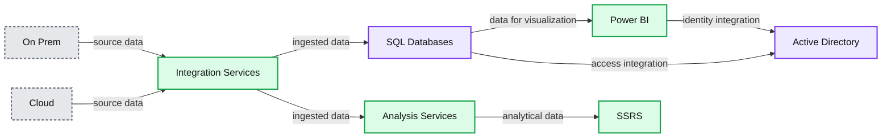
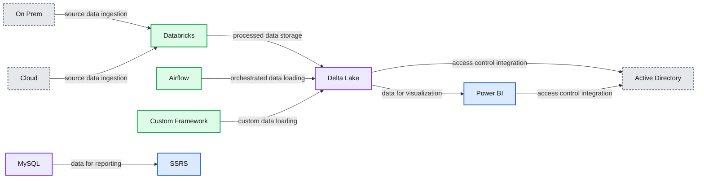

# Driving Transformation at Northwestern Mutual (Insights Platform) by Moving Towards a Scalable, Open Lakehouse Architecture

- Source: https://www.databricks.com/blog/2021/07/15/driving-transformation-at-northwestern-mutual-with-scalable-open-lakehouse-platform.html
- Published: 2021-07-15
- Authors: Madhu Kotian
- Categories: product, data-warehousing, company, customers
- Images: 2 total, 2 extracted as architecture

This is a guest authored post by Madhu Kotian, Vice President of Engineering (Investment Products Data, CRM, Apps and Reporting) at Northwestern Mutual.

 
 Digital Transformation has been front and center in most contemporary big data corporate initiatives, especially in companies with a heavy legacy footprint. One of the underpinning components in digital transformation is data and its related data store. For 160+ years, Northwestern Mutual has been helping families and businesses achieve financial security. With over $31 Billion in revenue, 4.6M+ clients and 9,300+ financial professionals, there are not too many companies that have this volume of data across a variety of sources.

Data ingestion is a challenge in this day and age when organizations deal with millions of data points coming in different formats, time frames and from different directions at an unprecedented volume. We want to make data ready for analysis to make sense  of it. Today, I am excited to share our novel approach to transforming and modernizing our data ingestion process, scheduling process, and journey with data stores.  One thing we learned is that an effective approach is multifaceted, which is why in addition to the technical arrangements I’ll walk through our plan to onboard our team.

**Challenges faced**

Before we embarked on our transformation, we worked with our business partners to really understand our technical constraints and help us shape the problem statement for our business case.

The business pain point we identified was a lack of integrated data, with customer and business data coming from different internal and external teams and data sources. We realized the value of real-time data but had limited access to production/real-time data that could enable us to make business decisions in a timely manner. We also learned that data stores built by the business team resulted in data silos, which in turn caused data latency issues, increased cost of data management and unwarranted security constraints.

Furthermore, there were technical challenges with respect to our current state. With increased demand and additional data needed, we experienced constraints with infrastructure scalability, data latency, cost of managing data silos, data size and volume limitations and data security issues. With these challenges mounting, we knew we had a lot to take on and needed to find the right partners to help us in our transformation journey.

**Solution analysis**

We needed to become data-driven to be competitive and serve our customers better and optimize internal processes. We explored various options and performed several POCs to select a final recommendation. The following were the must-haves for our go-forward strategy -

1. An all-inclusive solution for our data ingestion, data management and analytical needs
2. A modern data platform that can effectively support our developers and business analysts to perform their analysis using SQL
3. A data engine that can support ACID transactions on top of S3 and enable role-based security
4. A system that can effectively secure our PII/PHI information
5. A platform that can automatically scale based on the data processing and analytical demand

Our legacy infrastructure was based on MSBI Stack. We used SSIS for ingestion, SQL Server for our datastore, Azure Analysis Service for Tabular model and PowerBI for Dashboarding and reporting. Although the platform met the needs of the business initially, we had challenges around scaling with increased data volume and data processing demand, and constrained our data analytical expectations. With additional data needs, our data latency issues from load delays and a data store for specific business needs caused data silos and data sprawl.

Security became a challenge due to the spread of data across multiple data stores. We had approximately 300 ETL jobs that took more than 7 hours from our daily jobs.  The time to market for any change or new development was roughly 4 to 6 weeks (depending on the complexity).

*Figure 1: Legacy Architecture*

**Summary:** Legacy architecture showing data sources flowing through integration services into SQL and analysis services, then into Power BI and SSRS, with Active Directory supporting access.

**Components:**

- On Prem - on-premises data sources
- Cloud - cloud data sources
- Integration Services - data ingestion and integration
- SQL Databases - SQL-based data storage
- Analysis Services - analytical data services
- Power BI - visualization and business intelligence
- SSRS - reporting and visualization
- Active Directory - identity and access management

**Flows:**

- On Prem -> Integration Services: source data
- Cloud -> Integration Services: source data
- Integration Services -> SQL Databases: ingested data
- Integration Services -> Analysis Services: ingested data
- SQL Databases -> Power BI: data for visualization
- Analysis Services -> SSRS: analytical data for reporting
- SQL Databases -> Active Directory: access integration
- Power BI -> Active Directory: identity integration

**Numbers:** none

source image: https://www.databricks.com/wp-content/uploads/2021/07/Data-Tranformation-Journey-img-1.jpg

Figure 1: Legacy Architecture

After evaluating multiple solutions in the marketplace, we decided to move forward with Databricks to help us deliver one integrated data management solution on an open lakehouse architecture.

Databricks being developed on top of Apache Spark™ enabled us to use Python to build our custom framework for data ingestion and metadata management. It provided us the flexibility to perform ad-hoc analysis and other data discoveries using the notebook. Databricks Delta Lake (the storage layer built on top of our data lake) provided us the flexibility to implement various database management functions (ACID transactions, Metadata Governance, Time travel, etc.) including the implementation of required security controls. Databricks took the headache out from managing/scaling the cluster and reacted effectively to the pent-up demand from our engineers and business users.

*Figure 2: Architecture with Databricks*

**Summary:** The diagram shows Northwestern Mutual’s Databricks-based architecture connecting data sources through ingestion and storage to visualization, with Active Directory integration.

**Components:**

- On Prem: on-premises data source
- Cloud: cloud data source
- Databricks: ingestion platform
- Airflow: ingestion orchestration
- Custom Framework: custom ingestion framework
- Delta Lake: data storage
- MySQL: data storage
- Power BI: visualization
- SSRS: visualization
- Active Directory: identity and access management

**Flows:**

- On Prem -> Databricks: source data ingestion
- Cloud -> Databricks: source data ingestion
- Databricks -> Delta Lake: processed data storage
- Airflow -> Delta Lake: orchestrated data loading
- Custom Framework -> Delta Lake: custom data loading
- Delta Lake -> Power BI: data for visualization
- MySQL -> SSRS: data for reporting
- Delta Lake -> Active Directory: access control integration
- Power BI -> Active Directory: access control integration

**Numbers:** none

source image: https://www.databricks.com/wp-content/uploads/2021/07/Data-Tranformation-Journey-blog-img-2.jpg

Figure 2: Architecture with Databricks

**Migration approach and onboarding resources **

We started with a small group of engineers and assigned them to a virtual team from our existing scrum team. Their goal was to execute different POC, build on the recommended solution, develop best practices and transition back to their respective team to help with the onboarding. Leveraging existing team members favored us better because they had existing legacy system knowledge, understood the current ingestion flow/business rules, and were well versed with at least one programming knowledge (data engineering + software engineering knowledge). This team first trained themselves in Python, understood intricate details of Spark and Delta, and closely partnered with the Databricks team to validate the solution/approach. While the team was working on forming the future state, the rest of our developers worked on delivering the business priorities.

Since most of the developers were MSBI Stack engineers, our plan of action was to deliver a data platform that would be frictionless for our developers, business users, and our field advisors.

- We built an ingestion framework that covered all our data load and transformation needs. It had in-built security controls, which maintained all the metadata and secrets of our source systems. The ingestion process accepted a JSON file that included the source, target and required transformation. It allowed for both simple and complex transformation.
- For scheduling, we ended up using Airflow but given the complexity of the DAG, we built our own custom framework on top of Airflow, which accepted a YAML file that included job information and its related interdependencies.
- For managing schema-level changes using Delta, we built our own custom framework which automated different database type operations (DDL) without requiring developers to have break-glass access to the data store. This also helped us to implement different audit controls on the data store.

 

In parallel, the team also worked with our Security team to make sure we understood and met all the criteria for data security (Encryption in Transit, Encryption at Rest and column level encryption to protect PII information).

Once these frameworks were set up, the cohort team deployed an end-to-end flow (Source to target with all transformation) and generated a new set of reports/dashboards on PowerBI pointing to Delta Lake. The goal was to test the performance of our end-to-end process, validate the data and obtain any feedback from our field users. We incrementally improved the product based on the feedback and outcomes of our performance/validation test.

Simultaneously, we built training guides and how-tos to onboard our developers. Soon after, we decided to move the cohort team members to their respective teams while retaining a few to continue to support the platform infrastructure (DevOps). Each scrum team was responsible for managing and delivering their respective set of capabilities/features to the business. Once the team members moved back to their respective teams, they embarked on the task to adjust the velocity of the team to include the backlog for migration effort. The team leads were giving specific guidance and appropriate goals to meet the migration goals for different Sprint/Program Increments.   The team members who were in the cohort group were now the resident experts and they helped their team onboard to the new platform. They were available for any ad-hoc questions or assistance.

As we incrementally built our new platform, we retained the old platform for validation and verification.

**The beginning of success **

The overall transformation took us roughly a year and a half, which is quite a feat given that we had to build all the frameworks, manage business priorities, manage security expectations, retool our team and migrate the platform. Overall load time came down remarkably from 7 hours to just 2 hours. Our time to market was roughly about 1 to 2 weeks, down significantly from 4-6 weeks. This was a major improvement in which I know will extend itself to our business in several ways.

Our journey is not over. As we continue to enhance our platform, our next mission will be to expand on the lakehouse pattern. We are working on migrating our platform to E2 and deploying Databricks SQL. We are working on our strategy to provide a self-service platform to our business users to perform their ad-hoc analysis and also enable them to bring their own data with the ability to perform analysis with our integrated data. What we learned is that we benefited greatly by using a platform that was open, unified and scalable. As our needs and capabilities grow, we know we have a robust partner in Databricks.

Hear more about [Northwestern Mutual's journey to the lakehouse](https://www.databricks.com/session_na21/northwestern-mutual-journey-transform-bi-space-to-cloud-us).

---

**About Madhu Kotian**

 

Madhu Kotian is the Vice President of Engineering ( Investment Products Data, CRM, Apps and Reporting) at Northwestern Mutual. He has over 25+ years of experience in the field of Information Technology with experience and expertise in data engineering, people management, program management, architecture, design, development and maintenance using Agile practices. He is also an expert in Data Warehouse Methodologies and Implementation of Data Integration and Analytics.
