# Unlocking the Power of Health Data With a Modern Data Lakehouse

- Source: https://www.databricks.com/blog/2021/07/19/unlocking-the-power-of-health-data-with-a-modern-data-lakehouse.html
- Published: 2021-07-19
- Authors: Michael Ortega, Michael Sanky, Amir Kermany
- Categories: engineering, solution-accelerators
- Images: 2 total, 2 extracted as architecture

A single patient produces approximately[80 megabytes of medical data](https://www.frontiersin.org/articles/10.3389/fict.2018.00030/full#B37) every year. Multiply that across thousands of patients over their lifetime, and you're looking at petabytes of patient data that contains valuable insights. Unlocking these insights can help streamline clinical operations, accelerate drug R&D and improve patient health outcomes. But first, the data needs to be prepared for downstream analytics and AI. Unfortunately, most healthcare and life science organizations spend an inordinate amount of time simply gathering, cleaning and structuring their data.

 

 Read [Rise of the Data Lakehouse](https://www.databricks.com/resources/ebook/rise-data-lakehouse?itm_data=powerhealthdatablog-textpromo-riselakehousebook) to explore why lakehouses are the data architecture of the future with the father of the data warehouse, Bill Inmon.

 

*Health data is growing exponentially with a single patient producing over 80 megabytes of data a year*

**Summary:** A patient-centered view of medical data generated annually across eight healthcare data sources.

**Components:**

- Patient medical data hub - technology unspecified
- Electronic health records - technology unspecified
- Disease registries - technology unspecified
- Medical imaging - technology unspecified
- Genome registries - technology unspecified
- Clinical trials - technology unspecified
- Pharmacy data - technology unspecified
- Health claims - technology unspecified
- Health wearables - technology unspecified

**Flows:**

- Patient medical data hub -> Electronic health records: medical data
- Patient medical data hub -> Disease registries: medical data
- Patient medical data hub -> Medical imaging: medical data
- Patient medical data hub -> Genome registries: medical data
- Patient medical data hub -> Clinical trials: medical data
- Patient medical data hub -> Pharmacy data: medical data
- Patient medical data hub -> Health claims: medical data
- Patient medical data hub -> Health wearables: medical data

**Numbers:** 80+ megabytes of medical data per patient per year

```text
%% mermaid failed to render; kept as text
%% Patient-centered medical data sources and annual data generation
flowchart LR
    EHR[Electronic health records] --> P[Patient medical data hub]
    DR[Disease registries] --> P
    MI[Medical imaging] --> P
    GR[Genome registries] --> P
    CT[Clinical trials] --> P
    PD[Pharmacy data] --> P
    HC[Health claims] --> P
    HW[Health wearables] --> P
    P --> V[80 plus megabytes per year]

    classDef client fill:#dbeafe,stroke:#2563eb,stroke-width:2px,color:#111
    classDef service fill:#dcfce7,stroke:#16a34a,stroke-width:2px,color:#111
    classDef store fill:#ede9fe,stroke:#7c3aed,stroke-width:2px,color:#111
    classDef cache fill:#fef3c7,stroke:#d97706,stroke-width:2px,color:#111
    classDef queue fill:#cffafe,stroke:#0891b2,stroke-width:2px,color:#111
    classDef critical fill:#fee2e2,stroke:#dc2626,stroke-width:4px,color:#111
    classDef external fill:#e5e7eb,stroke:#6b7280,stroke-width:2px,color:#111,stroke-dasharray:4 3
    classDef decision fill:#fce7f3,stroke:#db2777,stroke-width:2px,color:#111
    EHR,DR,MI,GR,CT,PD,HC,HW external
    P service
    V store
```

<sub>source image: https://www.databricks.com/wp-content/uploads/2021/07/single-patient-produces-80-megabytes-medical-data-year-min.png</sub>

Health data is growing exponentially with a single patient producing over 80 megabytes of data a year

## Challenges with data analytics in healthcare and life sciences

There are lots of reasons why data preparation, analytics and AI are a challenge for organizations  in the healthcare industry, many of which are related to investments in legacy data architectures built on data warehouses. Here are the four common challenges we see in the industry:

### Challenge #1 (Volume): Scaling for rapidly growing health data

Genomics is perhaps the single best example of the explosive growth in data volume in healthcare. The first genome cost more than $1B to sequence. Given the prohibitive costs, early efforts (and many efforts still) focused on genotyping, a process to look for specific variants in a very small fraction of a person's genome, typically around 0.1%. That evolved to Whole Exome Sequencing, which covers the protein coding portions of the genome, still less than 2% of the entire genome. Companies now offer direct-to-consumer tests for Whole Genome Sequencing (WGS) that are less than $300 for 30x WGS. On a population level, the UK Biobank is releasing more than 200,000 whole genomes for research this year.  It's not just genomics. Imaging, health wearables and electronic medical records are growing tremendously as well.

Scale is the name of the game for initiatives like population health analytics and drug discovery. Unfortunately, many legacy architectures are built on-premises and designed for peak capacity. This approach results in unused compute power (and ultimately wasted dollars) during periods of low usage nor does it scale quickly when upgrades are needed.

### Challenge #2 (Variety): Analyzing diverse health data

Healthcare and life science organizations deal with a tremendous amount of data variety, each with its own nuances. It is widely accepted that over 80% of medical data is unstructured, yet most organizations still focus their attention on data warehouses designed for structured data and traditional SQL-based analytics. Unstructured data includes image data, which is critical to diagnose and measure disease progression in areas like oncology, immunology and neurology (the fastest growing areas of cost) and narrative text in clinical notes, which are critical to understanding the complete patient health and social history. Ignoring these data types, or setting them to the side, is not an option.

To further complicate matters, the healthcare ecosystem is becoming more interconnected, requiring stakeholders to grapple with new data types. For example, providers need claims data to manage and adjudicate risk-sharing agreements, and payers need clinical data to support processes like prior authorizations and drive quality measures. These organizations often lack data architectures and platforms to support these new data types.

Some organizations have invested in data lakes to support unstructured data and advanced analytics, but this creates a new set of issues. In this environment, data teams now need to manage two systems -- data warehouses and data lakes -- where data is copied across siloed tools resulting in data quality and management issues.

### Challenge #3 (Velocity): Processing streaming data for real-time patient insights

In many settings, healthcare is a matter of life and death. Conditions can be very dynamic, and batch data processing -- done even on a daily basis -- often is not good enough. Access to the latest, up-to-the-second information is critical to successful interventional care. To save lives, streaming data is used by hospitals and national health systems for everything from predicting sepsis to implementing real-time demand forecasting for ICU beds.

Additionally, data velocity is a major component of the healthcare digital revolution. Individuals have access to more information than ever before and are able to influence their care in real time. For example, wearable devices -- like the continuous glucose monitors provided by [Livongo](https://www.youtube.com/watch?v=B9kQp2i-fso) - stream real-time data into mobile apps that provide personalized behavioral recommendations.

Despite some of these early successes, most organizations have not designed their data architecture to accommodate streaming data velocity. Reliability issues and challenges integrating real-time data with historic data is inhibiting innovation.

### Challenge #4 (Veracity): Building trust in healthcare data and AI

Last, but not least, clinical and regulatory standards demand the utmost level of data accuracy in healthcare. Healthcare organizations have high public health compliance requirements that must be met. Data democratization within organizations requires governance.

Additionally, organizations need good model governance when bringing artificial intelligence (AI) and machine learning (ML) into a clinical setting. Unfortunately, most organizations have separate platforms for data science workflows that are disconnected from their data warehouse. This creates serious challenges when trying to build trust and reproducibility in AI-powered applications.

## Unlocking health data with a Lakehouse

[The lakehouse architecture](https://www.databricks.com/blog/2021/08/30/frequently-asked-questions-about-the-data-lakehouse.html) helps healthcare and life sciences organizations overcome these challenges with a modern data architecture that combines the low-cost, scalability and flexibility of a cloud data lake with the performance and governance of a data warehouse. With a lakehouse, organizations can store all types of data and power all types of analytics and ML in an open environment.

*Deliver on all your healthcare and life sciences data analytics use cases with a modern Lakehouse architecture*

**Summary:** The diagram shows a four-stage healthcare and life sciences lakehouse architecture from data ingestion through processing, analytics and machine learning, and business use cases.

**Components:**

- Ingest diverse data: structured, unstructured, batch, streaming, and healthcare data sources
- Process at scale: lakehouse storage and real-time data processing
- Reproducible analytics and machine learning: build, train, and validate analytics and ML models
- Deliver on all use cases: ad-hoc data science, production machine learning, and BI reporting and dashboards
- Healthcare data domains: clinical charts, claims, manufacturing, inventory, genomics, research publications, telemetry, disease registries, trial data, provider notes, chatbots, social and behavioral data, imaging, and patient-reported outcomes
- Healthcare and life sciences use cases: R&D, trials, drug safety, manufacturing, readmissions, disease risk, fraud and abuse, and chronic condition management

**Flows:**

- Ingest diverse data -> Process at scale: healthcare and life sciences data
- Process at scale -> Reproducible analytics and machine learning: processed data for model development and analysis
- Reproducible analytics and machine learning -> Deliver on all use cases: validated analytics and ML outputs

**Numbers:** 1, 2, 3, 4

```mermaid
%% Healthcare and life sciences lakehouse flow from ingestion to use cases
flowchart LR
    A[Ingest diverse data] -->|Healthcare data| B[Process at scale]
    B -->|Processed data| C[Reproducible analytics and machine learning]
    C -->|Validated analytics and ML outputs| D[Deliver on all use cases]

    classDef client   fill:#dbeafe,stroke:#2563eb,stroke-width:2px,color:#111
    classDef service  fill:#dcfce7,stroke:#16a34a,stroke-width:2px,color:#111
    classDef store    fill:#ede9fe,stroke:#7c3aed,stroke-width:2px,color:#111
    classDef cache    fill:#fef3c7,stroke:#d97706,stroke-width:2px,color:#111
    classDef queue    fill:#cffafe,stroke:#0891b2,stroke-width:2px,color:#111
    classDef critical fill:#fee2e2,stroke:#dc2626,stroke-width:4px,color:#111
    classDef external  fill:#e5e7eb,stroke:#6b7280,stroke-width:2px,color:#111,stroke-dasharray:4 3
    classDef decision  fill:#fce7f3,stroke:#db2777,stroke-width:2px,color:#111

    class A external
    class B store
    class C service
    class D client
```



<sub>source image: https://www.databricks.com/wp-content/uploads/2021/07/building-a-lakehouse-for-healthcare-and-life-science-min.png</sub>

Deliver on all your healthcare and life sciences data analytics use cases with a modern Lakehouse architecture

Specifically, the lakehouse provides the following benefits for healthcare and life sciences organizations:

- **Organize all your health data at scale.** At the core of the Databricks Lakehouse Platform is [Delta Lake](https://delta.io/), an open-source data management layer, that provides reliability and performance to your data lake. Unlike a traditional data warehouse, Delta Lake supports all types of structured and unstructured data, and to make ingesting health data easy, Databricks has built connectors for domain-specific data types like electronic medical records and genomics. These connectors come packaged with industry-standard data models in a set of quick-start solution accelerators.  Additionally, Delta Lake provides built-in optimizations for data caching and indexing to significantly accelerate data processing speeds. With these capabilities, teams can land all their raw data in a single place and then curate it to create a holistic view of patient health.
- **Power all your patient analytics and AI.** With all your data centralized in a lakehouse, teams can build powerful patient analytics and predictive models directly on the data. To build on these capabilities, Databricks provides collaborative workspaces with a full suite of analytics and AI tools and support for a broad set of programming languages — such as SQL, R, Python, and Scala. This empowers a diverse group of users, like data scientists, engineers, and clinical informaticists, to work together to analyze, model and visualize all your health data.
- **Provide real-time patient insights.** The lakehouse provides a unified architecture for streaming and batch data. No need to support two different architectures nor wrestle with reliability issues. Additionally, by running the lakehouse architecture on Databricks, organizations have access to a cloud-native platform that auto-scales based on workload. This makes it easy to ingest streaming data and blend with petabytes of  historic data for near real-time insights at population scale.
- **Deliver data quality and compliance.** To address data veracity, the lakehouse includes capabilities missing from traditional Data Lakes like schema enforcement, auditing, versioning and fine-grained access controls. An important benefit of the lakehouse is the ability to perform both analytics and ML on this same, trusted data source. Additionally, Databricks provides ML model tracking and management capabilities to make it easy for teams to reproduce results across environments and help meet compliance standards. All of these capabilities are provided in a HIPAA-compliant analytics environment.

This lakehouse is the best architecture for managing healthcare and life sciences data. By marrying this architecture with the capabilities of Databricks, organizations can support a wide range of highly impactful use cases, from drug discovery through chronic disease management programs.

## Get started building your Lakehouse for Healthcare and Life Sciences

As mentioned above, we are pleased to make available a series of solution accelerators to help Healthcare and Life Sciences organizations get started building a Lakehouse for their specific needs. Our solution accelerators include sample data, prebuilt code and step-by-step instructions within a Databricks notebook.

- **New Solution Accelerator: Lakehouse for Real-world Evidence.** Real-world data provides pharmaceutical companies with new insights into patient health and drug efficacy outside of a trial. This accelerator helps you build a Lakehouse for Real-world Evidence on Databricks. We'll show you how to ingest sample EHR data for a patient population, structure the data using the OMOP common data model and then run analyses at scale like investigating drug prescription patterns.

Check out the [Lakehouse for Real-world Evidence notebooks](https://notebooks.databricks.com/notebooks/HLS/1-omop-cdm/index.html).

- **Coming Soon: Lakehouse for Population Health**. Healthcare payors and providers need real-time insights on patients to make more informed decisions. In this accelerator, we will show you how to easily ingest streaming HL7 data on Databricks and build powerful ML models for use cases like predicting patient disease risk.

Learn more about all of our [Healthcare](https://www.databricks.com/solutions/industries/healthcare-industry-solutions) and [Life Sciences](https://www.databricks.com/solutions/industries/life-sciences-industry-solutions) solutions.
