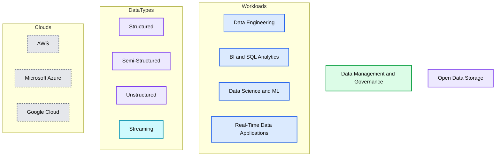

# Building the Next Generation Visualization Tools at Databricks

- Source: https://www.databricks.com/blog/2021/11/03/building-the-next-generation-visualization-tools-at-databricks.html
- Published: 2021-11-03
- Authors: Kanit “Ham” Wongsuphasawat
- Categories: data-warehousing, company, culture
- Images: 3 total, 1 extracted as architecture

[Databricks SQL](https://www.databricks.com/product/databricks-sql) is now generally available on AWS and Azure.

*This post is a part of our blog series on our frontend work. You can see the previous one on “[Simplifying Data + AI, One Line of TypeScript at a Time.](https://www.databricks.com/blog/2021/10/21/simplifying-data-ai-one-line-of-typescript-at-a-time.html)”*

After years of working on data visualization tools, I recently joined Databricks as a founding member of the visualization team, which aims to develop high-performance visual analytics capabilities for Databricks products. In this post, I’m sharing why I am super excited to build the next-generation visualization tools at Databricks.

## Mission alignment: simplify data and AI

I joined Databricks because my passion aligns with the company’s mission to simplify data and AI.

For context, I did my PhD at the [UW Interactive Data Lab](https://idl.cs.washington.edu/) to research new visualization tools that make data more accessible (like the lab did by creating [D3.js](https://idl.cs.washington.edu/papers/d3/)). After my PhD, I joined Apple’s AI/ML group as their first visualization research scientist and co-founded the Machine Intelligence Visualization team to build better visualization tools for machine learning at Apple. Over the years, I co-authored many open-source projects that aimed to simplify data visualization and AI, including [Vega-Lite](http://vega.github.io/vega-lite/), [Voyager](https://github.com/vega/voyager), and the [Tensorflow Graph Visualization](https://www.tensorflow.org/tensorboard/graphs).
  

*Vega-Lite lets users easily build interactive visualizations with a concise and intuitive JSON API.*

 
 Similar to how Apache Spark™ helps people run distributed computations with just a few lines of Python or SQL, Vega-Lite helps users build interactive charts by writing a dozen lines of code (instead of hundreds in D3.js). Vega-Lite’s JSON format also enables the open-source communities to build wrapper APIs in other languages such as Altair in Python. As a result, people can easily create interactive charts in these languages as well.

Voyager is a graphical interface that leverages chart recommendations for data exploration.

Besides simplifying code for visualization, I also built a tool for visualizing data without writing code. The [Voyager system](https://github.com/vega/voyager) leverages chart recommendations to help people quickly explore data in a graphical user interface (GUI). As a research project, Voyager received a lot of traction including [integration with JupyterLab](https://github.com/altair-viz/jupyterlab_voyager). However, building a production-quality GUI tool and integrating it with data science environments require significant resources beyond what a small research team could have. Thus, I had been hoping for an opportunity to take some of these research ideas to the next level.

So when I heard that Databricks was assembling a team to develop new visualization tools on top of their powerful [Lakehouse platform](https://www.databricks.com/product/data-lakehouse), I jumped at the opportunity.

## Databricks: Unique opportunity for visualization tool builders

Databricks offers a unique opportunity for building next-generation visualization tools for many reasons:

First, Databricks is where data at scales live. One of the hardest problems visualization tools need to overcome in gaining adoption is to integrate with the data sources. Over 5,000 global organizations are using the Databricks Lakehouse Platform for data engineering, machine learning and analytics. Every day, the platform processes exabytes of data over millions of machines. We can build tools that impact data analysts, data engineers, and data scientists on this platform, where the data is readily available.

Second, the company has a strong open-source culture. Databricks was co-founded by the original authors of [Apache Spark](https://spark.apache.org/) and has since built many leading open-source projects including [Delta Lake](https://delta.io/)and [MLflow](https://mlflow.org/). At Databricks, we have the opportunity to both build products that impact customers and contribute to open-source communities.

Third, future visualization tools should be integrated into data, analytics, and machine learning workflows, so people can easily leverage the power of visualizations. As a unified platform for all of these workflows, Databricks is the perfect place to build these integrations.

Last but not least, since visualization is a relatively new area for Databricks, we have the flexibility to innovate a new class of visualization tools without being restricted by decades of legacy.

*The Databricks Lakehouse Platform provides a unified environment for data, analytics, and machine learning work. Visualization can be an integral part of these different activities.*

**Summary:** The diagram shows the Databricks Lakehouse Platform spanning workloads, governance, open data storage, data types, and cloud providers.

**Components:**

- Data Engineering - technology not specified
- BI and SQL Analytics - technology not specified
- Data Science and ML - technology not specified
- Real-Time Data Applications - technology not specified
- Data Management and Governance - technology not specified
- Open Data Storage - technology not specified
- Structured - technology not specified
- Semi-Structured - technology not specified
- Unstructured - technology not specified
- Streaming - technology not specified
- AWS - Amazon Web Services
- Microsoft Azure - Microsoft Azure
- Google Cloud - Google Cloud

**Flows:**

- none visible

**Numbers:** none

source image: https://www.databricks.com/wp-content/uploads/2021/11/next-gen-vis-blog-img-3-rev.png

The Databricks Lakehouse Platform provides a unified environment for data, analytics, and machine learning work. Visualization can be an integral part of these different activities.

## Visualization tools as an integral part of a unified platform

There are many exciting challenges and advantages for building visualization tools as an integrated part of a unified platform for data, analytics, and AI. Here are a few highlights.

### Bridging coding and graphical user interfaces

As we consider different groups of data workers, which include both programmers and non-programmers, one exciting challenge is to design tools that can benefit from the best of both graphical and coding interfaces. Specifically, existing visualization GUI tools provide ease-of-use and accessibility to non-programmers, but are often built as monolithic standalone tools and thus are not integrated with data science coding environments like notebooks. On the other hand, charting APIs are natural for usage in notebooks and for integration with other engineering tools such as version control and continuous integration. However, they lack the same ease-of-use and interactivity provided by GUI tools.

We think the future of visualization tools will be GUI components that are well integrated with coding environments and the data ecosystems. Prior to joining Databricks, my colleagues and I explored this idea in our [mage project](https://www.youtube.com/watch?v=uA0ZwCqSgFo) and [published a paper about it at UIST’20](https://www.domoritz.de/papers/2020-mage-UIST.pdf). I am also very excited that [Databricks recently acquired 8080 Labs](https://www.databricks.com/company/newsroom/press-releases/databricks-acquires-low-code-no-code-company-to-expand-its-lakehouse-platform-to-citizen-data-scientists), the creator of [Bamboolib](https://bamboolib.8080labs.com/), a popular Python library that introduces extendable GUIs to enable low-code analysis in Jupyter notebooks. We have a great opportunity to better bridge the gap between coding and graphical interfaces on the Databricks Lakehouse platform.

 Bamboolib introduces extendable GUIs that can export code in Jupyter Notebooks.

### Consistent experience for different data activities

By integrating visualizations tools into a unified data platform, users can leverage the same set of features and get consistent experiences for different activities. We are currently integrating visualization capabilities from [Databricks SQL](https://www.databricks.com/blog/2021/09/30/databricks-sql-delivering-a-production-sql-development-experience-on-the-data-lake.html) across the Lakehouse platform.

With this integration, users may use our tools to profile and clean their data during ETL. They may then use the same tools for their analyses or modeling. They can also reuse the same charts from their analyses in their reports and dashboards, or use similar tools to create new charts. As we enhance our features, our work can benefit all of these use cases.

We can also leverage other tools on the platform to improve the user experience of visualization tools. For example, as users perform data modeling in our data catalog, visualization tools can leverage the resulting metadata (such as data types or relationships between columns) to provide better defaults and make recommendations for our users.

### Scalable visualization tools

As the amount of data is growing rapidly, it is critical that future visualization tools must also scale. Databricks is arguably the best place to build visualizations tools at scale because the company is well-known for the scalability of its platform. We have an opportunity to leverage Databricks’ powerful systems on the platform. For example, we are building a new visualization aggregation feature in Databricks SQL that can aggregate data either in the browser or in the backend, depending on the data size. More importantly, we can also collaborate with our world-class backend engineers and influence the design of the platform to better support new use cases such as ad hoc data analytics and streaming visualizations.

## You can help us build the future of data experience!

I’m super excited about what we are building at Databricks. We are starting with a small but talented team, with world-class engineers, designers, and product managers that have designed leading data analysis and visualization tools. However, we are just getting started. There are still a lot of exciting things to build at Databricks and you can help us revolutionize how people work with data.

[JOIN OUR TEAM!](https://www.databricks.com/company/careers/open-positions?department=engineering&location=all)
