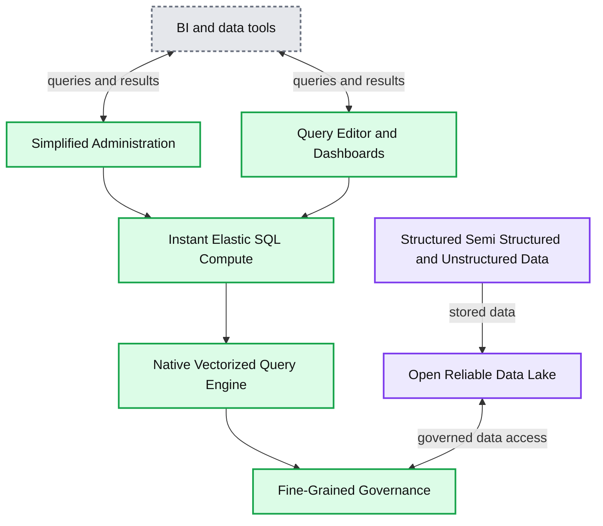

# Announcing General Availability of Databricks SQL

- Source: https://www.databricks.com/blog/2021/12/15/announcing-general-availability-of-databricks-sql.html
- Published: 2021-12-15
- Authors: Bilal Aslam, Can Efeoglu, Erika Ehrli, Shant Hovsepian, Paul Leventis, Cyrielle Simeone, Reynold Xin
- Categories: platform, product, data-warehousing
- Images: 1 total, 1 extracted as architecture

Today, we are thrilled to announce that [Databricks SQL](https://www.databricks.com/product/databricks-sql) is Generally Available (GA)! This follows our earlier announcements about [Databricks SQL’s world record-setting performance for data warehousing workloads](https://www.databricks.com/blog/2021/11/02/databricks-sets-official-data-warehousing-performance-record.html), and [adoption of standard ANSI SQL](https://www.databricks.com/blog/2021/11/16/evolution-of-the-sql-language-at-databricks-ansi-standard-by-default-and-easier-migrations-from-data-warehouses.html). With GA, you can expect the highest level of stability, support and enterprise-readiness from Databricks for mission-critical workloads on the [Databricks Lakehouse Platform](https://www.databricks.com/resources/ebook/bring-data-warehousing-data-lakes?itm_data=generalavailabilitydatabricks-blog-whylakehouseisnextdw ). In this blog post, we explore how Databricks SQL is powering a new generation of analytics and data applications, running directly on the data lake, at the world’s leading companies.

## Customers win with the open lakehouse

Historically, data teams had to resort to a bifurcated architecture to run traditional BI and analytics workloads, copying subsets of the data already stored in their data lake to a legacy data warehouse. Unfortunately, this led to the lock-in, high costs and complex governance inherent in proprietary architectures.

Our customers asked us to simplify their data architecture. We introduced Databricks SQL to provide data warehousing capabilities and first class support for SQL on the [Databricks Lakehouse Platform](https://www.databricks.com/product/data-lakehouse). Using open standards, Databricks SQL provides up to 12x better price/performance for data warehousing and analytics workloads on existing data lakes. And it works seamlessly with popular tools like [Tableau](https://www.tableau.com/about/blog/2021/6/how-databricks-and-tableau-customers-are-fueling-innovation-data-lakehouse), [PowerBI](https://www.databricks.com/blog/2021/02/26/announcing-general-availability-ga-of-the-power-bi-connector-for-databricks.html), Looker, and [dbt](https://www.databricks.com/blog/2021/12/06/deploying-dbt-on-databricks-just-got-even-simpler.html) without sacrificing concurrency, latency and scale, all the while maintaining a single source of truth for your data.

Databricks SQL is already powering production use cases at leading companies around the globe. From startups to enterprises, over 1,000 companies are using Databricks SQL to power the next generation of self-served analytics and data applications:

- [Atlassian](https://www.youtube.com/watch?v=Xo1U617T-mU) is building on the Lakehouse Platform one of the most ambitious data applications on the planet, providing nearly 190K external users with the ability to generate insights and analytics on the freshest data. Databricks SQL is also enabling data democratization internally across over 3K users, and more BI workloads are moving to Databricks SQL with PowerBI.
- [Punchh](https://www.databricks.com/customers/punchh) has accelerated ETL pipelines, democratized data and analytics, and improved BI and reporting—increasing customer retention and loyalty. Databricks SQL allows Punchh’s data team to query their data directly within Databricks and then share insights through rich visualizations and fast reporting via Tableau.
- [SEGA Europe](https://youtu.be/SzeXHcwPDSE) has moved away from a costly data warehouse-centric architecture to the Databricks Lakehouse Platform. And in doing so, successfully unified massive amounts of structured and unstructured data. This enables their data teams to derive insights needed to deliver personalized experiences to 30 million gamers across the globe. SEGA Europe’s existing BI tools, Tableau and PowerBI, work seamlessly with Databricks SQL.

## Powering modern analytics on the lakehouse

Databricks SQL offers all the capabilities you need to run data warehousing and analytics workloads on the [Databricks Lakehouse Platform](https://www.databricks.com/product/data-lakehouse):

- Instant, elastic SQL-optimized compute for low-latency, high-concurrency queries that are typical in analytics workloads. Compute is separated from storage so you can scale with confidence.
- Integration with your existing tools such as Tableau, PowerBI, dbt and Fivetran, so you can get value from your data without having to learn new solutions.
- Simplified administration and data governance, so you can quickly and confidently enable self-serve analytics.
- A first-class, built-in analytics experience with a SQL query editor, visualizations and interactive dashboards. Analysts can go from zero-to-aha! in moments.

**Summary:** Databricks SQL connects BI and data tools to an elastic SQL analytics platform built on an open data lake.

**Components:**

- BI and data tools: Tableau, Power BI, Looker, Fivetran, dbt, Qlik, Mode, MicroStrategy, ThoughtSpot, TIBCO Spotfire
- Simplified Administration
- Query Editor and Dashboards
- Instant Elastic SQL Compute
- Native Vectorized Query Engine
- Fine-Grained Governance
- Open Reliable Data Lake: Delta Lake, cloud object storage, Amazon S3, Google BigQuery
- Structured, Semi-Structured, and Unstructured Data

**Flows:**

- BI and data tools -> Databricks SQL: analytics queries and data access
- Databricks SQL -> BI and data tools: query results and visualizations
- Structured, Semi-Structured, and Unstructured Data -> Open Reliable Data Lake: stored data
- Open Reliable Data Lake -> Databricks SQL: governed data for SQL analytics

**Numbers:** none

source image: https://www.databricks.com/wp-content/uploads/2021/12/db-sql-ga-blog-img-1.jpg

## We can’t wait to see what you build

Watch the demo below to discover the ease of use of Databricks SQL for analysts and administrators alike:

If you already are a Databricks customer, follow the guide to get started ([AWS](https://docs.databricks.com/sql/index.html) | [Azure](https://docs.microsoft.com/en-us/azure/databricks/scenarios/sql/)). Read the [release notes](https://docs.databricks.com/sql/release-notes/index.html)to learn more about what's included in this GA release. If you are not an existing Databricks customer, sign up for a [free trial](https://www.databricks.com/try-databricks) with a Premium or Enterprise workspace.

[Watch Delivering Analytics on the Lakehouse with Reynold Xin](https://www.youtube.com/watch?v=NBzJu-vR68U) to learn more, and don’t miss our [free virtual training](https://www.databricks.com/event/data-ai-world-tour-2021) on January 13, 2022 to dive in!
