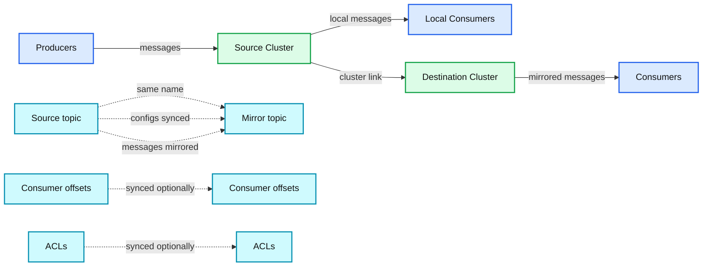

# Confluent Streaming for Databricks: Build Scalable Real-time Applications on the Lakehouse

- Source: https://www.databricks.com/blog/2022/01/13/confluent-streaming-for-databricks-build-scalable-real-time-applications-on-the-lakehouse.html
- Published: 2022-01-13
- Authors: Hiral Jasani
- Categories: platform, partners, data-streaming
- Images: 2 total, 2 extracted as architecture

For many organizations, real-time data collection and data processing at scale can provide immense advantages for business and operational insights. The need for [real-time data](https://www.databricks.com/product/data-streaming) introduces technical challenges that require skilled expert experience to build custom integration for a successful real-time implementation.

For customers looking to implement streaming real-time applications, our partner Confluent recently announced a new [Databricks Connector for Confluent Cloud](https://www.confluent.io/blog/migrate-data-to-the-cloud-with-confluent-and-databricks-connector/). This new fully-managed connector is designed specifically for the data lakehouse and provides a powerful solution to build and scale real-time applications such as application monitoring, internet of things (IoT), fraud detection, personalization and gaming leaderboards. Organizations can now use an integrated capability that streams legacy and cloud data from Confluent Cloud directly into the Databricks Lakehouse for business intelligence (BI), data analytics and machine learning use cases on a single platform.

**Summary:** The diagram shows legacy, IoT, and cloud data flowing through Confluent Kafka into Databricks Delta Lake for analytics, BI, and machine learning.

**Components:**

- IoT sources
- Legacy data stores using Netezza, Teradata, Oracle, mainframes, and databases
- Kafka Connect
- Confluent Event Streaming Platform built on Kafka
- Kafka Streams and ksqlDB for real-time stream processing and transformations
- Databricks Delta Lake
- Databricks Data Science Workspace using MLflow, TensorFlow, and PyTorch
- Databricks BI Workspace using Tableau and Looker
- Google Cloud, Azure, AWS, and on-premises environments
- Databricks Data Lake Sink Connector for Confluent Cloud

**Flows:**

- IoT sources -> Kafka Connect: source events
- Legacy data stores -> Kafka Connect: legacy data
- Kafka Connect -> Confluent Event Streaming Platform: connected source data
- Confluent Event Streaming Platform -> Kafka Streams and ksqlDB: streaming events
- Kafka Streams and ksqlDB -> Confluent Event Streaming Platform: processed and transformed events
- Confluent Event Streaming Platform -> Databricks Data Lake Sink Connector: streaming data
- Databricks Data Lake Sink Connector -> Databricks Delta Lake: sink data
- Databricks Delta Lake -> Databricks Data Science Workspace: analytics and machine learning data
- Databricks Delta Lake -> Databricks BI Workspace: BI data

**Numbers:** none

source image: https://www.databricks.com/wp-content/uploads/2022/01/confluent-connector-blog-img-1.jpg

```mermaid
%% Confluent and Databricks real-time data architecture
flowchart LR
    A[IoT Sources] -->|source events| B[Kafka Connect]
    C[Legacy Data Stores] -->|legacy data| B
    B -->|connected source data| D[Confluent Event Streaming Platform]
    D -->|streaming events| E[Kafka Streams and ksqlDB]
    E -->|processed events| D
    D -->|streaming data| F[Databricks Data Lake Sink Connector]
    F -->|sink data| G[Databricks Delta Lake]
    G -->|analytics data| H[Databricks Data Science Workspace]
    G -->|BI data| I[Databricks BI Workspace]

    classDef client fill:#dbeafe,stroke:#2563eb,stroke-width:2px,color:#111
    classDef service fill:#dcfce7,stroke:#16a34a,stroke-width:2px,color:#111
    classDef store fill:#ede9fe,stroke:#7c3aed,stroke-width:2px,color:#111
    classDef cache fill:#fef3c7,stroke:#d97706,stroke-width:2px,color:#111
    classDef queue fill:#cffafe,stroke:#0891b2,stroke-width:2px,color:#111
    classDef critical fill:#fee2e2,stroke:#dc2626,stroke-width:4px,color:#111
    classDef external fill:#e5e7eb,stroke:#6b7280,stroke-width:2px,color:#111,stroke-dasharray:4 3
    classDef decision fill:#fce7f3,stroke:#db2777,stroke-width:2px,color:#111

    class A,C client
    class B,F,H,I service
    class D,E queue
    class G store
```

## Utilizing the best of Databricks and Confluent

Streaming data through Confluent Cloud directly into [Delta Lake on Databricks](https://www.databricks.com/blog/2021/12/01/the-foundation-of-your-lakehouse-starts-with-delta-lake.html) greatly reduces the complexity of writing manual code to build custom real-time streaming pipelines and hosting open source Kafka, saving hundreds of hours of engineering resources. Delta Lake provides reliability that traditional data lakes lack, enabling organizations to run analytics directly on their data lake for up to 50x faster time-to-insights. Once streaming data is in Delta Lake, you can unify it with batch data to build integrated data pipelines to power your mission-critical applications.

### 1. Streaming on-premises data for cloud analytics

Data teams can migrate from legacy data platforms to the cloud or across clouds with Confluent and Databricks. Confluent leverages its Apache Kafka footprint to reach into on-premises Kafka clusters from Confluent Cloud to create an instant cluster to cluster solution or provides rich libraries of fully-managed or [self-managed connectors](https://www.confluent.io/product/connectors/) for bringing real-time data into Delta Lake. Databricks offers the speed and scale to manage your real-time application in production so you can meet your SLAs, improve productivity, make fast decisions, simplify streaming operations and innovate.

**Summary:** The diagram shows Confluent cluster linking from a source cluster to a destination cluster, mirroring topics, messages, offsets, configurations, and optional ACLs.

**Components:**

- Producers: event producers
- Source Cluster: source Confluent cluster
- Source topic: source Kafka topic
- Cluster link: Confluent cluster linking
- Destination Cluster: destination Confluent cluster
- Mirror topic: mirrored Kafka topic
- Consumers: event consumers
- Consumer offsets: optional synchronized offsets
- Configs: configurations synchronized per Confluent best practices
- ACLs: optional synchronized access control lists

**Flows:**

- Producers -> Source Cluster: messages
- Source Cluster -> Consumers: messages consumed locally
- Source topic -> Mirror topic: topic name with the same name
- Source topic -> Mirror topic: configurations synchronized
- Source topic -> Mirror topic: messages mirrored with identical partitions and offsets
- Consumer offsets -> Consumer offsets: offsets synchronized optionally
- ACLs -> ACLs: ACLs synchronized optionally
- Destination Cluster -> Consumers: mirrored messages

**Numbers:** none

source image: https://www.databricks.com/wp-content/uploads/2022/01/confluent-connector-blog-img-2.jpg

### 2. Streaming data for analysts and business users using SQL analytics

When it comes to building business-ready BI reports, querying data that is fresh and constantly updated is a challenge. Processing data at rest and in motion requires different semantics and often takes different skill sets. Confluent offers CDC connectors for multiple databases that import the most current event datastreams to consume as tables in Databricks. For example, a grocery delivery service needs to model a stream of shopper availability data and combine it with real-time customer orders to identify potential shipping delays. Using Confluent and Databricks, organizations can prep, join, enrich and query streaming data sets in [Databricks SQL](https://www.databricks.com/product/databricks-sql) to perform blazingly fast analytics on stream data.

With up to 12x better price-performance than a traditional data warehouse, Databricks SQL unlocks thousands of optimizations to provide enhanced performance for real-time applications. The best part? It comes with [pre-built integrations with popular BI tools](https://www.databricks.com/partnerconnect) such as Tableau and Power BI so the stream data is ready for first-class SQL development, allowing data analysts and business users to write queries in a familiar SQL syntax and build quick dashboards for meaningful insights.

### 3. Predictive analytics with ML models using streaming data

Building predictive applications using ML models to score historical data requires its own toolset. Add real-time streaming data into the mix and the complexity becomes multifold as the model now has to make predictions on new data as it comes in against static, historical data sets.

Confluent and Databricks can help solve this problem. Transform streaming data the same way you perform computations on batch data by feeding the most updated event streams from multiple data sources into your ML model. Databricks’ collaborative [Machine Learning solution](https://www.databricks.com/product/machine-learning) standardizes the full ML lifecycle from experimentation to production. The ML solution is built on Delta Lake so you can capture gigabytes of streaming source data directly from Confluent Cloud into Delta tables to create ML models, query and collaborate on those models in real-time. There are a host of other Databricks features such as Managed MLflow that automates experiment tracking and Model Registry for versioning and role-based access controls. Essentially, it streamlines cross-team collaboration so you can deploy real-time streaming data based operational applications in production -- at scale and low latency.

## Getting Started with Databricks and Confluent Cloud

To get started with the connector, you will need access to Databricks and Confluent Cloud. Check out the [Databricks Connector for Confluent Cloud](https://docs.confluent.io/cloud/current/connectors/cc-databricks-delta-lake-sink/index.html#databrick) documentation and take it for a spin on Databricks for free by signing up for a [14-day trial](https://www.databricks.com/try-databricks).
