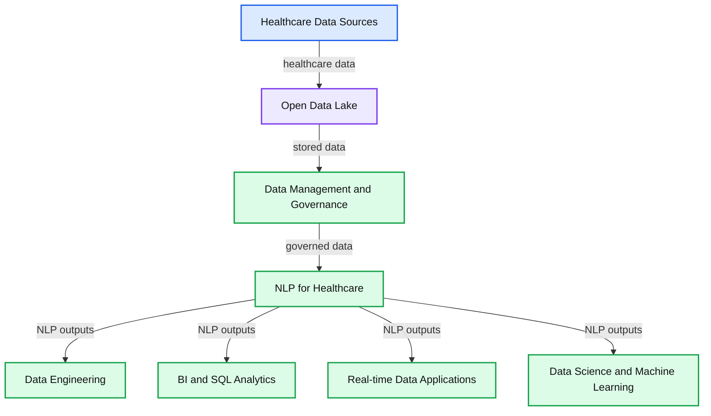
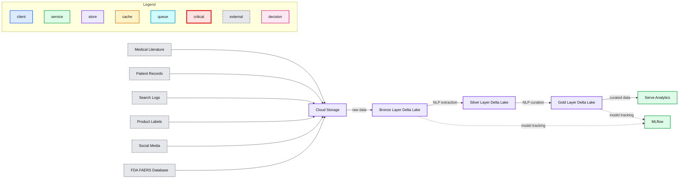
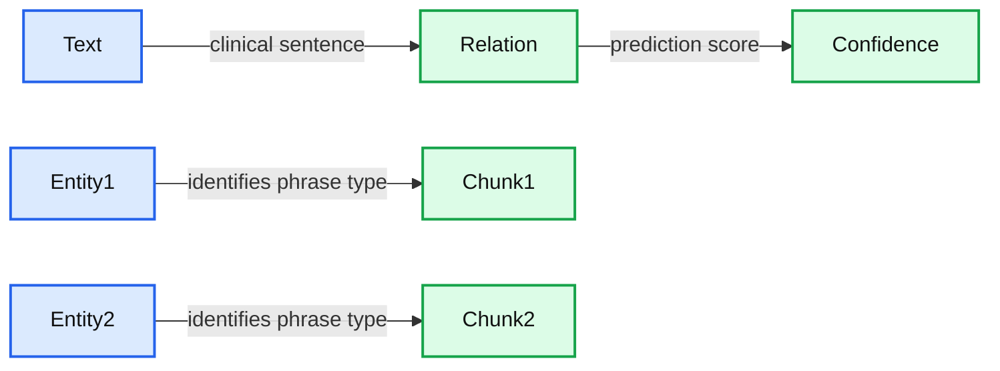

# Improving Drug Safety With Adverse Event Detection Using NLP

- Source: https://www.databricks.com/blog/2022/01/17/improving-drug-safety-with-adverse-event-detection-using-nlp.html
- Published: 2022-01-17
- Authors: Amir Kermany, Michael Ortega, Moritz Steller, David Talby, Michael Sanky
- Categories: engineering, solution-accelerators
- Images: 7 total, 3 extracted as architecture

Don't miss our upcoming virtual workshop with John Snow Labs, [Improve Drug Safety with NLP](https://pages.databricks.com/202201-AMER-VE-Healthcare-and-Life-Sciences-Workshop-Improve-Drug-Safety-w_Registration-Page.html?utm_source=databricks&utm_medium=blog&utm_campaign=7013f000000LjuUAAS), to learn more about our joint NLP solution accelerator for adverse drug event detection.

The World Health Organization defines [pharmacovigilance](https://www.who.int/teams/regulation-prequalification/regulation-and-safety/pharmacovigilance) as "the science and activities relating to the detection, assessment, understanding and prevention of adverse effects or any other medicine/vaccine-related problem." In other words, drug safety.

## Pharmacovigilance: drug safety monitoring in the real-world

While all medicines and vaccines undergo rigorous testing for safety and efficacy in clinical trials, certain side effects may only emerge once these products are used by a larger and more diverse patient population, including people with other concurrent diseases.

To support ongoing drug safety, biopharmaceutical manufacturers must report adverse drug events (ADEs) to regulatory agencies, such as the US Food and Drug Administration (FDA) in the United States and the European Medicines Agency (EMA) in the EU. Adverse drug reactions or events are medical problems that occur during treatment with a drug or therapy. Of note, ADEs do not necessarily have a casual relationship with the treatment. But in aggregate, the proactive reporting of adverse events is a key part of the signal detection system used to ensure drug safety.

## Adverse event detection requires the right data foundation

Monitoring patient safety is becoming more complex as more data is collected. In fact, less than 5% of ADEs are reported via official channels and the vast majority are captured in free-text channels: emails and phone calls to patient support centers, social media posts, sales conversations between clinicians and pharma sales reps, online patient forums, and so on.

Robust drug safety monitoring requires manufacturers, pharmaceutical companies and drug safety groups to monitor and analyze unstructured medical text from a variety of jargons, formats, channels and languages. To do this effectively, organizations need a modern, scalable data and AI platform that can provide scientifically rigorous, near real-time insights.

The path forward begins with [the Databricks Lakehouse](https://www.databricks.com/product/data-lakehouse), a modern data platform that combines the best elements of a data warehouse with the low-cost, flexibility and scale of a cloud data lake. This new, simplified architecture enables healthcare providers and life sciences organizations to bring together all their data—structured (like diagnoses and procedure codes found in EMRs), semi-structured (like clinical notes) and unstructured (like images)— into a single, high-performance platform for both traditional analytics and data science.

**Summary:** The diagram shows the Databricks Lakehouse Platform integrating healthcare data sources with NLP for Healthcare, data management, governance, analytics, applications, and machine learning.

**Components:**

- Databricks Lakehouse Platform
- Data Engineering
- BI and SQL Analytics
- Real-time Data Applications
- Data Science and Machine Learning
- NLP for Healthcare using John Snow Labs
- Data Management and Governance using Delta Lake
- Open Data Lake
- Provider Notes
- Lab Reports
- Medical Claims
- Research
- Social / Behavioral data

**Flows:**

- Provider Notes -> Open Data Lake: healthcare text data
- Lab Reports -> Open Data Lake: healthcare text data
- Medical Claims -> Open Data Lake: healthcare data
- Research -> Open Data Lake: healthcare data
- Social / Behavioral -> Open Data Lake: healthcare data
- Open Data Lake -> Data Management and Governance: stored data
- Data Management and Governance -> NLP for Healthcare: governed healthcare data
- NLP for Healthcare -> Data Engineering: NLP processing
- NLP for Healthcare -> BI and SQL Analytics: NLP outputs
- NLP for Healthcare -> Real-time Data Applications: NLP outputs
- NLP for Healthcare -> Data Science and Machine Learning: NLP outputs

**Numbers:** none

source image: https://www.databricks.com/wp-content/uploads/2022/01/drug-safety-blog-img-1.jpg

Building on these capabilities, Databricks has partnered with John Snow Labs, the leader in healthcare natural language process (NLP), to provide a robust set of NLP tools tailored for healthcare text. This is critical, as much of the data used for adverse event detection is text-based. You can learn more about our partnership with John Snow in our previous blog, [Applying Natural Language Processing to Health Text at Scale](https://www.databricks.com/blog/2021/09/22/extracting-oncology-insights-from-real-world-clinical-data-with-nlp.html).

## Solution accelerator for adverse drug event detection

To help organizations monitor drug safety issues, Databricks and John Snow Labs built a [solution accelerator notebook for ADE](https://notebooks.databricks.com/notebooks/HLS/adverse-drug-events/index.html) using NLP. As demonstrated in our previous blog, by leveraging the Databricks Lakehouse Platform, we can use pre-trained NLP models to extract highly-specialized structures from unstructured text and build powerful analytics and dashboards for different personas. In this solution accelerator, we show how to use pre-trained models to process conversational text, extract adverse events and drug information and build a Lakehouse for pharmacovigilance that powers various downstream use cases.

**Summary:** End-to-end Lakehouse workflow for extracting adverse drug events from unstructured medical text and serving pharmacovigilance analytics.

**Components:**

- Cloud Storage: medical literature, patient records, search logs, product labels, social media, and FDA FAERS Database
- Bronze Layer: raw data stored in Delta Lake
- NLP: adverse event and drug entity extraction
- Silver Layer: clean data stored in Delta Lake
- NLP: adverse event assertion and relationship curation
- Gold Layer: curated data stored in Delta Lake
- MLflow: model tracking
- Serve: data analysis and visualizations

**Flows:**

- Cloud Storage -> Bronze Layer: raw medical and related data
- Bronze Layer -> Silver Layer: NLP-extracted adverse events and drug entities
- Silver Layer -> Gold Layer: NLP-curated adverse event assertions and relationships
- Gold Layer -> Serve: curated data for analysis and visualizations
- Bronze Layer -> MLflow: model tracking input
- Gold Layer -> MLflow: model tracking output

**Numbers:** none

source image: https://www.databricks.com/wp-content/uploads/2022/01/drug-safety-blog-img-2.jpg

The solution accelerator follows 4 basic steps:

1. Ingest unstructured medical text at scale.
2. Use pre-trained NLP models to extract useful information such as adverse events (e.g., renal damage), drug names and timing of the events in near real-time.
3. Correlate adverse events with drug entities to establish a relationship.
4. Measure frequency of events to determine significance.

Below is a brief summary of the workflow contained within the [notebook](https://notebooks.databricks.com/notebooks/HLS/adverse-drug-events/index.html).

## Overview of the adverse drug event detection workflow

Starting with raw text data, we use a corpus of 20,000 texts with known ADE status (4,200 texts containing ADE) and apply a [pre-trained biobert model](https://nlp.johnsnowlabs.com/2021/01/21/classifierdl_ade_conversational_biobert_en.html) to detect ADE status and assess the specificity and sensitivity of the model based on the ground truth and the confidence level in accuracy of the assignment. In addition, we extract ADE status and drug entities from the conversational texts by using a combination of ner_ade_clinical and ner_posology models.

By simply adding a stage in the pipeline, we can detect the assertion status of the ADE (present, absence, occured in the past, etc).

To infer the relationship status of an ADE with a clinical entity, we use a pre-trained model (re_ade_clinical), which detects the relationships between a clinical entity (in this case drug) and the inferred ADE.

**Summary:** A relation-extraction results table showing adverse drug events linked to drugs, with confidence scores.

**Components:**

- Text: clinical sentence containing the detected relationship
- Relation: predicted relation label, shown as 1
- Entity1: first entity type, ADE or DRUG
- Chunk1: extracted adverse event or drug phrase
- Entity2: second entity type, ADE or DRUG
- Chunk2: extracted drug or adverse event phrase
- Confidence: model confidence score

**Flows:**

- Text -> Relation: clinical text is classified for an entity relationship
- Entity1 -> Chunk1: entity type identifies the first extracted phrase
- Entity2 -> Chunk2: entity type identifies the second extracted phrase
- Relation -> Confidence: predicted relation receives a confidence score

**Numbers:** Row indices 0 through 15; relation value 1; confidence values 1.0 and 0.9999999

source image: https://www.databricks.com/wp-content/uploads/2022/01/drug-safety-blog-img-5.jpg

The sparknlp_display library has the ability to show relations on the raw text and their linguistic relationships and dependencies as demonstrated below.

After the ADE and drug entity data has been processed and correlated, we can build powerful dashboards to monitor the frequency of ADE and drug entity pairs in real time.

## Get started analyzing adverse drug events with NLP on Databricks

With this solution accelerator, Databricks and John Snow Labs make it easy to analyze large volumes of text data to help with real-time drug signal detection and safety monitoring. To use this solution accelerator, you can preview the [notebooks](https://notebooks.databricks.com/notebooks/HLS/adverse-drug-events/index.html) online and import them directly into your Databricks account. The notebooks include guidance for installing the related John Snow Labs NLP libraries and license keys.

You can also visit our industry pages to learn more about our [Healthcare](https://www.databricks.com/solutions/industries/healthcare-industry-solutions) and [Life Sciences](https://www.databricks.com/solutions/industries/life-sciences-industry-solutions) solutions.
