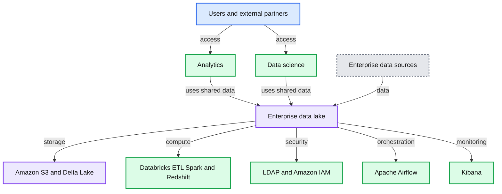
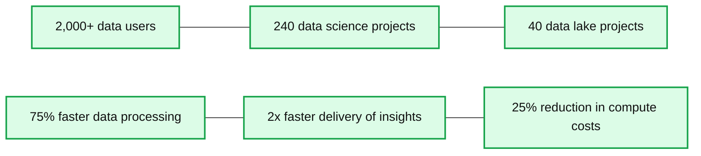

# How the Lakehouse Democratizes Data to Help Amgen Speed Drug Development & Delivery

- Source: https://www.databricks.com/blog/2022/03/22/amgen-modernizes-analytics-with-a-unified-data-lakehouse-to-speed-drug-development-delivery.html
- Published: 2022-03-22
- Authors: Jaison Dominic, Kerby Johnson
- Categories: data-warehousing, customers
- Images: 4 total, 2 extracted as architecture

This is a guest authored post by Jaison Dominic, Product Owner, and Kerby Johnson, Distinguished Software Engineer, at Amgen.

 

[Amgen](https://www.amgen.com/), the world’s largest independent biotech company, has long been synonymous with innovation. For 40 years, we’ve pioneered new drug-making processes and developed life-saving medicines, positively impacting the lives of millions around the world. In order to continue fulfilling our mission to best serve patients, we recently embarked on another journey of innovation: a complete digital transformation.

In the process of reimagining how to leverage our data for better outcomes across the business — from improving R&D productivity to optimizing supply chains and commercialization — it quickly became obvious that the types of problems our data teams were looking to solve had drastically changed in the last handful of years. Additionally, these problems were no longer isolated by skillset, department or function. Instead, the most impactful problems were cross-functional in nature and required bringing together people with different, unique expertise to attack problems in a novel way. In our quest to modernize, we chose the Databricks Data + AI Platform as the foundation for our digital transformation journey. As a result, we were able to unlock the potential of our data across various organizations, streamlining operational efficiency and accelerating drug discovery.

Today, we are sharing our success story in the hopes that others can learn from our journey and apply it to their own business strategies.

## From data warehouse to data lake – and the problems within

Within three core verticals of Amgen - clinical trials, manufacturing, and commercialization – lies a wealth of valuable data. But increasing volumes of data presented challenges when it came to actually using that data efficiently.

We were unable to truly weave together the various aspects of our business, which impacted operational efficiency as we scaled both internally and in our number of customers. The key was to not only make it easy to access and process data but to do so in a collaborative manner that ties in different personas that have different viewpoints on the data — a connected data fabric that enables better cross-functional collaboration. If you’re only looking at it from one or two perspectives, you’re going to miss valuable key points from others.

For example, consider the question: *How do you granularly forecast demand so you can produce the right amount of therapeutics for patients in need?*

If you’re looking at the answer from a supply chain and manufacturing perspective, you’re missing commercial sales forecast data. On the other hand, you don’t want to take the commercial sales forecast as the gospel of the amount of production needed because what if they blow their sales numbers out of the water, which is always the hope, and you’ve underestimated what manufacturing needs to produce?

In order to solve today’s problems, businesses need to focus on different data relationships and connections so that they can look at the same data from multiple lenses — but how can they enable this? At Amgen, we’ve broken the foundation of modern data requirements down as follows:

- Data needs to be organized and easy to use.
- Sharing data and re-using that of others in a natural way is a must.
- Analytics should be able to operate off a trusted shared view of data.
- Different forms of analytics from descriptive (BI) to predictive (ML) helps facilitate new discoveries and predictions on one version of the data.
- Data needs to be able to evolve as new types are brought in, changes from one system to another occur, new domains are added, etc. but the core of it all should remain consistent.

The need for this to be the case is likely known by most organizations, but seeing it come to life has been particularly difficult for enterprises with counter-intuitive processes: each team owning, managing and organizing their data differently, requiring yet another project if they simply want to share it. We too struggled with not only several years of accumulating more data than we knew what to do with, but also with the lack of process and infrastructure to ensure everyone was able to work off the same data.

To try and address our early data needs, we transitioned from a legacy technology infrastructure over to a Hadoop-based data lake a few years back. With a Hadoop data lake, we were able to keep structured and unstructured data in one place, but significant data challenges remained, both on the technical side and when it came to processes, cost and organization. The shared clusters caused “Noisy Neighbor” problem and were difficult and costly to scale.

For my role, as a product owner of the platform, managing a single shared cluster was a nightmare. It was always on, there was never a good time to upgrade versions, and we had distributed costs which meant, for example, figuring out how to charge one group for high storage and low compute and another group for high compute and low storage.

This approach also required stitching together a variety of different tools in order to meet the needs of each individual group, which created significant collaboration challenges. And like so many others, we had a variety of ways that end-users were consuming data: Jupyter Notebooks, R Studio, Spotfire and Tableau, which only added to the complexity and challenge of making data readily available to those that need it.

## How the lakehouse architecture solves our problems

Adopting the Databricks Data + AI Platform has enabled a variety of teams and personas to do more with our data. With this unifying and collaborative platform, we’ve been able to utilize a single environment for all types of users and their preferred tools, keeping operations backed by a consistent set of data.

**Summary:** Amgen’s unified data analytics architecture connects enterprise data sources to an enterprise data lake supporting analytics and data science.

**Components:**

- IS users
- Business users
- Executives
- Data scientists
- External partners
- Analytics using Tableau, Databricks SQL, and Databricks reporting clusters
- Data science using Amgen Data Science Workbench, MLflow, Databricks, and notebook clusters
- Security using LDAP and Amazon IAM
- Orchestration using Apache Airflow
- Data compute using Databricks ETL clusters, Apache Spark, and Amazon Redshift
- Monitoring using Kibana
- Data storage using Amazon S3 and Delta Lake
- Enterprise data lake containing encrypted enterprise data
- Unstructured data
- Oracle
- Workday
- Teradata
- SAP

**Flows:**

- Unstructured data -> Enterprise data lake: data
- Oracle -> Enterprise data lake: data
- Workday -> Enterprise data lake: data
- Teradata -> Enterprise data lake: data
- SAP -> Enterprise data lake: data
- Enterprise data lake -> Analytics: shared data
- Enterprise data lake -> Data science: shared data

**Numbers:** none

source image: https://www.databricks.com/wp-content/uploads/2022/03/db-117-blog-img-2.jpg

We’re leveraging Delta Lake to enable ACID compliance, historical lookback, and lower the barrier to entry for developers to begin coding by providing a common data layer for data analysts and data scientists alike to use data to optimize supply chains and improve operations. We’re also leveraging AWS Glue to connect different Databricks environments together so it’s one data lake – whether the data is stored in one AWS account or 10 different accounts. It’s all connected.

This has enabled us to provide sufficient flexibility for a variety of needs while standardizing on Apache Spark™ for data and analytics. The unified data layer within the lakehouse allows Amgen to reliably process data of any type and size, while providing the application teams with the flexibility to move the business forward.

*What size clusters do you want? How much do you want to spend? Is it more important to get your reports an hour faster, or to cut costs?* Decisions like these can now be made by individual teams. Collectively, this standardization of tools and languages, and a single source of truth for data scientists, analysts, and engineers, is what started enabling connected teams.

Our current data architecture uses an Amazon S3 as the single source of truth for all data, Delta Lake as the common data layer, the Glue data catalog as the centralized metastore for Databricks, an ELK stack for monitoring with Kibana, Airflow for orchestration, and consumption, whether it’s analysts or data scientists, all operating off the Databricks Data + AI Platform.

This common data architecture, and integrating these architectural patterns has enabled us to shift our focus from platform maintenance to really digging into what the business actually wants and what our users care about. The key has been our ability to leverage the lakehouse approach to unify our data across our various data teams while aligning with our business goals.

With data at the ready, various data teams from engineering to data science to analysts can access and collaborate on data. Databricks’ collaborative notebooks support their programming language of choice to easily explore and start leveraging the data for downstream analytics and ML. As we start to use [Databricks SQL](https://www.databricks.com/product/databricks-sql), our analysts can find and explore the latest and freshest data without having to move it into a data warehouse. They can run queries without sacrificing performance, and easily visualize results with their tools of choice — either through built-in visualizations and dashboards or Tableau, which is primarily used by business partners throughout the company.

Our data scientists also benefit from using [Databricks Machine Learning](https://www.databricks.com/product/machine-learning) to simplify all aspects of ML. And since Databricks ML is built on the lakehouse foundation with Delta Lake and MLflow, our data scientists can prepare and process data, streamline cross-team collaboration and standardize the full lifecycle from experimentation to production without depending on data engineering support. This improved approach to managing ML has had a direct impact on decreasing the time it takes to enroll in clinical trials.

## Improving patient outcomes with connected data and teams

The implementation of the Databricks Data + AI Platform has ultimately helped us continue to achieve our goals of serving patients and improving the drug development lifecycle in the modern world. Our data ingestion rates have increased significantly, improving processing times by 75% and resulting in 2x faster delivery of insights to the business, all while reducing compute costs by ~25% over static Hadoop clusters.

With Databricks, we can take a modern approach to deliver on a myriad of use cases by focusing on the data, the relationships, and the connections rather than just the technology. Since partnering with Databricks in 2017, we’ve seen massive growth adoption across the company. To date, 2,000+ data users from data engineering to analysts have accessed 400TB of data through Databricks to support 40+ data lake projects and 240 data science projects.

**Summary:** The image presents key Amgen data platform adoption and performance metrics.

**Components:**

- Data users, technology not specified
- Data science projects, technology not specified
- Data lake projects, technology not specified
- Data processing, technology not specified
- Insight delivery, technology not specified
- Compute costs, technology not specified

**Flows:**

- none

**Numbers:**

2,000+ data users; 240 data science projects; 40 data lake projects; 75% faster data processing; 2x faster delivery of insights; 25% reduction in compute costs.

source image: https://www.databricks.com/wp-content/uploads/2022/03/db-117-blog-img-3.jpg

What this looks like in practice is easy to use, easy to find data that enables a number of use cases across the company:

- Genomic exploration and research at scale: Harnessing the power of genomic data has allowed us to accelerate the drug discovery process this could significantly increase our chances to find new drugs to cure grievous illnesses.
- Optimized clinical trial designs: Now we can bring in a variety of data from purchased data to real-world evidence, and leverage insights from this wide variety of clinical data to improve the likelihood of success and potentially save tens of millions of dollars.
- Supply chain and inventory optimization: Manufacturing efficiency and inventory management is a challenge for every manufacturing industry, and drug manufacturing is no exception. Efficient manufacturing and optimized supply chain management can help save millions of dollars to the business, and help get the right drugs to the right patients at the right time.

As Amgen’s success demonstrates, novel solutions to age-old problems require a refresh of a business’s platforms, tools, and methods of innovation. And as adoption continues to rise at Amgen, we’ll explore new ways to take advantage of the lakehouse approach to foster collaboration and transparency with tools like Delta Sharing. Another intriguing tool that could provide value is Delta Live Tables, which could help us simplify ETL development and management even more, as well as benefit our downstream data consumers. Ultimately, Databricks has helped us to move the starting line for advanced analytics, so we can spend more time-solving problems that can benefit the patients who need treatments, and less time rebuilding the foundational infrastructure that enables it.

## Next Steps

- Learn more about the [Databricks Lakehouse for Healthcare and Life Sciences](https://www.databricks.com/solutions/industries/healthcare-and-life-sciences)
- Watch the Amgen talk from a recent [webinar](https://vimeo.com/420862237/58cfe2dfd4)
