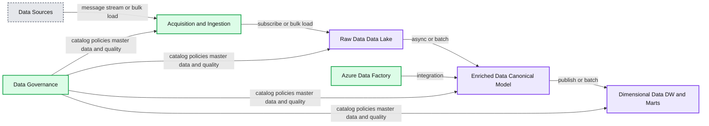

# Lakehouse Empowers CareSource to Operate from a Single Source of Data to Provide Better Healthcare to Members

- Source: https://www.databricks.com/blog/2022/04/07/how-caresource-modernized-its-data-architecture-to-provide-better-healthcare-to-members.html
- Published: 2022-04-07
- Authors: Joydeep Mukherjee
- Categories: data-warehousing, company, customers
- Images: 1 total, 1 extracted as architecture

This is a guest post from Joydeep Mukherjee, Vice President of Enterprise Data Services at CareSource.

## Data needs in a rapidly growing healthcare organization

CareSource is nationally recognized for leading the industry in providing member-centric health care coverage. The company’s managed care business model was founded in 1989 and today CareSource is one of the nation’s largest Medicaid managed care plans. CareSource serves more than 2 million members across six states supported by a growing workforce of 4,500. CareSource’s holistic model of care breaks down the hurdles of clinical treatment and social qualities that can lead to reduced health outcomes. The company’s regional, community-based multi-disciplinary care management teams comb through the data and social aspects that could affect physical, mental, and psychosocial health and integrate insights into how to improve the health and overall well-being of its members and the populations it serves.

CareSource has grown exponentially over the past 30 years. As a result, our legacy data systems couldn’t keep up with the influx of new members and we had to start applying band-aids just to get by. For example, we had to run jobs that were designed to be run monthly on a daily basis, which the systems were simply not designed to handle. As a result, we expended significant resources to maintain our systems.

All of this meant that CareSource needed to implement a more modern data platform — one that lived in the cloud and could scale, be performant, and be future-proof.

## Creating a modern data platform for modern data needs

Deploying the Databricks Data + AI Platform on Azure helped CareSource fast-track our data analytics journey by removing data silos and creating a single source of truth for all of the data coming in. The driving force was to create a data platform that was agile, efficient, secure, and highly trusted by decision-makers.

To accomplish this, we turned to the experts at Databricks to help with implementing a three-layer architecture, with the first layer serving as a way to ingest large amounts of raw data. Then, we wrote all our transformation logic and processing logic in [Databricks notebooks](https://www.databricks.com/product/collaborative-notebooks)to feed into an integrated layer that leverages an industry-standard data model: the IBM Universal Health Care Data Model. From there, the second level of transformation (again, through Databricks notebooks) occurs in the final layer to get the data into an easily consumable structure primed for downstream analytics use cases designed to better serve our members and their health care needs

**Summary:** CareSource’s modern data platform moves data from multiple sources through Azure and Databricks acquisition, integration, governance, and consumption layers.

**Components:**

- Data Sources: Member, Provider, Claims, Eligibility and Enrollments, Population Health, Corporate Systems, Sales and Marketing, RX and Delegated Claims, Other Partners
- Acquisition and Ingestion: Azure
- Acquired and Parsed Layers: Raw Data Data Lake using Azure Data Lake and Databricks with Delta Lake
- Integrated Layer: Enriched Data Canonical Model using Azure SQL Database and Databricks with Delta Lake
- Consumption Layer: Dimensional Data DW and Marts using Databricks with Delta Lake
- Integration: Azure Data Factory
- Data Governance: Catalog and Group Data for Search and Discovery
- Data Governance: Policies, Procedures and Access Controls
- Data Governance: Master and Reference Data Management Services
- Data Governance: Profiling and Quality Management
- Governance Tools: Informatica, Axon Enterprise Data Catalog, and Informatica Data Quality

**Flows:**

- Data Sources -> Acquisition and Ingestion: message stream
- Data Sources -> Acquisition and Ingestion: bulk load
- Acquisition and Ingestion -> Raw Data Data Lake: subscribe
- Acquisition and Ingestion -> Raw Data Data Lake: bulk load
- Raw Data Data Lake -> Enriched Data Canonical Model: async
- Raw Data Data Lake -> Enriched Data Canonical Model: batch
- Enriched Data Canonical Model -> Consumption Layer: publish
- Enriched Data Canonical Model -> Consumption Layer: batch
- Data Governance -> Data Platform: governance controls and quality management

**Numbers:** none

source image: https://www.databricks.com/wp-content/uploads/2022/04/db-139-img-1.jpg

With this modern lakehouse architecture in place, our analysts have also been excited to turn to Databricks SQL to better analyze the data in a more intuitive and visual way. In fact, some analysts are even using SQL directly within the [Databricks SQL](https://www.databricks.com/product/databricks-sql) interface, and are planning to rewrite our existing predictive models in a more efficient way within the Databricks environment.

## Creating real health care impact with data

Thanks to the power of Databricks Data + AI Platform, we’ve been able to drive real impact on the way we process and analyze data. As an example, when our members get a prescription filled, the claim goes to a third-party company. While we receive data about the claim being adjudicated and paid, we also receive an invoice from this third party.

All this data flows between our two entities, but we’ve never been able to automatically reconcile that data. With Databricks serving as the foundation for our modern data platform, we’re able to proactively generate our own invoice dollar amount before actually receiving the invoice, and it matches down to the penny. This is a huge differentiator for CareSource. Most peers in the industry can’t do this, both from an operating perspective and in terms of the reliability and usability of the data.

Looking ahead, our work on predictive modeling with the help of Databricks will also have a huge impact on the well-being of our members. We’re currently in the process of rewriting a predictive model for high-risk pregnancies, for instance. By processing data points and setting certain parameters, we can essentially flag when someone is potentially going to have a high-risk pregnancy, and a workflow can automatically be created for a nurse to do proactive outreach. None of that would be possible without Databricks.

There’s still a lot we hope to accomplish with our modern data platform. Not only is more effective data sharing with [Delta Sharing](https://www.databricks.com/product/delta-sharing) on our roadmap, but so is a deeper exploration of AI and ML to create even more robust and accurate predictive models. The high-performance platform will enable us to build and execute complex models more frequently leading to proactive health interventions. With the Databricks Data + AI Platform powering our new data architecture, we can rest easy knowing that we’ll be making the best use of the data to better the lives of our millions of members.
