# Democratizing Data for Supply Chain Optimization at Johnson & Johnson

*How Johnson & Johnson Leverages the Databricks Data + AI Platform*

- Source: https://www.databricks.com/blog/2022/04/25/democratizing-data-for-supply-chain-optimization.html
- Published: 2022-04-25
- Authors: Mrunal Saraiya
- Categories: data-warehousing, industries, retail-and-consumer-goods, customers
- Images: 1 total, 1 extracted as architecture

This is a guest-authored post by Mrunal Saraiya, Sr. Director - Advance Technologies (Data, Intelligent Automation and Advanced Technology Incubation), Johnson & Johnson

 
 As a cornerstone, global consumer goods and pharmaceutical provider, Johnson & Johnson serves businesses, patients, doctors, and people around the world, and has for more than 150 years. From life-sustaining medical devices to vaccines, over-the-counter and prescription medications (plus the tools and resources used to create them), we must ensure the availability of everything we bring to market—and guarantee consistency in the quality, preservation, and timely delivery of those various goods to our customers.

How we serve our community with these products and services is core to our business strategy, particularly when it comes to ensuring that items get delivered on time, to the right place, and are sold at a fair price, so that consumers can access and use our products effectively. And while logistical challenges have long existed across market supply chains, streamlining those pathways and optimizing inventory management and costs on a global scale is impossible without data—and lots of it. That data has to be accurate, too, which requires us to have tools in place to distill and interpret an incredibly complex array of information to make that data useful. With that data, we are able to use supply chain analytics to help optimize various aspects of the supply chain, from keeping shelves stocked across our retail partners and ensuring the vaccines that we provide are temperature-controlled and delivered on time to managing global category spending and identifying further cost improvement initiatives.

And the impact of these supply chain optimizations is significant. For example, within our Janssen global supply chain procurement organization, the inability to understand and control spend and pricing can ultimately lead to limited identification of future strategic decisions and initiatives that could further the effectiveness of global procurement. All said, if this problem is not solved, we can miss the opportunity to achieve $6MM in upside.

Over the decades, we’ve grown extensively as an organization, both organically and through numerous acquisitions. Historically, our supply chain data was coming to our engineers through fragmented systems with disparate priorities and unique configurations—the result of multiple organizations coming under the Johnson & Johnson umbrella over time, and bringing their proprietary resources with them. Additionally, data was largely extracted and analyzed manually. Opportunities for speed and scalability were extremely limited, and actionable insights were slow to surface. The disconnection was negatively impacting how we served our customers, and impeding our ability to make strategic decisions about what to do next.

## Migrating from Hadoop to a unified approach with Databricks

With this in mind, we embarked on an important journey to democratize our data across the entire organization. The plan was to create a common data layer that would drive higher performance, allow for more versatility, improve decision making, bring scalability to engineering and supply chain operations, and make it easy to modify queries and insights efficiently in real time. This led us to the Databricks Data + AI Platform on the Azure cloud.

Ultimately, our goal was to bring all of Johnson & Johnson’s global data together, replacing 35+ global data sources that were created by our fragmented systems with a single view into data that could then be readily available for our data scientists, engineers, analysts, and of course, applications, to contextualize as needed. But rather than continuing to repeat the data activity from previous pipelines, we decided to create a single expression of the data—allowing the data itself to be the provider. From that common layer, insights can be drawn by various users for various use cases across the Johnson & Johnson sphere, enabling us to develop valuable applications that bring true value to the people and businesses we serve, gain deeper insights into data more quickly, synergize the supply chain management process across multiple sectors, and improve inventory management and predictability.

But transforming our data infrastructure into one that can handle an SLA of around 15 minutes for data delivery and accessibility required having to tackle a couple of immediate challenges. First and foremost was the problem of scalability; our existing Hadoop infrastructure was not able to meet those service-level agreements while supporting data analytics requirements. The effort to push that legacy system to deliver in time and at scale was cost and resource-prohibitive. Secondly, we had critical strategic imperatives around supply chain strategy and data optimization that were going unmet due to a lack of scalability. Finally, limited flexibility and growth provided fewer use cases and reduced the accuracy of the data models.

With a lakehouse approach to data management, we now have a common data layer to feed a myriad of data pipelines that can scale alongside business needs. This has produced significantly more use cases from which to extract actionable insights and value from our data. It has also given us the ability to go beyond a broad business context, allowing us to use predictive analytics to anticipate key trends and needs around optimizing logistics, understand our customers’ therapy needs, and how that impacts our supply chain with greater confidence and agility.

## Delivering accurate healthcare solutions at scale

To guarantee the best outcome for our efforts, we engaged with Databricks to expand resources and deploy a highly effective common data ingestion layer for data analytics and machine learning. With strategic and intentional collaboration between our engineering and AI functions, we were able to fully optimize the system to deliver much greater processing power.

Today, our data flow has been significantly streamlined. Data teams use Photon - the next-generation query engine on Databricks - to enable extremely fast query performance at a low cost for SQL workloads. All data pipelines now feed through Delta Lake, which helps to simplify data transformation in Photon. From there, Databricks SQL provides high-performance data warehousing capabilities, feeding data through optimized connectors to various applications and business intelligence (BI) tools (e.g., PowerBI, Qlik, Synapse, Teradata, Tableau, ThoughtSpot) for our analysts and scientists to consume in near real-time.

**Summary:** The diagram shows on-premise ERP data ingestion into Azure Blob Storage and Kafka, followed by Databricks processing and Delta Lake storage in Azure Data Lake Storage Gen2.

**Components:**

- Source ERPs: on-premise enterprise resource planning systems
- Informatica PowerCenter: initial data extraction
- Informatica PowerExchange Publisher: CDC data publishing
- Azure Blob: CSV file landing and compressed Parquet
- Confluent Kafka: message streaming
- Databricks: batch processing and structured streaming
- Azure Data Lake Storage Gen2: durable Delta table storage and merge target

**Flows:**

- Source ERPs -> PowerCenter: initial data
- Source ERPs -> PowerExchange Publisher: CDC data
- PowerCenter -> Azure Blob: initial data as CSV files
- PowerExchange Publisher -> Confluent Kafka: CDC messages
- Azure Blob -> Databricks: compressed Parquet processing
- Confluent Kafka -> Databricks: micro-batch streaming
- Databricks batch -> Azure Data Lake Storage Gen2: processed initial data
- Databricks streaming -> Azure Data Lake Storage Gen2: merged CDC data in the same Delta table

**Numbers:**

- 1 Kafka topic per ERP
- 2 Compressed Parquet
- 4 Cluster setups
- 4 Use a schema
- 5 CDC optimization
- 6 Intelligent scaling
- 7 Compression
- 8 Optimized partitions
- 9 Bandwidth optimization
- 10 Automated jobs
- A Reserved instances
- Gen2
- CSV
- CDC

```mermaid
%% Shows on-premise ERP ingestion through Azure services into Delta Lake
flowchart LR
    ERP[Source ERPs]
    PC[Informatica PowerCenter]
    PEP[Informatica PowerExchange Publisher]
    BLOB[Azure Blob]
    KAFKA[Confluent Kafka]
    BATCH[Databricks batch job]
    STREAM[Databricks streaming job]
    ADLS[Azure Data Lake Storage Gen2]

    ERP -->|Initial data| PC
    ERP -->|CDC data| PEP
    PC -->|CSV files| BLOB
    PEP -->|CDC messages| KAFKA
    BLOB -->|Compressed Parquet| BATCH
    KAFKA -->|Messages| STREAM
    BATCH -->|Processed initial data| ADLS
    STREAM -->|Merged CDC data| ADLS

    classDef client fill:#dbeafe,stroke:#2563eb,stroke-width:2px,color:#111
    classDef service fill:#dcfce7,stroke:#16a34a,stroke-width:2px,color:#111
    classDef store fill:#ede9fe,stroke:#7c3aed,stroke-width:2px,color:#111
    classDef cache fill:#fef3c7,stroke:#d97706,stroke-width:2px,color:#111
    classDef queue fill:#cffafe,stroke:#0891b2,stroke-width:2px,color:#111
    classDef critical fill:#fee2e2,stroke:#dc2626,stroke-width:4px,color:#111
    classDef external fill:#e5e7eb,stroke:#6b7280,stroke-width:2px,color:#111,stroke-dasharray:4 3
    classDef decision fill:#fce7f3,stroke:#db2777,stroke-width:2px,color:#111

    class ERP external
    class PC,PEP,BATCH,STREAM service
    class BLOB,ADLS store
    class KAFKA queue
```

source image: https://www.databricks.com/wp-content/uploads/2022/04/db-151-blog-img-1.png

To date, we’ve achieved a 45-50% reduction in cost for data engineering workloads and dropped data delivery lag from around 24 hours to under ten minutes.

By being able to run our BI workloads directly off of Delta Lake using Databricks SQL, rather than our legacy data warehouse, we have an improved understanding of consumer and business needs. With these insights, we can focus our efforts on surfacing ongoing opportunities such as forecasting product demand to help our retail partners ensure the right levels of stock are available to their consumers; ensure cost-efficient distribution of drugs around the world, and more. Additionally, because we’re able to analyze directly from Delta Lake with Databricks SQL, we expect to further reduce the time and money spent on the demand planning process.

One really interesting solution is our ability to now track patient therapy products throughout the supply chain. Within our cell therapy program, we can now track the therapy journey of our Apheresis patients across 14+ milestones and how 18+ JNJ global subsidiaries and vendor partners — from donor collection to manufacturing and to administration of the final product — are working in tandem to support these patients.

With the cloud-based Databricks Data + AI Platform in place, we’ve greatly simplified our operational data infrastructure in the Azure cloud, enabling us to consistently meet our SLAs, reduce overall costs, and most importantly better serve our customers and community.

## Looking ahead with Databricks

Data’s potential is limitless, and in the data science space, exploration is as much a priority as collection and analysis. As a direct result of our migration from a legacy Hadoop infrastructure to the Databricks Data + AI Platform, we’ve streamlined our data pathways and removed barriers for users across the business. Today, we’re more able than ever before to transform our innovative explorations into real solutions for people everywhere.
