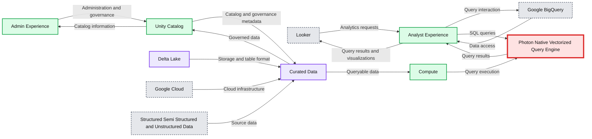

# Introducing Databricks SQL on Google Cloud – Now in Public Preview

- Source: https://www.databricks.com/blog/2022/04/25/introducing-databricks-sql-on-google-cloud-now-in-public-preview.html
- Published: 2022-04-25
- Authors: Reynold Xin, Bilal Aslam, Amit Kara, Shant Hovsepian, Clinton Ford, Hannah Vergara
- Categories: platform, product, data-warehousing
- Images: 1 total, 1 extracted as architecture

Today we’re pleased to announce the availability of [Databricks SQL](https://www.databricks.com/product/databricks-sql) in [**public preview**](https://docs.gcp.databricks.com/sql/index.html) on [Google Cloud](https://www.databricks.com/product/google-cloud). With this announcement, customers can further adopt the lakehouse architecture by performing data warehousing and business intelligence workloads on Google Cloud by leveraging [Databricks SQL’s world record-setting performance for data warehousing workloads](https://www.databricks.com/blog/2021/11/02/databricks-sets-official-data-warehousing-performance-record.html) using [standard SQL](https://www.databricks.com/blog/2021/11/16/evolution-of-the-sql-language-at-databricks-ansi-standard-by-default-and-easier-migrations-from-data-warehouses.html).

The tight integration of[Databricks on Google Cloud](https://www.databricks.com/product/google-cloud) gives organizations the flexibility of running analytics and AI workloads on a simple, [open lakehouse platform](https://www.databricks.com/product/data-lakehouse) that combines the best of data warehouses and data lakes.

With Databricks SQL you have all capabilities needed to run data warehousing and analytics workloads on the [Databricks Lakehouse Platform](https://www.databricks.com/product/data-lakehouse) with Google Cloud:

- Instant, elastic serverless compute for low-latency, high-concurrency queries that are typical in analytics workloads. Compute is separated from storage so you can scale with confidence.
- Optimized and integrated connectors for your BI tools, so you can get value from your data without having to learn new solutions.
- Simplified administration and data governance using standard SQL, so you can quickly and confidently enable self-serve analytics.
- Simple user administration with native support for [Google Workspace based SSO.](https://docs.databricks.com/administration-guide/users-groups/single-sign-on/gsuite20.html)
- A first-class, built-in analytics experience with a SQL query editor, visualizations and interactive dashboards.

**Summary:** The diagram shows Databricks SQL on Google Cloud connecting analyst and admin experiences to Photon, compute, Unity Catalog, and curated data, with integrations for Looker and Google BigQuery.

**Components:**

- Looker: Business intelligence and analytics tool.
- Google BigQuery: Google Cloud data warehouse.
- Analyst Experience: Databricks SQL analyst interface.
- Admin Experience: Databricks SQL administration interface.
- Photon: Native vectorized query engine.
- Compute: Query processing resources.
- Unity Catalog: Data governance and catalog service.
- Curated Data: Governed analytical data.
- Delta Lake: Storage and table format.
- Google Cloud: Cloud infrastructure platform.
- Structured, Semi-Structured, and Unstructured Data: Source data types.

**Flows:**

- Looker -> Analyst Experience: Analytics requests
- Analyst Experience -> Looker: Query results and visualizations
- Google BigQuery -> Analyst Experience: Data access
- Analyst Experience -> Google BigQuery: Query interaction
- Curated Data -> Unity Catalog: Governed data
- Unity Catalog -> Curated Data: Catalog and governance metadata
- Structured, Semi-Structured, and Unstructured Data -> Curated Data: Source data
- Curated Data -> Compute: Queryable data
- Compute -> Photon: Query execution
- Photon -> Analyst Experience: Query results
- Analyst Experience -> Photon: SQL queries
- Admin Experience -> Unity Catalog: Administration and governance
- Unity Catalog -> Admin Experience: Catalog information

**Numbers:** none

source image: https://www.databricks.com/wp-content/uploads/2022/04/db-148-blog-img-1.jpg

## Getting started

Databricks SQL is in [public preview](https://docs.gcp.databricks.com/sql/index.html) for all customers on Google Cloud enabling customers to operate multi-cloud lakehouse architectures with performant query execution. Thus public preview of Databricks SQL on Google Cloud is a win-win for customers who can enable their organizations to work seamlessly across to support data and AI services on Google Cloud. Learn more about Databricks SQL on Google Cloud by joining us at [Data Partner Spotlight](https://cloudonair.withgoogle.com/events/data-partner-spotlight?utm_source=cloud_sfdc&utm_medium=partner&utm_content=databricks&blaid=2886939) and our next hands-on [Quickstart Lab](https://www.databricks.com/p/webinar/databricks-on-google-cloud-quickstart-labs).
