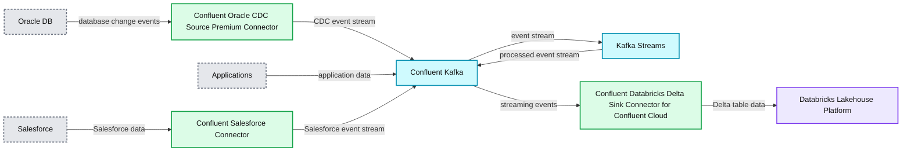

# Build Scalable Real-time Applications on the Lakehouse Using Confluent & Databricks, Part 2

*See it come to life in an end-to-end Financial Service Predictive Analytics use case*

- Source: https://www.databricks.com/blog/2022/05/17/build-scalable-real-time-applications-on-the-lakehouse-using-confluent-databricks-part-2.html
- Published: 2022-05-17
- Authors: Prasad Kona, Paul Earsy
- Categories: platform, partners, data-streaming
- Images: 6 total, 2 extracted as architecture

This is a collaborative post between Confluent and Databricks. We thank Paul Earsy Staff Solutions Engineer at Confluent, for their contributions.

 
 In this blog we’ll be highlighting the simplified experience using Confluent’s fully-managed sink connector for Databricks on AWS. This fully-managed connector was designed specifically for the Databricks Lakehouse and provides a powerful solution to build and scale [real-time applications](https://www.databricks.com/product/data-streaming) such as application monitoring, internet of things (IoT), fraud detection, personalization and gaming leaderboards. Organizations can use an integrated capability that streams legacy and cloud data from the Confluent platform directly into the Databricks Lakehouse for data science, data analytics, machine learning and business intelligence (BI) use cases on a single platform. The direct ingestion into the Databricks Lakehouse, specifically Delta Lake is available with the Confluent product and this provides a significant ease-of-use advantage compared to other data streaming alternatives like AWS Kinesis or AWS Managed Service for Kafka (MSK).

As we touched on in our last [blog: Confluent Streaming for Databricks: Build Scalable Real-time Applications on the Lakehouse](https://www.databricks.com/blog/2022/01/13/confluent-streaming-for-databricks-build-scalable-real-time-applications-on-the-lakehouse.html), streaming data through Confluent Cloud directly into [Databricks Delta Lake](https://www.databricks.com/product/delta-lake-on-databricks) greatly reduces the complexity of writing manual code to build custom real-time streaming pipelines and hosting open source Apache Kafka, saving hundreds of hours of engineering resources. Once streaming data is in Delta Lake, you can unify it with batch data to build integrated data pipelines to power your mission-critical applications. Delta lake provides greater reliability than traditional data lakes with its transaction management and schema enforcement capabilities.

There are three core use cases that are enabled with the Confluent Databricks Delta Lake Sink Connector for Confluent Cloud:

1. Streaming on-premises and multicloud data for cloud analytics: Leveraging its Apache Kafka and Confluent footprint across on-prem and clouds, Confluent can stream all of this distributed data into Delta Lake, where Databricks offers the speed and scale to manage real-time applications in production.
2. Streaming data for analysts and business users using SQL analytics: Using Confluent and Databricks, organizations can prep, join, enrich and query streaming data sets in [Databricks SQL](https://www.databricks.com/product/databricks-sql) to perform blazingly fast analytics on stream data. Data is available much faster for analysis because it is now available in the data lakehouse.
3. Predictive analytics with ML models using streaming data: Databricks’ collaborative [Machine Learning solution](https://www.databricks.com/product/machine-learning) is built on Delta Lake so you can capture gigabytes of streaming source data directly from Confluent Cloud into Delta tables to create ML models, query and collaborate on those models in real-time.

Together, Databricks and Confluent form a powerful and complete data solution focused on helping companies modernize their legacy data infrastructure and operate at scale in real time. With Confluent and Databricks, developers can create real-time applications, enable microservices, and leverage multiple data sources driving better business outcomes.

## How the Sink Connector accelerates data migration through simplified data ingestion

The [Databricks Delta Lake Sink Connector for Confluent Cloud](https://docs.confluent.io/cloud/current/connectors/cc-databricks-delta-lake-sink/index.html#databrick) eliminates the need for the development and management of custom integrations, and thereby reduces the overall operational burden of connecting your data between Confluent Cloud and Delta Lake on Databricks. Databricks Delta Lake is an open format storage layer that delivers reliability, security, and performance on your data lake—for both streaming and batch operations. By replacing data silos with a single home for structured, semi-structured, and unstructured data, Delta Lake is the foundation of a cost-effective, highly-scalable lakehouse.

For example, enterprises can pull data from on-premises data warehouses (e.g Oracle, Teradata, Microsoft SQL Server, MySQL and others) and hundreds of popular systems (applications, SaaS applications, log streams, event streams, and others) into Confluent Cloud, pre-process and prep streaming data in ksqlDB, and send it off to Databricks Delta Lake using the fully managed sink connector.

## Easy to configure experience vs. writing custom code

If you were to build a custom real time data extraction and ingest pipeline, it would involve a lot of developer resources. They would need to implement these custom pipelines, then maintain and operationalize them. These custom pipelines would also be brittle due to the complexity involved in data extraction api supported by the various source systems, api limitations and frequent api changes. Using a low-code, config based, managed data extract & ingest pipelines helps provide a low cost, scalable and maintainable solutions. This also frees up developer resources to focus on projects that provide higher business value.

Confluents Databricks Sink Connector provides a no-code, config based approach that simplifies data extraction and ingest pipelines. This flow and set of screenshots show you how easy it is to get started on connecting Confluent to Databricks.

To start using this connector

- On the Confluent Cloud UI , navigate to the Cluster overview page. Then select Data integration -> Connectors. Then add a fully managed connector and choose the Databricks Delta Lake Sink connector.

And then to start configuring the connector

- On the next screen, select the Kafka topics you want to get the data from, the format for the input messages and Kafka cluster credentials. Provide the details to connect to a Databricks SQL endpoint or Databricks Cluster. Provide Kafka topic to Databricks Delta table mappings. Provide details of your own staging location, where temporary data is staged before ingesting into Delta.

And to finally deploy the connector

- Click Next to review the details for your connector, and click Launch to start it. On the “Connectors” page, the status of your new connector reads “Provisioning” and then changes to “Running.” The connector is now copying data to Databricks Delta. The sink connector also creates the tables on Databricks, if they don't already exist.

## Enable a use case around predictive analytics for fraud detection

In this demo scenario, we will see how Databricks and Confluent enable predictive analytics for detecting fraud at a financial institution. At this financial institution, an increase in fraudulent transactions has started to affect the growth of the business and they want to leverage predictive analytics to reduce fraud.

Let's say they use a database like Oracle (or any other database) to store transactions related to their business. They have implemented Salesforce to manage all of their CRM data, and hence maintain all customer account and contact data in Salesforce. They also use lots of other databases and applications that have customer and product data.

The data science team wants to harness existing customer data and apply the latest machine learning and predictive analytics to customer data with real-time financial transactions. However, there are three challenges:

- DBAs likely don’t want the data science team to directly and frequently query the tables in the Oracle databases due to the increased load on the database servers and the potential to interfere with existing transactional activity
- If the team makes a static copy of the data, they will need to keep that copy up to date in near real time
- With data siloed in various data source systems, data science teams have a fragmented approach to accessing and consuming customer and product data. Therefore a central data repository, such as Delta Lake, makes it easy for work with curated/standardized/gold data

Confluent’s Oracle CDC Source Connector can continuously monitor the original database and create an event stream in the cloud with a full snapshot of all of the original data and all of the subsequent changes to data in the database, as they occur and in the same order. The Databricks Delta Lake Sink Connector can continuously consume that event stream and apply those same changes to Databricks Delta. The sink connector has been designed to work effectively with Databricks SQL.

This connector helps simplify the architecture and implementation for extracting data from the various sources and ingesting the streaming data into the Databricks Lakehouse Platform.

Below is a high-level architecture for this use case.

**Summary:** The diagram shows data flowing from Oracle DB, applications, and Salesforce through Confluent Kafka into Databricks Lakehouse, with Kafka Streams for stream processing.

**Components:**

- Oracle DB: Oracle database
- Confluent Oracle CDC Source Premium Connector: Oracle change data capture connector
- Applications: application data sources
- Salesforce: Salesforce platform
- Confluent Salesforce Connector: Salesforce source connector
- Confluent Kafka: event streaming platform
- Kafka Streams: stream processing
- Confluent Databricks Delta Sink Connector for Confluent Cloud: Delta Lake sink connector
- Databricks Lakehouse Platform: cloud data lakehouse with Unity Catalog, Delta Lake, and Cloud Data Lake

**Flows:**

- Oracle DB -> Confluent Oracle CDC Source Premium Connector: database change events
- Confluent Oracle CDC Source Premium Connector -> Confluent Kafka: CDC event stream
- Applications -> Confluent Kafka: application data
- Salesforce -> Confluent Salesforce Connector: Salesforce data
- Confluent Salesforce Connector -> Confluent Kafka: Salesforce event stream
- Confluent Kafka -> Kafka Streams: event stream for processing
- Kafka Streams -> Confluent Kafka: processed event stream
- Confluent Kafka -> Confluent Databricks Delta Sink Connector: streaming events
- Confluent Databricks Delta Sink Connector -> Databricks Lakehouse Platform: Delta table data

**Numbers:** none

source image: https://www.databricks.com/wp-content/uploads/2022/05/db-123-blog-img-3.jpg

The streaming raw data is now available as Delta tables. The raw data can now be cleansed and prepared to support the fraud analytics use case.

[Delta Live Tables](https://www.databricks.com/product/delta-live-tables) then helped build reliable, maintainable, fully managed data processing pipelines that help take the raw data and go through the [medallion architecture](https://www.databricks.com/glossary/medallion-architecture) (i.e., improving the structure and quality of data as it flows from bronze -> silver -> gold). Gold data is now readily made available for the data scientists working on building the machine learning (ML) models to predict fraudulent transactions.

**Summary:** Databricks Delta Live Tables shows Salesforce account data flowing through managed transformation stages into customer 360 data with data quality monitoring.

**Components:**

- Salesforce account data source
- Silver table 1 for Salesforce account and contact data
- Silver table 2 for Customer360 internal ATM transactions
- Customer360 output table
- Delta Live Tables pipeline UI
- Data quality monitor

**Flows:**

- Salesforce account data -> Silver table 1: account and contact records
- Silver table 1 -> Silver table 2: joined and transformed customer data
- Silver table 2 -> Customer360 output: curated customer 360 data
- Customer360 output -> Data quality monitor: written and dropped record metrics

**Numbers:** 1, 2, 3, 50, 3/24/2022 2:57:33 PM, 2022-03-24 14:57:33 PDT, 100% (22,712), 0% (0), 4 minutes ago

source image: https://www.databricks.com/wp-content/uploads/2022/05/db-123-blog-img-4.jpg

Databricks AutoML helped create baseline machine learning (ML) models and notebooks. This enabled data scientists to review, select, deploy and operationalize the best ML model. The end to end ML model lifecycle is also fully managed using mlflow. This includes running/tracking the experiments, using a model registry to manage the model lifecycle, deploying the models to production and model serving.
 This helped simplify the implementation of the end-to-end solution to predict fraud in real time.

Using Databricks SQL, business intelligence (BI) analysts can query for data and build dashboards. Optimized connectors for Databricks SQL available in leading business intelligence tools like Tableau, PowerBI, Looker, and others allows one to create BI dashboards.

Let’s recap how Confluent + Databricks helped support this predictive fraud analytics use case for this financial institution.

- Confluent Cloud’s Sink Connector for Databricks helped simplify the ingest of the streaming data into the Databricks Lakehouse
- Delta Live tables helped simplify data engineering by allowing analysts to use SQL to build managed data pipelines
- Databricks AutoML helped simplify creating and operationalizing the machine learning models
- Databricks SQL helped enable data analysts and BI users to explore data and create dashboards

Conclusion

With Confluent and Databricks, organizations can create real-time applications, enable microservices, and enable analysis of all data, resulting in better data-driven decisions and business outcomes. Together, we form a powerful and complete data solution focused on helping companies operate at scale in real-time.

## Getting Started with Databricks and Confluent Cloud

To get started with the connector, you will need access to Databricks and Confluent Cloud. Check out the [Databricks Sink Connector for Confluent Cloud documentation](https://docs.confluent.io/cloud/current/connectors/cc-databricks-delta-lake-sink/index.html#databrick) and take it for a spin on Databricks for free by signing up for a [14-day trial](https://www.databricks.com/try-databricks). Also check out a free trial of [Confluent Cloud](https://www.confluent.io/get-started/?product=cloud&utm_campaign=tm.partner_cd.conflu%5B%E2%80%A6%5Dr-databricks-part2&utm_source=databricks&utm_medium=blogpost).

Check out the previous blog “[Confluent Streaming for Databricks: Build Scalable Real-time Applications on the Lakehouse](https://www.databricks.com/blog/2022/01/13/confluent-streaming-for-databricks-build-scalable-real-time-applications-on-the-lakehouse.html)”
