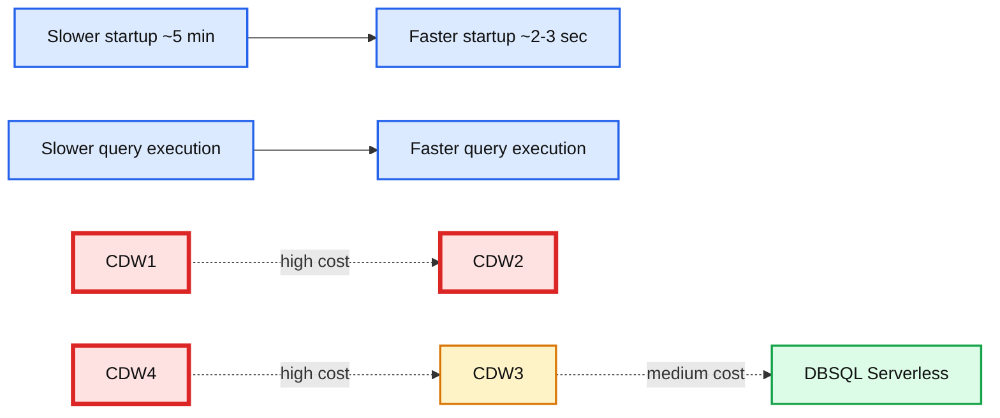

# Databricks SQL Serverless Now Available on AWS

*Focus on insights rather than infrastructure*

- Source: https://www.databricks.com/blog/2022/06/28/databricks-sql-serverless-now-available-on-aws.html
- Published: 2022-06-28
- Authors: Reynold Xin, Shant Hovsepian, Jonathan Keller, Cyrielle Simeone, Shankar Sivadasan, Nikhil Jethava
- Categories: platform, announcements, data-warehousing
- Images: 3 total, 1 extracted as architecture

[Databricks SQL Serverless](https://www.databricks.com/product/databricks-sql) is now generally available. Read [our blog](https://www.databricks.com/blog/announcing-general-availability-databricks-sql-serverless) to learn more.

 

We are excited to announce the availability of serverless compute for [Databricks SQL](https://www.databricks.com/product/databricks-sql) (DBSQL) in Public Preview on AWS today at the Data + AI Summit! DB SQL Serverless makes it easy to get started with data warehousing on the lakehouse. Serverless frees up time, lowers costs, and allows you to focus on delivering the most value to your business rather than managing infrastructure.

## Databricks SQL Serverless for improved performance at lower cost

[Databricks SQL Serverless](https://www.databricks.com/blog/2021/08/30/announcing-databricks-serverless-sql.html) helps address challenges customers face with compute, management, and infrastructure costs:

- **Instant and elastic**: Serverless compute brings a truly elastic, always-on environment that’s instantly available and scales with your needs. You'll benefit from simple usage based pricing, without worrying about idle time charges. Imagine no longer needing to wait for clusters to become available to run queries or overprovisioning resources to handle spikes in usage. Databricks SQL Serverless dynamically grows and shrinks resources to handle whatever workload you throw at it.
- **Eliminate management overheads**: Serverless transforms DBSQL into a fully managed service, eliminating the burden of capacity management, patching, upgrading and performance optimization of the cluster. You only need to focus on your data and the insights it holds. Additionally, the simplified pricing model means there’s only one bill to track and only one place to check attribute costs.
- **Lower infrastructure cost**: Under the covers, the serverless compute platform uses machine learning algorithms to provision and scale compute resources right when you need them. This enables substantial cost savings without the need to manually shut down clusters. Customers such as Scribd have found that adopting serverless allowed them to increase utilization of their SQL warehouses and significantly reduce infrastructure cost.

>  "We rely on Databricks SQL to power the business intelligence tools used by our analysts. Databricks SQL Serverless allows us to use the power of Databricks SQL while being much more efficient with our infrastructure. Checking the serverless box resulted in a 3x reduction in our infrastructure costs, which is why we're integrating Databricks SQL Serverless into more and more data pipelines." - R Tyler Croy, Director of Platform Engineering, Scribd

In fact, in our internal tests we found Databricks SQL Serverless to have the best price-performance compared to traditional data warehouses.

**Summary:** The chart compares cloud data warehouse options by startup time, query execution time, and estimated cost.

**Components:**

- CDW1, CDW2, CDW4: High cost cloud data warehouses
- CDW3: Medium cost cloud data warehouse
- DBSQL Serverless: Low cost Databricks SQL Serverless
- Startup Time axis: Slower to faster startup
- Query Execution Time axis: Slower to faster execution
- Cost Estimate legend: High, medium, and low cost

**Flows:**

- Slower Startup Time -> Faster Startup Time: Startup time increases toward the right
- Slower Query Execution Time -> Faster Query Execution Time: Query speed increases toward the top

**Numbers:** CDW1, CDW2, CDW3, CDW4, ~5 min, ~2-3 sec

source image: https://www.databricks.com/wp-content/uploads/2022/06/image3.png

*Source - 2022 Cloud Data Warehouse Benchmark Report; Databricks research*

 

With the serverless platform, we support enterprise grade security features such as [private network connectivity](https://docs.databricks.com/administration-guide/cloud-configurations/aws/privatelink.html) for blob storage and [customer managed keys](https://docs.databricks.com/security/keys/customer-managed-keys-storage-aws.html) for encrypting data at rest which will allow you to bring your sensitive, production workloads while maintaining your organization’s governance controls.

## Getting Started

If you are on AWS, ask your admin [to enable Serverless](https://docs.databricks.com/sql/admin/serverless.html) from the account console and create serverless SQL warehouses (formerly known as endpoints). You can also convert an existing SQL warehouse to leverage serverless compute by simply toggling the serverless option in the warehouse settings page. To learn more visit the [Serverless compute](https://docs.databricks.com/serverless-compute/index.html) documentation page.

If you are an Azure customer, please [submit](http://bit.ly/DBSQLServerless-Azure) your request and we will onboard you as soon as Databricks SQL Serverless for Azure Databricks becomes available.

*Enabling serverless compute at account console*

*Creating and managing serverless warehouses on Databricks SQL*
