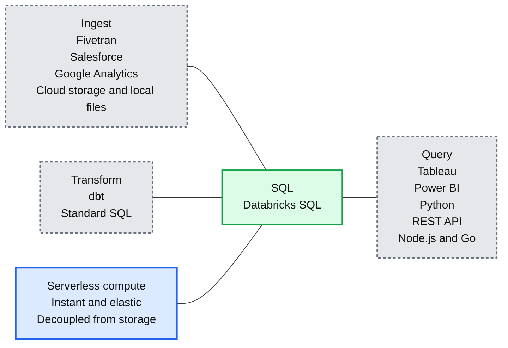
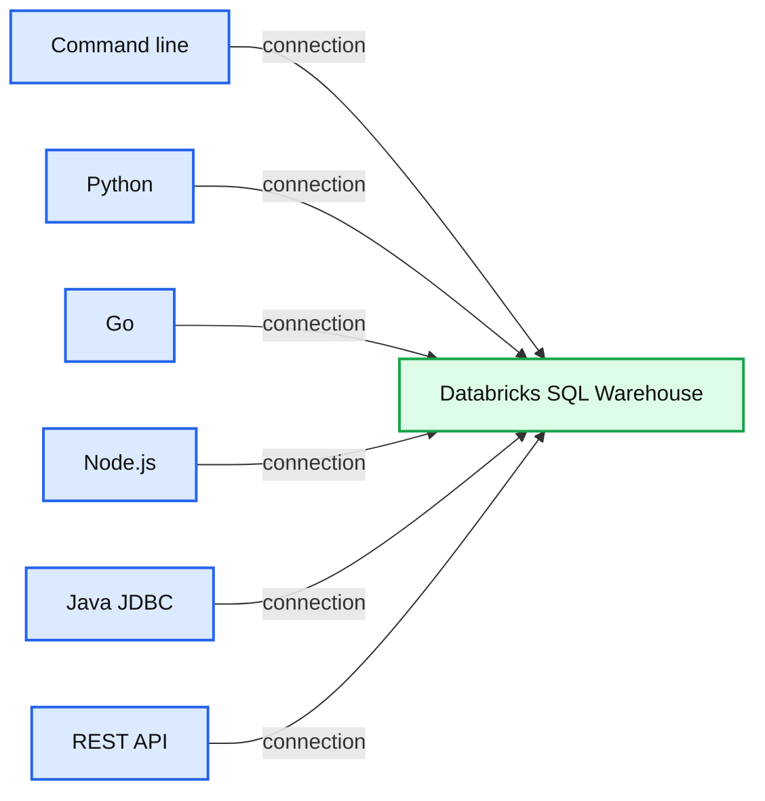
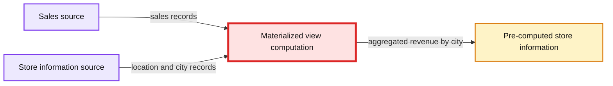
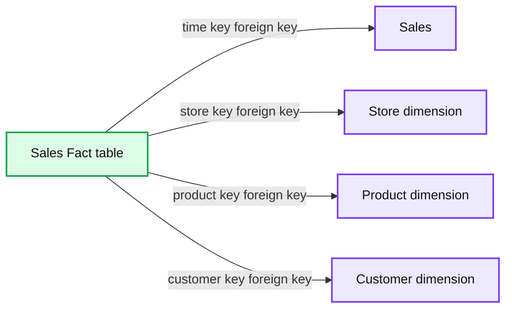

# Databricks SQL Highlights From Data & AI Summit

*The best data warehouse is a lakehouse*

- Source: https://www.databricks.com/blog/2022/07/20/databricks-sql-highlights-from-data-ai-summit.html
- Published: 2022-07-20
- Authors: Shant Hovsepian, Miranda Luna, Cyrielle Simeone, Alex Lichen
- Categories: platform, product, data-warehousing
- Images: 4 total, 4 extracted as architecture

Data warehouses are not keeping up with today's world: the explosion of languages other than SQL, unstructured data, machine learning, IoT and streaming analytics have forced customers to adopt a bifurcated architecture: data warehouses for BI and data lakes for ML. While SQL is ubiquitous and known by millions of professionals, it has never been treated as a first-class citizen on the data lake - until the rise of the data lakehouse.

As customers adopt the lakehouse architecture, [Databricks SQL](https://www.databricks.com/product/databricks-sql) (DBSQL) provides data warehousing capabilities and first-class support for SQL on the [Databricks Lakehouse Platform](https://www.databricks.com/product/data-lakehouse) - and brings together the best of data lakes and data warehouses. Thousands of customers worldwide have already adopted DBSQL, and at the [Data + AI Summit](https://www.databricks.com/dataaisummit/), we announced a number of innovations for data transformation & ingest, connectivity, and classic data warehousing to continue to redefine analytics on the lakehouse. Read on for the highlights.

## Instant on, serverless compute for Databricks SQL

First, we announced the availability of [serverless compute](https://www.databricks.com/blog/2021/08/30/announcing-databricks-serverless-sql.html) for Databricks SQL (DBSQL) in Public Preview on AWS! Now you can enable every analyst and analytics engineer to ingest, transform, and query the most complete and freshest data without having to worry about the underlying infrastructure.

*Ingest, transform, and query the most complete and freshest data using standard SQL with instant, elastic serverless compute - decoupled from storage*

**Summary:** Databricks SQL connects ingest, transform, and query workflows across lakehouse data and external tools.

**Components:**

- SQL: Databricks SQL
- Ingest: Fivetran, Salesforce, Google Analytics, cloud storage, local files, and business-critical applications
- Transform: dbt and standard SQL
- Query: Tableau, Power BI, Python, REST API, Node.js, and Go
- Compute: instant, elastic serverless compute decoupled from storage

**Flows:**

- No explicit arrows are visible; the diagram presents SQL as the hub for ingest, transform, and query.

**Numbers:** none

source image: https://www.databricks.com/wp-content/uploads/2022/07/db-259-blog-img-1.jpg

Ingest, transform, and query the most complete and freshest data using standard SQL with instant, elastic serverless compute - decoupled from storage

## Open sourcing Go, Node.js, Python and CLI connectors to Databricks SQL

Many customers use Databricks SQL to build custom data applications powered by the lakehouse. So we [announced](https://www.databricks.com/blog/2022/06/29/connect-from-anywhere-to-databricks-sql.html) a full lineup of open source connectors for [Go](https://github.com/databricks/databricks-sql-go), [Node.js](https://github.com/databricks/databricks-sql-nodejs), [Python](https://github.com/databricks/databricks-sql-python), as well as a new [CLI](https://github.com/databricks/databricks-sql-cli) to make it simpler for developers to connect to Databricks SQL from any application. Contact us on [GitHub](https://github.com/databricks/) and the [Databricks Community](https://community.databricks.com/s/) for any feedback and let us know what's next to build!

*Databricks SQL connectors: connect from anywhere and build data apps powered by your lakehouse*

**Summary:** Databricks SQL Warehouse accepts connections from command line, Python, Go, Node.js, Java JDBC, and REST API clients.

**Components:**

- Command line
- Python
- Go
- Node.js
- Java JDBC
- REST API
- Databricks SQL Warehouse

**Flows:**

- Command line -> Databricks SQL Warehouse: connection
- Python -> Databricks SQL Warehouse: connection
- Go -> Databricks SQL Warehouse: connection
- Node.js -> Databricks SQL Warehouse: connection
- Java JDBC -> Databricks SQL Warehouse: connection
- REST API -> Databricks SQL Warehouse: connection

**Numbers:** none

source image: https://www.databricks.com/wp-content/uploads/2022/07/db-259-blog-img-2.jpg

Databricks SQL connectors: connect from anywhere and build data apps powered by your lakehouse

## Python UDFs

Bringing together data scientists and data analysts like never before, Python UDFs deliver the power of Python right into your favorite SQL environment! Now analysts can tap into python functions - from complex transformation logic to machine learning models - that data scientists have already developed and seamlessly use them in their SQL statements directly in Databricks SQL. Python UDFs are now in private preview - stay tuned for more updates to come.

## Query Federation

The lakehouse is home to all data sources. Query federation allows analysts to directly query data stored outside of the lakehouse without the need to first extract and load the data from the source systems. Of course, it’s possible to combine data sources like PostgreSQL and delta transparently in the same query.

## Materialized views

Materialized Views (MVs) accelerate end-user queries and reduce infrastructure costs with efficient, incremental computation. Built on top of [Delta Live Tables (DLT)](https://www.databricks.com/product/delta-live-tables), MVs reduce query latency by pre-computing otherwise slow queries and frequently used computations.

*Speed up queries with pre-computed results*

**Summary:** The diagram shows a materialized view computation combining sales data with store information to produce pre-computed revenue totals by city.

**Components:**

- Sales source with product, location, transaction, and price fields
- Store information source with location, manager, and city fields
- Materialized view computation engine
- Pre-computed store information result with city and total revenue

**Flows:**

- Sales -> Materialized view computation: sales records
- Store information source -> Materialized view computation: location and city records
- Materialized view computation -> Pre-computed result: aggregated revenue by city

**Numbers:** 24, 7, 11, 24, 7, 1, 2, 3

source image: https://www.databricks.com/wp-content/uploads/2022/07/db-259-blog-img-3.jpg

Speed up queries with pre-computed results

## Data Modeling with Constraints

Everyone’s favorite data warehouse constraints are coming to the lakehouse! Primary Key & Foreign Key Constraints provides analysts with a familiar toolkit for advanced data modeling on the lakehouse. DBSQL & BI tools can then leverage this metadata for improved query planning.

- Primary and foreign key constraints clearly explain the relationships between tables
- [IDENTITY](https://docs.databricks.com/sql/language-manual/sql-ref-syntax-ddl-create-table-using.html) columns automatically generate unique integer values as new rows are added
- Enforced [CHECK](https://docs.databricks.com/delta/delta-constraints.html#check-constraint) constraints to stop worrying about data quality and correctness issues

*Understand the relationships between tables with primary and foreign key constraints*

**Summary:** The diagram shows a sales fact table linked to time, store, product, and customer dimension tables through foreign key relationships.

**Components:**

- Sales table: relational dimension table using a primary key
- Store dimension: relational dimension table using a primary key
- Sales Fact table: relational fact table using foreign keys and sales measures
- Product dimension: relational dimension table using a primary key
- Customer dimension: relational dimension table using a primary key

**Flows:**

- Sales Fact table time key -> Sales time key: foreign key relationship
- Sales Fact table product key -> Product dimension product key: foreign key relationship
- Sales Fact table store key -> Store dimension store key: foreign key relationship
- Sales Fact table customer key -> Customer dimension customer key: foreign key relationship

**Numbers:** none

source image: https://www.databricks.com/wp-content/uploads/2022/07/db-259-blog-img-4.jpg

Understand the relationships between tables with primary and foreign key constraints

## Next Steps

Join the conversation in the [Databricks Community](https://community.databricks.com/s/) where data-obsessed peers are chatting about Data + AI Summit 2022 announcements and updates, and visit [https://dbricks.co/dbsql](https://dbricks.co/dbsql) to get started today !

Below is a selection of related sessions from the Data+AI Summit 2022 to watch on-demand:

- [Day 1 Morning Keynote](https://dataaisummit.com/session-virtual/?v2477da705118cc74fd14460db021e1784e2eed5a7982c6482ec95cb2e86d259644b8741959f52a49e0e6908b82a9d860=86463F6480F81908630C57761FA0E076B19263C21EA0A69F74DC4FEBB3D820C9CA5BE01EE8F2E671C511BDCB6B5FD6E1&return=/agenda/?scuid=C73CA775-A452-49B6-96E2-CC7BBF9182E8)
- [Data Warehousing on the Lakehouse](https://dataaisummit.com/session-virtual/?v2477da705118cc74fd14460db021e1784e2eed5a7982c6482ec95cb2e86d259644b8741959f52a49e0e6908b82a9d860=54557078072D4CA8705BD2981FF94F5CEB66D8845B870713577DBAADB26F508C7F0B80D8CCC4DD53C1E556ABB9CB1462&return=/agenda/?scuid=E0F1250B-24FB-47E1-A2F4-7DFD9B3349CE)
- [Databricks SQL Under the Hood: What's New with Live Demos](https://dataaisummit.com/session-virtual/?v2477da705118cc74fd14460db021e1784e2eed5a7982c6482ec95cb2e86d259644b8741959f52a49e0e6908b82a9d860=1FF278567E940F03CB87002A82FD11E0149350BECC0832D4ED65BCE2E0D1B20C8E34D812076D6196DF4B0F4DB9EB4734&return=/agenda/?scuid=80D1C1ED-A8EC-4C8A-9B6F-AC8E789B3976)
- [dbt and Databricks: Analytics Engineering on the Lakehouse](https://dataaisummit.com/session-virtual/?v2477da705118cc74fd14460db021e1784e2eed5a7982c6482ec95cb2e86d259644b8741959f52a49e0e6908b82a9d860=633FF50BFBA3808C5FD938BF9E72C22B89B49311DD208E465CDFA41A6DCDF7AC28AAA6B04AE4DE6EFD883FB7921224EC&return=/agenda/?scuid=0F5E8288-25BF-4545-BBDA-0203684200C4)
- [Delta Lake, the Foundation of Your Lakehouse](https://dataaisummit.com/session-virtual/?v2477da705118cc74fd14460db021e1784e2eed5a7982c6482ec95cb2e86d259644b8741959f52a49e0e6908b82a9d860=AE91CC39335EFDB36994925AA331122E5581B5DB514B426E803895F6E4A56D0D98FEBA179456661AF87966C649AB9076&return=/agenda/?scuid=D8D79216-C614-41D0-8DC1-CC11BBCCF93F)
- [Unity Catalog: Journey to unified governance for your Data and AI assets on Lakehouse](https://dataaisummit.com/session-virtual/?v2477da705118cc74fd14460db021e1784e2eed5a7982c6482ec95cb2e86d259644b8741959f52a49e0e6908b82a9d860=044A9FDF52A7C5C5BEA6D2E6C52BFDEA43BC26B4134E348850194B6E54ABBE69B8FA9FF9AC9EF48356E6FBF060133BA5&return=/agenda/?scuid=AA0FFB5D-A412-4129-9FD4-F4FC3B086143)
- [Scaling Your Workloads with Databricks Serverless](https://dataaisummit.com/session-virtual/?v2477da705118cc74fd14460db021e1784e2eed5a7982c6482ec95cb2e86d259644b8741959f52a49e0e6908b82a9d860=BE2B9BDF6A60CA2FECFB170DD342B8F305C50EC4FB28039D10C362602CB1D04B3A2A7B1792F3BB5F9552816370FEF2A2&return=/agenda/?scuid=934E63F6-45C4-4FBE-89F8-622AA6B750E2)
- [Radical Speed on the Lakehouse: Photon Under the Hood](https://dataaisummit.com/session-virtual/?v2477da705118cc74fd14460db021e1784e2eed5a7982c6482ec95cb2e86d259644b8741959f52a49e0e6908b82a9d860=E4A70C1B6807AA24D0D300E6FA26E7B7AEFD20476F8051B36F3AA2BF50610D3DC852BBBB5FB95121095FD226D8893FD0&return=/agenda/?scuid=8DBBB88D-59A0-4F2E-8C18-491CF12832F8)

## Learn More

- Watch Data + AI Summit 2022 on-demand:[https://www.databricks.com/dataaisummit/](https://www.databricks.com/dataaisummit/)
- Announcing open-source Go, Node.js, Python, and CLI connectors to Databricks SQL: [https://www.databricks.com/blog/2022/06/29/connect-from-anywhere-to-databricks-sql.html](https://www.databricks.com/blog/2022/06/29/connect-from-anywhere-to-databricks-sql.html)
- Serverless announcement: [https://www.databricks.com/blog/2021/08/30/announcing-databricks-serverless-sql.html](https://www.databricks.com/blog/2021/08/30/announcing-databricks-serverless-sql.html)
