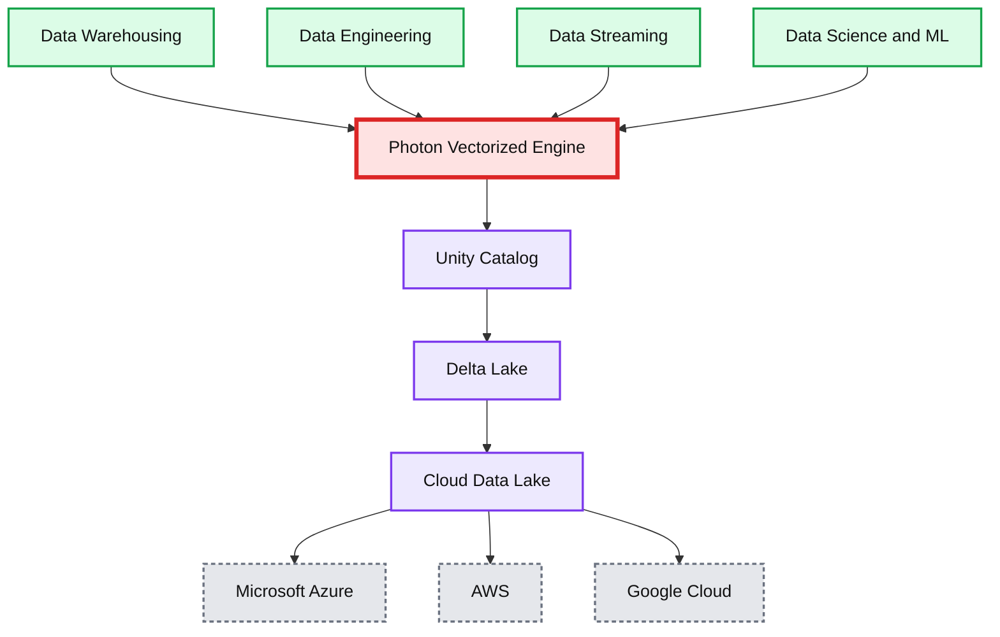

# Announcing Photon Engine General Availability on the Databricks Lakehouse Platform

*Get radical speed at lower costs for all data use cases*

- Source: https://www.databricks.com/blog/2022/08/03/announcing-photon-engine-general-availability-on-the-databricks-lakehouse-platform.html
- Published: 2022-08-03
- Authors: Alexander Behm, Cyrielle Simeone, Justin Breese, Sriram Krishnamurthy
- Categories: platform, product, data-warehousing
- Images: 1 total, 1 extracted as architecture

We are pleased to announce that [Photon](https://www.databricks.com/product/photon), the record-setting next-generation query engine for lakehouse systems, is now [generally available](https://docs.databricks.com/runtime/photon.html) on Databricks across all major cloud platforms. Photon, built from the ground up by the original creators of Apache Spark™ and fully compatible with modern Spark workloads, delivers fast performance with lower TCO on cloud hardware for all data use cases.

Since its launch two years ago, Photon has processed exabytes of data, ran billions of queries, delivered [benchmark-setting price/performance](https://www.databricks.com/blog/2021/11/02/databricks-sets-official-data-warehousing-performance-record.html) at up to 12x better than traditional cloud data warehouses, and received a prestigious [award](https://www.databricks.com/blog/2022/06/15/apache-spark-and-photon-receive-sigmod-awards.html).

While the initial focus of Photon was on SQL to enable data warehousing workloads on your existing data lakes, we have expanded the coverage of languages (e.g. Python, Scala, Java, and R) and workloads (e.g. data engineering, analytics, and data science) to reflect modern DataFrame and SparkSQL workloads.

As a result, customers like [AT&T](https://www.databricks.com/dataaisummit/session/how-att-data-science-team-solved-insurmountable-big-data-challenge-databricks) have seen dramatic infrastructure cost savings and speed-ups on Photon not only via Databricks SQL Warehouse - but also for data ingestion, ETL, streaming, and interactive queries on the traditional Databricks Workspaces:

- Up to 80% TCO cost savings (30% on average) with Photon over traditional Databricks Runtime (Apache Spark™), and up to 85% reduction in VM compute hours (50% on average)
- Up to 5x lower latency for ⅕ of the compute using [Delta Live Tables](https://www.databricks.com/product/delta-live-tables) with Photon
- 3-8x faster queries on interactive SQL workloads

Furthermore, in a recent survey of 400 preview customers, 90% reported faster query execution in the workspace and 87% said they can get more work done due to faster increase in performance, so they can iterate and develop business value faster.

*Radical speed on the Databricks Lakehouse Platform with Photon*

**Summary:** The diagram shows the Databricks Lakehouse Platform layered over Photon, Unity Catalog, Delta Lake, and cloud data lakes.

**Components:**

- Databricks Lakehouse Platform
- Data Warehousing
- Data Engineering
- Data Streaming
- Data Science and ML
- Photon Vectorized Engine
- Unity Catalog
- Delta Lake
- Cloud Data Lake
- Microsoft Azure
- AWS
- Google Cloud

**Flows:**

- none

**Numbers:** none

source image: https://www.databricks.com/wp-content/uploads/2022/08/db-282-blog-img-1.png

Radical speed on the Databricks Lakehouse Platform with Photon

## What's new in Photon with GA?

While Photon GA has many amazing features, we'd like to emphasize the following:

- **Fast and Robust Sort:** Using **vectorized sort** in Photon, customers have seen 3-20x performance gain during preview, which is significantly faster than in Apache Spark™.
- **Accelerated Window Functions:** Functions that perform calculations across a set of table rows for use cases such as aggregations, moving average, or data duplications have been reported to speed up 2-3 times during preview.
- **Accelerated Structured Streaming:** Photon now supports stateless Structured Streaming workloads. During the preview, customers who've had streaming jobs reported a 5x decrease in cost.

## Getting Started

Follow our [docs](https://docs.databricks.com/runtime/photon.html) to get started with Photon, and watch our [Data + AI Summit talk](https://www.databricks.com/dataaisummit/session/radical-speed-lakehouses-photon-under-hood) to dive in!
