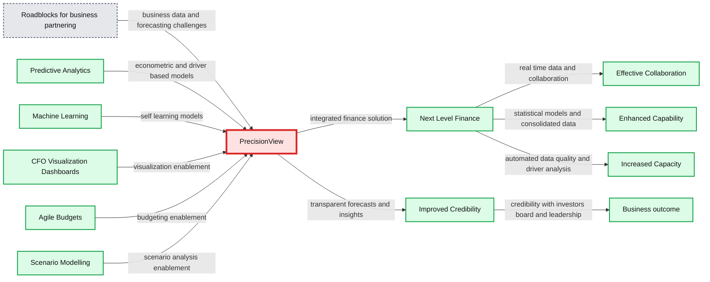

# Databricks Expands Brickbuilder Solutions for Healthcare and Life Sciences

- Source: https://www.databricks.com/blog/2022/08/22/databricks-expands-brickbuilder-solutions-healthcare-and-life-sciences.html
- Published: 2022-08-22
- Authors: Michael Lumb
- Categories: data-science-machine-learning
- Images: 3 total, 1 extracted as architecture

Today, we’re excited to announce that Databricks has collaborated with Avanade, Deloitte, and ZS to expand Brickbuilder Solutions for healthcare and life sciences. These new solutions, in addition to the previously launched Lovelytics solution, help healthcare organizations map data across the entire patient lifecycle and derive insights at speed and scale.

Earlier this year, Databricks announced [Lakehouse for Healthcare and Life Sciences](https://www.databricks.com/blog/2022/03/09/introducing-lakehouse-for-healthcare-and-life-sciences.html), a platform that delivers partner solutions and use case accelerators designed to address the unique requirements for healthcare organizations. To complement the Lakehouse, we also introduced [Brickbuilder Solutions](https://www.databricks.com/blog/2022/03/17/brickbuilder-solutions-partner-developed-industry-solutions-for-the-lakehouse.html) – data and AI solutions expertly designed by leading consulting companies to address industry-specific business requirements.* Last week, we announced the expansion of Brickbuilder Solutions to include partner [migration solutions](https://www.databricks.com/blog/2022/08/11/announcing-brickbuilder-solutions-for-migrations.html). We’ll continue this growth and momentum by launching additional financial services and manufacturing solutions, all to help customers reduce costs and accelerate time to value throughout their data transformation journey.

Let’s take a further look into Databricks’ suite of healthcare and life sciences Brickbuilder Solutions.

*Fig. 1: Brickbuilder Solutions are partner-developed industry and migration solutions for the lakehouse.*

**Avanade Intelligent Healthcare on Azure Databricks: end-to-end solution to help providers harness data to strengthen patient outcomes**

The healthcare industry has long been challenged by heavy clinician workloads, cost of care, and processes that impact the patient experience. Unfortunately, the pandemic has only intensified these challenges, and created new ones. Many healthcare leaders are investing in digital transformation efforts to strengthen operations and the entire care experience. Powered by the cloud, technologies like machine learning, natural language processing, and cognitive apps can help health organizations address the challenges faced by healthcare professionals.

Avanade’s Intelligent Healthcare on Azure Databricks solution enables providers to improve operational efficiencies and overcome resource constraints. With Intelligent Healthcare, data more seamlessly flows across the patient lifecycle to improve team care collaboration and provide enhanced insights at scale using analytics and AI. Providers can use these insights to improve patient health outcomes, personalize the patient journey, and enhance care team productivity.

**Deloitte PrecisionView™: enrich internal collaboration for the finance department in healthcare organizations**

For healthcare organizations, finance is at an inflexion point where growing expectations for real-time insights is the norm. Chief Financial Officers and other finance leaders find themselves regularly having to adapt to maintain top-performing FP&A organizations that deliver efficiency and business value. This requires them to challenge the way their organizations use data to unleash the power of advanced forecasting techniques and predictive modeling.

PrecisionView™, Deloitte’s proprietary advanced forecasting solution for healthcare and life sciences, leverages data aggregation technologies with predictive analytics as well as cognitive and machine-learning capabilities to let businesses generate improved forecasting accuracy and predictive modeling. The solution also helps generate high-impact insights that relate to the total enterprise, business units, geographies and products. It’s no secret that traditional forecasting and predictive modeling methods can be excessively manual and prone to unintentional human bias or sandbagging. PrecisionView, plus the right user experience, can help change that.

*Fig. 2: Deloitte PrecisionView™ leverages data aggregation with predictive analytics to let healthcare organizations generate improved forecasting accuracy.*

**Summary:** The diagram shows how Deloitte PrecisionView combines predictive analytics, machine learning, and finance enablers to improve forecasting credibility and business collaboration.

**Components:**

- Roadblocks for business partnering: disparate data, inefficient forecasting, limited analytics, and low driver transparency
- Predictive Analytics: econometric and driver-based models
- Machine Learning: self-learning and continuously evolving models
- Solution: PrecisionView
- Enablers: CFO visualization dashboards, agile budgets, and scenario modelling
- Next Level Finance: finance transformation capability
- Improved Credibility: statistically grounded insights and real-time action
- Effective Collaboration: real-time data tracking and finance-business collaboration
- Enhanced Capability: statistical models and consolidated market and regional data
- Increased Capacity: automated data quality and driver analysis

**Flows:**

- Roadblocks for business partnering -> PrecisionView: business data and forecasting challenges
- Predictive Analytics -> PrecisionView: econometric and driver-based models
- Machine Learning -> PrecisionView: self-learning models
- PrecisionView -> Next Level Finance: integrated finance solution
- CFO Visualization Dashboards -> PrecisionView: visualization enablement
- Agile Budgets -> PrecisionView: budgeting enablement
- Scenario Modelling -> PrecisionView: scenario analysis enablement
- PrecisionView -> Improved Credibility: transparent forecasts and insights
- Next Level Finance -> Effective Collaboration: real-time data and collaboration
- Next Level Finance -> Enhanced Capability: statistical models and consolidated data
- Next Level Finance -> Increased Capacity: automated data quality and driver analysis
- Improved Credibility -> Business outcome: credibility with investors, the board, and leadership

**Numbers:** none

source image: https://www.databricks.com/sites/default/files/inline-images/db-311-blog-img-2.png?v=1661805020

*Fig. 2: Deloitte PrecisionView™ leverages data aggregation with predictive analytics to let healthcare organizations generate improved forecasting accuracy.*

**Lovelytics Health Data Interoperability: quick and meaningful analytics for health data**

The healthcare industry has a legacy of highly-structured data models and complex analytics pipelines for a variety of use cases, such as clinical trial analytics, therapeutics, operational reporting, and governance and compliance. These data sets have enormous potential to uncover new, life-saving treatments, predict disease before it happens, and fundamentally change the way that care is delivered.

The [Lovelytics Health Data Interoperability accelerator](https://www.databricks.com/company/partners/consulting-and-si/partner-solutions/lovelytics-health) helps you establish the right foundation for your analytics roadmap by automating the ingestion of streaming FHIR bundles into the lakehouse for downstream patient analytics at scale. With this accelerator, you are able to democratize technology to prototype health data dashboards quicker as well as simplify the exchange of health data models and reusable data assets for a variety of new use cases.

*Fig. 3: Lovelytics Health Data Interoperability accelerator automates the ingestion of streaming FHIR bundles into the lakehouse for downstream patient analytics at scale.*

**ZS Intelligent Data Management for Biomedical Research: transform biomedical research data into insights**

The need for digital transformation in life sciences has accelerated, creating a demand for a deeper understanding of customers globally. This means that organizations need high-quality, comprehensive data in order to drive innovation and enable new commercial models, but many of them struggle with the implementation of AI. When an organization can execute complete AI life cycles, explore large datasets, and quickly iterate across data science and data engineering workloads, they can improve engagement, forecasting, and internal collaboration.

[Intelligent Data Management for Biomedical Research by ZS](https://www.databricks.com/company/partners/consulting-and-si/partner-solutions/zs-intelligent-data-management-biomedical) is a modular solution leveraged in the end-to-end value chain of setting up and using scientific data as an enterprise asset. It helps customers move closer to the vision of precision medicine at scale and at speed. The solution solves speed and cost issues around ingestion, storage, and querying of petabyte-scale genomic datasets, and provides quality control management for data from disparate sources. With Intelligent Data Management, you are now able to expedite query response times of excessive data sets, reduce infrastructure costs, and increase time-to-value.

**See More Brickbuilder Solutions**

At Databricks, we continue to collaborate with our consulting partner ecosystem to enable use cases in healthcare and life sciences. Check out our full set of partner solutions on [the Databricks Brickbuilder Solutions page](https://www.databricks.com/company/partners/consulting-and-si/partner-solutions?itm_data=menu-item-brickbuildersoverview).

**Create Brickbuilder Solutions for the Databricks Lakehouse Platform**

Brickbuilder Solutions is a key component of the Databricks Partner Program and recognizes partners who have demonstrated a unique ability to offer differentiated industry and migration solutions on the Databricks Lakehouse Platform in combination with their knowledge and expertise.

Partners who are interested in learning more about how to create a Brickbuilder Solution are encouraged to email us at [partners@databricks.com](mailto:partners@databricks.com).

**We have collaborated with consulting and system integrator (C&SI) partners to develop industry and migration solutions to address data engineering, data science, machine learning and business analytics use cases.*
