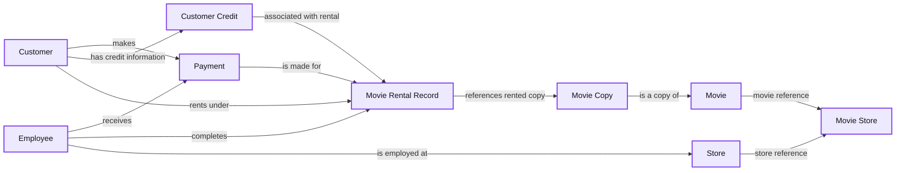
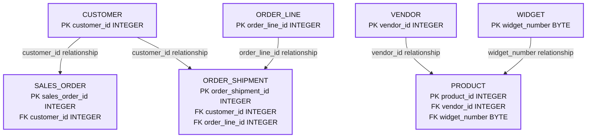
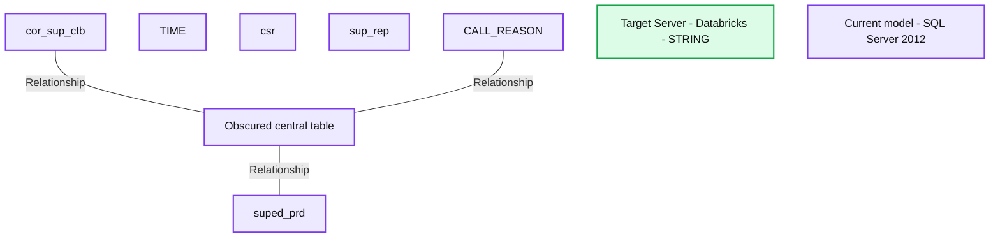
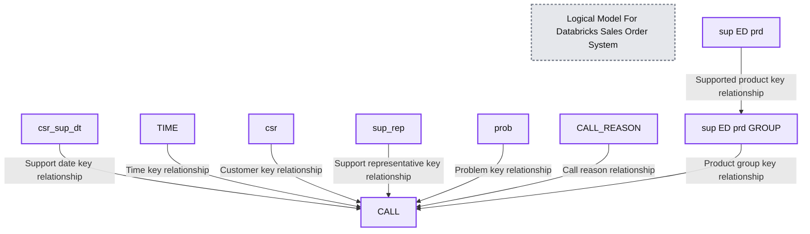

# Visual data modeling using erwin Data Modeler by Quest on the Databricks Lakehouse Platform

*Data Modeling using erwin on Databricks *

- Source: https://www.databricks.com/blog/2023/04/05/visual-data-modeling-using-erwin-data-modeler-databricks-lakehouse-platform.html
- Published: 2023-04-05
- Authors: Vani Mishra, Abhishek Dey, Leo Mao, Soham Bhatt, Pradeep Anandapu
- Categories: platform, data-warehousing
- Images: 9 total, 4 extracted as architecture

This is a collaborative post between Databricks and Quest Software. We thank Vani Mishra, Director of Product Management at Quest Software for her contributions.

 

## Data Modeling using erwin Data Modeler

As customers modernize their data estate to Databricks, they are consolidating various data marts and EDWs into a single scalable lakehouse architecture which supports ETL, BI and AI. Usually one of the first steps of this journey starts with taking stock of the existing data models of the legacy systems and rationalizing and converting them into Bronze, Silver and Gold zones of the Databricks Lakehouse architecture. A robust data modeling tool that can visualize, design, deploy and standardize the lakehouse data assets greatly simplifies the lakehouse design and migration journey as well as accelerates the data governance aspects.

We are pleased to announce our partnership and integration of [erwin Data Modeler by Quest](https://www.erwin.com/products/erwin-data-modeler/) with the [Databricks Lakehouse Platform](https://www.databricks.com/product/data-lakehouse) to serve these needs. Data modelers can now model and visualize lakehouse data structures with erwin Data Modeler to build Logical and Physical data models to fast-track migration to Databricks. Data Modelers and architects can quickly re-engineer or reconstruct databases and their underlying tables and views on Databricks. You can now easily access erwin Data Modeler from [Databricks Partner Connect](https://docs.databricks.com/partners/data-governance/erwin.html)!

Here are some of the key reasons why data modeling tools like erwin Data Modeler are important:

1. Improved understanding of data: Data modeling tools provide a visual representation of complex data structures, making it easier for stakeholders to understand the relationships between different data elements.
2. Increased accuracy and consistency: Data modeling tools can help ensure that databases are designed with accuracy and consistency in mind, reducing the risk of errors and inconsistencies in data.
3. Facilitate collaboration: With data modeling tools, multiple stakeholders can collaborate on the design of a database, ensuring that everyone is on the same page and that the resulting schema meets the needs of all stakeholders.
4. Better database performance: Properly designed databases can improve the performance of applications that rely on them, leading to faster and more efficient data processing.
5. Easier maintenance: With a well-designed database, maintenance tasks like adding new data elements or modifying existing ones become easier and less error-prone.
6. Enhanced data governance, data intelligence and metadata management.

In this blog, we will demonstrate three scenarios on how erwin Data Modeler can be used with Databricks:

1. The first scenario is where a team wants to build a fresh Entity Relationship Diagram (ERD) based on documentation from the business team. The goal is to create an ER diagram for the logical model for a business unit to understand and apply relationships, definitions and business rules as applied in the system. Based on this logical model, we will also build a physical model for Databricks.
2. In the second scenario, the business unit is building a visual data model by reverse engineering it from their current Databricks environment, to understand business definitions, relationships and governance perspectives, in order to collaborate with the reporting and governance team.
3. In the third scenario, the Platform architect team is consolidating its various Enterprise Data Warehouse(EDW) and data marts such as Oracle, SQL Server, Teradata, MongoDB etc. into the Databricks Lakehouse platform and building a consolidated Master model.

Once ERD creation is complete, we will show you how to generate a DDL/SQL file for Databricks physical design team.

## Scenario #1: Create a new Logical and Physical Data Model to implement in Databricks

The first step will be selecting a Logical/Physical model as shown here:

Create a new logical model.

Once selected, you can start building your entities, attributes, relationships, definition, and other details in this model.

The screenshot below shows an example of an advanced model:

*Sample of our Logical Model.*

**Summary:** The eMovies logical model in erwin Data Modeler connects customers, payments, employees, stores, movie rentals, and movie inventory.

**Components:**

- CUSTOMER: erwin logical entity containing customer identifiers and contact details.
- CUSTOMER CREDIT: erwin logical entity containing customer credit information.
- PAYMENT: erwin logical entity containing payment identifiers, amounts, dates, and payment details.
- EMPLOYEE: erwin logical entity containing employee identifiers and employment information.
- STORE: erwin logical entity containing store identifiers and address details.
- MOVIE RENTAL RECORD: erwin logical entity containing rental dates, customer references, and charges.
- MOVIE COPY: erwin logical entity identifying individual movie copies.
- MOVIE: erwin logical entity containing movie identifiers and descriptive attributes.
- MOVIE STORE: erwin logical association entity containing store and movie identifiers.

**Flows:**

- CUSTOMER -> PAYMENT: customer makes a payment.
- CUSTOMER -> CUSTOMER CREDIT: customer has credit information.
- CUSTOMER -> MOVIE RENTAL RECORD: customer is associated with a rental.
- CUSTOMER CREDIT -> MOVIE RENTAL RECORD: credit information is associated with a rental.
- PAYMENT -> MOVIE RENTAL RECORD: payment is made for a rental.
- EMPLOYEE -> PAYMENT: employee receives a payment.
- EMPLOYEE -> MOVIE RENTAL RECORD: employee completes a rental.
- EMPLOYEE -> STORE: employee is employed at a store.
- MOVIE RENTAL RECORD -> MOVIE COPY: rental references a movie copy.
- MOVIE COPY -> MOVIE: copy represents a movie.
- STORE -> MOVIE STORE: store identifier participates in the association.
- MOVIE -> MOVIE STORE: movie identifier participates in the association.

**Numbers:** Visible interface values include 2021 R1, Data Vault 2.0, and font color 128; 0; 0. No technical measurements are shown. Smaller text is not reliably legible.

source image: https://www.databricks.com/sites/default/files/inline-images/db-393-blog-imgs-2.png

Sample of our Logical Model.

Here you can build your model and document the details as needed. To learn more about how to use erwin Data modeler, refer to their online [help](https://bookshelf.erwin.com/bookshelf/public_html/12.5/Content/User%20Guides/erwin%20Help/Online%20Help.html) documentation.

## Scenario #2: Reverse Engineer a Data Model from the Databricks Lakehouse Platform

A Data Model reverse engineering is creating a data model from an existing database or script. The modeling tool creates a graphical representation of the selected database objects and the relationships between the objects. This graphical representation can be a logical or a physical model.

We will connect to Databricks from erwin Data modeler via [partner connect](https://docs.databricks.com/partners/data-governance/erwin.html#connect-to-erwin-data-modeler-using-partner-connect):

### Connection Options:

| Parameter | Description | Additional Information |
|---|---|---|
| Connection Type | Specifies the type of connection you want to use. Select Use ODBC Data Source to connect using the ODBC data source you have defined. Select Use JDBC Connection to connect using JDBC. |  |
| ODBC Data Source | Specifies the data source to which you want to connect. The drop-down list displays the data sources that are defined on your computer. | This option is available only when the Connection Type is set to Use ODBC Data Source. |
| Invoke ODBC Administrator. | Specifies whether you want to start the ODBC Administrator software and display the Select Data Source dialog. You can then select a previously defined data source or create a data source. | This option is available only when the Connection Type is set to Use ODBC Data Source. |
| Connection String | Specifies the connection string based on your JDBC instance in the following format: jdbc:spark://<server-hostname>:443/default;transportMode=http;ssl=1;httpPath=<http-path> | This option is available only when the Connection Type is set to Use JDBC Connection. For example: jdbc:spark://<url>.cloud.databricks.com:443/default;transportMode=http;ssl=1;httpPath=sql/protocolv1/o/<workspaceid>/xxxx |

The below screenshot shows JDBC connectivity via erwin DataModeler to the Databricks SQL Warehouse.

Connecting to Databricks SQL Warehouse via JDBC

It allows us to view all of the available databases and select which database we want to build our ERD model in, as shown below.

Reverse Engineering Wizard

**Summary:** An order-tracking relational model connects customers, sales orders, shipments, order lines, products, vendors, and widgets.

**Components:**

- CUSTOMER: Relational table with customer_id as its primary key and customer contact fields.
- SALES_ORDER: Relational table with sales_order_id as its primary key, customer_id as a foreign key, and order dates and status.
- ORDER_SHIPMENT: Relational table with order_shipment_id as its primary key, customer_id and order_line_id as foreign keys, and shipment details.
- ORDER_LINE: Relational table with order_line_id as its primary key, plus sales order ID, quantity, and date.
- PRODUCT: Relational table with product_id as its primary key, vendor_id and widget_number as foreign keys, plus name, cost, and quantity.
- VENDOR: Relational table with vendor_id as its primary key and vendor contact fields.
- WIDGET: Relational table with widget_number as its primary key, plus description, color, and type.
- erwin Data Modeler: Modeling application displaying the physical model; the status bar identifies Databricks.

**Flows:**

- CUSTOMER -> SALES_ORDER: customer_id primary-key to foreign-key relationship.
- CUSTOMER -> ORDER_SHIPMENT: customer_id primary-key to foreign-key relationship.
- ORDER_LINE -> ORDER_SHIPMENT: order_line_id primary-key to foreign-key relationship.
- VENDOR -> PRODUCT: vendor_id primary-key to foreign-key relationship.
- WIDGET -> PRODUCT: widget_number primary-key to foreign-key relationship.

The connectors represent table relationships, with direction inferred from the displayed foreign keys.

**Numbers:**

- CUSTOMER: name char(25), address varchar(35), city char(44), Postal_Code varchar(20), phone char(10), fax char(10).
- SALES_ORDER: SALES_ORDER_STATUS_CODE char(1).
- ORDER_SHIPMENT: ORDER_SHIPMENT_STATUS char(200).
- PRODUCT: PRODUCT_NAME char(25).
- VENDOR: VENDOR_NAME char(25), VENDOR_ADDRESS varchar(35), VENDOR_CITY varchar(20), Province varchar(20), Postal_Code varchar(20), VENDOR_PHONE char(10), VENDOR_FAX char(10).
- WIDGET: widget_type char(18).
- Interface: font size 10, zoom 83%, Data Vault 2.0, PublicationMart12.1_sony.erwin tab, F1 help shortcut.

source image: https://www.databricks.com/sites/default/files/inline-images/db-393-blog-imgs-4.png

The above screenshot shows an ERD built after reverse engineering from Databricks with the above method. Here are some benefits of reverse engineering a data model:

1. Improved understanding of existing systems: By reverse engineering an existing system, you can better understand how it works and how its various components interact. It helps you identify any potential issues or areas for improvement.
2. Cost savings: Reverse engineering can help you identify inefficiencies in an existing system, leading to cost savings by optimizing processes or identifying areas of wasteful resources.
3. Time savings: Reverse engineering can save time by allowing you to reuse existing code or data structures instead of starting from scratch.
4. Better documentation: Reverse engineering can help you create accurate and up-to-date documentation for an existing system, which can be useful for maintenance and future development.
5. Easier migration: Reverse engineering can help you understand the data structures and relationships in an existing system, making it easier to migrate data to a new system or database.

Overall, reverse engineering is valuable and a foundational step for data modeling. Reverse engineering enables a deeper understanding of an existing system and its components, controlled access to the enterprise design process, full transparency through modeling lifecycle, improvements in efficiency, time and cost savings, and better documentation which leads to better governance objectives.

## Scenario #3: Migrate existing Data Models to Databricks.

The above scenarios assume you are working with a single data source, but most enterprises have different data marts and EDWs to support their reporting needs. Imagine your enterprise fits this description and is now embarking on creating a Databricks Lakehouse to consolidate its data platforms in the cloud in one unified platform for BI and AI. In that situation, it will be easy to utilize erwin Data Modeler to convert your existing data models from a legacy EDW to a Databricks data model. In the example below, a data model built for an EDW like SQL Server, Oracle or Teradata can now be implemented in Databricks by altering the target database to Databricks.

*Existing SQL Server Data Model*

**Summary:** An erwin dimensional data model shows related SQL Server tables with the Target Server dialog set to Databricks.

**Components:**
- cor_sup_ctb: relational table with a dimension key and supplier-related attributes.
- TIME: relational time dimension.
- csr: relational table with a dimension key and representative attributes.
- sup_rep: partially obscured relational table.
- CALL_REASON: relational table containing call-reason attributes.
- suped_prd: relational table containing product attributes.
- Central table: name and attributes obscured by the dialog.
- Target Server: erwin configuration dialog showing Databricks, default datatype STRING, and a NOT NULL option.
- SQL Server 2012: current model database shown in the status bar.

**Flows:**
- cor_sup_ctb -> Central table: visible relationship line; direction and cardinality are unclear.
- CALL_REASON -> Central table: partially visible relationship line; direction and cardinality are unclear.
- Central table -> suped_prd: visible relationship line; direction and cardinality are unclear.

**Numbers:** SQL Server 2012; zoom 70%; CHAR lengths 1, 2, 10, and 18; VARCHAR lengths 20, 30, and 35; font color 159, 0, 0; Display1; Model1; Data Vault 2.0; F1. Some field definitions are too small or obscured to read reliably.

source image: https://www.databricks.com/sites/default/files/inline-images/db-393-blog-img-5.png

Existing SQL Server Data Model

As you can see in the marked circle area, this model is built for SQL Server. Now we will convert this model and migrate its deployment to Databricks by changing the target server. This kind of easy conversion of your data models helps organizations quickly and safely migrate data models from legacy or on-prem databases to the cloud and govern those data sets throughout their lifecycle.

*Convert a SQL Server Data Model to Databricks equivalent.*

**Summary:** A logical sales order data model for Databricks connects CALL to customer, time, support, problem, call reason, and product entities through key relationships.

**Components:**
- Logical Model For Databricks Sales Order System: model title identifying Databricks as the target platform.
- CALL: central relational entity containing foreign keys and call timing fields.
- csr_sup_dt: relational entity for customer support dates and pricing.
- TIME: relational time dimension.
- csr: relational customer dimension.
- sup_rep: relational support representative dimension.
- prob: relational problem dimension.
- CALL_REASON: relational call reason dimension.
- sup ED prd GROUP: relational supported product grouping entity.
- sup ED prd: relational supported product dimension.

**Flows:**
- csr_sup_dt -> CALL: key relationship through csr_sup_dte_dim_k.
- TIME -> CALL: key relationship through time_dim_k.
- csr -> CALL: key relationship through csr_dim_k.
- sup_rep -> CALL: key relationship through sup_rep_dim_k.
- prob -> CALL: key relationship through prob_dim_k.
- CALL_REASON -> CALL: key relationship through call_rsn_code.
- sup ED prd GROUP -> CALL: supported product group key relationship.
- sup ED prd -> sup ED prd GROUP: key relationship through suped_prd_dim_k.

These connections represent entity relationships; the image does not specify runtime data movement.

**Numbers:** none

source image: https://www.databricks.com/sites/default/files/inline-images/db-393-blog-img-6.png

Convert a SQL Server Data Model to Databricks equivalent.

Above picture, we tried to convert a legacy SQL server-based data model to Databricks with a few simple steps. This kind of easy migration path allows and helps organizations to quickly and safely migrate their data and assets to Databricks, encourages remote collaboration, and enhances security.

Now let's move on to our final part; once ER Model is ready and approved by the data architecture team, you can quickly generate a .sql file from erwin DM or connect to Databricks and forward engineer this model to Databricks directly.

Follow the screenshots below, which explain the step-by-step process to create a DDL file or a database model for Databricks.

Steps to generate SQL DDLs

Here you can review or update your SQL script

erwin Data Modeler Mart also supports [GitHub](https://bookshelf.erwin.com/bookshelf/public_html/12.0/Content/User%20Guides/erwin%20Help/Connecting_to_GitRepositories.html). This support enables your DevOps team's requirement to control your scripts to your choice of enterprise source control repositories. Now with Git support, you can easily collaborate with developers and follow version control workflows.

## Conclusion

In this blog, we demonstrated how easy it is to create, reverse engineer or forward engineer data models using erwin Data Modeler and create visual data models for migrating your table definitions to Databricks and reverse engineer data models for Data Governance and Semantic layer creation.

This kind of data modeling practice is the key element to add value to your:

1. Data governance practice
2. Cutting costs and achieving faster time to value for your data and metadata
3. Understand and improve the business outcomes and their associated metadata
4. Reduce complexities and risk
5. Improve collaboration between the IT team and business stakeholders
6. Better documentation
7. Finally, an easy path to migrate from legacy databases to Databricks platform

Get started with using erwin from [Databricks Partner Connect](https://docs.databricks.com/partners/data-governance/erwin.html).

[Try Databricks free for 14 days](https://www.databricks.com/try-databricks?itm_data=datavault-blog).
[Try erwin Data modeler](https://www.erwin.com/products/erwin-data-modeler/)
 ** erwin DM 12.5 is coming with Databricks Unity Catalog support where you will be able to visualize your primary & foreign keys.
