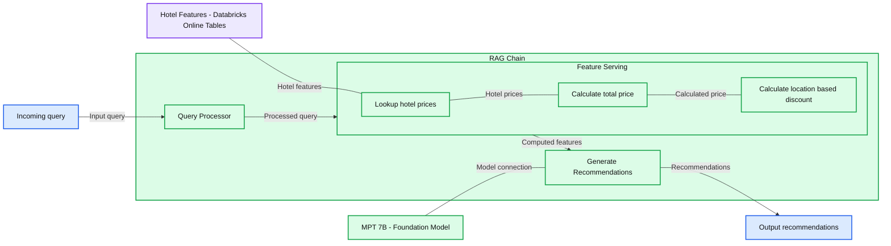
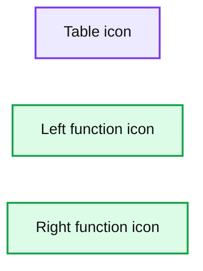

# Announcing the General Availability of Databricks Feature Serving

- Source: https://www.databricks.com/blog/announcing-general-availability-databricks-feature-serving
- Published: 2024-03-11
- Authors: Aakrati Talati, Mani Parkhe, Chenen Liang, Jasraj Dange, Mingyang Ge, Akhil Gupta
- Categories: data-science-machine-learning
- Images: 4 total, 2 extracted as architecture

Today, we are excited to announce the general availability of Feature Serving. Features play a pivotal role in AI Applications, typically requiring considerable effort to be computed accurately and made accessible with low latency. This complexity makes it harder to introduce new features to improve the quality of applications in production. With Feature Serving, you can now easily serve pre-computed features as well as compute on-demand features using a single REST API in real time for your AI applications, without the hassle of managing any infrastructure!

We designed Feature Serving to be fast, secure and easy to use and provides the following benefits:

- **Fast with low TCO** - Feature Serving is designed to provide high performance at low TCO, able to serve features within milliseconds latency
- **Feature Chaining** - Specifying chains of pre-computed features and on-demand computations, making it easier to specify the calculation of complex real-time features
- **Unified Governance** - Users can use their existing security and governance policies to manage and govern their Data and ML assets
- **Serverless** - Feature Serving leverages Online Tables to eliminate the need to manage or provision any resources
- **Reduce training-serving skew** - Ensure that features used in training and inference have gone through exactly the same transformation, eliminating common failure modes

In this blog, we will walk through the basics of Feature Serving, share more details about the simplified user journey with Databricks Online Tables, and discuss how customers are already using it in various AI use cases.

### What is Feature Serving?

Feature Serving is a low latency, real-time service designed to serve pre-computed and on-demand ML features to build real-time AI applications like personalized recommendations, customer service chatbots, fraud detection, and compound Gen AI systems. Features are transformations of raw data that are used to create meaningful signals for the Machine Learning models.

In the [previous blog post](https://www.databricks.com/blog/best-practices-realtime-feature-computation-databricks), we talked about three types of feature computation architectures: Batch, Streaming and On-demand. These feature computation architectures lead to two categories of features:

- **Pre-computed features** - Computed in batch or streaming, pre-computed features can be calculated ahead of prediction request and stored in an offline Delta Table in Unity Catalog to be used in training of a model and served online for inference
- **On-demand features **- For features that are only computable at the time of inference, i.e., at the same time as the request to the model, the effective data freshness requirement is "immediate". These features are typically computed using context from the request such as the real time location of a user, pre-computed features or a chained computation of both.

Feature Serving ([AWS](https://docs.databricks.com/en/machine-learning/feature-store/feature-function-serving.html) | [Azure](https://learn.microsoft.com/en-us/azure/databricks/machine-learning/feature-store/feature-function-serving)) makes both types of features available in milliseconds of latency for real time AI applications. Feature Serving can be used in a variety of use cases:

- Recommendations - personalized recommendation with real time context-aware features
- Fraud Detection - Identify and track fraudulent transactions with real time signals
- RAG applications - delivering contextual signals to a RAG application

Customers using Feature Serving have found it easier to focus on improving the quality of their AI applications by experimenting with more features without worrying about the operational overhead of making them accessible to their AI applications.

>  Databricks Feature Serving's easy online service setup made it easy for us to implement our recommendation system for our clients. It allowed us to swiftly transition from model training to deploying personalized recommendations for all customers. Feature Serving has allowed us to provide our customers with highly relevant recommendations, handling scalability effortlessly and ensuring production reliability. This has allowed us to focus on our main specialty: personalized recommendations!—Mirina Gonzales Rodriguez, Data Ops Tech Lead at Yape Peru

### Native Integration with Databricks Data + AI Platform

Feature Serving is natively integrated with Databricks Data + AI Platform and makes it easy for ML developers to make pre-computed features stored in any Delta Table accessible with milliseconds of latency using Databricks Online Table ([AWS](https://docs.databricks.com/en/machine-learning/feature-store/online-tables.html) | [Azure](https://learn.microsoft.com/en-us/azure/databricks/machine-learning/feature-store/online-tables)) (currently in Public Preview). This provides a simple solution that doesn’t require you to maintain a separate set of data ingestion pipelines to make your features available online and constantly updated.

>  Databricks automatic feature lookup and real-time computation in model serving has transformed our liquidity data management to improve the payment experience of a multitude of customers. The integration with Online Tables enables us to accurately predict account liquidity needs based on live market data points, streamlining our operations within the Databricks ecosystem. Databricks Online Tables provided a unified experience without the need to manage our own infrastructure as well as reduced latency for real time predictions!—Jon Wedrogowski, Senior Manager Applied Science at Ripple

Let’s look at an example of a hotel recommendation chatbot where we create a Feature Serving endpoint in four simple steps and use it to enable real time filtering for the application.

**Summary:** A hotel recommendation RAG chain uses Databricks Feature Serving to look up hotel prices, calculate totals and location-based discounts, and generate recommendations with MPT 7B.

**Components:**

- RAG Chain: encloses query processing, feature serving, and recommendation generation.
- Query Processor: query processing component; technology unspecified.
- Feature Serving: Databricks feature lookup and computation.
- Lookup hotel prices: table-backed feature lookup.
- Calculate total price: function-based computation.
- Calculate location based discount: function-based computation.
- Generate Recommendations: recommendation generation component connected to a foundation model.
- Hotel Features / Online Tables: Databricks online feature storage.
- MPT 7B / Foundation Model: foundation model supporting recommendation generation.

**Flows:**

- Incoming query -> Query Processor: input query.
- Query Processor -> Feature Serving: processed query.
- Lookup hotel prices -> Calculate total price: hotel prices through an undirected connection.
- Calculate total price -> Calculate location based discount: calculated price through an undirected connection.
- Hotel Features / Online Tables -> Lookup hotel prices: hotel features through an undirected connection.
- Feature Serving -> Generate Recommendations: computed features.
- MPT 7B / Foundation Model -> Generate Recommendations: model connection, shown without direction.
- Generate Recommendations -> Output: recommendations.

**Numbers:** 7B in the model label MPT 7B.

source image: https://www.databricks.com/sites/default/files/inline-images/screenshot-2024-03-11-at-5.24.54-pm.png

The example assumes that you have a delta table inside Unity Catalog called `main.travel.hotel_prices `with pre-computed offline feature as well as a function called `main.travel.compute_hotel_total_prices` registered in Unity Catalog that computes the total price with discount. You can see details on how to registering on-demand functions here ([AWS](https://docs.databricks.com/en/machine-learning/feature-store/on-demand-features.html)|[Azure](https://learn.microsoft.com/en-us/azure/databricks/machine-learning/feature-store/on-demand-features)).

**Step 1.** Create an online table to query the pre-computed features stored in `main.travel.hotel_prices `using the UI or our REST API/SDK ([AWS](https://docs.databricks.com/en/machine-learning/feature-store/online-tables.html)|[Azure](https://learn.microsoft.com/en-us/azure/databricks/machine-learning/feature-store/online-tables))

**Step 2. **We create FeatureSpec specifying the ML signals you want to serve in the Feature Serving endpoint ([AWS](https://docs.databricks.com/en/machine-learning/feature-store/feature-function-serving.html) | [Azure](https://learn.microsoft.com/en-us/azure/databricks/machine-learning/feature-store/feature-function-serving)).

The FeatureSpec can be composed of:

- Lookup of pre-computed data
- Computation of an on-demand feature
- Chained featurization using both pre-computed and on-demand features

Here we want to calculate a chained feature by first looking up pre-compute hotel prices, then calculating total price based on discount for the user's location and number of days for the stay.

**Summary:** A table icon and two function icons appear in a horizontal arrangement, but labels and connections are unreadable.

**Components:**
- Table icon: technology not readable.
- Left function icon: technology not readable.
- Right function icon: technology not readable.

**Flows:**
- No arrows are discernible.

**Numbers:** none

source image: https://www.databricks.com/sites/default/files/inline-images/image3_18.png

**Step 3. **Create a Feature Serving Endpoint using the UI or our REST API/SDK ([AWS](https://docs.databricks.com/en/machine-learning/feature-store/feature-function-serving.html) | [Azure](https://learn.microsoft.com/en-us/azure/databricks/machine-learning/feature-store/feature-function-serving)).

Our serverless infrastructure automatically scales to your workflows without the need to manage servers for your hotel features endpoint. This endpoint will return features based on the FeatureSpec in step 2 and the data fetched from your online table set up in Step 1.

**Step 4.** Once the Feature Serving endpoint is ready, you can query using primary keys and context data using the UI or our REST API/SDK

Now you can use the new Feature Serving endpoint in building a compound AI system by retrieving signals of total price to help a chatbot recommend personalized results to the user.

### Getting Started with Databricks Feature Serving

-

Use this [notebook example](https://docs.databricks.com/en/_extras/notebooks/source/machine-learning/feature-function-serving-online-tables.html) to leverage real time features for your AI applications.

- Dive deeper into Feature Serving documentation ([AWS](https://docs.databricks.com/en/machine-learning/feature-store/feature-function-serving.html))([Azure](https://learn.microsoft.com/en-us/azure/databricks/machine-learning/feature-store/feature-function-serving)) now Generally Available. Take it for a spin! Start querying ML features as a REST API
- Databricks Online Tables ([AWS](https://docs.databricks.com/en/machine-learning/feature-store/online-tables.html))([Azure](https://learn.microsoft.com/en-us/azure/databricks/machine-learning/feature-store/online-tables)) now available in Public Preview.
- Have a use case you'd like to share with Databricks? Contact us at feature-serving-feedback@databricks.com

Sign-up to the GenAI Payoff in 2024: Build and deploy production–quality GenAI Apps [Virtual Event](https://www.databricks.com/resources/webinar/gen-ai-payoff-2024)on 3/14
