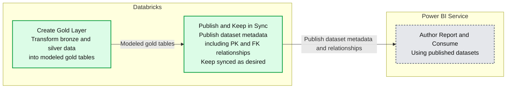

# Announcing General Availability: Publish to Microsoft Power BI Service from Unity Catalog

*Seamless catalog integration and data model sync*

- Source: https://www.databricks.com/blog/announcing-general-availability-publish-microsoft-power-bi-service-unity-catalog
- Published: 2024-10-28
- Authors: Can Efeoglu, Sachin Thakur, Jade Wang
- Categories: platform, announcements, platform-and-products-and-announcements, data-warehousing
- Images: 2 total, 1 extracted as architecture

We're excited to announce the General Availability of Publish to Microsoft Power BI Service from Unity Catalog, an integration that makes it easy to create Power BI web reports from your Unity Catalog data in just a few clicks. This feature enables seamless catalog integration and data model sync, allowing you to publish datasets directly to Power BI Service without leaving the Databricks UI. 

[Unity Catalog](https://www.databricks.com/product/unity-catalog) provides a single source of truth for your organization’s data and AI assets, providing open connectivity to any data source, unified governance with detailed lineage tracking, comprehensive monitoring, and support for open sharing and collaboration. This seamless integration with Power BI environments delivers actionable data intelligence across your organization, fostering a data-driven culture and enabling more informed decision-making.

## Seamless Integration with Unity Catalog and Power BI Service

With Publish to Power BI, you can now integrate Power BI dataset creation directly into your Databricks workflows and data pipelines. This eliminates the need to switch contexts between Databricks and Power BI Desktop, significantly simplifying the process of making your data available for visualization and analysis.

Publish to Power BI doesn't just transfer individual tables - it synchronizes entire schemas, including table relationships. This means your carefully crafted data model in Unity Catalog, complete with primary and foreign key relationships, is preserved when published to Power BI. This saves significant time and ensures consistency between your data lake and BI layer.

Native integration with Power BI and Microsoft Entra ID, provides best-in-class governance and observability.  Power BI semantic models can be configured to utilize OAuth with Single Sign-On, allowing individual user identities to flow into Unity Catalog and ensuring that permissions are honored for each dashboard query and audited end to end. This integration ensures seamless authentication, authorization, and data access control across your Databricks and Power BI environments, enhancing security and compliance

**Summary:** Databricks transforms bronze and silver data into modeled gold tables, publishes dataset metadata and relationships to Power BI Service, and keeps them synchronized for report authoring and consumption.

**Components:**
- Databricks: platform containing gold-layer creation and dataset publishing.
- Create Gold Layer: Databricks transformation of bronze and silver data into modeled gold tables.
- Publish and Keep in Sync: Databricks publishing of dataset metadata, including primary-key and foreign-key entity relationships.
- Power BI Service: Microsoft service for authoring reports and consuming published datasets.

**Flows:**
- Create Gold Layer -> Publish and Keep in Sync: modeled gold tables for dataset metadata publishing.
- Databricks publishing -> Power BI Service: published dataset metadata and entity relationships, synchronized as desired.

**Numbers:** none

source image: https://www.databricks.com/sites/default/files/inline-images/databricks-new-graphics-for-unity-catalog_V1-1.png?v=1729914432

**Key benefits include:**

- **Direct integration: **Publish datasets to Power BI right from within Databricks, at the end of your data pipelines.
- **No manual connection management:** Automatically handle connections and credentials, removing the need for manual setup.
- **Always up-to-date: **Easily push changes to underlying tables and their relationships automatically.
- **Single source of truth:** Define entity relationships once in Unity Catalog, and have them reflected in Power BI without duplication of effort.

## Streamlined Publishing Process: How It Works

Publishing a dataset to Power BI is now as simple as a few clicks:

1. Navigate to your desired schema or table in Unity Catalog
2. Click "Use with BI tools" or "Open in a dashboard"
3. Select "Publish to Power BI workspace"
4. Login to Power BI, choose your workspace and dataset options
5. Click "Publish to Power BI"

Within seconds, your dataset will be available in Power BI Online, ready for report creation and analysis.

Publish to Microsoft Power BI Service

## Looking Ahead: Upcoming Roadmap

We aim to improve the Publish to Power BI experience. Upcoming features include API-based publishing for dataset management and scheduling and enhanced admin capabilities for managing user-published datasets across workspaces.

## Get Started 

Publish to Power BI from Unity Catalog is now available to all Databricks customers. To get started, ensure you have the necessary permissions in both Databricks and Power BI, then navigate to your Unity Catalog data and look for the "Publish to Power BI" option.

For detailed instructions and best practices, check out our documentation ([AWS](https://docs.databricks.com/en/partners/bi/power-bi.html), [Azure](https://learn.microsoft.com/en-us/azure/databricks/partners/bi/power-bi), [GCP](https://docs.gcp.databricks.com/en/partners/bi/power-bi.html))

We're excited to see how this integration will accelerate your data analytics workflows and look forward to your feedback as we continue to enhance this feature.
