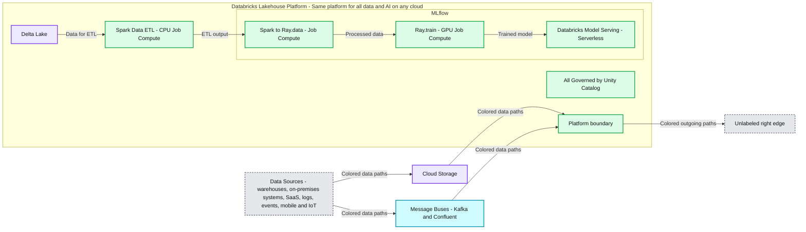

# Announcing General Availability of Ray on Databricks

*Leverage the functionality and power of Ray alongside optimized Apache Spark on Databricks*

- Source: https://www.databricks.com/blog/announcing-general-availability-ray-databricks
- Published: 2024-04-16
- Authors: Stephen Offer, Weichen Xu, Ben Wilson, Maheswaran Venkatachalam, Puneet Jain, Nitin Wagh, Howard Wu
- Categories: engineering, data-science-machine-learning
- Images: 1 total, 1 extracted as architecture

We released Ray support [public preview](https://www.databricks.com/blog/2023/02/28/announcing-ray-support-databricks-and-apache-spark-clusters.html) last year and since then, hundreds of Databricks customers have been using it for variety of use cases such as multi-model hierarchical forecasting, LLM finetuning, and Reinforcement learning. Today, we are excited to announce the general availability of Ray support on Databricks. Ray is now included as part of the Machine Learning Runtime starting from version 15.0 onwards, making it a first-class offering on Databricks. Customers can start a Ray cluster without any additional installations, allowing you to get started using this powerful framework within the integrated suite of products that Databricks has to offer, such as Unity Catalog, Delta Lake, MLflow, and Apache Spark

## A Harmonious Integration: Ray and Spark on Databricks

The general availability of Ray on Databricks expands the choice of running distributed ML AI workloads on Databricks and new Python workloads. It creates a cohesive ecosystem where logical parallelism and data parallelism thrive together. Ray complements Databricks' offerings by offering an additional, alternative logical parallelism approach to processing Python code that is not as heavily dependent on data partitioning as ML workloads that are optimized for Spark are.

One of the most exciting aspects of this integration lies in the interoperability with Spark DataFrames. Traditionally, transitioning data between different processing frameworks could be cumbersome and resource-intensive, often involving costly write-read cycles. However, with Ray on Databricks, the platform facilitates direct, in-memory data transfers between Spark and Ray, eliminating the need for intermediate storage or expensive data translation processes. This interoperability ensures that data can be manipulated efficiently in Spark and then passed seamlessly to Ray, all without leaving the data-efficient and computationally rich environment of Databricks.

> "At Marks & Spencer, forecasting is at the heart of our business, enabling use cases such as inventory planning, sales probing, and supply chain optimization. This requires robust and scalable pipelines to deliver our use cases. At M&S, we've harnessed the power of Ray on Databricks to experiment and deliver production-ready pipelines from model tuning, training, and prediction. This has enabled us to confidently deliver end-to-end pipelines using Spark's scalable data processing capabilities with Ray's scalable ML workloads." —Joseph Sarsfield, Senior ML Engineer, Marks and Spencer

## Empowering New Applications with Ray on Databricks

The integration between Ray and Databricks opens doors to a myriad of applications, each benefiting from the unique strengths of both frameworks:

- **Reinforcement Learning**: Deploying advanced models for autonomous vehicles and robotics, taking advantage of Ray's distributed computing using RLlib.
- **Distributed Custom Python Applications**: Scaling custom Python applications across clusters for tasks requiring complex computation.
- **Deep Learning Training**: Offering efficient solutions for deep learning tasks in computer vision and language models, leveraging Ray's distributed nature.
- **High-Performance Computing (HPC)**: Addressing large-scale tasks like genomics, physics, and financial calculations with Ray's capacity for high-performance computing workloads.
- **Distributed Traditional Machine Learning**: Enhancing the distribution of traditional machine learning models, like scikit-learn or forecasting models, across clusters.
- **Enhancing Python Workflows**: Distributing custom Python tasks previously limited to single nodes, including those requiring complex orchestration or communication between tasks.
- **Hyperparameter Search**: Providing alternatives to Hyperopt for hyperparameter tuning, utilizing Ray Tune for more efficient searches.
- **Leveraging the Ray Ecosystem**: Integrating with the expansive ecosystem of open-source libraries and tools within Ray, enriching the development environment.
- **Massively Parallel Data Processing**: Combining Spark and Ray to improve upon UDFs or foreach batch functions - ideal for processing non-tabular data like audio or video.

## Starting a Ray Cluster

Initiating a Ray cluster on Databricks is remarkably straightforward, requiring only a few lines of code. This seamless initiation, coupled with Databricks' scalable infrastructure, ensures that applications transition smoothly from development to production, leveraging both the computational power of Ray and the data processing capabilities of Spark on Databricks.

Starting from [Databricks Machine Learning Runtime 15.0](https://docs.databricks.com/en/release-notes/runtime/15.0ml.html#python-libraries), Ray is pre-installed and fully set up on the cluster. You can start a Ray cluster using the following code as guidance (depending on your cluster configuration, you will want to modify these arguments to fit the available resources on your cluster):

This approach starts a Ray cluster on top of the highly scalable and managed Databricks Spark cluster. Once started and available, this Ray cluster can seamlessly integrate with the other Databricks features, infrastructure, and tools that Databricks provides. You can also leverage enterprise features such as dynamic autoscaling, launching a combination of on-demand and spot instances, and cluster policies. You can easily switch from an interactive cluster during code authoring to a job cluster for long-running jobs.

To go from running Ray on a laptop to thousands of nodes on the cloud is just a matter of adding a few lines of code using the preceding **`setup_ray_cluster`** function. Databricks manages the scalability of the Ray cluster through the underlying Spark cluster and is as simple as changing the number of specified worker nodes and resources dedicated to the Ray cluster.

> "Over the past year and a half, we have extensively utilized Ray in our application. Our experience with Ray has been overwhelmingly positive, as it has consistently delivered reliable performance without any unexpected errors or issues. Its impact on our application's speed performance has been particularly noteworthy, with the implementation of Ray Cluster in Databricks playing a vital role in reducing processing times by at least half. In some instances, we have observed an impressive improvement of over 4X. All of this without any additional cost. Moreover, the Ray Dashboard has been invaluable in providing insights into memory consumption for each task, allowing us to make sure we have the optimized configuration for our application" —Juliana Negrini de Araujo, Senior Machine Learning Engineer, Cummins

## Enhancing Data Science on Databricks: Ray with MLflow and Unity Catalog

*Figure 1. Example Ray Train Pipeline on Databricks using MLflow*

**Summary:** Databricks combines Delta Lake, Spark ETL, Ray data processing and training, and serverless Model Serving with MLflow and Unity Catalog.

**Components:**

- Data Sources: Data Warehouses, On-premises Systems, SaaS Applications, Machine & Application Logs, Application Events, and Mobile & IoT Data.
- Cloud Storage: storage services represented by unlabeled provider icons.
- Message Buses: Kafka, Confluent, and additional unlabeled service icons.
- Databricks Lakehouse Platform: enclosing platform labeled “Same platform for all data and AI on any cloud.”
- Delta Lake: storage feeding Spark ETL.
- Spark Data ETL: CPU Job Compute.
- MLflow: enclosing area for Ray processing, training, and model serving.
- Spark -> Ray.data: Ray data processing on Job Compute.
- Ray.train: Ray training on GPU Job Compute.
- Databricks Model Serving: Serverless.
- Unity Catalog: governance across the platform, labeled “All Governed by Unity Catalog.”

**Flows:**

- Data Sources -> Cloud Storage: colored data paths.
- Data Sources -> Message Buses: colored data paths.
- Cloud Storage -> Databricks Lakehouse Platform: colored data paths entering the platform boundary.
- Message Buses -> Databricks Lakehouse Platform: colored data paths entering the platform boundary.
- Delta Lake -> Spark Data ETL: data for ETL.
- Spark Data ETL -> Spark -> Ray.data: ETL output for Ray data processing.
- Spark -> Ray.data -> Ray.train: processed data for training.
- Ray.train -> Databricks Model Serving: trained model for serving.
- Databricks Lakehouse Platform -> unlabeled right edge: colored paths leaving the platform with no named destination.

**Numbers:** none

source image: https://www.databricks.com/sites/default/files/inline-images/db-935-blog-img-1.jpg

Figure 1. Example Ray Train Pipeline on Databricks using MLflow

Databricks enhances data science workflows by integrating Ray with three key managed services: MLflow for lifecycle management, Unity Catalog for data governance, and Model Serving for MLOps. This integration streamlines the tracking, optimizing, and deploying of machine learning models developed with Ray, leveraging MLflow for seamless model lifecycle management. Data scientists can efficiently monitor experiments, manage model versions, and deploy models into production, all within Databricks' unified platform.

[Unity Catalog](https://www.databricks.com/product/unity-catalog) further supports this ecosystem by offering robust data governance, enabling clear lineage, and sharing machine learning artifacts created with Ray. This ensures data quality and compliance across all assets, fostering effective collaboration within secure and regulated environments.

Combining Unity Catalog and our Delta Lake integration with Ray allows for much wider and more comprehensive integration with the rest of the data and AI landscape. This gives Ray users and developers an unparalleled ability to integrate with more data sources than ever. Writing data that is generated from Ray applications to Delta Lake and Unity Catalog also allows for connecting to the vast ecosystem of data and business intelligence tools.

This combination of Ray, MLflow, Unity Catalog, and Databricks Model Serving on Databricks simplifies and accelerates the deployment of advanced data science solutions, providing a comprehensive, governed platform for innovation and collaboration in machine learning projects.

## Get Started with Ray on Databricks

The collaboration of Ray and Databricks is more than a mere integration; it offers a tight coupling of two frameworks that not only excel at their respective strengths but, when integrated together, offer a uniquely powerful solution to your AI development needs. This integration not only allows developers and data scientists to tap into the vast capabilities of Databricks' platform, including MLflow, Delta Lake, and Unity Catalog but also to integrate with Ray's computational efficiency and flexibility seamlessly. To learn more, see the full guide to [using Ray on Databricks](https://docs.databricks.com/en/machine-learning/ray-integration.html).
