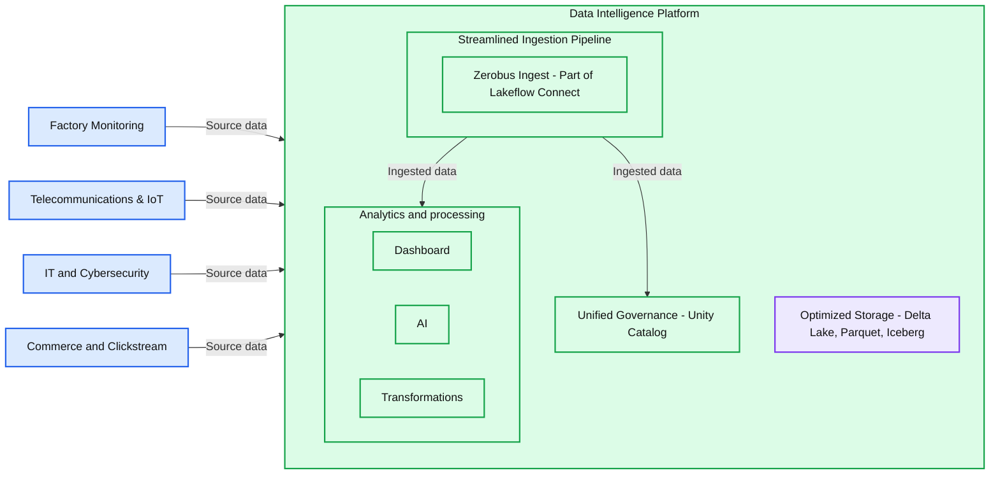

# Announcing General Availability of Zerobus Ingest

*Stream 10+ GB/sec to your lakehouse in under 5 seconds with zero infrastructure overhead*

- Source: https://www.databricks.com/blog/announcing-general-availability-zerobus-ingest-part-lakeflow-connect
- Published: 2026-02-23
- Authors: Victoria Bukta, Giselle Goicochea
- Categories: announcements, product, data-engineering, customers
- Images: 3 total, 2 extracted as architecture

**Key takeaways**

- Zerobus Ingest is now Generally Available (GA), providing a fully managed, serverless service that streams data directly into Delta tables—eliminating the need for intermediate message buses like Kafka.
- Teams can achieve sub-5-second latency while supporting thousands of concurrent clients and delivering up to 100 MB/sec per connection for over 10 GB/sec of aggregate throughput to a single table.
- This GA launch includes production-ready gRPC API and REST APIs (Beta), plus SDKs for Python, Java, Rust, Go, and TypeScript, enabling integration from any application.

As organizations scale real-time operational intelligence, traditional streaming architectures have become costly bottlenecks. Managing message buses like Kafka and handling schema registries and connector frameworks creates a significant “complexity tax” that diverts high-value engineering resources from strategic business initiatives. Meanwhile, duplicate storage inflates cloud bills and multi-hop architectures delay critical insights. Finally, data in transit often sits outside centralized governance frameworks, creating compliance risks and lineage blind spots. 

## Introducing Zerobus Ingest: Near Real-Time Streaming to the Lakehouse

Today, we’re excited to announce the General Availability of [**Zerobus Ingest**](https://www.databricks.com/product/data-engineering/lakeflow-connect/zerobus-ingest), part of [Lakeflow Connect](https://www.databricks.com/product/data-engineering/lakeflow-connect). Zerobus Ingest is a fully managed, serverless service that streams data directly into governed Delta tables, removing intermediate layers to deliver a simplified, high-performance architecture. 

By enabling data to flow directly from producers to the lakehouse, Zerobus Ingest slashes costs and eliminates tool sprawl. It also delivers high performance at scale, supporting thousands of concurrent connections and achieving over 10GB/second of aggregate throughput to a table in under 5 seconds. 

### The Single-Sink Advantage: Simplified Architecture for Major Cost Reduction

Traditional message buses like Kafka were designed as multi-sink architectures: universal hubs that route data to dozens of independent consumers. However, this flexibility can come at a steep cost when your sole destination is the lakehouse. Zerobus Ingest uses a fundamentally different approach, with a single-sink architecture optimized for a single job: pushing data directly to the lakehouse. 

This architectural choice eliminates complexity and drastically reduces cost:

- **No brokers** to scale as your data volume grows
- **No partitions** to tune for optimal performance
- **No consumer groups **to monitor and debug
- **No cluster upgrades** to plan and execute
- **No specialized expertise**, such as Kafka, is required on your team  

With Zerobus Ingest, there’s a single, managed Databricks endpoint. Create your table in Unity Catalog, start writing data with the API or SDK, and you’re done. That’s it, nothing else to set up. The serverless architecture automatically scales up to support gigabytes-per-second ingestion without any configuration changes. 

**Zerobus Ingest allows data producers to bypass the message bus and push events directly into managed Delta tables in your Lakehouse. **

Zerobus Ingest simplifies the traditional streaming architecture from five managed systems down to two components, eliminating multiple failure points, reducing operational overhead and removing the need for specialized expertise.

- **Traditional architecture: **Source systems → Message Bus (Kafka Cluster) with a Schema Registry → Connectors → Lakehouse
- **Zerobus Ingest architecture: **Source systems → Zerobus Ingest → Lakehouse

By eliminating the intermediate message bus, you remove two major cost centers: the compute and storage for the bus itself, and the dedicated engineering time needed to manage it. Zerobus Ingest offers ingestion at a fraction of the cost per gigabyte compared to running and maintaining a self-managed Kafka cluster.

**Zerobus Ingest offers ingestion at a fraction of the cost per gigabyte compared to running and maintaining a self-managed Kafka cluster.**

Learn more about how Zerobus works in this [deep dive Databricks Community blog](https://community.databricks.com/t5/technical-blog/deep-dive-on-zerobus-ingest-now-ga/ba-p/148385) or in the [documentation](https://docs.databricks.com/aws/en/ingestion/zerobus-overview).

### Supported Interfaces and Native Integration

Developers can integrate via gRPC and REST APIs, or use language-specific SDKs. Zerobus Ingest provides a broad set of push-based interfaces for industry-specific integrations, making it a flexible, single tool that simplifies ingestion.

- **gRPC API: **Recommended for high-performance applications requiring the lowest latency and highest throughput.
- **REST API (Beta):** Ideal for webhooks, serverless functions, and languages where gRPC support may be limited.
- **SDKs: **Production-ready libraries for Python, Java, Rust, Go, and TypeScript simplify authentication and batching logic utilizing gRPC.
- **Open Telemetry (Beta): **Bring your operational logs, metrics, and traces into the Lakehouse for long-term historical analysis with just a config change. Learn more about the Open Telemetry ecosystem [here](https://opentelemetry.io/ecosystem/).

Learn more about the [differences between REST and gRPC](https://docs.databricks.com/aws/en/ingestion/zerobus-ingest).

Also, since every write is governed by Unity Catalog, you get automatic lineage tracking and fine-grained access control from the moment data is created—ensuring your streaming data has unified governance with the rest of your lakehouse. 

## Driving Customer Breakthroughs: Exponentially Faster Insights at Scale 

### Real-Time Manufacturing Monitoring for Toyota Motor Corporation

Toyota sought a unified solution to instantly process telemetry from thousands of factory devices, without the latency and complexity of traditional IoT architectures. 

> "Zerobus Ingest allows us to detect overheating factory conditions in minutes rather than hours, directly supporting our carbon-neutrality strategy and operational efficiency. But it's not just about tracking temperature telemetry; having Zerobus Ingest as an additional data ingestion option gives us the ability to collect diverse factory data in near real-time and trigger immediate countermeasures that have transformed our operations.” —Kento Izumi, General Manager, Digital Transformation Promotion Division, Toyota Motor Corporation

Instead of stitching together multiple cloud services, Toyota uses Zerobus Ingest, integrated with global IoT connectivity from [Soracom](https://soracom.io/beam/), to mitigate the high maintenance costs of real-time operations, transform its manufacturing operations, and support its sustainability goals.

**Summary:** Devices send IoT data through Soracom Beam for cloud gateway and protocol conversion functions, then through Zerobus Ingest into Databricks.

**Components:**
- Devices: Sensors, MicroController, and Wireless.
- Soracom Beam: Cloud Gateway and Protocol Conversion.
- Zerobus Ingest: Ingestion connection from Soracom Beam to Databricks.
- Databricks: Platform containing Stream Processing, Data Lakehouse, Analytics, and Delta Lake.
- Stream Processing: Processing capability within Databricks.
- Data Lakehouse: Lakehouse storage within Databricks.
- Analytics: Analytics capability within Databricks.
- Delta Lake: Storage technology within Databricks.

**Flows:**
- Devices -> Soracom Beam: IoT device data.
- Soracom Beam -> Databricks: Data through Zerobus Ingest.

**Numbers:** none

source image: https://www.databricks.com/sites/default/files/inline-images/Updated-Diagram.png

```mermaid
%% Devices send data through Soracom Beam and Zerobus Ingest into Databricks
flowchart LR
    D["Devices<br/>Sensors<br/>MicroController<br/>Wireless"]
    S["SORACOM BEAM<br/>Cloud Gateway<br/>Protocol Conversion"]
    subgraph DB["DATABRICKS"]
        P["Stream Processing"]
        L["Data Lakehouse"]
        A["Analytics"]
        DL["Delta Lake"]
    end

    D -->|IoT device data| S
    S -->|Zerobus Ingest| DB

    classDef client fill:#dbeafe,stroke:#2563eb,stroke-width:2px,color:#111
    classDef service fill:#dcfce7,stroke:#16a34a,stroke-width:2px,color:#111
    classDef store fill:#ede9fe,stroke:#7c3aed,stroke-width:2px,color:#111
    classDef cache fill:#fef3c7,stroke:#d97706,stroke-width:2px,color:#111
    classDef queue fill:#cffafe,stroke:#0891b2,stroke-width:2px,color:#111
    classDef critical fill:#fee2e2,stroke:#dc2626,stroke-width:4px,color:#111
    classDef external fill:#e5e7eb,stroke:#6b7280,stroke-width:2px,color:#111,stroke-dasharray:4 3
    classDef decision fill:#fce7f3,stroke:#db2777,stroke-width:2px,color:#111

    class D client
    class S external
    class DB,P,A service
    class L,DL store
```

**IoT Data Pipeline Architecture: From Edge to Analytics Platform with Zerobus Ingest and Soracom Beam**

Izumi also explained that they are able to accelerate their operational efficiency, “When combined with 'vista,' our unified data and AI platform powered by Databricks, we aren't just collecting data faster; we are optimizing our data operations."

### Joby Aviation: Accelerating Flight Performance Analysis From Days to Minutes

An early adopter of Zerobus Ingest, Joby Aviation streams gigabytes of aircraft telemetry every minute directly to the lakehouse, enabling their engineering teams to analyze flight performance in near real-time. [Read the Joby Aviation case study](https://www.databricks.com/customers/joby/lakeflow-connect).

> "Zerobus Ingest reduced our telemetry resolution latency from days to minutes. This allows our engineering teams to analyze flight performance in near real-time and accelerate our mission to transform transportation." —Dominik Müller, Factory Systems Lead, Joby Aviation

## Powering Industry Use Cases

Traditional infrastructure slows down real-time operations. By removing the complexity of intermediate message buses, Zerobus Ingest creates a direct, sub-5-second path to value across industries.

**Summary:** Zerobus Ingest connects four industry source categories to the Databricks Data Intelligence Platform for analytics, AI, transformations, governance, and optimized storage.

**Components:**
- Factory Monitoring: factory equipment sources; technology unspecified.
- Telecommunications & IoT: telecommunications and connected-device sources; technology unspecified.
- IT and Cybersecurity: IT and security sources; technology unspecified.
- Commerce and Clickstream: commerce and interaction sources; technology unspecified.
- Data Intelligence Platform: platform containing ingestion, processing, governance, and storage capabilities.
- Streamlined Ingestion Pipeline: ingestion boundary containing Zerobus Ingest.
- Zerobus Ingest: ingestion service, part of Lakeflow Connect.
- Dashboard: dashboard capability; technology unspecified.
- AI: artificial intelligence capability; technology unspecified.
- Transformations: data transformation capability; technology unspecified.
- Unified Governance: Unity Catalog.
- Optimized Storage: Delta Lake, Parquet, and Iceberg.

**Flows:**
- Factory Monitoring -> Data Intelligence Platform: source data through a shared incoming connection.
- Telecommunications & IoT -> Data Intelligence Platform: source data through a shared incoming connection.
- IT and Cybersecurity -> Data Intelligence Platform: source data through a shared incoming connection.
- Commerce and Clickstream -> Data Intelligence Platform: source data through a shared incoming connection.
- Streamlined Ingestion Pipeline -> Dashboard, AI, and Transformations group: ingested data through the upper branch.
- Streamlined Ingestion Pipeline -> Unified Governance: ingested data through the lower branch.

**Numbers:** none

source image: https://www.databricks.com/sites/default/files/inline-images/zerobus_ingest_industry_usecases.png

**Accelerate your digital transformation by pushing data from any source across industries directly to your lakehouse.**

**Manufacturing: Maximize factory floor efficiency.** Use the Zerobus Ingest SDKs to build custom forwarding agents that stream massive sensor volumes to the Lakehouse. This optimizes machine performance by eliminating heavy network infrastructure overhead.

**Telecommunications and IoT: Monitor global networks at scale.** Deployed at the edge, Zerobus Ingest pipes telemetry from your network to the lakehouse to track your network load in near real-time. Our partnership with Soracom expands integration with secure, reliable global IoT data ingestion through cellular, satellite, and LPWAN networks.

**IT and Cybersecurity: Identify threats without the ETL delay.** Bypass complex pipelines by streaming logs and behavioral events directly to the Lakehouse. This enables threat detection within seconds, adaptive model retraining, and faster incident response.

**Commerce and Clickstream: Personalize experiences in near real-time. **Capture high-volume clickstream data from apps and devices with minimal infrastructure overhead. This enables instant data availability to power personalization engines, A/B testing, and conversion optimization.

## Availability

Zerobus Ingest is now **Generally Available **on AWS and Microsoft Azure, with Google Cloud Platform support coming soon. [Pricing](https://www.databricks.com/product/pricing/lakeflow-connect) is volume-based under the **Lakeflow Jobs Serverless **SKU.

As part of the GA launch, we are introducing a **6-month promotional pricing period**. Learn more at the [Lakeflow Connect pricing page](https://www.databricks.com/product/pricing/lakeflow-connect). 

## Getting Started with Zerobus Ingest

Ready to eliminate streaming infrastructure complexity? With just a few lines of code, you can begin streaming data directly to your Unity Catalog-governed tables, ensuring your data is ready the moment it arrives to help deliver insights.

Check out the following Zerobus Ingest resources to get started today:

- **Try Zerobus Ingest Now: **Access the [documentation and quickstart guides](https://docs.databricks.com/aws/en/ingestion/zerobus-overview).
- **Take Product Tour: **[Navigate](https://www.databricks.com/resources/demos/tours/lakeflow/connector/zerobus-ingest) through Zerobus Ingest and learn how to get started ingesting data.
- **Build an End-to-End Application: **A real-time sailing simulator tracks a fleet of sailboats using Python SDK and the REST API, with Databricks Apps and Declarative Automation Bundles. [Read the blog](https://community.databricks.com/t5/technical-blog/data-drifter-charting-the-course-from-data-collection-to/ba-p/148397).
- **Build a Digital Twins Solution:** Learn how to maximize operational efficiency, accelerate real-time insight and predictive maintenance with Databricks Apps and Lakebase. [Read the blog](https://www.databricks.com/blog/how-build-digital-twins-operational-efficiency).
