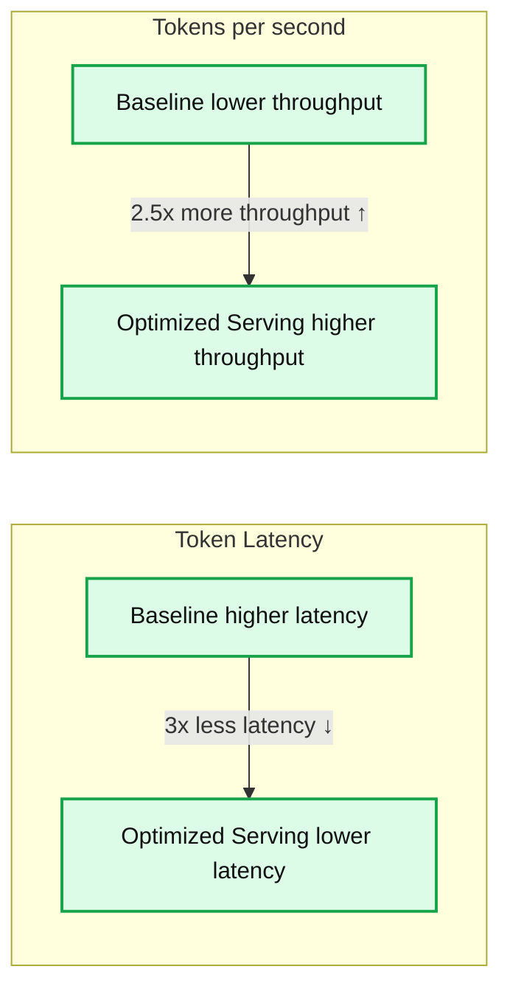
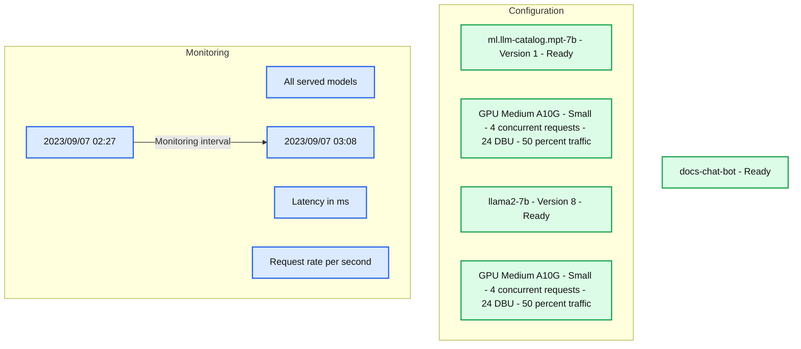

# Deploy Private LLMs using Databricks Model Serving

- Source: https://www.databricks.com/blog/announcing-gpu-and-llm-optimization-support-model-serving
- Published: 2023-09-28
- Authors: Ahmed Bilal, Ankit Mathur, Kasey Uhlenhuth, Joshua Hartman
- Categories: engineering, data-science-machine-learning
- Images: 2 total, 2 extracted as architecture

We are excited to announce public preview of GPU and LLM optimization support for Databricks Model Serving! With this launch, you can deploy open-source or your own custom AI models of any type, including LLMs and Vision models, on the Lakehouse Platform. Databricks Model Serving automatically optimizes your model for LLM Serving, providing best-in-class performance with zero configuration.

Databricks Model Serving is the first serverless GPU serving product developed on a unified data and AI platform. This allows you to build and deploy GenAI applications from data ingestion and fine-tuning, to model deployment and monitoring, all on a single platform.

## Build Generative AI Apps with Databricks Model Serving

>  "With Databricks Model Serving, we are able to integrate generative AI into our processes to improve customer experience and increase operational efficiency. Model Serving allows us to deploy LLM models while retaining complete control over our data and model." —Ben Dias, Director of Data Science and Analytics at easyJet - [Learn more](http://www.databricks.com/blog/easyjet-bets-on-databricks-lakehouse-for-gen-ai)

### Securely host AI models without worrying about Infrastructure Management

Databricks Model Serving provides a single solution to deploy any AI model without the need to understand complex infrastructure. This means you can deploy any natural language, vision, audio, tabular, or custom model, regardless of how it was trained - whether built from scratch, sourced from open-source, or fine-tuned with proprietary data. Simply log your model with MLflow, and we will automatically prepare a production-ready container with GPU libraries like CUDA and deploy it to serverless GPUs. Our fully managed service will take care of all the heavy lifting for you, eliminating the need to manage instances, maintain version compatibility, and patch versions. The service will automatically scale instances to meet traffic patterns, saving infrastructure costs while optimizing latency performance.

> "Databricks Model Serving is accelerating our capability to infuse intelligence into a diverse array of use cases, ranging from meaningful semantic search applications to predicting media trends. By abstracting and simplifying the intricate workings of CUDA and GPU server scaling, Databricks allows us to focus on our real areas of expertise, namely expanding Condé Nast’s use of AI across all our applications without the hassle and burden of infrastructure" —Ben Hall, Sr. ML Engr at Condé Nast

### Reduce Latency and Cost with Optimized LLM Serving

Databricks Model Serving now includes optimizations for efficiently serving large language models, reducing latency and cost by up to 3-5x. Using Optimized LLM Serving is incredibly easy: just provide the model along with its OSS or fine-tuned weights, and we'll do the rest to ensure the model is served with optimized performance. This enables you to focus on integrating LLM into your application instead of writing low-level libraries for model optimizations. Databricks Model Serving automatically optimizes the  MPT and Llama2 class of models, with support for more models forthcoming.

*Note: Benchmarked on llama2-13b with input_tokens=512, output_tokens=64 on Nvidia 4xA10*

**Summary:** Optimized Serving delivers 3x less token latency and 2.5x more tokens per second than the baseline.

**Components:**
- Token Latency: compares Baseline and Optimized Serving; underlying technologies are not specified.
- Tokens per second: compares Baseline and Optimized Serving; underlying technologies are not specified.

**Flows:**
- Higher token latency -> Lower token latency: downward arrow indicates 3x less latency.
- Lower throughput -> Higher throughput: upward arrow indicates 2.5x more throughput.
- These arrows indicate performance changes, not data flows.

**Numbers:**
- 3x less latency.
- 2.5x more throughput.
- Throughput unit: tokens per second.
- No absolute values or latency units are shown.

source image: https://www.databricks.com/sites/default/files/inline-images/db-740-blog-img-1.png

Note: Benchmarked on llama2-13b with input_tokens=512, output_tokens=64 on Nvidia 4xA10

### Accelerate Deployments through Lakehouse AI Integrations

When productionizing LLMs, it's not just about deploying models. You also need to supplement the model using techniques such as retrieval augmented generation (RAG), parameter-efficient fine-tuning (PEFT), or standard fine-tuning. Additionally, you need to evaluate the quality of the LLM and continuously monitor the model for performance and safety. This often results in teams spending substantial time integrating disparate tools, which increases operational complexity and creates maintenance overhead.

Databricks Model Serving is built on top of a unified data and AI platform enabling you to manage the entire LLMOps, from data ingestion and fine tuning to deployment and monitoring, all on a single platform, creating a consistent view across the AI lifecycle that accelerates deployment and minimizes errors. Model Serving integrates with various LLM services within the [Lakehouse](https://www.databricks.com/blog/lakehouse-ai), including:

- **Fine-tuning**: Improve accuracy and differentiate by fine-tuning foundational models with your proprietary data directly on Lakehouse.
- **AI Search Integration**: Integrate and seamlessly perform vector search for retrieval augmented generation and semantic search use cases. Sign up for preview [here](https://docs.google.com/forms/d/e/1FAIpQLSeeIPs41t1Ripkv2YnQkLgDCIzc_P6htZuUWviaUirY5P5vlw/viewform).
- **Built-in LLM Management**: Integrated with Databricks AI Gateway as a central API layer for all your LLM calls.
- **MLflow**: Evaluate, compare, and manage LLMs via MLflow’s PromptLab.
- **Quality & Diagnostics**: Automatically capture requests and responses in a Delta table to monitor and debug models. You can additionally combine this data with your labels to generate training datasets through our partnership with [Labelbox](https://docs.databricks.com/en/partners/ml/labelbox.html).
- **Unified governance**: Manage and govern all data and AI assets, including those consumed and produced by Model Serving, with Unity Catalog.

**Summary:** The docs-chat-bot serving endpoint splits traffic equally between two ready models using A10G GPUs and displays latency and request-rate metrics.

**Components:**
- docs-chat-bot: Databricks serving endpoint, marked Ready.
- ml.llm-catalog.mpt-7b: Version 1, deployed as ml-llm-catalog-mpt-7b-1, marked Ready.
- llama2-7b: Version 8, deployed as llama2-7b-8, marked Ready.
- Compute for each model: GPU Medium using A10G, Small concurrency configuration.
- Metrics: All served models filter, time-range selector, latency chart, and request-rate chart.
- Management controls: Permissions, Query endpoint, and Edit configuration.
- Monitoring tabs: Metrics, Events, and Logs.

**Flows:**
- 2023/09/07 02:27 -> 2023/09/07 03:08: selected monitoring interval. No system-flow arrows are visible.

**Numbers:**
- Model identifiers: ml.llm-catalog.mpt-7b; ml-llm-catalog-mpt-7b-1; llama2-7b; llama2-7b-8.
- Versions: 1 and 8.
- Each model: GPU Medium, A10G, Small, 4 concurrent requests, 24 DBU.
- Traffic: 50% per model.
- Monitoring interval: 2023/09/07 02:27 to 2023/09/07 03:08.
- Latency axis, milliseconds: 2000.00, 3000.00, 4000.00, 5000.00.
- Request-rate axis, per second: 0.06, 0.08, 0.10, 0.12, 0.14.
- Endpoint URL: https://e2-dogfood.staging.cloud.databricks.com/serving-endpoints/docs-chat-bot/invocations.

source image: https://www.databricks.com/sites/default/files/inline-images/db-740-blog-img-2.png

### Bring Reliability and Security to LLM Serving

Databricks Model Serving provides dedicated compute resources that enable inference at scale, with full control over the data, model, and deployment configuration. By getting dedicated capacity in your chosen cloud region, you benefit from low overhead latency, predictable performance, and SLA-backed guarantees. Additionally, your serving workloads are protected by multiple layers of security, ensuring a secure and reliable environment for even the most sensitive tasks. We have implemented several controls to meet the unique compliance needs of highly regulated industries. For further details, please visit [this page](https://www.databricks.com/trust) or contact your Databricks account team.

## Getting Started with GPU and LLM Serving

- Take it for a spin! Deploy your first LLM on Databricks Model Serving by reading the getting started tutorial ([AWS](https://docs.databricks.com/en/machine-learning/model-serving/llm-optimized-model-serving.html) | [Azure](https://learn.microsoft.com/azure/databricks/machine-learning/model-serving/llm-optimized-model-serving)).
- Dive deeper into the Databricks Model Serving [documentation](https://docs.databricks.com/en/machine-learning/model-serving/index.html).
- Learn more about Databricks' approach to Generative AI [here](https://www.databricks.com/blog/lakehouse-ai).
- [Generative AI Engineer Learning Pathway](https://www.databricks.com/blog/databricks-announces-industrys-first-generative-ai-engineer-learning-pathway-and-certification): take self-paced, on-demand and instructor-led courses on Generative AI
