# Announcing Databricks AI Search General Availability in Databricks

- Source: https://www.databricks.com/blog/announcing-mosaic-ai-vector-search-general-availability-databricks
- Published: 2024-05-21
- Authors: Sergei Tsarev, Oliver Chiu
- Categories: data-science-machine-learning
- Images: 3 total, 1 extracted as architecture

Following the [announcement](https://www.databricks.com/blog/production-quality-rag-applications-databricks) we made around a suite of tools for Retrieval Augmented Generation, today we are thrilled to announce the general availability of [Databricks AI Search](https://docs.databricks.com/en/generative-ai/vector-search.html) in Databricks.

## **What is Databricks AI Search?**

AI Search enables developers to improve the accuracy of their [Retrieval Augmented Generation (RAG)](https://www.databricks.com/glossary/retrieval-augmented-generation-rag) and generative AI applications through similarity search over unstructured documents such as PDFs, Office Documents, Wikis, and more. This enriches the LLM queries with context and domain knowledge, improving accuracy, and quality of results.

AI Search is part of the Databricks Data + AI Platform, making it easy for your RAG and Generative AI applications to use the proprietary data stored in your data lakes in a fast and secure manner and deliver accurate responses. Unlike other databases, AI Search supports automatic data synchronization from source to index, eliminating complex and costly pipeline maintenance. It leverages the same security and data governance tools organizations have already built for peace of mind. With its serverless design, Databricks AI Search easily scales to support up to 1 billion embeddings per endpoint with a range of 30-200 queries per second.

## Why do customers love AI Search?

> "Ford Direct needed to create a unified chatbot to help our dealers assess their performance, inventory, trends, and customer engagement metrics. AI Search allowed us to integrate our proprietary data and documentation into our Generative AI solution that uses retrieval-augmented generation (RAG).  The integration of AI Search with Databricks Delta Tables and Unity Catalog made it seamless to our vector indexes real-time as our source data is updated, without needing to touch/re-deploy our deployed model/application." - Tom Thomas, VP of Analytics

We designed AI Search to be fast, secure and easy to use.

- **Fast with low TCO -  **AI Search is designed to deliver high performance at lower TCO, with up to 5x faster performance than other providers.
- **Automated data ingestion - **AI Search makes it possible to synchronize any Delta Table into a vector index with 1-click. There is no need for complex, custom built data ingestion/sync pipelines.
- **Built-in Governance** - AI Search uses the same Unity Catalog-based security and data governance tools that already power your Data + AI Platform, meaning you do not have to build and maintain a separate set of data governance policies for your unstructured data.
- **Best-in-class retrieval quality - **AI Search has been engineered to provide the highest recall out of the box compared to other providers.
- **Serverless Scaling** - Our serverless infrastructure automatically scales to your workflows without the need to configure instances and server types. 

> Corning is a materials science company where our glass and ceramics technologies are used in many industrial and scientific applications. We built an AI research assistant using Databricks to index 25M documents of US patent office data. Having the LLM-powered assistant respond to questions with high accuracy was extremely important to us so our researchers could find and further the tasks they were working on. To implement this, we used AI Search to augment a LLM with the US patent office data. The Databricks solution significantly improved retrieval speed, response quality, and accuracy.  - Denis Kamotsky, Principal Software Engineer, Corning

## Automated Data Ingestion

Before a vector database can store information, it requires a data ingestion pipeline where raw, unprocessed data from various sources need to be cleaned, processed (parsed/chunked), and embedded with an AI model before it is stored as vectors in the database.  This process to build and maintain another set of data ingestion pipelines is expensive and time-consuming, taking time from valuable engineering resources.  AI Search is fully integrated with the Databricks Data + AI Platform, enabling it to automatically pull data and embed that data without needing to build and maintain new data pipelines. 

Our Delta Sync APIs automatically synchronize source data with vector indexes. As source data is added, updated, or deleted, we automatically update the corresponding vector index to match. Under the hood, AI Search manages failures, handles retries, and optimizes batch sizes to provide you with the best performance and throughput without any work or input.  These optimizations reduce your total cost of ownership due to increased utilization of your embedding model endpoint.

## Built-In Governance

Enterprise organizations require stringent security and access controls over their data so users cannot use Generative AI models to give them confidential data they shouldn’t have access to. However, current Vector databases either do not have robust security and access controls or require organizations to build and maintain a separate set of security policies separate from their data platform. Having multiple sets of security and governance adds cost and complexity and is error-prone to maintain reliably.

Databricks AI Search leverages the same security controls and data governance that already protects the rest of the Data + AI Platform enabled by integration with Unity Catalog. The vector indexes are stored as entities within your Unity catalog and leverage the same unified interface to define policies on data, with fine-grained control on embeddings. 

## Best in Class Retrieval Quality

In any Retrieval-Augmented Generation (RAG) application, the cornerstone of delivering relevant and precise answers lies in the retrieval quality of the underlying search engine. Central to evaluating this quality is the metric known as recall. Recall measures the ability of the search engine to retrieve all relevant documents from a dataset. High recall ensures that no critical information is omitted, making it indispensable especially in domains where completeness of information is paramount, such as legal research, medical inquiries, and technical support.

Recall is particularly critical in RAG applications because these systems rely on retrieving the most relevant documents to generate accurate and contextually appropriate responses. If a search engine has low recall, it risks missing crucial documents, which can lead to incomplete or incorrect answers. This is why ensuring high recall is not just a technical requirement, but a fundamental aspect of building trust and reliability in RAG applications.

Databricks AI Search has been engineered to provide the highest recall out of the box compared to other providers. Our vector search leverages state-of-the-art machine learning models, optimized indexing strategies, and advanced query understanding techniques to ensure that every search captures the complete range of relevant documents. This capability sets AI Search apart, offering our users an unmatched level of retrieval quality that enhances the overall effectiveness of their RAG applications. 

By prioritizing high recall, we enable more accurate, reliable, and contextually enriched responses, thereby enhancing user satisfaction and trust in the applications powered by our technology.

**Summary:** Databricks achieves recall of 0.91 at K=10, compared with 0.87 for Service 1 and 0.84 for Service 2, with higher values indicating better retrieval quality.

**Components:**
- Databricks: red bar; underlying technology unspecified.
- Service 1: blue bar; underlying technology unspecified.
- Service 2: green bar; underlying technology unspecified.
- Retrieval Quality: benchmark title.
- Recall@K=10: metric, labeled Higher is better.
- recall: axis label.

**Flows:**
- none. No arrows are visible.

**Numbers:**
- K=10.
- Databricks recall: 0.91.
- Service 1 recall: 0.87.
- Service 2 recall: 0.84.
- Recall axis ticks: 0.75, 0.80, 0.85, 0.90, 0.95.
- Service identifiers: 1 and 2.

```mermaid
%% Retrieval quality comparison using Recall at K=10 with higher values better
flowchart TD
    T[Retrieval Quality]
    M[Recall at K=10 - Higher is better]
    D[Databricks - recall 0.91 - red bar]
    S1[Service 1 - recall 0.87 - blue bar]
    S2[Service 2 - recall 0.84 - green bar]
    X[recall axis - 0.75, 0.80, 0.85, 0.90, 0.95]

    classDef client fill:#dbeafe,stroke:#2563eb,stroke-width:2px,color:#111
    classDef service fill:#dcfce7,stroke:#16a34a,stroke-width:2px,color:#111
    classDef store fill:#ede9fe,stroke:#7c3aed,stroke-width:2px,color:#111
    classDef cache fill:#fef3c7,stroke:#d97706,stroke-width:2px,color:#111
    classDef queue fill:#cffafe,stroke:#0891b2,stroke-width:2px,color:#111
    classDef critical fill:#fee2e2,stroke:#dc2626,stroke-width:4px,color:#111
    classDef external fill:#e5e7eb,stroke:#6b7280,stroke-width:2px,color:#111,stroke-dasharray:4 3
    classDef decision fill:#fce7f3,stroke:#db2777,stroke-width:2px,color:#111
    class T,M,X decision
    class D service
    class S1,S2 external
```

source image: https://www.databricks.com/sites/default/files/inline-images/image3_20.png?v=1715352860

## **Next Steps**

Get started by reading our [documentation](https://docs.databricks.com/generative-ai/vector-search.html) and specifically [creating a AI Search index](https://docs.databricks.com/generative-ai/create-query-vector-search.html)

Read more about AI Search [pricing](https://www.databricks.com/product/pricing/vector-search)

Starting deploying [your own RAG application](https://www.databricks.com/resources/demos/tutorials/data-science-and-ai/lakehouse-ai-deploy-your-llm-chatbot) (demo)

[Generative AI Engineer Learning Pathway](https://www.databricks.com/blog/databricks-announces-industrys-first-generative-ai-engineer-learning-pathway-and-certification): take self-paced, on-demand and instructor-led courses on Generative AI

Read the summary [announcements](https://www.databricks.com/blog/production-quality-rag-applications-databricks) we made earlier
