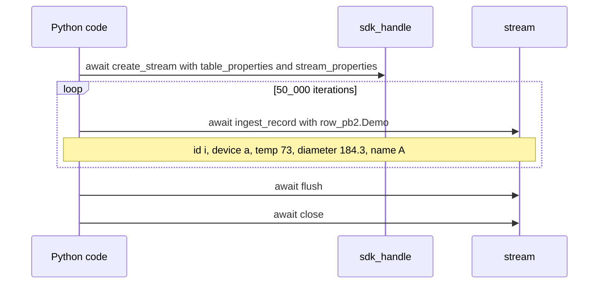
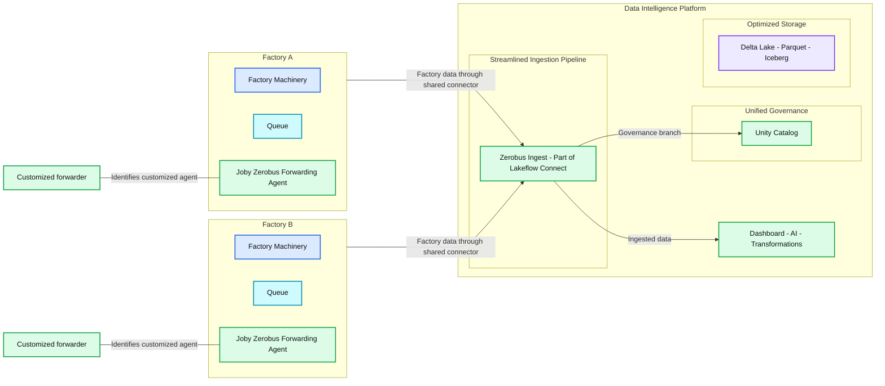

# Announcing the Public Preview of Zerobus Ingest

*Streamline event data ingestion with a direct path from source to Delta tables, no message bus required*

- Source: https://www.databricks.com/blog/announcing-public-preview-zerobus-ingest
- Published: 2025-10-30
- Authors: Victoria Bukta, Giselle Goicochea, Elise Georis
- Categories: announcements, data-engineering, tech, manufacturing, customers
- Images: 3 total, 2 extracted as architecture

**Key takeaways**

- Zerobus Ingest is a managed service that streams event data directly into the lakehouse, removing message bus complexity and enabling near real-time, scalable ingestion.
- Learn how Zerobus Ingest powers diverse use cases across industries—from manufacturing and IoT at Joby Aviation to telecommunications and IoT through our partnership with Soracom, and many more.
- Access the Public Preview, explore step-by-step tutorials and Solution Accelerators to see it in action.

[**Zerobus Ingest**](https://docs.databricks.com/aws/en/ingestion/lakeflow-connect/zerobus-overview), part of [**Lakeflow Connect**](https://www.databricks.com/product/data-engineering/lakeflow-connect), provides a streamlined way to push event data directly into the lakehouse, eliminating the single-sink message bus layer entirely. By reducing infrastructure, simplifying operations, and delivering near real-time ingestion at scale, Zerobus Ingest makes it easier than ever to unlock the value of your event data.

Traditionally, organizations use message buses like Kafka as a transport layer. While Kafka provides durability and low latency, it introduces a two-hop architecture: data is first written to Kafka, then pulled into the lakehouse with Spark Declarative Pipelines (SDP). This adds infrastructure, duplicates data, and demands specialized tools and expertise, all of which can make debugging harder. The outcome is higher costs, slower delivery, and more operational overhead—especially when the sole destination is the lakehouse.

**Summary:** The code creates a stream, asynchronously ingests 50,000 records, flushes the stream, and closes it.

**Components:**
- `sdk_handle`: Python SDK handle used to create a stream.
- `table_properties`, `stream_properties`: Stream creation arguments.
- `stream`: Object exposing asynchronous ingestion, flush, and close methods.
- `row_pb2.Demo`: Record constructor with `id`, `payload`, and `name` fields.

**Flows:**
- No arrows are visible. The code executes stream creation, repeated record ingestion, flushing, and closing in order.

**Numbers:**
- `50_000`: Iteration count.
- `73`: Payload temperature value; no unit shown.
- `184.3`: Payload diameter value; no unit shown.
- `2`: Appears in the identifier `row_pb2`.

source image: https://www.databricks.com/sites/default/files/inline-images/zerobus-code-snippet.png

**With just a few lines of code, Zerobus Ingest enables you to create a stream and start pushing your data directly to your lakehouse.**

## Performance at scale, simplified architecture

Event data powers critical real-time analytics and AI applications. From clickstreams and telemetry to IoT sensor data, organizations depend on fast, reliable pipelines to make decisions in seconds, not hours. Zerobus Ingest is designed for performance at scale, delivering latency as low as five seconds, throughput up to 100 MB/sec per connection, and support for thousands of concurrent clients writing to the same table.

By eliminating data hops, redundant copies, and external message buses, Zerobus simplifies infrastructure and reduces operational overhead for event data ingestion. Fully unified with the Databricks Data + AI Platform, Zerobus writes natively to Delta tables, integrates with Unity Catalog for security and governance, and connects seamlessly with analytics and AI tools.

**Zerobus Ingest Interfaces and SDKs:**
Databricks supports an expanded set of interfaces to streamline ingestion and provides an SDK that allows you to build customized high-throughput applications using Zerobus Ingest. There is also support for standardized interfaces such as Open Telemetry to enable your existing applications to forward data with only a config change.

Zerobus Ingest SDKs and APIs support custom device integrations, enabling direct communication to managed Delta tables with minimal infrastructure. 

We are releasing the following interfaces:

- SDKs
  - [SDK for Python](https://github.com/databricks/zerobus-sdk-py) (PuPr)
  - [SDK for Java](https://github.com/databricks/zerobus-sdk-java) (PuPr)
  - [SDK for Rust](https://github.com/databricks/zerobus-sdk-rs) (PuPr)
- APIs
  - gRPC APIs  (PuPr) *
  - REST API (PrPr) *
  - OpenTelemetry APIs (PrPr) * 

** Contact your Databricks representative for more information.*

These new interfaces enable support for your ever-growing throughput needs from source to sink, with no specialized infrastructure required. See the [technical documentation](https://docs.databricks.com/aws/en/ingestion/lakeflow-connect/zerobus-overview) for more details. 
 

**Zerobus Ingest allows data producers to bypass the message bus and push events directly into managed Delta tables in your Lakehouse. **

## Event Data Use Cases Across Industries

Zerobus Ingest is designed to handle diverse, high-volume event data at scale—across telemetry, clickstream, and IoT use cases supporting industries like manufacturing, telecommunications, e-commerce and retail, and IT and cybersecurity in near real-time. By connecting physical systems and digital environments directly to the lakehouse, Zerobus Ingest enables governed, high-performance analytics in near real-time. 

### Manufacturing and IoT

Factories produce continuous streams of machine and sensor data for real-time and historical performance analysis to help improve efficiency and reduce unplanned downtime. They do this often under strict networking and integration constraints. With Zerobus Ingest and its direct-write SDK, teams can build custom forwarding agents to stream data straight into the lakehouse. Combined with Unity Catalog, this provides secure, low-latency ingestion with end-to-end governance from edge to analytics.

Joby Aviation is reimagining air travel with electric aircraft built from the ground up—manufacturing precision components and analyzing flight telemetry. Joby uses Zerobus Ingest to stream gigabytes of telemetry data per minute directly into their lakehouse. powering near real-time insights that support aircraft development, post-flight operational optimization, and manufacturing optimizations down to the machine level. [Read the Joby Aviation case study](https://www.databricks.com/customers/joby/lakeflow-connect). 

> “With Zerobus Ingest, we’re pushing gigabytes of telemetry per minute to the lakehouse from our manufacturing sites… It’s not just that Zerobus is fast, it scales with us. We didn’t have to redesign anything to support more sites, more devices, or more data.” —Dominik Müller, Factory Systems Lead, Joby Aviation

**Summary:** Factory A and Factory B use customized Joby Zerobus forwarding agents to send data into Zerobus Ingest on the Data Intelligence Platform for analytics, governance, and storage.

**Components:**
- Factory A: manufacturing site containing factory machinery, a queue, and a Joby Zerobus Forwarding Agent.
- Factory B: manufacturing site containing factory machinery, a queue, and a Joby Zerobus Forwarding Agent.
- Factory Machinery: manufacturing equipment at each site; technology unspecified.
- Queue: message queue at each site; technology unspecified.
- Joby Zerobus Forwarding Agent: customized forwarder at each site.
- Data Intelligence Platform: platform enclosing ingestion, analytics, governance, and storage.
- Streamlined Ingestion Pipeline: Zerobus Ingest, part of Lakeflow Connect.
- Dashboard: analytics dashboard; technology unspecified.
- AI: artificial intelligence processing; technology unspecified.
- Transformations: data transformations; technology unspecified.
- Unified Governance: Unity Catalog.
- Optimized Storage: Delta Lake, Parquet, and Iceberg.

**Flows:**
- Factory A -> Zerobus Ingest: factory data follows a shared connector into ingestion.
- Factory B -> Zerobus Ingest: factory data follows the same shared connector into ingestion.
- Zerobus Ingest -> Dashboard, AI, and Transformations group: ingested data follows the upper output branch.
- Zerobus Ingest -> Unified Governance: lower output branch points toward Unity Catalog.
- Customized forwarder -> Factory A forwarding agent: annotation connector identifies the agent as customized.
- Customized forwarder -> Factory B forwarding agent: annotation connector identifies the agent as customized.

**Numbers:** none

source image: https://www.databricks.com/sites/default/files/inline-images/zerobus-joby-diagram-blog_0.png

**Streamlined ingestion solution using custom Joby forwarding agents with Zerobus Ingest.**

### Telecommunications and IoT

For telecommunications organizations with globally distributed devices, real-time processing of millions of device signals per second is crucial for analytics, monitoring network performance, and optimizing customer experience

Databricks is partnering with [**Soracom**](https://soracom.io/), a global provider of IoT connectivity, to extend Zerobus Ingest to cellular, satellite, and LPWAN services worldwide. Together, they can help customers move data securely and reliably from any device to the lakehouse. 

> “Our customers can now push high-fidelity data from devices around the world to the Databricks Data + AI Platform using our cellular, satellite and LPWAN services and accelerate time to insights for game-changing results.” —Kenta Yasukawa, CTO and Co-founder, Soracom, Inc.

### Commerce, Retail and Clickstream

In retail and e-commerce, analyzing behavioral and clickstream data from websites, apps, and connected devices as it’s generated is key to driving near real-time personalization, A/B testing, and conversion optimization. Zerobus Ingest helps enable this use case by writing data directly to Delta tables, removing message bus dependencies and overhead infrastructure, and providing a single, analytics-ready source of truth.

### IT and Cybersecurity

For security teams, fast access to telemetry and event data in near real-time is critical to reduce the latency between detection, model feedback, analysis, and response. Zerobus Ingest enables continuous, low-latency ingestion of logs and metrics to accelerate threat identification and adaptive model retraining. It can also enable near real-time fraud or anomaly detection by streaming behavioral events directly into your lakehouse, without the delays of traditional ETL or batch ingestion. 

## Getting Started with Zerobus Ingest

As part of the Public Preview, we’re excited to see how customers across industries will use Zerobus to unlock new possibilities with the Databricks Data + AI Platform. To help you get started, we’ve also released several demos, a solutions accelerator, and step-by-step tutorials with sample data to help you experience the capabilities of Zerobus Ingest first-hand.  

In order to get Zerobus Ingest enabled on your workspace today, reach out to your Databricks account representative.

- [**Solution Accelerator: Digital Twins**](https://www.databricks.com/blog/how-build-digital-twins-operational-efficiency)
Deploy your own Digital Twin solution using native Databricks features (Zerobus Ingest, Lakeflow Declarative Pipelines, Lakebase) to reduce the costs and complexity of integrating a third party solution. [Read blog](https://www.databricks.com/blog/how-build-digital-twins-operational-efficiency) | [Github repo](https://github.com/databricks-industry-solutions/digital-twin)
- [**Tutorial: Using Databricks Apps as a Lambda with Zerobus to write to Delta**](https://community.databricks.com/t5/technical-blog/tutorial-using-databricks-apps-as-a-lambda-with-zerobus-to-write/ba-p/135527)
A step-by-step tutorial on how to use the Databricks Direct Write App, a production-ready, modular FastAPI application designed for high-performance ingestion of structured data using Zerobus Ingest for Delta Lake tables. Key benefits include fast, streaming data transfer, and efficient and secure data loading. [Read blog](https://community.databricks.com/t5/technical-blog/tutorial-using-databricks-apps-as-a-lambda-with-zerobus-to-write/ba-p/135527) | [Github repo](https://github.com/kaustavpaul107355/databricks-starter/tree/main/databricks-starter/databricks-apps/zerobus-delta-app)
- [**Tutorial: Streamline Data Ingestion with Zerobus Ingest: RabbitMQ to the Lakehouse**](https://community.databricks.com/t5/technical-blog/tutorial-streamline-data-ingestion-with-zerobus-ingest-rabbitmq/ba-p/135534)
Zerobus Ingest enables the creation of forwarding agents that easily subscribe to RabbitMQ messages, seamlessly pushing this data to Databricks and transforming it into Delta Lake tables for analytics. [Read blog](https://community.databricks.com/t5/technical-blog/tutorial-streamline-data-ingestion-with-zerobus-ingest-rabbitmq/ba-p/135534) | [Github repo](https://github.com/hntd187/zerobus-examples/tree/master/python/rabbitmq_example)
- [**Container Service: Zerobus-Station**](https://community.databricks.com/t5/technical-blog/container-service-zerobus-station/ba-p/135536)
A scalable container service that provides a RESTful interface to Zerobus Ingest tables. 
[Read blog](https://community.databricks.com/t5/technical-blog/container-service-zerobus-station/ba-p/135536) | [Github repo](https://github.com/databricks-solutions/zerobus_station)
