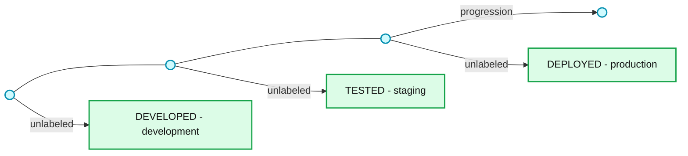
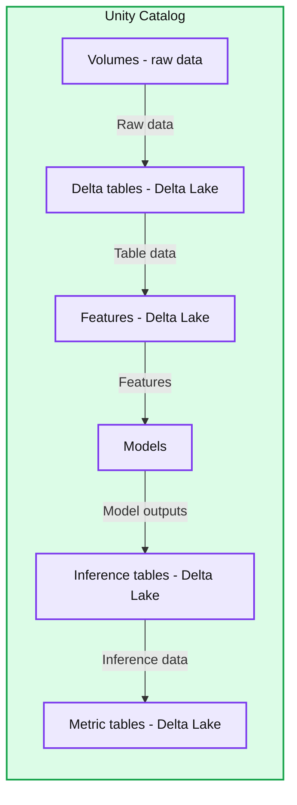
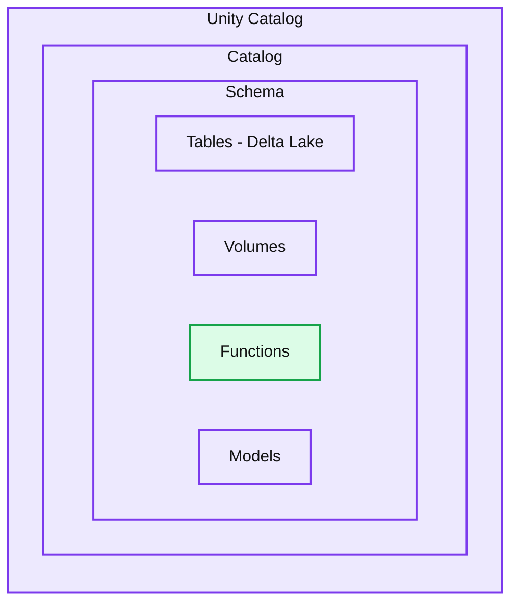

# Big Book of MLOps Updated for Generative AI

*Comprehensive refresh including new developments for Data Science and ML practitioners for the world of GenAI and Databricks AI*

- Source: https://www.databricks.com/blog/big-book-mlops-updated-generative-ai
- Published: 2023-10-30
- Authors: Joseph Bradley, Niall Turbitt, Michael Shtelma, Rafi Kurlansik, Matthew Thomson
- Categories: data-science-machine-learning
- Images: 6 total, 4 extracted as architecture

Last year, we published the Big Book of MLOps, outlining guiding principles, design considerations, and reference architectures for Machine Learning Operations (MLOps). Since then, Databricks has added key features simplifying MLOps, and Generative AI has brought new requirements to MLOps platforms and processes. We are excited to announce a new version of the Big Book of MLOps covering these product updates and Generative AI requirements.

This blog post highlights key updates in the eBook, which can be downloaded [here](https://www.databricks.com/resources/ebook/the-big-book-of-mlops). We provide updates on governance, serving, and monitoring and discuss the accompanying design decisions to make. We reflect these updates in improved reference architectures. We also include a new section on LLMOps (MLOps for Large Language Models), where we discuss implications on MLOps, key components of LLM-powered applications, and LLM-specific reference architectures.

This blog post and eBook will be useful to ML Engineers, ML Architects, and other roles looking to understand the latest in MLOps and the impact of Generative AI on MLOps.

The rest of the blog post is structured as follows:

- Big Book v1 recap
  - We recap the core principles and concepts covered in the first edition of the Big Book of MLOps.
- What's new?
  - We outline new features introduced since the first edition, and how they impact MLOps on Databricks.
- Reference architectures
  - We present our prescribed MLOps reference architecture, taking new features and recommendations into consideration.
- LLMOps
  - We unpack key changes required for Generative AI models, specifically looking at LLM-powered applications.
- Get started updating your MLOps architecture
  - Resources to learn more about MLOps and LLMOps on Databricks.
 

## Big Book v1 recap

If you have not read the original Big Book of MLOps, this section gives a brief recap. The same motivations, guiding principles, semantics, and deployment patterns form the basis of our updated MLOps best practices.

### Why should I care about MLOps?

We keep our definition of [MLOps](https://www.databricks.com/glossary/mlops) as a set of ***processes and automation ***to manage ***data***, ***code and models*** to meet the two goals of ***stable performance and long-term efficiency*** in ML systems.

**MLOps = DataOps + DevOps + ModelOps**

In our experience working with customers like [CareSource](https://www.databricks.com/blog/2023/04/03/saving-mothers-ml-how-mlops-improves-healthcare-high-risk-obstetrics.html) and [Walgreens](https://www.databricks.com/blog/mlops-walgreens-boots-alliance-databricks-lakehouse-platform), implementing MLOps architectures accelerates the time to production for ML-powered applications, reduces the risk of poor performance and non-compliance, and reduces long-term maintenance burdens on Data Science and ML teams.

### Guiding principles

Our guiding principles remain the same:

1. Take a data-centric approach to machine learning.
2. Always keep your business goals in mind.
3. Implement MLOps in a modular fashion.
4. Process should guide automation.

The first principle, taking a data-centric approach, lies at the heart of the updates in the eBook. As you read below, you will see how our ["Lakehouse AI" philosophy](https://www.databricks.com/blog/lakehouse-ai) unifies data and AI at both the governance and model/pipeline layers.

### Semantics of development, staging and production

We structure MLOps in terms of how ML assets—code, data, and models—are organized into stages from development, to staging, and to production. These stages correspond to steadily stricter access controls and stronger quality guarantees.

**Summary:** Development, staging and production appear in order above a rightward progression arrow, with upward arrows pointing to each stage.

**Components:**
- DEVELOPED / development: development stage; no technology specified.
- TESTED / staging: staging stage; no technology specified.
- DEPLOYED / production: production stage; no technology specified.

**Flows:**
- Horizontal line -> right endpoint: unlabeled progression.
- Horizontal line -> development: unlabeled upward arrow.
- Horizontal line -> staging: unlabeled upward arrow.
- Horizontal line -> production: unlabeled upward arrow.

**Numbers:** none

source image: https://www.databricks.com/sites/default/files/inline-images/image4_w_padding_0.png

### ML deployment patterns

We discussed how code and/or models are deployed from development towards production, and the tradeoffs in deploying code, models, or both. We show architectures for deploying code, but our guidance remains largely the same for deploying models.

For more details on any of these topics, please refer to the original eBook.

## What's new?

In this section, we outline the key product features that improve our MLOps architecture. For each of these, we highlight the benefits they bring and their impact on our end-to-end MLOps workflow.

### Unity Catalog

A data-centric AI platform must provide unified governance for both data and AI assets on top of the [Lakehouse](https://www.databricks.com/glossary/data-lakehouse). Databricks [Unity Catalog](https://www.databricks.com/product/unity-catalog) centralizes access control, auditing, lineage, and data discovery capabilities across Databricks workspaces.

Unity Catalog now includes [MLflow Models](https://docs.databricks.com/machine-learning/manage-model-lifecycle/index.html) and [Feature Engineering](https://docs.databricks.com/en/machine-learning/feature-store/workspace-feature-store/feature-tables.html). This unification allows simpler management of AI projects which include both data and AI assets. For ML teams, this means more efficient access and scalable processes, especially for lineage, discovery, and collaboration. For administrators, this means simpler governance at project or workflow level.

**Summary:** Unity Catalog manages assets across an ML workflow from raw data volumes through Delta tables, features, models, inference tables, and metric tables.

**Components:**
- Unity Catalog: governance boundary managing all displayed ML workflow assets.
- Volumes, raw data: Unity Catalog volumes.
- Delta tables: Delta Lake tables.
- Features: Delta Lake feature tables.
- Models: ML models managed within Unity Catalog.
- Inference tables: Delta Lake tables.
- Metric tables: Delta Lake tables.

**Flows:**
- Volumes -> Delta tables: raw data progresses to tables.
- Delta tables -> Features: table data progresses to features.
- Features -> Models: features feed models.
- Models -> Inference tables: model outputs progress to inference tables.
- Inference tables -> Metric tables: inference data progresses to metric tables.

**Numbers:** none

source image: https://www.databricks.com/sites/default/files/inline-images/image3_9.png

Within Unity Catalog, a given catalog contains schemas, which in turn may contain tables, volumes, functions, models, and other assets. Models can have multiple versions and can be tagged with aliases. In the eBook, we provide recommended organization schemes for AI projects at the catalog and schema level, but Unity Catalog has the flexibility to be tailored to any organization's existing practices.

**Summary:** Unity Catalog contains a catalog with a schema holding tables, volumes, functions, and models.

**Components:**
- Unity Catalog: outer governance container.
- Catalog: container within Unity Catalog.
- Schema: container within the catalog.
- Tables: table assets with Delta Lake indicated.
- Volumes: storage assets; no specific technology shown.
- Functions: function assets; no specific technology shown.
- Models: model assets; no specific technology shown.

**Flows:**
- None. Nested boundaries indicate containment; no arrows are visible.

**Numbers:** none

source image: https://www.databricks.com/sites/default/files/inline-images/image2_9.png

### Model Serving

[Databricks Model Serving](https://www.databricks.com/blog/announcing-general-availability-databricks-model-serving)provides a production-ready, serverless solution to simplify real-time model deployment, behind APIs to power applications and websites. Model Serving reduces operational costs, streamlines the ML lifecycle, and makes it easier for Data Science teams to focus on the core task of integrating production-grade real-time ML into their solutions.

In the eBook, we discuss two key design decision areas:

- **Pre-deployment testing **ensures good system performance and generally includes deployment readiness checks and load testing.
- **Real-time model deployment **ensures good model accuracy (or other ML performance metrics). We discuss techniques including A/B testing, gradual rollout, and shadow deployment.

We also discuss implementation details in Databricks, including:

- Using [model aliases](https://docs.databricks.com/en/machine-learning/manage-model-lifecycle/index.html#uc-model-aliases) for tracking champion vs. challenger models
- Controlling [endpoint traffic](https://docs.databricks.com/en/machine-learning/model-serving/serve-multiple-models-to-serving-endpoint.html) for implementing different real-time deployment techniques
- Integrating [Lakehouse Monitoring](https://docs.databricks.com/en/lakehouse-monitoring/index.html) with Model Serving via [inference tables](https://docs.databricks.com/en/machine-learning/model-serving/inference-tables.html)

### Lakehouse Monitoring

[Databricks Data Quality Monitoring](https://www.databricks.com/product/machine-learning/lakehouse-monitoring) is a data-centric monitoring solution to ensure that both data and AI assets are of high quality and reliable. Built on top of Unity Catalog, it provides the unique ability to implement both data and model monitoring, while maintaining lineage between the data and AI assets of an MLOps solution. This unified and centralized approach to monitoring simplifies the process of diagnosing errors, detecting quality drift, and performing root cause analysis.

The eBook discusses implementation details in Databricks, including:

- Using [metric tables](https://docs.databricks.com/en/lakehouse-monitoring/monitor-output.html) produced by Lakehouse Monitoring
- Scheduling [automatic refreshes](https://docs.databricks.com/en/lakehouse-monitoring/create-monitor-ui.html#schedule)of monitoring tables
- Customizing monitoring with [user-defined metrics](https://docs.databricks.com/en/lakehouse-monitoring/custom-metrics.html) and [data slices](https://docs.databricks.com/en/lakehouse-monitoring/monitor-output.html#how-monitor-statistics-are-computed)
- Using the generated [Databricks SQL dashboard](https://docs.databricks.com/en/sql/user/dashboards/index.html)and setting [alerts](https://docs.databricks.com/en/sql/user/alerts/index.html)

### MLOps Stacks and Databricks asset bundles

[MLOps Stacks](https://github.com/databricks/mlops-stack)are updated infrastructure-as-code solutions which help to accelerate the creation of MLOps architectures. This repository provides a customizable stack for starting new ML projects on Databricks, instantiating pipelines for model training, model deployment, CI/CD, and others.

MLOps Stacks are built on top of [Databricks asset bundles](https://docs.databricks.com/en/dev-tools/bundles/index.html), which define infrastructure-as-code for data, analytics, and ML. Databricks asset bundles allow you to validate, deploy, and run Databricks workflows such as [Databricks jobs](https://docs.databricks.com/en/workflows/index.html#what-is-databricks-jobs) and [Delta Live Tables](https://docs.databricks.com/en/workflows/index.html#what-is-delta-live-tables), and to manage ML assets such as MLflow models and experiments.

## Reference architectures

The updated eBook provides several reference architectures:

- **Multi-environment view**: This high-level view shows how the development, staging, and production environments are tied together and interact.
- **Development**: This diagram zooms in on the development process of ML pipelines.
- **Staging**: This diagram explains the unit tests and integration tests for ML pipelines.
- **Production**: This diagram details the target state, showing how the various ML pipelines interact.

Below, we provide a multi-environment view. Much of the architecture remains the same, but it is now even easier to implement with the latest updates from Databricks.

- Top-to-bottom: The three layers show [code in Git](https://docs.databricks.com/en/repos/index.html) (top) vs. [workspaces](https://docs.databricks.com/en/workspace/index.html) (middle) vs. Lakehouse assets in [Unity Catalog](https://docs.databricks.com/en/data-governance/unity-catalog/index.html) (bottom).
- Left-to-right: The three stages are shown in three different workspaces; that is not a strict requirement but is a common way to separate stages from development to production. The same set of ML pipelines and services are used in each stage, initially developed (left) before being tested in staging (middle) and finally deployed to production (right).

**Summary:** Git-controlled ML pipelines move through development, staging, and production workspaces, using MLflow for tracking and Unity Catalog on the Lakehouse for data and model governance.

**Components:**

- Git provider: Git repositories and branches for the ML project.
- ML Project Repo, dev: development branch with Create dev branch and Commit code actions.
- ML Project Repo, main: main branch with CI trigger and Merge actions.
- ML Project Repo, release: release branch for production deployment.
- Unit tests (CI): automated unit testing of dev code.
- Continuous Deployment: deployment from the release branch.
- Development workspace: development environment containing exploratory analysis and ML pipelines.
- Exploratory data analysis: interactive data exploration.
- Model training, Model validation, Model deployment, Monitoring: development pipeline components using the dev branch.
- Development Tracking Server: MLflow experiment tracking, receiving Logging.
- Development Model Serving Endpoint: model serving.
- Staging workspace: integration-testing environment.
- Integration tests (CI): integration testing using the dev branch.
- Staging Tracking Server: MLflow experiment tracking, receiving Logging.
- Staging Model Serving Endpoint: model serving.
- Production workspace: production ML environment.
- Production Tracking Server: MLflow experiment tracking, receiving Logging.
- Model train-deploy Workflow: Model training, Model validation, and Model deployment using the release branch.
- Production Model Serving Endpoint: model serving.
- Batch inference: prediction pipeline using the release branch.
- Monitoring: production monitoring using the release branch.
- Development-side Prod Catalog: Unity Catalog Tables and Models.
- Dev Catalog: Unity Catalog Tables and Models.
- Staging-side Prod Catalog: Unity Catalog Tables and Models.
- Staging Catalog: Unity Catalog Tables and Models.
- Production Prod Catalog: Unity Catalog Tables, Models, Metric Tables, and Inference Tables.
- Models: registered models with Alias: Challenger and Alias: Champion.
- Unity Catalog: shared catalog layer managing data and ML assets.
- Lakehouse: underlying platform layer.

**Flows:**

- Main ML Project Repo -> Dev ML Project Repo: create dev branch.
- Dev ML Project Repo -> Development workspace: branch code enters development.
- Development workspace -> Dev ML Project Repo: commit code.
- Dev ML Project Repo -> Main ML Project Repo: pull request to main.
- Main ML Project Repo -> Unit tests: CI trigger.
- Unit tests -> Integration tests: continue CI testing.
- Integration tests -> Main ML Project Repo: merge.
- Main ML Project Repo -> Release ML Project Repo: merge to release.
- Release ML Project Repo -> Continuous Deployment: release code.
- Continuous Deployment -> Production workspace: deploy production code.
- Development-side Prod Catalog -> Exploratory data analysis: access production assets.
- Development-side Prod Catalog -> Model training: access production assets.
- Development Model training -> Development MLflow Tracking Server: logging.
- Development pipeline stack -> Dev Catalog: development asset updates.
- Development Model deployment -> Dev Catalog: model deployment output.
- Dev Catalog -> Development Model Serving Endpoint: model serving deployment.
- Staging-side Prod Catalog -> Integration tests: access production assets.
- Integration tests -> Staging MLflow Tracking Server: logging.
- Integration tests -> Staging Catalog: staging asset updates.
- Staging Catalog -> Staging Model Serving Endpoint: model serving deployment.
- Production Prod Catalog -> Model train-deploy Workflow: access production assets.
- Model train-deploy Workflow -> Production MLflow Tracking Server: logging.
- Production Model training -> Model validation: trained model.
- Production Model validation -> Model deployment: validated model.
- Production Model training -> Production Models: register model.
- Production Model validation -> Alias: Challenger: assign alias.
- Production Model deployment -> Alias: Champion: promote model.
- Production Model deployment -> Production Model Serving Endpoint: deploy model.
- Production Models -> Production Model Serving Endpoint: registered model for serving.
- Production Models -> Batch inference: registered model for predictions.
- Batch inference -> Inference Tables: inference output.
- Production Model Serving Endpoint -> Inference Tables: inference output.
- Production Monitoring -> Metric Tables: monitoring output.

**Numbers:** none

source image: https://www.databricks.com/sites/default/files/inline-images/image1_11.png

```mermaid
%% Git-controlled ML development, staging, and production with MLflow and Unity Catalog
flowchart LR
    G[Git repos - dev main release]
    CI[Unit tests and continuous deployment]
    D[Development - exploration and ML pipelines]
    S[Staging - integration tests]
    P[Production - train validate deploy]
    F[MLflow tracking servers]
    DS[Development and staging serving endpoints]
    PS[Production serving endpoint]
    B[Batch inference]
    M[Production monitoring]
    C[Unity Catalog on Lakehouse - production dev and staging assets]
    R[Production models - Challenger and Champion aliases]
    T[Metric Tables]
    I[Inference Tables]

    G -->|Create dev branch and supply code| D
    D -->|Commit code and pull request| G
    G -->|CI trigger and release deployment| CI
    CI -->|Run integration tests| S
    S -->|Merge| G
    CI -->|Deploy release code| P
    C -->|Production assets| D
    C -->|Production assets| S
    C -->|Production assets| P
    D -->|Update development assets| C
    S -->|Update staging assets| C
    D -->|Logging| F
    S -->|Logging| F
    P -->|Logging| F
    C -->|Deploy catalog models| DS
    P -->|Register model and assign or promote aliases| R
    P -->|Deploy model| PS
    R -->|Model for serving| PS
    R -->|Model for prediction| B
    PS -->|Inference output| I
    B -->|Inference output| I
    M -->|Monitoring output| T

    classDef client fill:#dbeafe,stroke:#2563eb,stroke-width:2px,color:#111
    classDef service fill:#dcfce7,stroke:#16a34a,stroke-width:2px,color:#111
    classDef store fill:#ede9fe,stroke:#7c3aed,stroke-width:2px,color:#111
    classDef cache fill:#fef3c7,stroke:#d97706,stroke-width:2px,color:#111
    classDef queue fill:#cffafe,stroke:#0891b2,stroke-width:2px,color:#111
    classDef critical fill:#fee2e2,stroke:#dc2626,stroke-width:4px,color:#111
    classDef external fill:#e5e7eb,stroke:#6b7280,stroke-width:2px,color:#111,stroke-dasharray:4 3
    classDef decision fill:#fce7f3,stroke:#db2777,stroke-width:2px,color:#111
    class G external
    class CI,D,S,P,F,DS,PS,B,M service
    class C,R,T,I store
```

The main architectural update is that both data and ML assets are managed as Lakehouse assets in the Unity Catalog. Note that the big improvements to Model Serving and Lakehouse Monitoring have not changed the architecture, but make it simpler to implement.

## LLMOps

We end the updated eBook with a new section on [LLMOps](https://www.databricks.com/glossary/llmops), or MLOps for [Large Language Models (LLMs)](https://www.databricks.com/product/machine-learning/large-language-models). We speak in terms of "LLMs," but many best practices translate to other Generative AI models as well. We first discuss major changes introduced by LLMs and then provide detailed best practices around key components of LLM-powered applications. The eBook also provides reference architectures for common Retrieval-Augmented Generation (RAG) applications.

### What changes with LLMs?

The table below is an abbreviated version of the eBook table, which lists key properties of LLMs and their implications for MLOps platforms and practices.

| Key properties of LLMs | Implications for MLOps |
|---|---|
| Implications for MLOps- LLMs are available in many forms:- Proprietary SaaS models- Open source models- Custom fine-tuned models- Custom pre-trained models | **Development process**: Projects often develop incrementally, starting from existing, third-party or open source models and ending with custom models (fine-tuned or fully trained on curated data). |
| Many LLMs take general queries and instructions as input. Those queries can contain carefully engineered "prompts" to elicit the desired responses. | **Development process**: Prompt engineering is a new important part of developing many AI applications.**Packaging ML artifacts**: LLM "models" may be diverse, including API calls, prompt templates, chains, and more. |
| Many LLMs can be given prompts with examples or context. | **Serving infrastructure**: When augmenting LLM queries with context, it is valuable to use tools such as vector databases to search for relevant context. |
| Proprietary and OSS models can be used via paid APIs. | **API governance**: It is important to have a centralized system for API governance of rate limits, permissions, quota allocation, and cost attribution. |
| LLMs are very large deep learning models, often ranging from gigabytes to hundreds of gigabytes. | **Serving infrastructure**: GPUs and fast storage are often essential.**Cost/performance trade-offs**: Specialized techniques for reducing model size and computation have become more important. |
| LLMs are hard to evaluate via traditional ML metrics since there is often no single "right" answer. | **Human feedback:** This feedback should be incorporated directly into the MLOps process, including testing, monitoring, and capturing for use in future fine-tuning. |

### Key components of LLM-powered applications

The eBook includes a section for each topic below, with detailed explanations and links to resources.

- **Prompt engineering**: Though many prompts are specific to individual LLM models, we give some tips which apply more generally.
- **Leveraging your own data:** We provide a table and discussion of the continuum from simple (and fast) to complex (and powerful) for using your data to gain a competitive edge with LLMs. This ranges from prompt engineering, to retrieval augmented generation (RAG), to fine-tuning, to full pre-training.
- **Retrieval augmented generation (RAG):** We discuss this most common type of LLM application, including its benefits and the typical workflow.
- **Vector database: **We discuss vector indexes vs. vector libraries vs. vector databases, especially for RAG workflows.
- **Fine-tuning LLMs:** We discuss variants of fine-tuning, when to use it, and state-of-the-art techniques for scalable and resource-efficient fine-tuning.
- **Pre-training: **We discuss when to go for full-on pre-training and reference state-of-the art techniques for handling challenges. We also strongly encourage the use of MosaicML Training, which automatically handles many of the complexities of scale.
- **Third-party APIs vs. self-hosted models**: We discuss the tradeoffs around data security and privacy, predictable and stable behavior, and vendor lock-in.
- **Model evaluation:** We touch on the challenges in this nascent field and discuss benchmarks, using LLMs as evaluators, and human evaluation.
- **Packaging models or pipelines for deployment:** With LLM applications using anything from API calls to prompt templates to complex chains, we provide advice on using MLflow Models to standardize packaging for deployment.
- **LLM Inference: **We provide tips around real-time inference and batch inference, including using large models.
- **Managing cost/performance trade-offs: **With LLMs being large models, we dedicate this section to reducing costs and improving performance, especially for inference.

## Get started updating your MLOps architecture

This blog is merely an overview of the explanations, best practices, and architectural guidance in the full [eBook](https://www.databricks.com/resources/ebook/the-big-book-of-mlops). To learn more and to get started on updating your MLOps platform and practices, we recommend that you:

- **Read the updated** [**Big Book of MLOps.**](https://www.databricks.com/resources/ebook/the-big-book-of-mlops) Throughout the eBook, we provide links to resources for details and for learning more about specific topics.
- **Catch up on the **[**Data+AI Summit 2023 talks **](https://www.databricks.com/dataaisummit/sessions/)**on MLOps**, including:
  - Wednesday keynote on [Lakehouse IQ](https://www.youtube.com/watch?v=h4z4vBoxQ6s&t=2469s), [MosaicML](https://www.youtube.com/watch?v=h4z4vBoxQ6s&t=3516s), and [Lakehouse AI](https://www.youtube.com/watch?v=h4z4vBoxQ6s&t=4335s), as well as [JetBlue's personal story](https://www.youtube.com/watch?v=h4z4vBoxQ6s&t=5958s)
  - Databricks vision and product updates
    - [LLMOps: Everything You Need to Know to Manage LLMs](https://www.databricks.com/dataaisummit/session/llmops-everything-you-need-know-manage-llms/), which overviews the Databricks vision for developing LLM-powered applications
    - [Deep Dive into the Latest Lakehouse AI Capabilities](https://www.databricks.com/dataaisummit/session/deep-dive-latest-lakehouse-ai-capabilities/)
    - [Advancements in Open Source LLM Tooling, Including MLflow](https://www.databricks.com/dataaisummit/session/advancements-open-source-llm-tooling-including-mlflow/)
  - [Key Insights From Running LLMs in Production From MLOps.Community](https://www.databricks.com/dataaisummit/session/key-insights-running-llms-production-mlopscommunity/)
- **Read and watch about success stories**:
  - [CareSource](https://www.databricks.com/blog/2023/04/03/saving-mothers-ml-how-mlops-improves-healthcare-high-risk-obstetrics.html) on their MLOps platform for improving healthcare
  - [Walgreens Boots Alliance](https://www.databricks.com/blog/mlops-walgreens-boots-alliance-databricks-lakehouse-platform) on the details of their MLOps architecture
  - [Gucci](https://www.databricks.com/dataaisummit/session/mlops-gucci-zero-hero/) on their end-to-end MLOps architecture
  - [Ahold Delhaize](https://www.databricks.com/dataaisummit/session/streamlining-api-deployment-ml-models-across-multiple-brands-ahold-delhaizes/) on their move to Serverless Model Serving
  - [The Trade Desk](https://www.databricks.com/dataaisummit/session/using-nlp-evaluate-100-million-global-webpages-daily-contextually-target/) on scaling NLP for 100 million web pages per day
- **Speak with your Databricks account team**, who can guide you through a discussion of your requirements, help to adapt this reference architecture to your projects, and engage more resources as needed for training and implementation.
