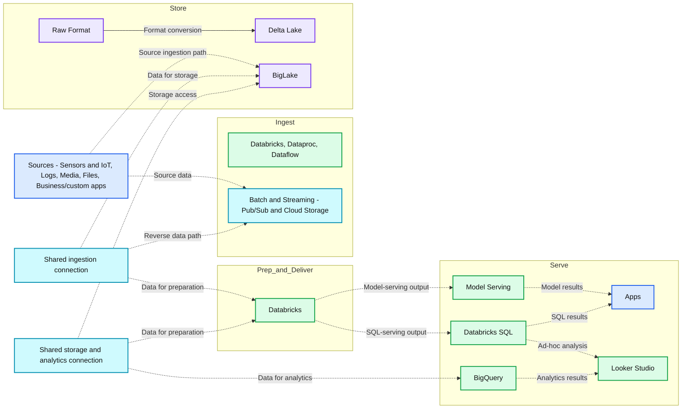

# BigQuery adds first-party support for Delta Lake

*Delta Lake on BigQuery: combine data stored on Delta Lake with data across other formats in BigQuery, with advanced feature support including Deletion Vectors*

- Source: https://www.databricks.com/blog/bigquery-adds-first-party-support-delta-lake
- Published: 2024-06-06
- Authors: Jonathan Brito, Bhavin Kukadia, Susan Pierce
- Categories: engineering, open-source
- Images: 1 total, 1 extracted as architecture

Delta Lake has over [20M+ monthly downloads](https://delta.io/community/). BigQuery, [now with first-party support for Delta Lake](https://cloud.google.com/blog/products/data-analytics/biglake-now-offers-native-support-for-delta-lake), builds on Delta’s rich connector ecosystem and seamlessly integrates with Databricks. In this blog, we will cover:

 

- Delta Lake on Google Cloud
- Building an open data lakehouse with Databricks and BigQuery
- How to read Delta Lake in BigQuery

## Delta Lake on Google Cloud

[Delta Lake](https://delta.io/) is an optimized storage layer, enhancing performance and reliability for enterprise data lakes. Delta is used by over 10,000 companies, including 70% of the Fortune 500. As a [fully open sourced](https://www.databricks.com/blog/2022/06/30/open-sourcing-all-of-delta-lake.html) Linux Foundation project, Delta Lake offers a rich connector ecosystem with support from many popular open source frameworks and commercial engines. BigQuery now offers integrated Delta Lake support, extending the Delta Lake ecosystem to Google Cloud. 

 

With BigQuery support, you can write Delta and continue to access Google Cloud native services downstream, all from a single copy of data. BigQuery’s Delta connector includes support for recent Delta innovations such as [deletion vectors](https://docs.delta.io/latest/delta-deletion-vectors.html), [column mapping](https://docs.delta.io/latest/delta-column-mapping.html), and [liquid clustering](https://docs.delta.io/latest/delta-clustering.html). 

## Lakehouse on Databricks and BigQuery

The [lakehouse architecture](http://cidrdb.org/cidr2021/papers/cidr2021_paper17.pdf) combines the flexibility of data lakes with the reliability of data warehouses. BigQuery support for Delta Lake is enabled through [BigLake](https://cloud.google.com/bigquery/docs/biglake-intro). BigLake is a storage engine that enables customers to store data in an open table format on cloud object storage, providing the flexibility to use BigQuery with other platforms like Databricks. Customers can converge their data warehouses and data lakes on a unified storage layer, using Delta Lake and BigLake.

**Summary:** Databricks and BigLake connect batch and streaming ingestion, raw and Delta Lake storage, data preparation, model serving, SQL analytics, BigQuery, and Looker Studio.

**Components:**

- Sensors and IoT: unstructured data sources.
- Logs: unstructured data sources.
- Media: unstructured data sources.
- Files: unstructured data sources.
- Business/custom apps: structured data sources.
- Ingest: Databricks, Dataproc, and Dataflow.
- Batch & Streaming: Pub/Sub and Cloud Storage.
- Store: BigLake with Raw Format and Delta Lake.
- Prep and Deliver: Databricks.
- Model Serving: model deployment service; technology unspecified.
- Databricks SQL: SQL serving and analysis.
- Apps: application consumers.
- BigQuery: analytics service.
- Looker Studio: reporting and visualization.

**Flows:**

- Sensors and IoT -> Batch & Streaming: source data.
- Logs, Media, Files, and Business/custom apps -> Batch & Streaming: grouped source data.
- Grouped source ingestion path -> BigLake: data for storage.
- Shared ingestion connection -> Batch & Streaming: reverse-direction data path.
- Shared ingestion connection -> Databricks: data for preparation.
- Shared ingestion connection -> BigLake: data for storage.
- Raw Format -> Delta Lake: format conversion.
- Shared storage and analytics connection -> BigLake: storage access path.
- Shared storage and analytics connection -> Databricks: data for preparation.
- Shared storage and analytics connection -> BigQuery: data for analytics.
- Databricks -> Model Serving: prepared model-serving output.
- Databricks -> Databricks SQL: prepared SQL-serving output.
- Model Serving -> Apps: model-serving results.
- Databricks SQL -> Apps: SQL results.
- Databricks SQL -> Looker Studio: ad-hoc analysis.
- BigQuery -> Looker Studio: analytics results.

Arrow meanings are inferred from endpoint labels; the image does not specify protocols or payloads.

**Numbers:** none

source image: https://www.databricks.com/sites/default/files/inline-images/Screenshot-2024-06-05-at-10.41.46-PM.png?v=1717641761

By standardizing your data lake in Delta Lake, you can:

- Unify data access: Maintain a single authoritative copy of your data that can be queried by both Databricks and BigQuery without the need to export, copy, or use manifest files
- Efficiently share data: Share data seamlessly across different processing engines like BigQuery, Databricks, Dataproc, and Dataflow, enabling efficient data utilization and collaboration

> “Google Cloud is committed to fostering an open and interoperable data ecosystem," said Ritika Suri, Director, Data and AI Technology Partnerships at Google Cloud. "Adding support for Delta Lake in BigQuery is a testament to our dedication to delivering an open platform with a comprehensive set of cloud solutions for managing their data.”

## Reading Delta Lake in BigQuery

You can read Delta Lake in BigQuery with just a [few easy steps](https://cloud.google.com/bigquery/docs/create-delta-lake-table). To start, let’s create a Delta table in Databricks:

Before you can access the table in BigQuery, you need a [Cloud resource connection](https://cloud.google.com/bigquery/docs/create-cloud-resource-connection#create-cloud-resource-connection) to Cloud Storage and the [required permissions](https://cloud.google.com/bigquery/docs/create-delta-lake-table#iam-permissions) in BigQuery. You create a Delta Lake table in BigQuery specifying the Delta Lake prefix as the URI:

When you query a Delta table, BigQuery reads data under the prefix to identify the current version of the table. BigQuery automatically detects data and schema changes, so you can read the latest snapshot without manually refreshing table metadata. 

Reading Delta Lake in BigQuery is that simple. With Delta Lake, you can use both Databricks and BigQuery without duplicating data files or manually maintaining table metadata, while also leveraging the latest Delta features. 

 

At Databricks, we are excited to enable open access to enterprise data through Delta Lake. We will continue to invest in our partnership with Google Cloud to help customers integrate Databricks with BigQuery and other Google Cloud services. 

 

You can learn more about Delta Lake and our partnership with Google Cloud at upcoming sessions at [Data and AI Summit](https://www.databricks.com/dataaisummit?scid=7018Y000001f8FRQAY&utm_medium=paid%20search&utm_source=google&utm_campaign=21064981877&utm_adgroup=159492352557&utm_content=summit&utm_offer=dataaisummit&utm_ad=692303190231&utm_term=spark%20summit%202024&gad_source=1&gclid=CjwKCAjwupGyBhBBEiwA0UcqaGrRJ1AzzSzV58KsSyDnHy3McPum6qcCziWD6f0K9Rs7iTQSlnh5VRoCWtYQAvD_BwE) from June 10-13, 2024. Sessions are live in San Francisco and virtual in a hybrid format. 

 

- [BigQuery Native Integration with Delta Lake - The Latest Announcement](https://www.databricks.com/dataaisummit/session/bigquery-native-integration-delta-lake-latest-announcement)
- [Processing a Trillion Rows Per Day with Delta Lake at Adobe](https://www.databricks.com/dataaisummit/session/processing-trillion-rows-day-delta-lake-adobe)
- [Drastically Reducing Processing Costs with Delta Lake](https://www.databricks.com/dataaisummit/session/drastically-reducing-processing-costs-delta-lake)
- [Deep Dive Into Delta Lake and UniForm on Databricks](https://www.databricks.com/dataaisummit/session/deep-dive-delta-lake-and-uniform-databricks)
- [Delta Lake 4.0 and Beyond](https://www.databricks.com/dataaisummit/session/delta-lake-40-and-beyond)
