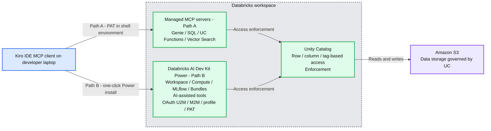

# Bring Databricks into Kiro IDE with the AI Dev Kit Power

*Two ways to connect Kiro IDE to the Databricks Data + AI Platform — the four Databricks-managed MCP servers for a 10-minute path, or the new Databricks AI Dev Kit Power for the full surface area.*

- Source: https://www.databricks.com/blog/bring-databricks-kiro-ide-ai-dev-kit-power
- Published: 2026-06-03
- Authors: Antony Prasad Thevaraj, Venkatavaradhan Viswanathan
- Categories: all, platform, partners, engineering
- Images: 1 total, 1 extracted as architecture

**Key takeaways**

- Two paths to connect Kiro IDE to Databricks: the four Databricks-managed MCP servers (Genie, SQL, Unity Catalog Functions, Vector Search) for a 10-minute PAT-based setup, or the new Databricks AI Dev Kit Power — one click, all essential tools and skills, four auth options.
- AI-assisted development grounded in real workspace metadata: both paths inherit Unity Catalog row, column, and tag-based grants, so the assistant writes SQL with your actual columns and only sees what you can see — no hallucinations, no unauthorized reads.
- Pick by surface area: Path A is the lightest setup for analysts and SQL-first builders; Path B opens the full Databricks platform (pipelines, jobs, Mosaic AI, Agent Bricks, Lakebase, Asset Bundles) inside the IDE.

## Why this matters

AI-assisted development falls apart the moment the assistant has to guess at column names, table layouts, or which catalogs you can read. The fix is grounding: connect the assistant to live workspace metadata via Model Context Protocol (MCP), and the SQL it writes uses the actual columns you have, dbt models join real tables, and every query inherits the Unity Catalog grants you already have in place. Nothing leaves the platform. The AI sees only what you can see.

Two milestones just landed that make this practical in Kiro IDE:

First, the Databricks AI Dev Kit added Kiro support upstream in PR #511. The unified installer treats `kiro` as a first-class target alongside `claude`, `cursor`, `copilot`, `codex`, and `gemini`. One command, and Kiro picks up the full toolkit at `~/.kiro/skills/` and `~/.kiro/settings/mcp.json`.

Second, the Databricks AI Dev Kit Power shipped in the Kiro Powers catalog in PR #129. Open the Powers panel, click Try, and the Power runs the entire onboarding: installer, MCP wiring, auth detection, and skill loading.

Combined with the four Databricks-managed remote MCP servers that already ship inside the platform, you have two ways to wire Kiro into Databricks. Both share a common outcome: builders ship analytics, pipelines, and agent workflows faster when the assistant inherits real workspace permissions instead of guessing at schemas, columns, and grants.

## Why Databricks for AI-assisted development

The two milestones above make Kiro × Databricks practical. The reason it matters is what's underneath. Three things make Databricks the substrate of choice for AI-assisted development, regardless of which path you take.

**Unity Catalog is the only governance layer that grounds AI at the data level.** Every MCP call — Path A or Path B — inherits row, column, and tag-based grants. The assistant doesn't have a privileged view of your data; it sees exactly what you can see. There is no separate access-control layer to manage, and no risk of the AI writing queries against tables it shouldn't even know exist.

**One copy of data, one set of definitions.** Because Databricks is a lakehouse, the table the assistant queries through databricks-sql is the same table your dbt model writes to, the same table your Genie space exposes, the same table your AI/BI dashboard reads from. There is no warehouse-to-lake sync to break, no separate semantic layer to keep in sync. When the assistant grounds itself in samples.tpch.lineitem, it's grounding in the same definition every other tool uses.

**The full AI stack is integrated, not bolted on.** Mosaic AI Gateway routes model calls. Agent Bricks orchestrates multi-agent workflows. MLflow tracks experiments and evaluations. Vector Search powers semantic retrieval. Lakebase handles transactional state. All of these surface in the Power, all on the same UC. You're not stitching together five products; you're using one platform.

There's a fourth thing worth naming: **the Power itself is Databricks-built.** No other data platform ships a one-click IDE Power for Kiro, Cursor, Claude, Copilot, Codex, and Gemini. The MCP layer is open, the protocol is open, the integration is open — but the experience that wraps it is engineered by Databricks specifically for the way our customers build.

## The two paths at a glance

| **Dimension** | **Path A: Managed MCP Servers** | **Path B: Databricks AI Dev Kit Power** |
|---|---|---|
| Surface area | 4 servers: Genie, SQL, UC Functions, Vector Search | All essential Databricks tools and skills |
| What you get | Natural-language SQL, semantic search, governed function execution | Path A surface plus pipelines, jobs, dashboards, Lakebase, Mosaic AI, Agent Bricks, Asset Bundles, MLflow, model serving, Apps |
| Hosting | Databricks-managed (remote HTTPS) | Local Python MCP server via the AI Dev Kit installer |
| Auth | PAT in shell env | OAuth U2M (recommended), OAuth M2M, .databrickscfg profile, or PAT |
| Setup | Edit `~/.kiro/settings/mcp.json`, export env vars | One-click Power install plus guided auth flow |
| Best for | Analysts and SQL-first builders who want a 10-minute path to ask their warehouse a question | Data engineers and platform builders who need the full Databricks surface area in one IDE |

## Integration architecture at a glance

**Summary:** Kiro IDE connects to Databricks through managed MCP servers or the AI Dev Kit Power, with Unity Catalog enforcing access to Amazon S3 data.

**Components:**
- Developer’s laptop: Kiro IDE with an MCP client.
- Databricks workspace: hosts both integration paths and Unity Catalog.
- Managed MCP servers, Path A: Genie, SQL, UC Functions, and Vector Search.
- Databricks AI Dev Kit Power, Path B: Workspace, Compute, MLflow, and Bundles; AI-assisted tools with OAuth U2M, M2M, profile, or PAT authentication.
- Unity Catalog: row, column, and tag-based access enforcement.
- Amazon S3: data storage governed by Unity Catalog.

**Flows:**
- Kiro IDE -> Managed MCP servers: Path A using PAT in shell environment.
- Kiro IDE -> Databricks AI Dev Kit Power: Path B through one-click Power installation.
- Managed MCP servers -> Unity Catalog: access enforcement.
- Databricks AI Dev Kit Power -> Unity Catalog: access enforcement.
- Unity Catalog -> Amazon S3: reads and writes.

**Numbers:** none

source image: https://www.databricks.com/sites/default/files/inline-images/unnamed-19.png

Both paths share the same back end: Unity Catalog enforcement and Databricks workspace identity. They differ in surface area and authentication model.

## Path A: connect to the four managed MCP servers

This is the lightest setup. One `mcp.json` file, a Databricks Personal Access Token, and a shell-profile edit. In under 10 minutes Kiro is talking to Genie, SQL, Unity Catalog Functions, and Vector Search.

### Prerequisites

- A Databricks workspace on AWS with Unity Catalog enabled.
- A Databricks Personal Access Token (PAT) or OAuth token scoped to the MCP servers you plan to use (`sql`, `unity-catalog`, `genie`, `vector-search`). Unused PATs auto-revoke after 90 days.
- Kiro installed and launched at least once so `~/.kiro/` exists.
- Your workspace hostname in the format `<workspace>.cloud.databricks.com`.

### Generate a Databricks PAT

In the Databricks workspace go to Settings, Developer, Access tokens, Manage, Generate new token. Set an expiration that aligns with your team's rotation policy. Select only the API scopes you need; least privilege beats the convenience of "everything." Copy the token immediately. Databricks does not display it again.

### Where Kiro stores MCP configuration

Kiro reads MCP configuration from JSON in two scopes; workspace overrides user.

- **User scope**: `~/.kiro/settings/mcp.json` applies to every workspace.
- **Workspace scope**: `$PWD/.kiro/settings/mcp.json` applies only to the current workspace and overrides the user-scope entry of the same key.

### One-click install from the Kiro server directory

Open kiro.dev/docs/mcp/servers/, find the Databricks row, and click Add to Kiro. The browser launches Kiro and opens a confirmation dialog with a pre-filled config. Confirm to write the `databricks-sql` entry into `~/.kiro/settings/mcp.json`. The entry references two environment variables that don't yet exist; we set them next.

### Verify (or add) the databricks-sql entry

### Set the environment variables

In the shell profile that launches Kiro (typically `~/.zshrc` on macOS):

Source the profile (`source` `~/.zshrc`) before launching Kiro. Fully quit Kiro (Cmd+Q on macOS) and reopen. Reload Window does not re-read environment variables; only a process restart does.

### Add Genie, UC Functions, and Vector Search

All four Databricks-managed servers connect as remote HTTP MCP. The initialize handshake succeeds even with a placeholder URL; the server validates the resource only when a tool is invoked. A connected-but-broken state, where `tools/call` returns `RESOURCE_DOES_NOT_EXIST` or `PERMISSION_DENIED`, is the most common failure mode. Run these pre-flight checks first:

- **Genie**: confirm a Genie space exists and you can open it. The space ID appears in the URL.
- **UC Functions**: confirm the function exists and you have `EXECUTE`. List functions with 
`SELECT * FROM system.information_schema.routines WHERE routine_type = 'FUNCTION'`.
- **Vector Search**: confirm an endpoint with at least one accessible index exists under Catalog, Vector Search.
- **PAT scope**: a workspace-scoped PAT can still hit `PERMISSION_DENIED` on Genie spaces or vector indexes if the user lacks Can View on the specific resource. Genie spaces are shared individually.

Add the additional env vars (`DATABRICKS_GENIE_MCP_URL`, `DATABRICKS_UC_FUNCTIONS_MCP_URL`, `DATABRICKS_VECTOR_SEARCH_MCP_URL`) and update `mcp.json` to the full configuration:

URL formats by server:

| **Server** | **URL pattern** |
|---|---|
| databricks-genie | https://<workspace-hostname>/api/2.0/mcp/genie/<genie_space_id> |
| databricks-sql | https://<workspace-hostname>/api/2.0/mcp/sql |
| databricks-uc-functions | https://<workspace-hostname>/api/2.0/mcp/functions/<catalog>/<schema>/<function_name> |
| databricks-vector-search | https://<workspace-hostname>/api/2.0/mcp/vector-search/<catalog>/<schema>/<index_name> |

Quit and relaunch Kiro again. Open the MCP SERVERS section of the Kiro panel; the four `databricks-*` entries appear with green status indicators. Click reconnect on anything red and re-check pre-flight. Try a low-risk first query in the chat panel: "List the catalogs I have access to."

### Path B: install the Databricks AI Dev Kit Power

The four managed servers cover SQL, semantic search, and natural-language analytics, which is enough for many builders. If your workflow spans pipelines, jobs, model serving, Lakebase, Asset Bundles, Mosaic AI, Agent Bricks, AI/BI dashboards, MLflow, or Databricks Apps, the four-server setup leaves you copying and pasting back to the workspace UI all day.

The Databricks AI Dev Kit Power solves that. One install. All essential tools and skills, four auth options, all loadable on demand.

### What you get

| **Surface** | **Coverage** |
|---|---|
| SQL & Compute | Execute SQL on warehouses; run Python or Scala on clusters; manage compute lifecycle |
| Pipelines & Jobs | Spark Declarative Pipelines (streaming tables, CDC, SCD Type 2, Auto Loader); multi-task job DAGs |
| Unity Catalog | Tables, volumes, grants, tags, storage credentials, system tables, metric views, External Iceberg Reads |
| AI/BI Dashboards | Visualizations, KPIs, analytics dashboards |
| Genie Spaces | Natural-language data exploration over governed datasets |
| Agent Bricks | Knowledge Assistants (RAG) and Multi-Agent Supervisors |
| Vector Search | Semantic search and RAG with managed indexes |
| Model Serving | ML models, AI agents, and pay-per-token Foundation Model APIs (FMAPI), routable through AI Gateway |
| MLflow | Experiments, evaluations, trace instrumentation, metric queries |
| Lakebase | Provisioned and autoscale managed PostgreSQL for OLTP workloads |
| Databricks Apps | Full-stack web apps on the Lakehouse |
| Asset Bundles | Infrastructure-as-code for Databricks resources |

### Install in one click

Inside Kiro, open the Powers panel, search for `databricks`, and click Try. The Power runs the official Databricks AI Dev Kit installer in non-interactive Kiro mode:

The installer downloads the MCP server, creates a `uv` virtual environment, and pulls the expert skill library into `~/.kiro/skills/`. The Power copies the skills into its own `steering/` directory so they load on demand based on the task at hand. No content is bundled in the Power itself; everything is fetched from upstream, so the skills stay current. 

### The four auth options

The Power's onboarding flow detects existing credentials and walks you through the right choice. All four are documented inline:

| **Option** | **What it is** | **Best for** |
|---|---|---|
| A: OAuth U2M (recommended for interactive use) | The Databricks CLI opens a browser, you authenticate as yourself, the SDK auto-refreshes hourly | A single human developer on a workstation. Safest interactive flow with no long-lived secret to leak |
| B: OAuth M2M | A Databricks service principal authenticates with `client_id` and `client_secret`; the SDK auto-issues 1-hour tokens | Headless, CI/CD, or production agents |
| C: Existing `.databrickscfg` profile | Point the Power at a profile you already use for the Databricks CLI or other tools | You already have a working profile and don't want to re-set up auth |
| D: Personal Access Token (legacy) | Bearer token in `mcp.json` env block | Tools that don't support OAuth, or workspaces without OAuth U2M enabled |

The Power's `mcp.json` ships with `disabled: true` until you pick an option; nothing connects until you have explicitly chosen and configured your credentials. The credential-detection flow is neutral. If multiple credentials are detected, all four options are presented in order, with no default and no silent reuse.

### Verify the install

Restart Kiro, open the MCP SERVERS panel, and confirm the `databricks` entry is connected (green). Ask the chat: "Get my current Databricks user." That single call exercises auth, env-var resolution, and server enablement. If it works, the full chain is healthy.

### How to choose between the two paths

A simple decision tree:

1. Just running SQL, asking natural-language questions over governed datasets via Genie, and searching vector indexes? Use Path A. The four managed servers do exactly that, and the setup is 10 minutes.
2. Authoring pipelines, managing jobs, deploying Asset Bundles, working with Lakebase, building Databricks Apps, or calling Mosaic AI / Agent Bricks? Use Path B. The full toolkit is too much surface area to bolt on as one-off remote MCP servers.
3. Hybrid? Run both. Path A and Path B don't conflict. The Power writes its own `mcpServers.databricks` entry, while Path A's four servers (`databricks-genie`, `databricks-sql`, `databricks-uc-functions`, `databricks-vector-search`) are separate keys. Kiro presents all of them in the MCP panel.

For builders who plan to live in Kiro day-to-day on Databricks workloads, Path B is the better long-term answer. Path A is the right answer if you have 10 minutes and a SQL warehouse you want to chat with.

## Through the lens of the builder

Both paths land differently depending on who's holding the IDE. Four personas, four pain points, four answers.

**The analytics engineer.** You spend half your day querying tables you've never seen and the other half copy-pasting between your editor and the workspace UI. Path A solves this in 10 minutes. The Genie and SQL servers ground every query in real schema metadata; the assistant writes against your actual columns, not guesses; and every result inherits your Unity Catalog grants. You stop tab-switching.

**The data engineer.** Your day is pipelines, jobs, Asset Bundles, and the cross-environment promotions that come with all three. Authoring databricks.yml by hand and running databricks bundle deploy from a terminal sidebar is the slow way. Path B is the fast way. The Power's pipelines + jobs + Asset Bundles skills produce, validate, and deploy IaC from one conversation. Spark Declarative Pipelines, CDC, SCD Type 2, Auto Loader — all generated against your actual UC tables and ready to commit.

**The AI / agent builder.** You're wiring model calls, evaluation, governance, and agent orchestration across three or four tools that don't quite agree on the schema. Path B covers the full Databricks AI surface — Mosaic AI Gateway for routing and fallbacks, Agent Bricks for multi-agent supervisors and knowledge assistants, MLflow for evaluation, Vector Search for retrieval — all UC-governed end to end. Your agent inherits the same permissions as its caller, and your eval traces land in the same workspace as your training runs.

**The platform builder.** You manage Databricks resources as code, promote across dev/stage/prod, and answer the "did we drift?" question on a weekly cadence. Path B's Asset Bundles skill plus the Unity Catalog management skills generate the full bundle, validate it against your workspace's actual state, and surface drift before it bites. You stop maintaining one set of YAML manually and another in a doc.

### A workflow you can run today

Whichever path you took, this exercise grounds the assistant in real workspace metadata using the `samples.tpch` catalog, available in every Databricks workspace.

**You ask**: "What columns and types does `samples.tpch.lineitem` have, and what is the data distribution by `l_shipdate` year?"

Kiro returns the actual schema and a histogram from a single MCP-executed query. Real column names, real distribution, no hallucinations.

**You ask**: "Draft a dbt model that joins lineitem to orders and aggregates revenue by nation per quarter."

Kiro produces SQL using the actual column names (`l_extendedprice`, `l_discount`, `o_orderdate`) instead of guesses. Because it queried the schema first, it knows the exact types and grain.

**You ask**: "Run my new aggregation against `samples.tpch` and compare the row count to last week's snapshot in `poc.gold.revenue_by_nation_qtr`."

Kiro executes both queries and surfaces the diff. When a number looks off, "Show me the lineage for `gold.revenue_by_nation_qtr`" pulls upstream tables from `system.access.table_lineage`. Once verified, Kiro generates the Databricks job JSON for the model and lists which catalogs and schemas it touches.

On Path B, the same workflow extends to "Generate the Asset Bundle for this job and deploy it to staging," or "Create an AI/BI dashboard backed by this aggregation," or "Wire this into a Mosaic AI Gateway endpoint with a fallback model," all without leaving the IDE. 

## Best practices, regardless of path

- **Least-privilege auth**. Generate a separate PAT per workstation and per scope set. On Path B, prefer OAuth U2M for interactive use over PATs.
- **Never commit credentials**. Store `DATABRICKS_ACCESS_TOKEN` in your shell profile or a secrets manager. Never put it in `mcp.json` checked into source control.
- **Scope per project**. Keep Genie space IDs and Vector Search index paths in `$PWD/.kiro/settings/mcp.json` so each project carries its own resource bindings.
- **Trust UC permissions**. All paths enforce Unity Catalog row, column, and tag-based grants. The AI inherits your effective permissions on every call. There is no separate access-control layer to manage.
- **Restart, don't reload**. Kiro reads environment variables once at process start. After editing your shell profile or adding auth, fully exit (Cmd+Q on macOS) and reopen.

## Troubleshooting

**"Server not found" or red status on an MCP entry.**

Path A: check `echo $DATABRICKS_SQL_MCP_URL` in the shell that launched Kiro. An empty value means Kiro can't resolve the URL. Confirm the workspace-scope `mcp.json` is not shadowing your user-scope config. Verify the PAT is still valid in Settings, Developer, Access tokens.

Path B: re-enter the credential-detection flow from the Power's onboarding. If the MCP server returns `Invalid` `access` `token` or `401`, the Power's built-in 401 recovery hook pauses tool calls and re-surfaces auth options.

**Connected to MCP but tool calls return **`**RESOURCE_DOES_NOT_EXIST**`** or **`**PERMISSION_DENIED**`**.**

The most common Path A failure. The initialize handshake succeeds with a placeholder URL because the server defers resource validation until invocation. Re-run pre-flight checks for the specific server (Genie space exists and is shared with you, function exists and you have `EXECUTE`, vector index exists and you have Can View).

**Try it today. The Databricks AI Dev Kit Power is the fastest way to get the full platform — pipelines, jobs, Lakebase, Mosaic AI, Agent Bricks, and everything else listed above — inside Kiro. Install it directly from the Kiro Powers catalog **at [github.com/kirodotdev/powers](https://github.com/kirodotdev/powers), or visit [github.com/databricks-solutions/ai-dev-kit](https://github.com/databricks-solutions/ai-dev-kit) to install the underlying toolkit for Kiro or any supported IDE (Claude, Cursor, Copilot, Codex, Gemini). For the four Databricks-managed MCP servers, the one-click install lives at [kiro.dev/docs/mcp/servers/](https://kiro.dev/docs/mcp/servers/).

Have feedback or hit a snag? File an issue — for Power setup or packaging, [kirodotdev/powers](https://github.com/kirodotdev/powers/issues); for the installer, MCP server or skills, [databricks-solutions/ai-dev-kit](https://github.com/databricks-solutions/ai-dev-kit/issues). We read every one.

*Opinions and ideas shared here are our own and not official Databricks policy.*
