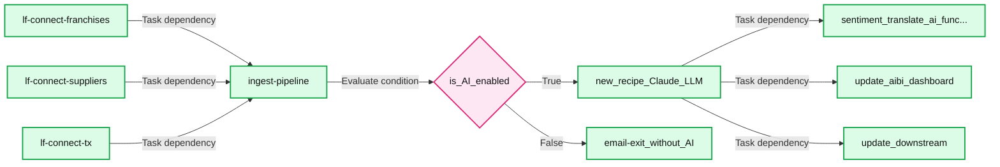

# Building with Databricks Document Intelligence and Lakeflow

*Turn locked enterprise knowledge into queryable, trusted intelligence*

- Source: https://www.databricks.com/blog/building-databricks-document-intelligence-and-lakeflow
- Published: 2026-04-16
- Authors: Giselle Goicochea, Joanna Zouhour
- Categories: product, data-engineering
- Images: 2 total, 2 extracted as architecture

**Key takeaways**

- Most enterprise knowledge is inaccessible in unstructured documents, while current intelligent document processing (IDP) is often brittle and unreliable
- Databricks Document Intelligence and Lakeflow enable data engineers to easily build and automate an end-to-end IDP workflow: ingesting unstructured data, parsing it with AI intelligence grounded in enterprise context, and then orchestrating at scale, all within a governed platform
- Data teams can surface previously hidden documents into trusted, queryable datasets that help unlock new insights, agentic workflows, and value for their business

Despite decades of perfecting structured data pipelines, 80% of enterprise knowledge remains functionally invisible, trapped in PDFs, images, and office documents. 

Traditionally, Intelligent Document Processing (IDP) has been a fragmented nightmare. Before the era of Generative AI, organizations were forced to rely on disconnected NLP and computer vision APIs that were outside of their primary data platforms. These siloed OCR (optical character recognition) vendors offered limited accuracy and lacked formal governance protocols, creating significant friction. To deliver on the promise of Enterprise AI, we need a unified approach that integrates data intelligence directly into the data lifecycle. 

Today, we’re showing how data engineers can leverage [Lakeflow](https://www.databricks.com/product/data-engineering), Databricks’ unified data engineering solution, and [Databricks Document Intelligence](http://www.databricks.com/blog/why-frontier-agents-cant-read-documents-and-how-were-fixing-it) to unlock that data and turn it into business-impacting intelligence by building production-grade autonomous IDP in their Databricks Data + AI Platform.

**Summary:** Lakeflow Connect feeds Document Intelligence, which feeds Lakeflow Jobs.

**Components:**
- Lakeflow Connect: Lakeflow ingestion component.
- Document Intelligence: document processing component.
- Lakeflow Jobs: Lakeflow job component.

**Flows:**
- Lakeflow Connect -> Document Intelligence: unspecified flow.
- Document Intelligence -> Lakeflow Jobs: unspecified flow.

**Numbers:** none

source image: https://www.databricks.com/sites/default/files/inline-images/2026-04-blog-from-document-silos-to-data-intelligence-building-production-grade-ipd-with-lakeflow-and-agent-bricks-inline-960x248.png

## Step 1: Secure Ingestion with Lakeflow Connect

Enterprise documents live in siloed graveyards, accessible only through fragile, custom-coded API integrations that break the moment a folder is renamed. [Lakeflow Connect](https://www.databricks.com/product/data-engineering/lakeflow-connect), Databricks' solution for ingesting data into the lakehouse, changes the game with built-in connectors for many popular enterprise applications, databases, and file sources including [SharePoint](https://docs.databricks.com/aws/en/ingestion/sharepoint) and [Google Drive](https://docs.databricks.com/aws/en/ingestion/google-drive).

This solution offers zero-maintenance ingestion by removing the need to manage complex OAuth flows or custom Python scripts. Documents land directly in [Unity Catalog Volumes](https://docs.databricks.com/aws/en/volumes/) and tables, so access control, lineage, and auditing apply as soon as the file is in the lakehouse, and you can reuse the same fine‑grained, attribute‑based policies you already rely on for structured data.

You also get fast and efficient ingestion at scale thanks to Lakeflow Connect’s [robust capabilities](https://docs.databricks.com/aws/en/ingestion/), including incremental reads and writes which avoids full re‑pulls of large libraries for both batch backfills and near‑real‑time document flows when combined with streaming downstream.

## Step 2: Getting started with Databricks Document Intelligence

These enterprise documents carry some of your organization’s most valuable insights but are inherently messy, variable and inconsistent. Scanned pages, handwritten notes and nested tables trap your most valuable insights. To fix this, you don’t just need another document extraction tool; as Forrester notes, you need a “reasoning-first architectural evolution.” With this approach, Gartner predicts GenAI will reduce the need for custom-trained document models by 70%.

Today, with **Databricks Document Intelligence**, you can bring state-of-the-art document understanding directly to your data. Your data engineering teams can leverage purpose-built AI functions that can reliably **parse**, **structure**, and **enrich** complex documents right alongside your existing data pipelines, all seamlessly governed by Unity Catalog.

- [**ai_parse_document**](https://docs.databricks.com/aws/en/sql/language-manual/functions/ai_parse_document)** (new - GA)**: This function converts unstructured files into structured representations using the Variant data type. It natively handles input complexity that typically trips up traditional parsers, such as scanned images, handwriting, and variable layouts, while preserving critical document structure (e.g., nested tables, sections, and headers) that flat text extraction would lose. This allows you to evolve schemas over time without breaking your pipelines. Downstream, you treat the VARIANT output as a flexible bronze/silver representation, projecting it into Delta columns in your silver/gold layers using SQL or PySpark in [Lakeflow Spark Declarative Pipelines](https://www.databricks.com/product/data-engineering/spark-declarative-pipelines).

On top of the parsed structure, you can chain additional **research-tuned AI Functions**:

- [**ai_extract **](https://docs.databricks.com/aws/en/sql/language-manual/functions/ai_extract)**(PuPr)** to pull structured insights such as contract effective and expiration dates, counterparties, invoice totals, taxes, currency, and PO numbers.
- [**ai_classify**](https://docs.databricks.com/aws/en/sql/language-manual/functions/ai_classify)** (PuPr) **to route documents by type (invoice, PO, SOW, NDA), urgency/risk, or owning business unit.
- [**ai_prep_search**](https://docs.databricks.com/gcp/en/sql/language-manual/functions/ai_prep_search)** (new - Beta)** to intelligently divide documents into chunks for high-quality downstream embedding, preparing them for retrieval or search use cases

Below is a simple example of chaining ai_parse_document and ai_extract together. 
*Note: this example shows PySpark, but you can also use SQL (see documentation). *

Because these are managed AI Functions integrated into the Databricks Data + AI Platform, Document Intelligence can combine them with your enterprise context (catalog metadata, business semantics, existing tables) to power agentic workflows that reason over your data with high accuracy, grounded in your enterprise domain context.

## Step 3: Productionizing IDP Workloads at Scale

Once you have ingestion and parsing working in notebooks, you need to **productionize your IDP**: orchestrate ingestion, parsing, enrichment, and serving. But you also want to monitor SLAs, failures, and retries in CI/CD to ensure pipelines remain healthy. 

With [Lakeflow Jobs](https://www.databricks.com/product/data-engineering/lakeflow-jobs), Databricks’ native orchestrator, you can turn IDP workloads into robust, automated pipelines with the same orchestration system you use for ETL, analytics, and ML. It provides **unified orchestration for every task in the IDP DAG**, so you can chain notebooks, Python scripts, SQL queries, pipelines, LLMs, or agent calls in a single job and model the full flow from document ingestion. 

Lakeflow Jobs also comes with built-in [advanced control flow](https://docs.databricks.com/aws/en/jobs/control-flow)(including if/else conditions, for each, retries, etc.) and [triggers](https://docs.databricks.com/aws/en/jobs/triggers) (table update, file arrival, continuous, etc.). This makes it easy to 1) re‑process only failed partitions or specific document batches and 2) manage jobs to fit specific schedules, event‑based triggers, or continuous mode for real‑time document streams.

With Lakeflow Jobs’ [serverless compute](https://docs.databricks.com/aws/en/jobs/run-serverless-jobs) with native [observability](https://docs.databricks.com/aws/en/data-engineering/observability-best-practices), you also get automatic scaling with spikes in document volume while surfacing real‑time monitoring, metrics, and alerts so you can pinpoint bottlenecks and repair failures without needing to re-run successful tasks.

**Summary:** Three ingestion pipelines converge into a shared pipeline, followed by an AI-enabled condition that selects either recipe generation and downstream updates or an exit task.

**Components:**
- lf-connect-franchises: Databricks pipeline task.
- lf-connect-suppliers: Databricks pipeline task.
- lf-connect-tx: Databricks pipeline task.
- ingest-pipeline: Databricks pipeline task.
- is_AI_enabled: Conditional task comparing a truncated parameter ending in `_enabled` against `FALSE` using `!=`.
- new_recipe_Claude_LLM: SQL task running `ai_query.sql` on `daiwt_dwh`; its name references Claude.
- email-exit_without_AI: Task referencing `Exit_without_AI`.
- sentiment_translate_ai_func...: SQL task running `sentiment_translate.sql` on `daiwt_dwh`.
- update_aibi_dashboard: Dashboard update task.
- update_downstream: Task referencing `Update_Downstream`.

**Flows:**
- lf-connect-franchises -> ingest-pipeline: Task dependency.
- lf-connect-suppliers -> ingest-pipeline: Task dependency.
- lf-connect-tx -> ingest-pipeline: Task dependency.
- ingest-pipeline -> is_AI_enabled: Task dependency leading to condition evaluation.
- is_AI_enabled -> new_recipe_Claude_LLM: True branch.
- is_AI_enabled -> email-exit_without_AI: False branch.
- new_recipe_Claude_LLM -> sentiment_translate_ai_func...: Task dependency.
- new_recipe_Claude_LLM -> update_aibi_dashboard: Task dependency.
- new_recipe_Claude_LLM -> update_downstream: Task dependency.

**Numbers:** none

source image: https://www.databricks.com/sites/default/files/inline-images/Step3.png

## Grounding AI in Enterprise Context

IDP is most valuable when it is backed by enterprise context: your unique schemas, business definitions, and custom semantics. 

### Unity Catalog 

**Unity Catalog** provides **unified governance and discovery **across structured data, unstructured files, ML models, and business metrics on any cloud. For IDP, that means: 

- A single place to define **access policies, lineage, and auditing** for both raw documents and derived structured tables
- Support for **open formats **(Delta, Apache Iceberg, Hudi, Parquet) so you aren’t locked into a proprietary document representation
- **Business semantics** and catalog‑level metadata that agents can use to consistently name and interpret entities such as “Vendor,” “Customer,” or “Contract Value.”

### Document Intelligence

[**Document Intelligence**](https://docs.databricks.com/aws/en/generative-ai/agent-framework/create-agent) uses this context to build **production AI agents** that know which **tables, tools, and models** to use for a given IDP task, are governed end‑to‑end so they never access more than they should, and continuously improve via **LLM‑based quality scoring**, **task‑specific benchmarks, and learning loops**. For developers, Databricks provides **APIs and SDKs** so you can define these agents as code and integrate them into your existing CI/CD pipelines, just like any other data or ML asset.

## Best Practices for the Modern IDP Stack

To move from pilot to platform, keep these best practices in mind:

- **Data Enrichment**: Don’t just extract a "Vendor Name." Join it with your internal Master Data or third-party sources (like Dun & Bradstreet) to provide full business context.
- **Operational Excellence:** Use Service Principals for Lakeflow Jobs to ensure pipeline stability.
- **Monitoring:** Use Lakehouse Monitoring to track model drift and extraction accuracy over time.

## The Path to Modern Data Intelligence

With Databricks, you can own the full lifecycle of Intelligent Document Processing on a modern data platform. Combining Lakeflow and AI functions lets you turn unstructured, hidden data into trusted, queryable datasets and seamlessly run observable document pipelines alongside your core ETL and ML. 

Now that we’ve covered the strategic value of autonomous document intelligence, it’s time to build it. Check out our companion post, [From PDF to Insights](https://community.databricks.com/t5/technical-blog/from-pdf-to-insights-autonomous-document-intelligence-at-scale/ba-p/154416), for a step-by-step technical walkthrough on deploying this exact architecture using Databricks.

You can also explore the [Document Intelligence](https://docs.databricks.com/aws/en/generative-ai/agent-bricks/intelligent-document-processing) and [Lakeflow](https://docs.databricks.com/aws/en/jobs/) documentation to start building your first IDP pipeline today!
