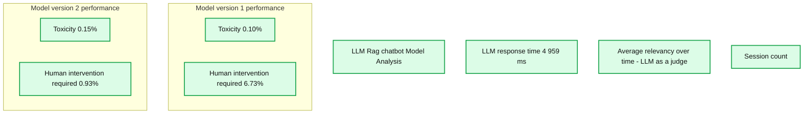

# Creating High Quality RAG Applications with Databricks

*A New Suite of Tools To Get Generative AI Applications to Production*

- Source: https://www.databricks.com/blog/building-high-quality-rag-applications-databricks
- Published: 2023-12-06
- Authors: Patrick Wendell, Hanlin Tang
- Categories: announcements, engineering, data-science-machine-learning
- Images: 4 total, 1 extracted as architecture

[Retrieval-Augmented-Generation (RAG)](https://www.databricks.com/glossary/retrieval-augmented-generation-rag#:~:text=Retrieval%20augmented%20generation%20or%20RAG%20is%20an%20architectural%20approach%20that,as%20context%20for%20the%20LLM.) has quickly emerged as a powerful way to incorporate proprietary, real-time data into [Large Language Model (LLM)](https://www.databricks.com/glossary/large-language-models-llm#:~:text=Large%20language%20models%20(LLMs)%20are,near%2Darbitrary%20instructions%2C%20translation%20as) applications. **Today we are excited to launch **a suite of RAG tools to help Databricks users build high-quality, production LLM apps using their enterprise data. 

LLMs offered a major breakthrough in the ability to rapidly prototype new applications. But after working with thousands of enterprises building RAG applications, we’ve found that their biggest challenge is getting these applications to **production quality**. To meet the standard of quality required for customer-facing applications, AI output must be accurate, current, aware of your enterprise context, and safe.

To achieve high quality with RAG applications, developers need rich tools for understanding the quality of their data and model outputs, along with an underlying platform that lets them combine and optimize all aspects of the RAG process. RAG involves many components such as data preparation, retrieval models, language models (either SaaS or open source), ranking and post-processing pipelines, prompt engineering, and training models on custom enterprise data. Databricks has always focused on combining your data with cutting edge ML techniques. With today’s release, we extend that philosophy to let customers leverage their data in creating high quality AI applications.

Today’s release includes Public Preview of:

- A [vector search](https://docs.databricks.com/en/generative-ai/vector-search.html) service to power semantic search on existing tables in your lakehouse.
- Online [feature and function serving](https://docs.databricks.com/en/machine-learning/feature-store/feature-function-serving.html) to make structured context available to RAG apps.
- Fully [managed foundation models](https://docs.databricks.com/en/machine-learning/foundation-models/index.html) providing pay-per-token base LLMs.
- A flexible [quality monitoring](https://docs.databricks.com/en/lakehouse-monitoring/index.html)interface to observe production performance of RAG apps.
- A set of LLM development tools to compare and evaluate various LLMs.

These features are designed to address the three major challenges we’ve seen in building production RAG applications:

## Challenge #1 - Serving Real-Time Data For Your RAG App

RAG applications combine your latest structured and unstructured data to produce the highest quality and most personalized responses. But maintaining online data serving infrastructure can be very difficult, and companies have historically had to stitch together multiple systems and maintain complex data pipelines to load data from central data lakes into bespoke serving layers. Securing important datasets is also very difficult when copies are striped across different infrastructure stacks.

With this release, Databricks natively supports serving and indexing your data for online retrieval. For unstructured data (text, images, and video), [**AI Search**](https://docs.databricks.com/en/generative-ai/vector-search.html) will automatically index and serve data from Delta tables, making them accessible via semantic similarity search for RAG applications. Under the hood, AI Search manages failures, handles retries, and optimizes batch sizes to provide you with the best performance, throughput, and cost. For structured data, **[Feature and Function Serving](https://docs.databricks.com/en/machine-learning/feature-store/feature-function-serving.html) **provides millisecond-scale queries of contextual data such as user or account data, that enterprises often want to inject into prompts in order to customize them based on user information. 

Unity Catalog automatically tracks lineage between the offline and online copies of served datasets, making debugging data quality issues much easier. It also consistently enforces access controls settings between online and offline datasets, meaning enterprises can better audit and control who is seeing sensitive proprietary information. 

## Challenge #2 - Comparing, Tuning, and Serving Foundation Models

A major determinant of quality in a RAG application is the choice of base LLM model. Comparing models can be difficult because models vary across several dimensions, such as reasoning ability, propensity to hallucinate, context window size, and serving cost. Some models can also be fine tuned to specific applications, which can further improve performance and potentially reduce costs. With new models being released almost weekly, comparing base model permutations to find the best choice for a particular application can be extremely burdensome. Further complicating things, model providers often have disparate API’s making rapid comparison or future-proofing of RAG applications very difficult. 

With this release, Databricks now offers **a unified environment for LLM development and evaluation**–providing a consistent set of tools across model families on a cloud-agnostic platform. Databricks users can access leading models from Azure OpenAI Service, AWS Bedrock and Anthropic, open source models such as Llama 2 and MPT, or customers’ fine-tuned, fully custom models. The new interactive AI Playground allows easy chat with these models while our integrated toolchain with MLflow enables rich comparisons by tracking key metrics like toxicity, latency, and token count. Side-by-side model comparison in the Playground or MLflow allows customers to identify the best model candidate for each use case, even supporting evaluation of the retriever component.  

Databricks is also releasing [**Foundation Model API’s**](https://docs.databricks.com/en/machine-learning/foundation-models/index.html), a fully managed set of LLM models including the popular Llama and MPT model families. Foundation Model API’s can be used on a pay-per-token basis, drastically reducing cost and increasing flexibility. Because Foundation Model API’s are served from within Databricks infrastructure, sensitive data does not need to transit to third party services.

In practice, achieving high quality often means mixing-and-matching base models according to the specific requirements of each application. Databricks’ [**Model Serving**](https://www.databricks.com/product/model-serving) architecture now provides a unified interface to deploy, govern, and query any type of LLM, be it a fully custom model, a Databricks-managed model, or a third party foundation model. This flexibility lets customers choose the right model for the right job and be future proof in the face of future advances in the set of available models.

## Challenge #3 - Ensuring Quality and Safety In Production

Once an LLM application is deployed, it can be difficult to know how well it is working. Unlike traditional software, language-based applications do not have a single correct answer or obvious “error” conditions. This means understanding quality (how well is this working?) or what constitutes anomalous, unsafe, or toxic output (is this thing safe?) is nontrivial. At Databricks, we’ve seen many customers hesitate to roll out RAG applications because they are unsure whether observed quality in a small internal prototype will translate to their user base at scale.

Included in this release, [**Lakehouse Monitoring **](https://www.databricks.com/product/machine-learning/lakehouse-monitoring)provides a fully managed quality monitoring solution for RAG applications. Lakehouse Monitoring can automatically scan application outputs for toxic, hallucinated, or otherwise unsafe content. This data can then feed dashboards, alerts, or other downstream data pipelines for subsequent actioning. Since monitoring is integrated with the lineage of datasets and models, developers can quickly diagnose errors related to e.g. stale data pipelines or models that have unexpectedly changed behavior. 

Monitoring is not only about safety but also quality. Lakehouse Monitoring can incorporate application level concepts like “thumbs up/thumbs down” style user feedback, or even derived metrics such as “user accept rate” (how often an end-user accepts AI generated recommendations). In our experience, measuring end-to-end user metrics substantially bolsters the confidence of enterprises that RAG applications are working well in the wild. Monitoring pipelines are also fully managed by Databricks, so developers can spend time on their applications rather than managing observability infrastructure.

**Summary:** Lakehouse Monitoring tracks chatbot response time, relevance, session counts, toxicity, and required human intervention across two model versions.

**Components:**
- LLM Rag chatbot Model Analysis: Databricks monitoring dashboard using MLflow evaluation APIs.
- LLM response time: response latency metric.
- Average relevancy over time - LLM as a judge: relevance trends for Model version 1 and Model version 2.
- Session count: daily chatbot session counts.
- Model version 1 performance: toxicity and human intervention metrics.
- Model version 2 performance: toxicity and human intervention metrics.

**Flows:**
- none. No arrows are visible.

**Numbers:**
- LLM response time: 4 959 ms.
- Model versions: 1 and 2.
- Relevance axis: 0, 1, 2, 3, 4, 5.
- Session count axis: 0, 20, 40, 60, 80, 100.
- Dates on both charts: Dec 3, Dec 10, Dec 17, Dec 24; year 2023.
- Model version 1: toxicity 0.10%; human intervention required 6.73%.
- Model version 2: toxicity 0.15%; human intervention required 0.93%.
- Refresh labels: 2 days ago.

source image: https://www.databricks.com/sites/default/files/inline-images/image2_12.png

The monitoring features in this release are just the beginning. Stay tuned for much more!

## Next Steps

We have in-depth blogs throughout this week and next that go through in detail on implementation best practices.  So come back to our Databricks blog, explore our products through the new [RAG demo](https://www.databricks.com/resources/demos/tours/deploy-llm-chatbots-rag-and-databricks-ai-vector-search?itm_data=demo_center), watch the Databricks [Generative AI Webinar on-demand](https://www.databricks.com/resources/webinar/disrupt-your-industry-generative-ai), take training on Generative AI with our [Gen AI Engineer Learning Pathway](https://www.databricks.com/blog/databricks-announces-industrys-first-generative-ai-engineer-learning-pathway-and-certification), and check out a quick video demo of the RAG suite of tools in action:
