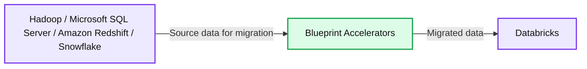
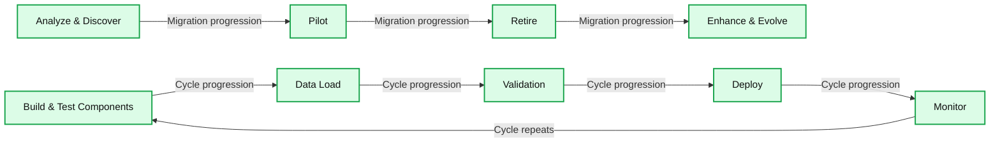

# Databricks adds new migration Brickbuilder Solutions to help customers succeed with AI

- Source: https://www.databricks.com/blog/databricks-adds-new-migration-brickbuilder-solutions-help-customers-succeed-ai
- Published: 2024-02-15
- Authors: Christine Gauthier
- Categories: partners, solution-accelerators
- Images: 3 total, 2 extracted as architecture

For the past two years, Databricks has collaborated with leading consulting partners to build innovative solutions for industry, migration, and data and AI use cases. Based on a foundation of proven customer deployments, [Databricks Brickbuilder Solutions](https://www.databricks.com/blog/2022/03/17/brickbuilder-solutions-partner-developed-industry-solutions-for-the-lakehouse.html) and [Accelerators](https://www.databricks.com/blog/databricks-expands-brickbuilder-program-include-lakehouse-accelerators) package together the experience and knowledge of our partners to help businesses unlock the full potential of the [Databricks Data + AI Platform](https://www.databricks.com/blog/what-is-a-data-intelligence-platform) to boost productivity and extract value from data.

To date, Databricks has [launched 60 partner solutions](https://www.databricks.com/company/partners/consulting-and-si/partner-solutions) spanning legacy system migrations, demand forecasting, customer 360, risk management, product performance, and much more. Read on to learn about our newest migration Brickbuilder Solutions and see how Databricks partners are helping businesses to have a phased approach for their end-to-end migration process to the lakehouse architecture. The result is lower risk, faster value realization, and increased ROI. Learn more about our new partner migration solutions by accessing the links below.

[Fig. 1: Brickbuilder Soutions are end-to-end lakehouse solutions and services for cloud migrations and common industry use cases.](https://www.databricks.com/sites/default/files/inline-images/db-900-blog-imgs-1.png)

## New Migration Brickbuilder Solutions

### Blueprint Accelerated Data Migration

Blueprint has methodologies and pre-built accelerators to help you migrate from EDW, Hadoop and SQL Server to the Databricks Data + AI Platform. Cloud-agnostic, the Blueprint [Accelerated Data Migration framework](https://www.databricks.com/company/partners/consulting-and-si/partner-solutions/blueprint-technologies-accelerated-data-migration) discovers, designs and modernizes your lakehouse to ensure high impact and to prove value quickly. From there, the framework iterates, matures and scales to meet your needs. Blueprint delivers ROI within your cloud environment that is made to maximize agility, adaptability and performance.

*Fig. 2: With Blueprint's Accelerated Data Migration framework, you can automate migration by 80%, and achieve rapid and unprecedented time to value.*

**Summary:** Hadoop, Microsoft SQL Server, Amazon Redshift and Snowflake feed into Blueprint Accelerators for migration to Databricks.

**Components:**
- Hadoop: source platform using Hadoop.
- Microsoft SQL Server: source database using SQL Server.
- Amazon Redshift: source data warehouse using Amazon Redshift.
- Snowflake: source data platform using Snowflake.
- Blueprint Accelerators: migration component using Blueprint accelerators.
- Databricks: destination platform using Databricks.

**Flows:**
- Grouped source platforms -> Blueprint Accelerators: source data for migration.
- Blueprint Accelerators -> Databricks: migrated data.

**Numbers:** none

source image: https://www.databricks.com/sites/default/files/inline-images/db-900-blog-img-2.png

[Fig. 2: With Blueprint's Accelerated Data Migration framework, you can automate migration by 80%, and achieve rapid and unprecedented time to value.](https://www.databricks.com/sites/default/files/inline-images/db-900-blog-img-2.png)

### Cognizant Cloud Data Migration Factory

Organizations operate large sets of applications and databases that they wish to migrate to cloud platforms, but often struggle to identify migration tools that reliably and cost-effectively enable their business cases. Cloud Migration Factory is an end-to-end technology migration solution for downstream/upstream applications and databases that migrates legacy technology to the Databricks Data + AI Platform on the cloud. Cognizant's specialized accelerators generate data models and scripts using AI/ML and then perform impact analysis and self-correction based on the target platform. This accelerates the modernization journey and results in faster completion, a reduced cost of implementation, higher accuracy and improvements in productivity.

### DATAPAO One-Stop Cloud Data Migration

DATAPAO accelerates companies' solution architecture initiatives by migrating workloads to cloud platforms such as AWS or Azure, and provides customized solutions for their big data needs. Their proprietary [One-Stop Cloud Data Migration](https://www.databricks.com/company/partners/consulting-and-si/partner-solutions/datapao-one-stop-cloud-data-migration) methodology ensures a smooth transition toward a future-proof data platform that effectively supports the business strategy. With a proven track record in data migration across industries, DATAPAO is helping companies to optimize their cloud infrastructure and utilize their data better.

### Deloitte Migration Factory

Enterprises are spending valuable time and money running and maintaining legacy technology. The imperative is to bring together data and processes through a leading cloud data platform that optimizes use-to-cost ratio and permits capabilities and innovation across the enterprise. Organizations need a trusted pathway to value, where risk is minimized and returns on investment are expedited. Deloitte's [Migration Factory](https://www.databricks.com/company/partners/consulting-and-si/partner-solutions/deloitte-migration-factory) can help you confidently migrate your data to the Databricks Data + AI Platform. This approach helps you achieve fast and efficient large-scale migration to realize the greatest agility, cost reduction and business case value.

[Read this data sheet](https://www2.deloitte.com/content/dam/Deloitte/us/Documents/consulting/us-migration-factory-for-databricks-sales-sheet-final.pdf) to learn more about the Deloitte Migration Factory solution.

### Insight Migration and Modernization Accelerator With Insight Lens™

[Insight Lens™](https://www.databricks.com/company/partners/consulting-and-si/partner-solutions/insight-migration-and-modernization-accelerator) is a framework for delivering end-to-end analytics success quickly using the power of the Databricks Data + AI Platform. Fully configurable, Insight Lens™ dramatically accelerates time-to-value for your data migration, data platform modernization, data science laboratory or MLOps platform. Built in the cloud and deployed in your tenant, Insight Lens™ puts the full power of the Databricks Data + AI Platform in your hands and helps you to reduce time-to-value for analytics delivery by up to 90%, onboard new data sources up to 10x faster, and enable your data scientists to be up to 4x more productive.

### Hitachi Solutions Migrate to Modernize

Organizations relying on legacy on-premises data platforms often face challenges such as limited scalability, slow data processing, high operational costs and complex maintenance requirements. These challenges hinder the ability to make data-driven decisions and drive business growth. Hitachi Solutions [Migrate to Modernize](https://www.databricks.com/company/partners/consulting-and-si/partner-solutions/hitachi-solutions-migrate-to-modernize) offers its expertise and frameworks to address these challenges head-on by helping you migrate your legacy on-premises data platforms to Azure Databricks so you can store all your data in a simple, open lakehouse and unify all your analytics and AI workloads.

### Perficient Migration Factory

Perficient has developed a [Migration Factory](https://www.databricks.com/company/partners/consulting-and-si/partner-solutions/perficient-migration-factory) approach to the migration of legacy data platforms into the Databricks Data + AI Platform. They leverage reusable tooling and a proven framework to migrate workloads quickly and efficiently while taking into consideration a reduction in technical debt, implementing best practices, and speeding up the migration process. With this solution, you get a focused analysis, discovery and pilot to identify risks and pitfalls along with reusable frameworks and tools for data migration, data validation and ETL/workload migrations to reduce the time to migration.

*Fig. 3: Perficient Migration Factory helps to improve the data engineering team's productivity and implement DataOps processes while modernizing the data platform with a lakehouse architecture.*

**Summary:** The migration workflow combines analysis and discovery, a pilot, an iterative build and deployment cycle, retirement, and ongoing enhancement.

**Components:**
- Analyze & Discover: technology not specified.
- Pilot: technology not specified.
- Build & Test Components: technology not specified.
- Data Load: technology not specified.
- Validation: technology not specified.
- Deploy: technology not specified.
- Monitor: technology not specified.
- Retire: technology not specified.
- Enhance & Evolve: technology not specified.

**Flows:**
- Analyze & Discover -> Pilot: migration progression.
- Pilot -> Retire: horizontal migration progression beneath the iterative cycle.
- Retire -> Enhance & Evolve: migration progression.
- Build & Test Components -> Data Load: cycle progression.
- Data Load -> Validation: cycle progression.
- Validation -> Deploy: cycle progression.
- Deploy -> Monitor: cycle progression.
- Monitor -> Build & Test Components: cycle repeats through the unlabeled lower segment.

**Numbers:** none

source image: https://www.databricks.com/sites/default/files/inline-images/db-900-blog-img-3.png

[Fig. 3: Perficient Migration Factory helps to improve the data engineering team's productivity and implement DataOps processes while modernizing the data platform with a lakehouse architecture.](https://www.databricks.com/sites/default/files/inline-images/db-900-blog-img-3.png)

### Tech Mahindra Sprinter

[Sprinter](https://www.databricks.com/company/partners/consulting-and-si/partner-solutions/tech-mahindra-sprinter) is a data migration solution that brings together automation and best practices to streamline the data migration journey across activities like analysis, planning, development, testing, monitoring and tracking. Sprinter helps you drastically reduce the overall migration effort while also ensuring data quality and accuracy. With Sprinter, you can reduce your discovery effort by 30%, accelerate stored procedure migration by 60%–90%, and see 80% improvement in schema migration via automation.

## See more Brickbuilder Solutions

At Databricks, we continue to collaborate with our regional and global consulting partners to enable even more use cases across key industries and migrations. Check out our full set of partner migrations solutions on [the Databricks Brickbuilder Solutions page](https://www.databricks.com/company/partners/consulting-and-si/partner-solutions?itm_data=menu-item-brickbuildersoverview).

## Create a Brickbuilder for the Databricks Data + AI Platform

Brickbuilder Solution and Accelerators are a key component of the Databricks Partner Program and recognize partners who have demonstrated a unique ability to offer differentiated lakehouse industry and migration solutions in combination with their knowledge and expertise.

Partners who are interested in learning more about how to create a Brickbuilder Solution or Accelerator are encouraged to email us at [brickbuilders@databricks.com](mailto:brickbuilders@databricks.com).

**We have collaborated with consulting and system integrator (C&SI) partners to develop industry and migration solutions to address data engineering, data science, machine learning and business analytics use cases.*
