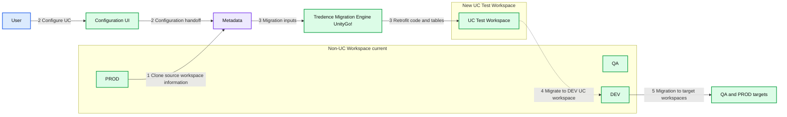

# Databricks Expands Brickbuilder Program to Include Unity Catalog Accelerators

*Simplify migration to unified governance for data and AI*

- Source: https://www.databricks.com/blog/databricks-expands-brickbuilder-program-include-unity-catalog-accelerators
- Published: 2024-03-07
- Authors: Christine Gauthier
- Categories: partners, solution-accelerators
- Images: 3 total, 2 extracted as architecture

Today, we're excited to announce the launch of Brickbuilder Unity Catalog Accelerators. This is an expansion to [the Brickbuilder Accelerator program](https://www.databricks.com/blog/databricks-expands-brickbuilder-program-include-lakehouse-accelerators), which pairs the expertise of system integrators and consulting partners with their proven frameworks and pre-built code to help organizations quickly implement a specific methodology or [Databricks Data + AI Platform](https://www.databricks.com/product/data-intelligence-platform) capability.

The Brickbuilder Program, made up of partner solutions and accelerators, began with a focus on [industry](https://www.databricks.com/blog/2022/03/17/brickbuilder-solutions-partner-developed-industry-solutions-for-the-lakehouse.html) and [migration solutions](https://www.databricks.com/blog/2022/08/11/announcing-brickbuilder-solutions-for-migrations.html) and quickly expanded to include accelerators to help customers of all sizes set up and hydrate their lakehouse architecture using the Databricks Data + AI Platform in weeks, not months. Today, Databricks continues to collaborate and invest in top partners to develop accelerators that fit within any stage of a customer's journey to improve productivity and optimize value.

The new Brickbuilder Unity Catalog Accelerators are designed to help businesses achieve a unified approach to governance and accelerate their data and AI initiatives while simplifying adherence to regulatory compliance. With [Unity Catalog](https://www.databricks.com/product/unity-catalog), organizations can now seamlessly govern their structured and unstructured data, machine learning models, notebooks, dashboards and files on any cloud or platform. This then allows data teams to use Unity Catalog to securely collaborate on trusted data and AI assets and to leverage AI to unlock the full potential of their lakehouse architecture. By utilizing a Brickbuilder Unity Catalog Accelerator, which are highly focused engagements, organizations can migrate to Unity Catalog, typically in 30 days or less, and achieve a faster time to value.

Let's take a further look at the new Unity Catalog Accelerators, which were designed to provide you with one tool for data access management and a unified view into your entire data estate. Our launch partners include Blueprint Technologies, Celebal Technology, Impetus, Koantek, Slalom, Tredence, and Virtusa.

[Harness the power of AI to automate monitoring, diagnose errors, and uphold data and ML model quality.](https://www.databricks.com/sites/default/files/inline-images/db-917-blog-imgs-1.png)

## Unity Catalog Accelerators: unified governance for data and AI

In the era of LLMs and generative AI, governance is critical to democratizing data and AI. But in a typical organization, data silos across various sources (e.g. data lakes, warehouses, and clouds) can pose a challenge for governance teams in creating a unified view, resulting in inefficient data discovery. Furthermore, disjointed tool sets for managing other data assets (e.g. ML models, dashboards, and notebooks) only compound the problem and lead to error-prone access management. This absence of an open, standard sharing solution hinders the ability for data teams to securely achieve cross-cloud, cross-platform sharing and collaborate on reliable data and AI assets. That is where Brickbuilder Unity Catalog Accelerators and the expertise of our partner ecosystem steps in, helping organizations to mitigate risk and reduce platform complexity.

The benefits of Databricks Unity Catalog include:

- **Unified visibility into data and AI:** discover all data, analytics, and AI assets in one platform
- **Simple permission model for data and AI:** Simple interface based on open standards with fine-grained access permissions
- **AI-driven monitoring and reporting:** automated monitoring of data and AI assets to proactively diagnose errors and root cause
- **Open data sharing:** secure sharing of data assets across platforms, cloud, and regions

While the benefits of Unity Catalog are plenty, migrating to Unity Catalog can require company tradeoffs and technical resources. Brickbuilder Unity Catalog Accelerators were developed to help you migrate to and deploy the necessary infrastructure and governance and are equipped with frameworks to rapidly develop data, analytics, and AI use cases in as little as 30 days. All of the Unity Catalog Accelerators listed below have been implemented for customers with proven results repeatedly.

[**Blueprint Technologies Unity Catalog Migration Accelerator**](https://bpcs.com/newsroom/blueprints-unity-catalog-migration-accelerator-joins-databricks-brickbuilder-program)
The [Unity Catalog Migration Accelerator](https://bpcs.com/what-we-do/unity-catalog-migration) helps you unlock efficient data management and unleash the full potential of your data assets. This solution, powered by Blueprint Technologies' [Lakehouse Optimizer](https://bpcs.com/databricks/lakehouse-optimizer), accelerates your Unity Catalog migration process and minimizes errors. With a focus on seamless integration and optimized performance, their solution ensures a smooth transition, empowering you to harness the true value of your data assets.

**Celebal Technology Unity Launcher**
The [Celebal Technology's Unity Launcher](https://celebaltech.com/unitylauncher) toolkit offers an automated, end-to-end Unity Catalog migration accelerator that speeds up the migration process by 70%. Designed to simplify and accelerate every aspect of the migration process from the Discovery phase to the Validation phase, it provides a real-time dashboard that enables tracking and analysis of the migration process and offers customizable solutions to handle diverse data scenarios. This provides flexibility and adaptability for the migration and prevents disruption in your day-to-day business operations. Additionally, this accelerator ensures seamless continuity and significant time savings, helping you prioritize the integrity and confidentiality of your data throughout the migration process.

**Impetus Unity Catalog Migration Accelerator**
The [Impetus Unity Catalog Migration Accelerator](https://www.impetus.com/solutions/unity-catalog-migration-accelerator/) seamlessly upgrades your current metastore to Unity Catalog, ensuring smooth integration, configurability and automation. It efficiently migrates tables, clusters, jobs and workflows, guaranteeing streamlined efficiency for an effortless end-to-end upgrade. The accelerator ensures a trouble-free process with refined capabilities, including centralized metadata and user management, access controls, data lineage, access auditing, search and discovery and secure data sharing with Delta Sharing.

*The Impetus Unity Catalog Migration Accelerator ensures a fluid and efficient Unity Catalog migration, reducing both time and effort.*

**Summary:** The Impetus UC Migration Accelerator migrates workspace resources from a legacy metastore to Unity Catalog with centralized governance.

**Components:**

- Legacy Metastore: source environment containing two workspaces; metastore technology unspecified.
- Workspace 1 and Workspace 2 in Legacy Metastore: each contains Access Control and User management, Metastore, Clusters & Groups, and Workflows and Jobs.
- Impetus UC Migration Accelerator: migration tooling carrying the Databricks Brickbuilder Accelerator badge.
- Customizable User Preferences: accelerator configuration; technology unspecified.
- Summary and Tracking: migration reporting; technology unspecified.
- Microservices: accelerator services; technology unspecified.
- Metastore Assessment: source assessment capability; technology unspecified.
- Migration scripts: migration automation; language unspecified.
- Databricks APIs: Databricks integration interfaces.
- Unity Catalog: destination governance layer.
- User management: Unity Catalog capability.
- Access Control: Unity Catalog capability.
- Metastore: Unity Catalog metadata component.
- Open Data Sharing: Unity Catalog capability; protocol unspecified.
- Lineage: Unity Catalog capability.
- Auditing & Monitoring: Unity Catalog capability.
- Workspace 1 and Workspace 2 at the destination: each contains Clusters & Groups and Workflows and Jobs.

**Flows:**

- Legacy Metastore -> Impetus UC Migration Accelerator: source migration input; arrow is unlabeled.
- Impetus UC Migration Accelerator -> Unity Catalog destination environment: migration output; arrow is unlabeled.

**Numbers:** Workspace identifiers 1 and 2 each appear twice. No quantities, units, percentages, or sizes are shown.

```mermaid
%% Migration from Legacy Metastore through Impetus accelerator to Unity Catalog
flowchart LR
    subgraph L[Legacy Metastore]
        L1[Workspace 1<br/>Access Control and User management<br/>Metastore<br/>Clusters & Groups<br/>Workflows and Jobs]
        L2[Workspace 2<br/>Access Control and User management<br/>Metastore<br/>Clusters & Groups<br/>Workflows and Jobs]
    end
    subgraph A[Impetus UC Migration Accelerator]
        B[Databricks<br/>Brickbuilder Accelerator]
        P[Customizable User Preferences]
        T[Summary and Tracking]
        M[Microservices]
        S[Metastore Assessment]
        R[Migration scripts]
        API[Databricks APIs]
    end
    subgraph D[Destination environment]
        subgraph U[Unity Catalog]
            G[User management<br/>Access Control<br/>Metastore<br/>Open Data Sharing<br/>Lineage<br/>Auditing & Monitoring]
        end
        W1[Workspace 1<br/>Clusters & Groups<br/>Workflows and Jobs]
        W2[Workspace 2<br/>Clusters & Groups<br/>Workflows and Jobs]
    end
    L -->|Migration input| A
    A -->|Migration output| D

    classDef client fill:#dbeafe,stroke:#2563eb,stroke-width:2px,color:#111
    classDef service fill:#dcfce7,stroke:#16a34a,stroke-width:2px,color:#111
    classDef store fill:#ede9fe,stroke:#7c3aed,stroke-width:2px,color:#111
    classDef cache fill:#fef3c7,stroke:#d97706,stroke-width:2px,color:#111
    classDef queue fill:#cffafe,stroke:#0891cfe,stroke-width:2px,color:#111
    classDef critical fill:#fee2e2,stroke:#dc2626,stroke-width:4px,color:#111
    classDef external fill:#e5e7eb,stroke:#6b7280,stroke-width:2px,color:#111,stroke-dasharray:4 3
    classDef decision fill:#fce7f3,stroke:#db2777,stroke-width:2px,color:#111
    class L1,L2,G store
    class P,T,M,S,R,API,W1,W2 service
    class B external
```

source image: https://www.databricks.com/sites/default/files/inline-images/db-917-blog-img-2.png

[The Impetus Unity Catalog Migration Accelerator ensures a fluid and efficient Unity Catalog migration, reducing both time and effort.](https://www.databricks.com/sites/default/files/inline-images/db-917-blog-img-2.png)

**Koantek Unity Catalog Upgrade Accelerator**
To help Databricks customers unlock the full potential of Unity Catalog on the Data + AI Platform without disrupting or breaking their existing environment, [Koantek's Unity Catalog Upgrade Accelerator](https://www.koantek.com/uc/) de-risks and accelerates the upgrade, ensuring continuity to your business and rapidly bringing you to your future state. They utilize tried and true repeatable patterns and accelerators to remove the complexity.

Watch [this video](https://www.youtube.com/watch?v=wC7zqmnlN9k) to learn how Koantek can help you with your UC migration.

**Slalom Unity Catalog Accelerator and Workshop**
Seamlessly govern your structured and unstructured data, machine learning models, notebooks, dashboards, and files on any cloud or platform with [Slalom's Unity Catalog Accelerator](https://go.slalom.com/databricks-unity-catalog-accelerator-workshop). Slalom has deep experience ramping clients up quickly and cost-effectively, building a strong understanding of the tool. Slalom's Unity Catalog Accelerator allows customers to rapidly populate and tag assets within Unity Catalog. With a unified, categorized view of organized, managed data, businesses can reduce time to insights by empowering a broader set of data users to safely discover and analyze data at scale to drive practical business insights and strengthen a company's competitive edge.

**Tredence UnityGo!**
[Tredence UnityGo!](https://www.tredence.com/solutions/unitygo) speeds enterprise Unity Catalog implementations by 60% by automating the migration steps through the conversion of metadata syntax, enabling mountpoints, notebooks, schemes, and tables to be migrated in an automated process. UnityGo! first assesses the legacy environment to streamline project planning, allowing for better optimization of resources. It eliminates model and notebook deployment risks through automated sandbox testing, optimizes migration project planning, and enables fewer technical resource requirements. Additionally, UnityGo! never touches your data for Intellectual Property protection.

Read [this ebook](https://www.tredence.com/pov/unity-go) to learn more about Tredence UnityGo!

*Tredence UnityGo! enables you to reduce model and notebook deployment risks, optimize migration resources and project planning, and reduce technical resource requirements.*

**Summary:** UnityGo! migrates a non-Unity Catalog Databricks environment through configuration, metadata processing, and a Unity Catalog test workspace before migration to DEV, QA, and PROD.

**Components:**

- Non-UC Workspace current: Databricks environment containing PROD, QA, and DEV workspaces.
- PROD: production Databricks workspace.
- QA: quality assurance Databricks workspace.
- DEV: development Databricks workspace.
- User: operator initiating configuration.
- Configuration UI: interface for configuring Unity Catalog migration.
- Metadata: cylindrical repository symbol; its small label is difficult to read.
- Tredence Migration Engine UnityGo!: migration processing engine.
- New UC Test Workspace: Unity Catalog-enabled Databricks test environment.
- UC Test Workspace: control workspace that accesses source workspace metadata; modified code migrates to the DEV UC workspace.
- Migration to target QA/PROD workspaces: promotion path beside the existing workspace group.

**Flows:**

- User -> Configuration UI: supply migration configuration.
- Configuration UI -> Metadata: configuration and metadata handoff.
- PROD -> Metadata: source workspace information for cloning.
- Metadata -> Tredence Migration Engine UnityGo!: migration inputs.
- Tredence Migration Engine UnityGo! -> UC Test Workspace: retrofit code and tables.
- UC Test Workspace -> DEV: migrate modified code into the DEV UC workspace.
- DEV -> QA/PROD targets: upward migration path to target workspaces.

**Numbers:** Step numbers 1, 2, 3, 4, and 5 appear in the key and beside the migration paths. No quantities, units, percentages, or sizes are shown.

source image: https://www.databricks.com/sites/default/files/inline-images/db-917-blog-img-4.png

[Tredence UnityGo! enables you to reduce model and notebook deployment risks, optimize migration resources and project planning, and reduce technical resource requirements.](https://www.databricks.com/sites/default/files/inline-images/db-917-blog-img-4.png)

**Virtusa Unity Catalog Migration StudioTM**
[Virtusa's Unity Catalog Migration Studio™](https://www.virtusa.com/solutions/unity-catalog-migration) is an innovative accelerator that streamlines the Unity Catalog migration journey while minimizing errors. Designed to simplify every aspect of the Unity Catalog migration process - from assessment to validation to deployment - Virtusa's Unity Catalog Migration Studio™ features a simplified dashboard that tracks and analyzes the comprehensive migration process for multiple workspaces. By ensuring seamless integration, the solution speeds up migration by up to 70%. It also prevents operational disruptions, ensures business continuity, and significantly reduces time and effort. As a result, customers can preserve the integrity and confidentiality of their data and AI assets throughout the migration lifecycle.

Read [this blog](https://www.virtusa.com/insights/perspectives/transform-your-data-landscape-with-virtusas-unity-catalog-migration-studio) to learn more about Virtusa Unity Catalog Migration StudioTM.

## Get started with Brickbuilder Accelerators

At Databricks, we continually collaborate with system integrators and consulting partners to enable more use cases across data, analytics, and AI. Want to get started? Check out our full set of partner solutions and accelerators on [the Databricks Brickbuilder page](https://www.databricks.com/company/partners/consulting-and-si/partner-solutions?itm_data=menu-item-brickbuildersoverview).

## Create a Brickbuilder for the Databricks Data + AI Platform

Brickbuilders are a key component of the Databricks Partner Program and recognize partners who have demonstrated a unique ability to offer differentiated data, analytics, and AI solutions and accelerators in combination with their development and deployment expertise.

Partners who are interested in learning more about how to create a Brickbuilder Accelerator are encouraged to email us at [partners@databricks.com](mailto:partners@databricks.com).
