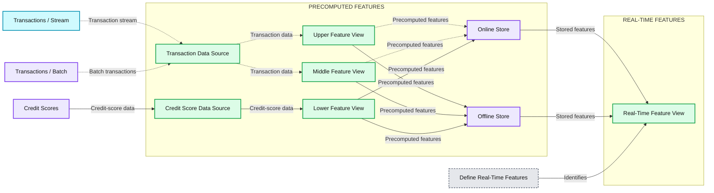

# How Do Real-Time Features Work in Machine Learning?

- Source: https://www.databricks.com/blog/how-do-real-time-features-work-in-machine-learning
- Published: 2025-07-18
- Authors: Sanika Natu
- Categories: data-science-machine-learning
- Images: 1 total, 1 extracted as architecture

From [detecting fraudulent transactions](https://www.tecton.ai/blog/detecting-and-preventing-fraud-with-machine-learning/) in milliseconds to delivering recommendations for new products while a customer shops, real-time machine learning is gaining traction. For use cases like these, models need access to extremely current, fresh context through *real-time features*.

In this post, I’ll give an overview of real-time features—the benefits, the importance of accurate and efficient data pipelines, and a step-by-step guide on how to build your own data pipelines.

## What are real-time features in ML?

ML features are transformations of raw data that are used as input signals for ML models. In feature pipelines, there are two categories of features: pre-computed and real-time features.

1. **Pre-computed features** are materialized ahead of prediction time and can be stored in a feature store, only to be used by a model both during training and when a prediction is needed. Typically, they are computed by transforming batch or streaming data.
2. **Real-time features** are features that are computed at prediction time; i.e., at the same time a request is made to the model. They may use request data, materialized data from the feature store, or a combination of both.

[Real-time feature pipelines](https://www.tecton.ai/blog/why-real-time-data-pipelines-are-hard/) typically contain the context that is necessary for making a prediction but wouldn’t be possible to compute ahead of time. An example would be a model on a shopping site that needs context such as a user’s current shopping cart state in order to serve the most accurate, personalized product recommendations.

Real-time features can also be used to compare some current context to historical data—a fraud model, for instance, might compare a customer’s current purchase details with their historical averages to determine if the purchase is suspicious. Finally, real-time features can be helpful in computing more advanced features, such as feature crosses, which tap into non-linear interactions that can extract more nuanced insights from data.

## Performance benefits of real-time features for ML

Not only are real-time features essential for many real-time ML use cases, they have a number of added benefits, too. They can lead to lower feature storage and feature computation costs, because on-demand feature views (ODFVs) for serving real-time features do not materialize data in the feature store. This is especially useful when it would be expensive to compute all possible feature crosses over your entire data source as opposed to computing feature crosses over just the training and inference data samples.

Real-time features could also reduce costs related to third-party requests for users on a website where most users don’t show up often. For example, a user looking to renew their insurance policy annually may not show up to the insurance website very often, but real-time requests can be made to fetch the most relevant quotes related to a user’s inputs. With real-time features, third-party data is only requested for users that land on your site to retrieve fresh features, which translates into reduced costs due to fewer requests.

Second, real-time features can result in more stable ML pipelines. When working with feature embeddings, for instance, it’s often necessary to use expensive dimensionality reduction techniques before inputting features into a model. Embeddings are often not stable and may change frequently, so you would instead want to store stable user and product data in your database, and compute embeddings on-the-fly with the latest version of your embedding model.

Finally, real-time features can be easier to work with and build upon than their pre-computed counterparts. With real-time features, there’s no waiting for features to be materialized or concern about how features are stored. This simplicity makes it easier to integrate new real-time features into your pipelines, leading to quicker development processes and more effortless iterations.

## How real-time features work in Tecton

Tecton’s On-Demand Feature Views (ODFVs) allow you to create your own real-time feature pipelines customized to your use case. These real-time features can be easily defined as a standard Python transformation. ODFVs operate similarly to how Tecton Batch and Stream Feature Views work, but instead of only performing transformations on data sources, they can perform transformations on request sources and pre-computed feature sources. In using Batch/Stream Feature Views and ODFVs, the entire real-time feature pipeline can be defined in Python using Tecton’s declarative feature engineering framework.

ODFVs are included in a feature service, just like batch or streaming feature views; however, instead of materializing features into your feature store, any computations are executed at request time. In the diagram below, you can see that while standard feature views materialize data in an offline and online feature store, ODFVs are added at the end of the feature service pipeline in order to compute features ad-hoc and in real time.

**Summary:** Tecton connects transaction and credit-score sources to precomputed feature views and online/offline stores, then supplies a real-time feature view.

**Components:**

- Transactions / Stream: streaming transaction input; technology unspecified.
- Transactions / Batch: batch transaction storage; technology unspecified.
- Credit Scores: credit-score storage; technology unspecified.
- Data Source, upper: Tecton source for transaction inputs.
- Data Source, lower: Tecton source for credit scores.
- Feature View, upper: Tecton precomputed transaction features.
- Feature View, middle: Tecton precomputed transaction features.
- Feature View, lower: Tecton precomputed credit-score features.
- Online Store: online feature storage; technology unspecified.
- Offline Store: offline feature storage; technology unspecified.
- Feature View, right: Tecton real-time feature computation.
- Define Real-Time Features: callout pointing to the rightmost feature view.
- PRECOMPUTED FEATURES: region containing sources, precomputed views, and stores.
- REAL-TIME FEATURES: region containing the rightmost feature view.

**Flows:**

- Transactions / Stream -> Upper Data Source: transaction stream.
- Transactions / Batch -> Upper Data Source: batch transactions.
- Upper Data Source -> Upper Feature View: transaction data.
- Upper Data Source -> Middle Feature View: transaction data.
- Credit Scores -> Lower Data Source: credit-score data.
- Lower Data Source -> Lower Feature View: credit-score data.
- Upper Feature View -> Online Store: precomputed features, highlighted with a dashed blue path.
- Upper Feature View -> Offline Store: precomputed features.
- Middle Feature View -> Online Store: precomputed features, highlighted with a dashed blue path.
- Middle Feature View -> Offline Store: precomputed features.
- Lower Feature View -> Online Store: precomputed features.
- Lower Feature View -> Offline Store: precomputed features.
- Online Store -> Right Feature View: stored features for real-time computation.
- Offline Store -> Right Feature View: stored features for real-time computation.
- Define Real-Time Features -> Right Feature View: annotation identifying real-time computation.

**Numbers:** none

source image: https://www.databricks.com/sites/default/files/inline-images/how-do-real-time-features-work-machine-learning-blog-imgs-1.png

### Example: Tecton On-Demand Feature View

Imagine that you are a retail company looking to recommend relevant products based on a user’s search query. You would be able to pre-compute and store product attributes in advance, but a user’s search item would only be available once a user landed on the website and entered their query. Thus, to serve relevant product recommendations, you would want to compute the similarity between a product name and a search query in real time. First, you might define your batch feature view to store product attributes as shown below:

Then, you would define your ODFV to compute the similarity between a product and a search query as shown below:

After creating your ODFV, requests that happen in real time can now be transformed into real-time features that your model can consume to recommend relevant products.
