# How DuPont achieved 11x latency reduction and 4x cost reduction with Photon

- Source: https://www.databricks.com/blog/how-dupont-achieved-11x-latency-reduction-and-4x-cost-reduction-photon
- Published: 2022-10-04
- Authors: Basant Aggarwal, Romain Fardel, John Cannarella, Ankur Dave, Justin Breese
- Categories: company, customers, data-warehousing
- Images: 1 total, 1 extracted as architecture

This is a collaborative post from Databricks and DuPont. We thank Basant Aggarwal (Lead Enterprise Architect), Romain Fardel (Senior Data Scientist), and John Cannarella (Data Science Leader) of Dupont for their contributions.

Databricks was fortunate enough to work with DuPont recently on providing more timely insight into production data at their 134 worldwide production sites. With the [Databricks Photon engine](https://www.databricks.com/product/photon), they were able to reduce their TCO by 4x, their latency by 11x, and bring a viable solution into production in record time.

## Business problem

DuPont is a premier multi-industrial company based in Wilmington, Delaware. They are a global innovation leader with technology-based materials, solutions, and expertise. DuPont serves many essential and growing global markets including electronics, water, protection, industrial technologies, and next-generation automotive.

Every day, senior business leaders are consuming manufacturing production data and hundreds of analysts are looking to drill down to individual manufacturing orders. There was not a single source of truth for data and large - and frail - spreadsheets were how people were making key business decisions. To make things more complicated: the source systems refresh at 4am and the reports need to be made available by 6am.

Trying to align key stakeholders across operations, supply chain, and finance on a common set of KPIs was causing a lot of pain throughout the many sites.

## Development process

Back in May of 2022, DuPont started working with Azure Databricks in order to modernize this workflow. Nearly 120 Delta Lake tables are joined together, consisting of aggregated data from subsidiaries across the world, producing more than 100M records. DuPont first started doing their development with Databricks Runtime (DBR). They were able to start development and have a proof of concept working in a short amount of time. The following is the architecture that they settled on:

**Summary:** The diagram shows SAP data flowing through Azure Data Factory into Delta Lake on Databricks, with Photon and Databricks SQL supporting Power BI analysis.

**Components:**

- SAP BW/4HANA
- Azure Data Factory
- Databricks
- Delta Lake
- Photon compute
- Delta Lake tables
- Databricks SQL
- Power BI
- Analysts

**Flows:**

- SAP BW/4HANA -> Azure Data Factory: source data
- Azure Data Factory -> Photon: ingested data
- Photon -> Delta Lake tables: transformed data
- Delta Lake tables -> Photon: queried table data
- Photon -> Databricks SQL: processed query results
- Power BI -> Databricks SQL: analytics queries
- Analysts -> Power BI: analysis

**Numbers:** none

```mermaid
%% Shows SAP data ingestion into Delta Lake and BI analysis through Databricks SQL
flowchart LR
    A[SAP BW/4HANA] -->|source data| B[Azure Data Factory]
    B -->|ingested data| C[Photon ingestion]
    C -->|transformed data| D[Delta Lake tables]
    D -->|queried table data| E[Photon query]
    E -->|processed query results| F[Databricks SQL]
    G[Power BI] -->|analytics queries| F
    H[Analysts] -->|analysis| G

    classDef client fill:#dbeafe,stroke:#2563eb,stroke-width:2px,color:#111
    classDef service fill:#dcfce7,stroke:#16a34a,stroke-width:2px,color:#111
    classDef store fill:#ede9fe,stroke:#7c3aed,stroke-width:2px,color:#111
    classDef cache fill:#fef3c7,stroke:#d97706,stroke-width:2px,color:#111
    classDef queue fill:#cffafe,stroke:#0891b2,stroke-width:2px,color:#111
    classDef critical fill:#fee2e2,stroke:#dc2626,stroke-width:4px,color:#111
    classDef external fill:#e5e7eb,stroke:#6b7280,stroke-width:2px,color:#111,stroke-dasharray:4 3
    classDef decision fill:#fce7f3,stroke:#db2777,stroke-width:2px,color:#111

    class A,G external
    class B,C,E,F service
    class D store
    class H client
```

source image: https://www.databricks.com/sites/default/files/inline-images/db-348-blog-img-1.png

However, after the POC successfully ran, they were faced with the daunting question that is all too common in development: to optimize or not to optimize? The team was on a tight timeline (ASAP) and this job was too expensive and the 5.5 hour duration was not meeting their SLA in its current state. At DuPont, the development team had recently learned about Photon via the account team; the next generation engine on the Databricks Lakehouse Platform that provides extremely fast query performance at a low cost.

Romain Fardel, a Data Scientist, said, "We decided to give Photon a try, we changed nothing in our code, we just selected Photon as the runtime."

## Results

By leveraging Photon and not changing anything in their code, the team was able to realize some impressive results. They were able to reduce their TCO by 4x and their latency by 11x.

| Databricks Runtime | Duration | Cost |
|---|---|---|
| **DBR 11.1** | 5.5 hours | $256 |
| **Photon** | 25 minutes | $65 |

Upon seeing the results, Basant Aggarwal, Lead Architect at Dupont, said that, "Photon optimized our pipeline. It enabled us to do a computationally inefficient approach and get something into production ASAP; it allowed us to iterate at unprecedented speed and not have to worry about tuning." This enabled the DuPont team to have a viable production candidate very quickly.

> "Having this dataset in the lakehouse allows us to iterate in near real time with operations analysts, which is probably the primary value driver since the majority of our effort is spent aligning key stakeholders across operations, supply chain, and finance on a common set of KPIs." – John Cannarella, a Data Science Leader at DuPont

## About DuPont

DuPont is a global innovation leader with technology-based materials and solutions that help transform industries and everyday life. Our employees apply diverse science and expertise to help customers advance their best ideas and deliver essential innovations in key markets including electronics, transportation, construction, water, healthcare and worker safety. More information about the company, its businesses, and solutions can be found at [www.dupont.com](http://www.dupont.com) or on their [LinkedIn](https://www.linkedin.com/company/dupont/) page.

## About Photon

Photon is the next generation engine on the Databricks Lakehouse Platform that provides extremely fast query performance at low cost – from data ingestion, ETL, streaming, data science and interactive queries – directly on your data lake. Photon is compatible with Apache Spark™ APIs, so getting started is as easy as turning it on – no code changes and no lock-in.

To learn more about Databricks Photon, please check out the Photon [homepage](https://www.databricks.com/product/photon).
