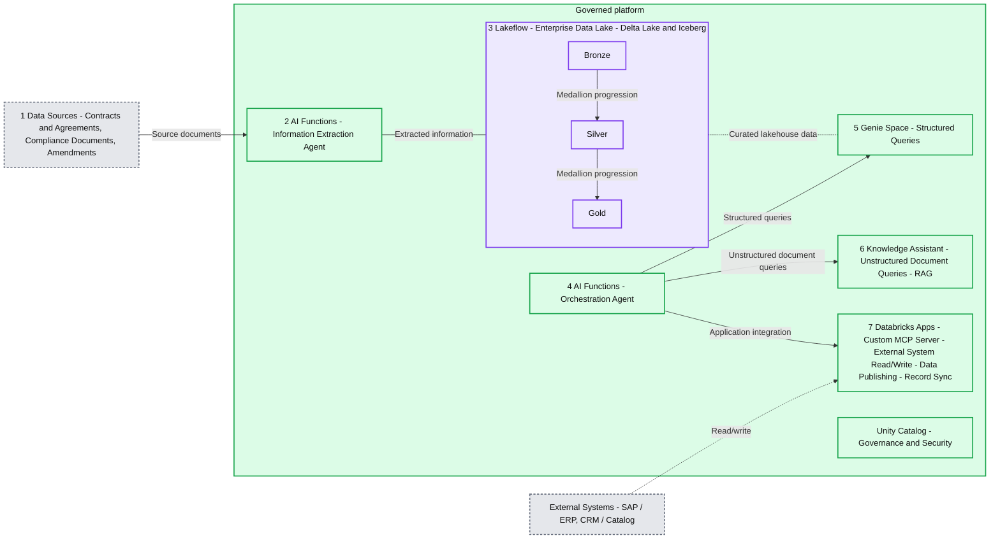

# How to transform document activation workflows with Genie and Agent Bricks

*Turn documents into valuable business insights with Databricks*

- Source: https://www.databricks.com/blog/how-transform-document-activation-workflows-genie-and-agent-bricks
- Published: 2026-04-22
- Authors: Elena Tesser
- Categories: solutions, data-science-machine-learning, databricks-ai, media-and-entertainment, telecommunications, data-leader, customers
- Images: 2 total, 1 extracted as architecture

**Key takeaways**

- -Manual document extraction workflows in industries like media, communications and gaming slow teams down, leaking revenue and increasing compliance risk. -Enterprises can bring together AI/BI Genie, Agent Bricks and Unity Catalog to establish a rigorous multi-agent workflow that can convert key documents across marketing, legal, finance, HR, and more into governed, searchable and actionable data. -Moving from extraction to multi-agent orchestration and system write-back, organizations can flow seamlessly from processing, to reading, to activating their documents

## **There is a document intelligence gap in today’s enterprise**

Organizations run on mountains of documents, from contracts, to employment agreements, talent agreements and NDAs, to advertising insertion orders and master service agreements and more.  Each document contains valuable insight into potential revenue, risk and obligation, yet the way most organizations work with them hasn’t changed much in decades.

Yet today, even as organizations are increasingly integrating AI to help them move faster, many teams still rely on humans to read PDFs, copy fields into spreadsheets, and re-enter data into ERP, CRM and planning systems.  It’s all creating significant risk; manual processing workflows lead to delays and potential revenue loss due to human error, while lack of governance means that teams cannot reliably audit their reporting.

## **Point tools and legacy architectures are falling short**

Leaders understand that AI automation can* *help them overcome these challenges.  However, many are reticent to fully integrate AI into their workflows, as early investments like OCR engines, contract lifecycle management systems, and domain-specific point solutions have often under-delivered.  Even as organizations experiment with GenAI, many finance, legal and operations teams still report little realized value from AI investments. The issue, however, is not AI automation itself, but the fragmented, incomplete data foundations these early tools sit on.  

Without a unified, well-governed data foundation, they lack industry and organizational context, are siloed from key enterprise systems, are only built for reading, not activating.  Even worse, when you attempt to build an agent workflow on top, you get an experience that is disjointed, inconsistent, and impossible to scale.

## **Taking a platform approach to document activation **

The watershed moment for document intelligence comes when an enterprise evolves from managing workflows with point tool solutions to **building them on a unified, governed data foundation.**  This shift opens the door for a truly unified, scalable multi-agent experience that enables technical and non-technical users alike to query their structured and unstructured business data, and then take appropriate action on that data.

Three core Databricks capabilities make this possible:

- [**AI/BI Genie**](https://www.databricks.com/product/business-intelligence/genie): an AI-native BI experience that lets business users ask questions in natural language over governed Delta tables, without writing SQL.
- [**Agent Bricks**:](https://www.databricks.com/product/artificial-intelligence/agent-bricks) reusable building blocks for high-quality, production-grade agents, including information extraction, knowledge assistants and orchestration, that are built and optimized on your data rather than as one-off prototypes.
- [**Unity Catalog**](https://www.databricks.com/product/unity-catalog): unified governance, lineage and fine-grained access control across data, AI agents and even MCP servers, from source document through agent response and system write-back.

## **The multi-agent document activation workflow**

On top of this foundation, we implement a phased **document activation** workflow that technical and non-technical teams can adopt and replicate step-by-step.

**Summary:** Document activation connects source documents to AI extraction, Lakeflow storage, structured and unstructured querying, and external system integration under Unity Catalog governance.

**Components:**
- Data Sources: contracts and agreements, compliance documents, and amendments.
- AI Functions - Information Extraction Agent: extracts information from documents.
- Lakeflow - Enterprise Data Lake: structured and enriched data organized as Bronze, Silver, and Gold, using Delta Lake and Iceberg.
- AI Functions - Orchestration Agent: connects to query services and application integration.
- Genie Space: structured queries over all curated data in the lakehouse.
- Knowledge Assistant: unstructured document queries using RAG over original source documents.
- Databricks Apps: custom MCP server, external system read/write, data publishing, and record sync.
- External Systems: SAP / ERP and CRM / Catalog.
- Unity Catalog: governance and security.

**Flows:**
- Data Sources -> Information Extraction Agent: source documents for extraction.
- Information Extraction Agent -> Lakeflow: extracted information; connection has no arrowhead.
- Bronze -> Silver: medallion progression.
- Silver -> Gold: medallion progression.
- Lakeflow -> Genie Space: dotted connection for curated data querying; no arrowhead shown.
- Orchestration Agent -> Genie Space: structured queries.
- Orchestration Agent -> Knowledge Assistant: unstructured document queries.
- Orchestration Agent -> Databricks Apps: application integration.
- External Systems -> Databricks Apps: dotted read/write connection.

**Numbers:** Numbered component markers: 1 - Data Sources; 2 - Information Extraction Agent; 3 - Lakeflow; 4 - Orchestration Agent; 5 - Genie Space; 6 - Knowledge Assistant; 7 - Databricks Apps.

source image: https://www.databricks.com/sites/default/files/inline-images/image_96.png?v=1776883284

### **Phase 1 - Extract: From PDFs to governed Delta tables**

In Phase 1, the **Information Extraction Agent** uses LLM-based extraction to convert unstructured documents (PDF, DOC/DOCX, PPT/PPTX, images) into structured fields, without building custom OCR pipelines or one-off parsers.

The raw outputs land in a **Lakeflow medallion** pipeline:

- **Bronze**: raw extracted fields as-is.
- **Silver**: cleaned and standardized values, with canonical IDs resolved and codes normalized.
- **Gold**: business-ready tables optimized for querying and analytics.

This extraction runs at ingestion time, not at query time, so everything downstream builds on a consistent, governed data foundation.

### **Phase 2: Query - Self-serve analytics with Genie**

Once key terms are structured in Delta tables, **AI/BI Genie** gives business users a self-serve interface to ask questions in plain English.

Point Genie at the gold-layer tables, and users can ask questions like “Which contracts are expiring next quarter in EMEA?” or “Which publisher agreements have revenue share tiers that activate above a given spend threshold?” Genie then translates these queries into SQL, enforces Unity Catalog permissions, and returns tabular or visual results, eliminating the analyst bottleneck while keeping data access governed.

### **Phase 3: Understand - Clause-level answers with Knowledge Assistant**

Some questions can’t be answered from aggregates alone. Legal, rights and compliance teams often need to know **exactly what a specific clause says**.

Here, a **Knowledge Assistant**, a RAG-based conversational agent, runs directly over the original source documents stored in Unity Catalog Volumes.

It can answer questions such as, “What are the sublicensing restrictions in the Warner deal?” or “Do we have SVOD rights for Show X in France in 2027, and are they exclusive?”  The assistant then returns clause-level snippets with **citations back to the original PDFs**, maintaining full traceability.

### **Phase 4: Orchestrate — one front door with a multi-agent supervisor**

As you add more agents, you don’t want users to decide which tool to open for each question.

The **Multi-Agent Supervisor** acts as a single conversational entry point that analyzes each query and routes it to the right specialist:

- Structured questions → Genie Spaces
- Clause-level questions → Knowledge Assistant
- System actions → MCP-based connectors and downstream flows

Users simply ask their question and the supervisor selects the right path, combining unstructured and structured context when needed.

### **Phase 5: Act — from insight to system updates with MCP**

Finally, **MCP servers** turn document understanding into action by wrapping external system APIs (ERP, HRIS, CRM, ad platforms, rights systems, Slack) as tools the supervisor can call.

This allows you to take the best course of action based on the extracted data and organizational context.  Examples include::

- Pushing validated rights data into SAP and sync it with a title catalog or CRM.
- Updating entitlements and bundles in billing and customer care systems based on extracted terms.
- Triggering workflows in ticketing or project management tools when regulatory deadlines or make-good obligations are detected.

Last, because all of this is governed by **Unity Catalog**, every field remains traceable back to the document it came from, with lineage and audit trails across agents and system write-back.

## **Industry-specific use cases across media, agencies, ad tech and telecom**

This document activation workflow can apply across a wide range of industries and use cases.  However, it can be especially impactful for industries like Telecommunications and Media and Entertainment, where customers stand on vast amounts of rapidly evolving structured and unstructured data within their documents.  No matter the business need or persona, there is an application for turning relevant documents into clean, governed insights and the appropriate next action.

- **Media publishers and studios**
  - Track rights and licensing contracts, answer questions like “Do we have streaming rights for Title X in Germany through 2027?” and proactively flag contracts expiring in the next 90 days.
  - Extract revenue share and distribution terms into structured tables and pipeline validated numbers into ERP and planning systems.

- **Media agencies**
  - Extract rate cards, AVB thresholds and billing triggers from media buying contracts, and reconcile them automatically against delivery and spend.
  - Structure client briefs and research reports into reusable data for planning systems and campaign analytics.
- **Ad tech platforms**
  - Activate privacy regulations and ad policy documents to answer “Which active regulations require opt-out mechanisms for behavioral targeting?” and enforce controls in consent and policy engines.
  - Track data license and API terms to prevent non-compliant model training or activation.
- **Telecommunications providers**
  - Manage service and wholesale agreements, roaming and interconnect deal terms, and tower leases, with clear visibility into SLAs, escalators and renewal windows.
  - Govern customer entitlements and bundles end-to-end, syncing validated rights to billing, CRM and support systems.

Across these scenarios, customers see improvements like faster month-end close, recovered revenue, reduced leakage, and lower operational risk, all while reducing manual effort for finance, legal, operations and marketing teams.

## **What's next**

If your teams are still relying on manual document workflows and disconnected tools, now is the time to modernize document intelligence on a governed data and AI platform.

- **Explore  Databricks **for [media, entertainment](https://www.databricks.com/solutions/industries/media-and-entertainment) and [telecommunications](https://www.databricks.com/solutions/industries/communications) to see how contracts, policies and agreements fit into your broader data strategy.
- **Talk to your Databricks account team** about a focused document activation proof of value, starting with one high-impact use case and a single line of business.
- **Dive deeper into customer stories** like [SEGA](https://www.databricks.com/customers/sega), [First American](https://www.databricks.com/customers/fadna), and [Vale](https://www.databricks.com/customers/vale/agent-bricks) to see how organizations are already turning unstructured documents into governed, actionable data at scale.

By unifying extraction, querying, RAG, orchestration and system write-back on Databricks, you can move beyond simply “reading documents” to activating them, in turn unlocking new revenue, reducing risk and freeing up your teams to focus on higher-value work.
