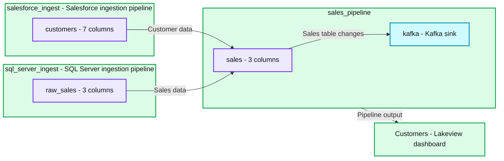

# Introducing Databricks Lakeflow: A unified, intelligent solution for data engineering

*Ingest data from databases, enterprise apps and cloud sources, transform it in batch and real-time streaming, and confidently deploy and operate in production.*

- Source: https://www.databricks.com/blog/introducing-databricks-lakeflow
- Published: 2024-06-13
- Authors: Michael Armbrust, Bilal Aslam
- Categories: platform, announcements, product, data-engineering
- Images: 3 total, 2 extracted as architecture

Today, we are excited to announce Databricks Lakeflow, a new solution that contains everything you need to build and operate production data pipelines. It includes new native, highly scalable connectors for databases like SQL Server and for enterprise applications like Salesforce, Workday, Google Analytics, ServiceNow, and SharePoint. Users can transform data in batch and streaming using standard SQL and Python. We are also announcing Real Time Mode for Apache Spark, allowing stream processing at orders of magnitude faster latencies than microbatch. Finally, you can orchestrate and monitor workflows and deploy to production using CI/CD. Databricks Lakeflow is native to the Data + AI Platform, providing serverless compute and unified governance with Unity Catalog.

*LakeFlow is the one unified data engineering solution for ingestion, transformation and orchestration*

**Summary:** Lakeflow unifies ingestion, transformation and orchestration, supported by Data Intelligence, Unity Catalog governance and Serverless Compute.

**Components:**
- Lakeflow: enclosing unified data engineering solution.
- Ingest: Connect, marked Private Preview.
- Transform: Pipelines, marked Coming Soon.
- Orchestrate: Jobs, marked Coming Soon.
- Powered by Data Intelligence.
- Governance with Unity Catalog.
- Efficiency with Serverless Compute.

**Flows:**
- None. No arrows are visible.

**Numbers:** none

```text
%% mermaid failed to render; kept as text
%% Lakeflow capabilities and supporting technologies
flowchart TD
    subgraph Lakeflow
        I[Ingest]
        C[Connect | Private Preview]
        T[Transform]
        P[Pipelines | Coming Soon]
        O[Orchestrate]
        J[Jobs | Coming Soon]
    end
    D[Powered by Data Intelligence]
    U[Governance with Unity Catalog]
    S[Efficiency with Serverless Compute]

    classDef client fill:#dbeafe,stroke:#2563eb,stroke-width:2px,color:#111
    classDef service fill:#dcfce7,stroke:#16a34a,stroke-width:2px,color:#111
    classDef store fill:#ede9fe,stroke:#7c3aed,stroke-width:2px,color:#111
    classDef cache fill:#fef3c7,stroke:#d97706,stroke-width:2px,color:#111
    classDef queue fill:#cffafe,stroke:#0891b2,stroke-width:2px,color:#111
    classDef critical fill:#fee2e2,stroke:#dc2626,stroke-width:4px,color:#111
    classDef external fill:#e5e7eb,stroke:#6b7280,stroke-width:2px,color:#111,stroke-dasharray:4 3
    classDef decision fill:#fce7f3,stroke:#db2777,stroke-width:2px,color:#111
    class I,C,T,P,O,J,D,U,S service
```

<sub>source image: https://www.databricks.com/sites/default/files/inline-images/lakeflow-image.png</sub>

LakeFlow is the one unified data engineering solution for ingestion, transformation and orchestration

In this blog post we discuss the reasons why we believe Lakeflow will help data teams meet the growing demand of reliable data and AI as well as Lakeflow’s key capabilities integrated into a single product experience.

## Challenges in building and operating reliable data pipelines

Data engineering - collecting and preparing fresh, high-quality and reliable data - is a necessary ingredient for democratizing data and AI in your business. Yet achieving this remains full of complexity and requires stitching together many different tools.

 

First, data teams need to ingest data from multiple systems each with their own formats and access methods. This requires building and maintaining in-house connectors for databases and enterprise applications. Just keeping up with enterprise applications’ API changes can be a full-time job for an entire data team. Data then needs to be prepared in both batch and streaming, which requires writing and maintaining complex logic for triggering and incremental processing. When latency spikes or a failure occurs, it means getting paged, a set of unhappy data consumers and even disruptions to the business that affect the bottom line. Finally, data teams need to deploy these pipelines using CI/CD and monitor the quality and lineage of data assets. This normally requires deploying, learning and managing another entirely new tool like Prometheus or Grafana.

 

This is why we decided to build Lakeflow, a unified solution for data ingestion, transformation, and orchestration powered by data intelligence. Its three key components are: Lakeflow Connect, Lakeflow Pipelines and Lakeflow Jobs.

## Lakeflow Connect: Simple and scalable data ingestion 

Lakeflow Connect provides point-and-click data ingestion databases such as SQL Server and enterprise applications such as Salesforce, Workday, Google Analytics, and ServiceNow. The roadmap also includes databases like MySQL, Postgres, and Oracle, as well as enterprise applications like NetSuite, Dynamics 365, and Google Ads. Lakeflow Connect can also ingest unstructured data such as PDFs and Excel spreadsheets from sources like SharePoint.

 

It supplements our popular native connectors for cloud storage (e.g. S3, ADLS Gen2 and GCS) and queues (e.g. Kafka, Kinesis, Event Hub and Pub/Sub connectors), and partner solutions such as Fivetran, Qlik and Informatica.

Setup an ingestion pipeline in a few easy steps with LakeFlow Connect

We are particularly excited about database connectors, which are powered by our [acquisition of Arcion](https://www.databricks.com/blog/databricks-arcion-real-time-enterprise-data-replication-lakehouse). An incredible amount of valuable data is locked away in operational databases. Instead of naive approaches to load this data, which hit operational and scaling issues, Lakeflows uses change data capture (CDC) technology to make it simple, reliable and operationally efficient to bring this data to your lakehouse.

 

Databricks customers who are using Lakeflow Connect find that a simple ingestion solution improves productivity and lets them move faster from data to insights. Insulet, a manufacturer of a wearable insulin management system, the Omnipod, uses the Salesforce ingestion connector to ingest data related to customer feedback into their data solution which is built on Databricks. This data is made available for analysis through Databricks SQL to gain insights regarding quality issues and track customer complaints. The team found significant value in using the new capabilities of Lakeflow Connect.

> "With the new Salesforce ingestion connector from Databricks, we've significantly streamlined our data integration process by eliminating fragile and problematic middleware. This improvement allows Databricks SQL to directly analyze Salesforce data within Databricks. As a result, our data practitioners can now deliver updated insights in near-real time, reducing latency from days to minutes." —Bill Whiteley, Senior Director of AI,  Analytics, and Advanced Algorithms, Insulet

## Lakeflow Pipelines: Efficient declarative data pipelines

Lakeflow Pipelines lower the complexity of building and managing efficient batch and streaming data pipelines. Built on the declarative [Delta Live Tables](https://www.databricks.com/product/delta-live-tables) framework, they free you up to write business logic in SQL and Python while Databricks automates data orchestration, incremental processing and compute infrastructure autoscaling on your behalf. Moreover, Lakeflow Pipelines offers built-in data quality monitoring and its Real Time Mode lets you enable consistently low-latency delivery of time-sensitive datasets without any code changes.

*LakeFlow Pipelines simplifies data pipeline automation*

**Summary:** Salesforce and SQL Server ingestion pipelines feed a sales pipeline containing sales and Kafka nodes, which connects to a Customers dashboard.

**Components:**

- salesforce_ingest: Salesforce ingestion pipeline containing the customers table.
- customers: Ingested table with 7 columns.
- sql_server_ingest: SQL Server ingestion pipeline containing the raw_sales table.
- raw_sales: Ingested table with 3 columns.
- sales_pipeline: Pipeline containing sales and kafka.
- sales: Table with 3 columns.
- kafka: Kafka sink defined in SQL with broker `kafka1.databricks.com`.
- Customers: Lakeview dashboard.

**Flows:**

- salesforce_ingest -> sales_pipeline: Customer data from customers.
- sql_server_ingest -> sales_pipeline: Sales data from raw_sales.
- sales -> kafka: Sales table changes, as specified by the visible SQL.
- sales_pipeline -> Customers: Pipeline output for the dashboard.

**Numbers:**

- customers: 7 columns.
- raw_sales: 3 columns.
- sales: 3 columns.
- Last edit: 1 hour ago.
- SQL editor line numbers: 1 through 9.
- Kafka broker hostname includes the digit 1: `kafka1.databricks.com`.



<sub>source image: https://www.databricks.com/sites/default/files/inline-images/lakeflow-pipelines.png</sub>

LakeFlow Pipelines simplifies data pipeline automation

## Lakeflow Jobs: Reliable orchestration for every workload

Lakeflow Jobs reliably orchestrates and monitors production workloads. Built on the advanced capabilities of [Databricks Workflows](https://www.databricks.com/product/workflows), it orchestrates any workload, including ingestion, pipelines, notebooks, SQL queries, machine learning training, model deployment and inference. Data teams can also leverage triggers, branching and looping to meet complex data delivery use cases.

 

Lakeflow Jobs also automates and simplifies the process of understanding and tracking data health and delivery. It takes a data-first view of health, giving data teams full lineage including relationships between ingestion, transformations, tables and dashboards. Additionally, it tracks data freshness and quality, allowing data teams to add monitors via Lakehouse Monitoring with the click of a button.

## Built on the Data + AI Platform

Databricks Lakeflow is natively integrated with our Data + AI Platform, which brings these capabilities:

- **Data intelligence:** AI-powered intelligence is not just a feature of Lakeflow, it is a foundational capability that touches every aspect of the product. [Databricks Assistant](https://www.databricks.com/product/databricks-assistant) powers the discovery, authoring and monitoring of data pipelines, so you can spend more time building reliable data.
- **Unified governance:** Lakeflow is also deeply integrated with [Unity Catalog](https://www.databricks.com/product/unity-catalog), which powers lineage and data quality. 
- **Serverless compute:** Build and orchestrate pipelines at scale and help your team focus on work without having to worry about infrastructure.

## The future of data engineering is simple, unified and intelligent

We believe that Lakeflow will enable our customers to deliver fresher, more complete and higher-quality data to their businesses. Lakeflow will enter preview soon starting with [Lakeflow Connect](https://www.databricks.com/product/data-ingestion). If you would like to request access, [sign up here](https://www.databricks.com/resources/other/request-access-lakeflow-connectors). Over the coming months, look for more Lakeflow announcements as additional capabilities become available.

## Want to see it in action?

[Try the Lakeflow Product Tour](https://www.databricks.com/resources/demos/tours/platform/discover-databricks-lakeflow-connect-demo?itm_data=demo_center) to seamlessly ingest, transform, and deploy data from multiple sources in both batch and real-time to production.
