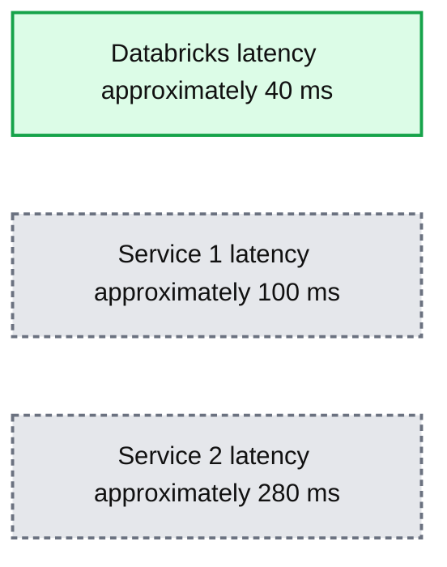

# Introducing Databricks AI Search Public Preview

- Source: https://www.databricks.com/blog/introducing-databricks-vector-search-public-preview
- Published: 2023-12-07
- Authors: Akhil Gupta, Sergei Tsarev, Eric Peter
- Categories: announcements, engineering
- Images: 5 total, 1 extracted as architecture

Following the [announcement](https://www.databricks.com/blog/building-high-quality-rag-applications-databricks) we made yesterday around [Retrieval Augmented Generation (RAG)](https://www.databricks.com/glossary/retrieval-augmented-generation-rag#:~:text=Retrieval%20augmented%20generation%20or%20RAG%20is%20an%20architectural%20approach%20that,as%20context%20for%20the%20LLM.), today, we’re excited to announce the public preview of Databricks AI Search. We [announced](https://www.databricks.com/company/newsroom/press-releases/databricks-introduces-new-generative-ai-tools-investing-lakehouse) the private preview to a limited set of customers at the Data + AI Summit in June, which is now available to all our customers. Databricks AI Search enables developers to improve the accuracy of their Retrieval Augmented Generation (RAG) and generative AI applications through similarity search over unstructured documents such as PDFs, Office Documents, Wikis, and more. AI Search is part of the [Databricks Data + AI Platform](https://www.databricks.com/product/data-intelligence-platform), making it easy for your RAG and Generative AI applications to use the proprietary data stored in your Lakehouse in a fast and secure manner and deliver accurate responses.  

 

We designed Databricks AI Search to be fast, secure and easy to use.

- **Fast with low TCO** -  AI Search is designed to deliver high performance at lower TCO, with up to 5x lower latency than other providers
- **Simple, fast developer experience** - AI Search makes it possible to synchronize any Delta Table into a vector index with 1-click - no need for complex, custom built data ingestion/sync pipelines.
- **Unified Governance **- AI Search uses the same Unity Catalog-based security and data governance tools that already power your Data + AI Platform, meaning you do not have to build and maintain a separate set of data governance policies for your unstructured data
- **Serverless Scaling **- Our serverless infrastructure automatically scales to your workflows without the need to configure instances and server types. 

## What is vector search?

AI Search is a method used in information retrieval and Retrieval Augmented Generation (RAG) applications to find documents or records based on their similarity to a query. Vector search is why you can type a plain language query such as “blue shoes that are good for friday night” and get back relevant results.  

Tech giants have used vector search for years to power their product experiences - with the advent of Generative AI, these capabilities are finally democratized to all organizations.
Here's a breakdown of how AI Search works:

 

**Embeddings**: In vector search, data and queries are represented as vectors in a multi-dimensional space called embeddings from a Generative AI model. 
Let’s take a simple example where we want to use vector search to find semantically similar words in a large corpus of words. So, if you query the corpus with the word ‘dog’, you want words like ‘puppy’ to be returned. But, if you search for ‘car’, you want to retrieve words like ‘van’. In traditional search, you will have to maintain a list of synonyms or “similar words” which is hard to generate or scale. In order to use vector search, you can instead use a Generative AI model to convert these words into vectors in a n-dimensional space called embeddings. These vectors will have the property that semantically similar words like ‘dog’ and ‘puppy’ will be closer to each in the n-dimensional space than the words ‘dog’ and ‘car’.

**Similarity Calculation**: To find relevant documents for a query, the similarity between the query vector and each document vector is calculated to measure how close they are to each other in the n-dimensional space. This is typically done using cosine similarity, which measures the cosine of the angle between the two vectors. There are several algorithms that are used to find similar vectors in an efficient manner, with HNSW based algorithms consistently being best in class performance.

 

**Applications**: AI Search has many use cases:

- Recommendations - personalized, context aware recommendations to users
- RAG - delivering relevant unstructured documents to help a RAG application answer user’s questions
- Semantic search - enabling plain language search queries that deliver relevant results
- Document clustering - understand similarities and differences between data

## Why do customers love Databricks AI Search?

> "We are thrilled to leverage Databricks' powerful solutions to transform our customer support operations at Lippert. Managing a dynamic call center environment for a company our size, the challenge of bringing new agents up to speed amidst the typical agent churn is significant. Databricks provides the key to our solution - by setting up an agent-assist experience powered by AI Search, we can empower our agents to swiftly find answers to customer inquiries. By ingesting content from product manuals, YouTube videos, and support cases into our AI Search, Databricks ensures our agents have the knowledge they need at their fingertips. This innovative approach is a game-changer for Lippert, enhancing efficiency and elevating the customer support experience.”-Chris Nishnick, Artificial Intelligence, Lippert

Automated Data Ingestion

Before a vector database can store information, it requires a data ingestion pipeline where raw, unprocessed data from various sources need to be cleaned, processed (parsed/chunked), and embedded with an AI model before it is stored as vectors in the database.  This process to build and maintain another set of data ingestion pipelines is expensive and time-consuming, taking time from valuable engineering resources.  Databricks AI Search is fully integrated with the Databricks Data + AI Platform, enabling it to automatically pull data and embed that data without needing to build and maintain new data pipelines. 

Our Delta Sync APIs automatically synchronize source data with vector indexes. As source data is added, updated, or deleted, we automatically update the corresponding vector index to match. Under the hood, AI Search manages failures, handles retries, and optimizes batch sizes to provide you with the best performance and throughput without any work or input.  These optimizations reduce your total cost of ownership due to increased utilization of your embedding model endpoint.

Let’s take a look at an example where we create a vector index in three simple steps. All AI Search capabilities are available through REST APIs, our Python SDK, or within the Databricks UI.

 

**Step 1**. Create a vector search endpoint that will be used to create and query a vector index using the UI or our REST API/SDK.

**Step 2.**  After creating a Delta Table with your source data, you select a column in the Delta Table to embed and then select a Model Serving endpoint that is used to generate embeddings for the data.  

The embedding model can be:

- A model that you fine-tuned
- An off-the-shelf open source model (such as E5, BGE, InstructorXL, etc)
- A proprietary embedding model available via API (such as OpenAI, Cohere, Anthropic, etc)

AI Search also offers advanced modes for customers that prefer to manage their embeddings in a Delta Table or create data ingestion pipelines using REST APIs.  For examples, please see the AI Search [documentation](https://docs.databricks.com/generative-ai/vector-search.html). 

 

**Step 3. **Once the index is ready, you can make queries to find relevant vectors for your query. These results can then be sent to your [Retrieval Augmented Generation (RAG)](https://www.databricks.com/glossary/retrieval-augmented-generation-rag) application.

> "This product is easy to use, and we were up and running in a matter of hours. All of our data is in Delta already, so the integrated managed experience of AI Search with delta sync is awesome." —- Alex Dalla Piazza (EQT Corporation)“

### Built-In Governance

Enterprise organizations require stringent security and access controls over their data so users cannot use Generative AI models to give them confidential data they shouldn’t have access to. However, current Vector databases either do not have robust security and access controls or require organizations to build and maintain a separate set of security policies separate from their data platform. Having multiple sets of security and governance adds cost and complexity and is error-prone to maintain reliably.

Databricks AI Search leverages the same security controls and data governance that already protects the rest of the Data + AI Platform enabled by integration with Unity Catalog. The vector indexes are stored as entities within your Unity catalog and leverage the same unified interface to define policies on data, with fine-grained control on embeddings. 

### Fast Query Performance

Due to the maturity of the market, many vector databases show good results in Proof-of-Concepts (POCs) with small amounts of data. However, they often fall short in performance or scalability  for production deployments. With poor out-of-the-box performance, users will have to figure out how to tune and scale search indexes which is time-consuming and difficult to do well. They are forced to understand their workload and make difficult choices on what compute instances to pick, and what configuration to use. 

Databricks AI Search is performant out-of-the-box where the LLMs return relevant results quickly with minimal latency and zero work needed to tune and scale the database. AI Search is designed to be extremely fast for queries with or without filtering. It shows performance up to 5x better than some of the other leading vector databases.  It is easy to configure - you simply tell us your expected workload size (e.g., queries per second), required latency, and expected number of embeddings - we take care of the rest.  You don’t need to worry about instance types, RAM/CPU, or understanding the inner workings of how vector databases operate.  

We spent a lot of effort customizing Databricks AI Search to support AI workloads that thousands of our customers are already running on Databricks. The optimizations included benchmarking and identifying the best hardware suitable for semantic search, optimizing the underlying search algorithm and the network overhead to provide the best performance at scale.

**Summary:** The benchmark compares 50th-percentile query latency for Databricks, Service 1, and Service 2, with Databricks showing the lowest latency.

**Components:**
- Databricks: benchmarked service; underlying technology unspecified.
- Service 1: unnamed comparison service; technology unspecified.
- Service 2: unnamed comparison service; technology unspecified.

**Flows:**
- none. No arrows are shown.

**Numbers:**
- Query latency: 50th percentile.
- Vertical axis: 0, 100, 200, 300 ms.
- Approximate bar values read from the chart: Databricks 40 ms, Service 1 100 ms, Service 2 280 ms.
- Service labels include identifiers 1 and 2.

source image: https://www.databricks.com/sites/default/files/inline-images/image1_14.png

## Next Steps

Get started by reading our [documentation](https://docs.databricks.com/generative-ai/vector-search.html) and specifically [creating a AI Search index](https://docs.databricks.com/generative-ai/create-query-vector-search.html)

Read more about AI Search [pricing](https://www.databricks.com/product/pricing/model-serving)

Starting deploying [your own RAG application](https://www.databricks.com/resources/demos/tutorials/data-science-and-ai/lakehouse-ai-deploy-your-llm-chatbot) (demo)

Sign–up for a Databricks Generative AI [Webinar](https://www.databricks.com/resources/webinar/disrupt-your-industry-generative-ai)

Looking to solve Generative AI use cases? Compete in the Databricks & AWS Generative AI Hackathon! Sign up [here](https://events.databricks.com/GenerativeAIHackathon)

[Generative AI Engineer Learning Pathway](https://www.databricks.com/blog/databricks-announces-industrys-first-generative-ai-engineer-learning-pathway-and-certification): take self-paced, on-demand and instructor-led courses on Generative AI

Read the [summary announcements](https://www.databricks.com/blog/building-high-quality-rag-applications-databricks)made earlier this week
