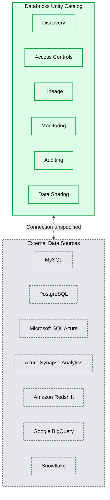
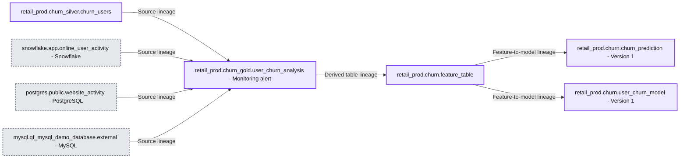

# Introducing Lakehouse Federation Capabilities in Unity Catalog

*Discover, query, govern all your data - no matter where it lives*

- Source: https://www.databricks.com/blog/introducing-lakehouse-federation-capabilities-unity-catalog
- Published: 2023-06-28
- Authors: Matei Zaharia, Andrew Li, Can Efeoglu, Cyrielle Simeone, Sachin Thakur, Daniel Tenedorio
- Categories: platform, data-warehousing, platform-and-products-and-announcements
- Images: 3 total, 2 extracted as architecture

Lakehouse Federation is now in public preview!

 

Data teams face many challenges to quickly access the right data primarily due to data fragmentation, time and cost involved in consolidating data, and difficulties in managing data governance across many systems.

That's why today at [Data+AI Summit](https://www.databricks.com/dataaisummit/), we are thrilled to announce Lakehouse Federation capabilities in Unity Catalog that allow organizations to build a highly scalable and performant data mesh architecture with unified governance. 

[Unity Catalog](https://www.databricks.com/product/unity-catalog) provides a unified [governance](https://www.databricks.com/discover/data-governance)solution for data and AI. Lakehouse Federation capabilities in Unity Catalog allow you to discover, query, and govern data across data platforms including MySQL, PostgreSQL, Amazon Redshift, Snowflake, Azure SQL Database, Azure Synapse, Google’s BigQuery, and more from within Databricks without moving or copying the data, all within a simplified and unified experience. This means Unity Catalog's advanced security features such as row and column level access controls, discovery features like tags, and data lineage will be available across these external data sources, ensuring consistent governance.

*Lakehouse Federation in Unity Catalog*

**Summary:** Databricks Unity Catalog provides six governance capabilities across external data sources through a bidirectional connection.

**Components:**
- Databricks Unity Catalog: governance layer containing the six capabilities below.
- Discovery: Unity Catalog capability.
- Access Controls: Unity Catalog capability.
- Lineage: Unity Catalog capability.
- Monitoring: Unity Catalog capability.
- Auditing: Unity Catalog capability.
- Data Sharing: Unity Catalog capability.
- External Data Sources: group of external database technologies.
- MySQL: MySQL database.
- PostgreSQL: PostgreSQL database.
- Microsoft SQL Azure: Azure SQL database.
- Azure Synapse Analytics: Azure analytics platform.
- Amazon Redshift: Amazon data warehouse.
- Google BigQuery: Google data warehouse.
- Snowflake: Snowflake data platform.

**Flows:**
- Databricks Unity Catalog -> External Data Sources: dashed connection, payload unspecified.
- External Data Sources -> Databricks Unity Catalog: dashed connection, payload unspecified.

**Numbers:** none

source image: https://www.databricks.com/sites/default/files/inline-images/Blog%20QF_1_1.PNG

*Lakehouse Federation in Unity Catalog*

*“Data scientists and business users alike can now access diverse data sources through a uniform user interface with consistent permissions managed in one place." said Jelle de Jong, Tech Lead at Bayer. "We’re continuously standardizing our data format to Delta Lake, but we’re thrilled that Lakehouse Federation has allowed us to iterate with agility before investing in data extraction.”*

## Data fragmentation is slowing down innovation

Thousands of organizations of all sizes are innovating across the world and all industries with data and AI on the Databricks Lakehouse Platform. But for historical, organizational or technological reasons, data is scattered across many operational and analytics systems, causing more challenges:

1. **Difficult to discover and access all data:** Most organizations have valuable data distributed across multiple data sources. It may be in several databases, a data warehouse, object storage systems, and more. This leads to incomplete data and insights, which hinder customers’ ability to make informed decisions and innovate faster.
2. **Slow execution due to engineering bottlenecks:** To query data across multiple data sources, customers typically need to first move their data from external data sources to their platform of choice. Some data might not even be worth the effort. Some data will take too long before landing in a single, unified location, slowing down innovation.
3. **Weak compliance across siloed systems:** Fragmented governance leads to duplication of efforts, and increases the risk of not being able to monitor and guard against inappropriate access or leakage, which hinders collaboration and data democratization.

## Unify your data estate with Lakehouse Federation in Unity Catalog

Lakehouse Federation addresses these critical pain points and makes it simple for organizations to expose, query, and govern siloed data systems as an extension of their lakehouse. With these new capabilities, you can:

1. **Build a unified view of your data estate:** Automatically classify and discover all your data, structured and unstructured, in one place and enable everyone in your organization to securely access and explore all the data available at their fingertips - no matter where it lives.
2. **Query and combine all data efficiently with a single engine:** Accelerate ad-hoc analysis and prototyping across all your data, analytics and AI use cases on the most complete data - no ingestion required - with a single engine. Advanced query planning across sources and caching ensures optimal query performance even when accessing and combining data from multiple platforms with a single query.
3. **Safeguard data across data sources:** Use one permission model to set and apply access rules and safeguard all your data across data sources. Apply rules like row and column level security, tag-based policies, centralized auditing consistently across platforms, track data usage, and meet compliance requirements with built-in data lineage and auditability.

*Connect to external data sources from Unity Catalog*

*“Lakehouse Federation gives us the ability to combine data — like usage, sales and game telemetry data — from multiple sources, across multiple clouds and view and query it all from one place. Now we leave the data in the original data source, but can utilize it from the Databricks Lakehouse." said Felix Baker, Head of Data Services at SEGA Europe. "Since we no longer have to move our finance data, which is refreshed frequently, it saves us valuable time that can be focused on giving our consumers the best possible gaming experience.”*

*Query across data sources and benefit from built-in data lineage*

**Summary:** Four source tables feed a user churn analysis table, which feeds a feature table linked to two churn model versions through data lineage.

**Components:**

- `retail_prod.churn_silver.churn_users`: Table with `user_id` and `email` string columns.
- `snowflake.app.online_user_activity`: Snowflake table with `USER_ID` and `EMAIL` string columns.
- `postgres.public.website_activity`: PostgreSQL table with `user_id` and `email` string columns.
- `mysql.qf_mysql_demo_database.external`: MySQL table with `user_id` and `event_id` string columns.
- `retail_prod.churn_gold.user_churn_analysis`: Table with `user_id` and `email` string columns and a monitoring alert.
- `retail_prod.churn.feature_table`: Feature table with `user_id` and `email` string columns.
- `retail_prod.churn.churn_prediction`: Model version owned by `dais-gov-keynote`.
- `retail_prod.churn.user_churn_model`: Model version owned by `dais-gov-keynote`.

**Flows:**

- `retail_prod.churn_silver.churn_users -> retail_prod.churn_gold.user_churn_analysis`: Source table lineage.
- `snowflake.app.online_user_activity -> retail_prod.churn_gold.user_churn_analysis`: Source table lineage.
- `postgres.public.website_activity -> retail_prod.churn_gold.user_churn_analysis`: Source table lineage.
- `mysql.qf_mysql_demo_database.external -> retail_prod.churn_gold.user_churn_analysis`: Source table lineage.
- `retail_prod.churn_gold.user_churn_analysis -> retail_prod.churn.feature_table`: Derived table lineage.
- `retail_prod.churn.feature_table -> retail_prod.churn.churn_prediction`: Feature-to-model lineage.
- `retail_prod.churn.feature_table -> retail_prod.churn.user_churn_model`: Feature-to-model lineage.

**Numbers:**

- Additional columns: churn users 10; Snowflake activity 20; PostgreSQL activity 9; MySQL external 6; churn analysis 11; feature table 11.
- Both models display `Version 1` and `1 version`.

source image: https://www.databricks.com/sites/default/files/inline-images/image1%20%281%29.png

*Query across data sources and benefit from built-in data lineage*

*"Lakehouse Federation has enabled us to move more quickly to consolidate our existing data landscape into Unity Catalog. This makes Shell's data governance simpler – more datasets become discoverable in one place, authentication is standardized and querying across datasets with a common programming language becomes possible," said Bryce Bartmann, Chief Digital Technology Advisor at Shell. "Ultimately, it makes us more effective in navigating the transformation happening in the energy sector today."*

These new capabilities coupled with the recently announced [open Hive interface](https://www.databricks.com/blog/extending-databricks-unity-catalog-open-apache-hive-metastore-api) mean that organizations can centralize their data management, discovery, and governance in Unity Catalog, and connect to it from a wide range of computing platforms, including Amazon EMR, Apache Spark, Amazon Athena, Presto, Trino, and others. The new interface eliminates the need for maintaining multiple data catalogs and ensures consistent data governance across these platforms.

## What's next?

These capabilities are currently in public preview so you can get started right away!

We are also extending Unity Catalog’s governance capabilities to various open storage formats including Apache Iceberg and Hudi, with the **public preview** of the Delta Universal Format ("UniForm"). This integration allows Delta tables to be read as if they were Iceberg tables (and soon Apache Hudi as well), making Unity Catalog the only universal catalog that supports all three major open lakehouse storage formats.

Finally, in the future, you will also be able to **push access policies** defined in Unity Catalog, to federated data sources for consistent enforcement wherever data is accessed. This eliminates the need to maintain redundant policy definitions across different governance tools.

Watch the [Data+AI Summit 2023](https://www.databricks.com/dataaisummit/) keynote from Matei Zaharia, co-founder and Chief Technology Officer at Databricks, to learn more.

Register for the Data + AI Summit [here](https://www.databricks.com/dataaisummit/?utm_source=databricks&utm_medium=blog&utm_campaign=7018Y000001RjAoQAK) to join us in person or virtually and explore the latest in data, analytics, and AI!
