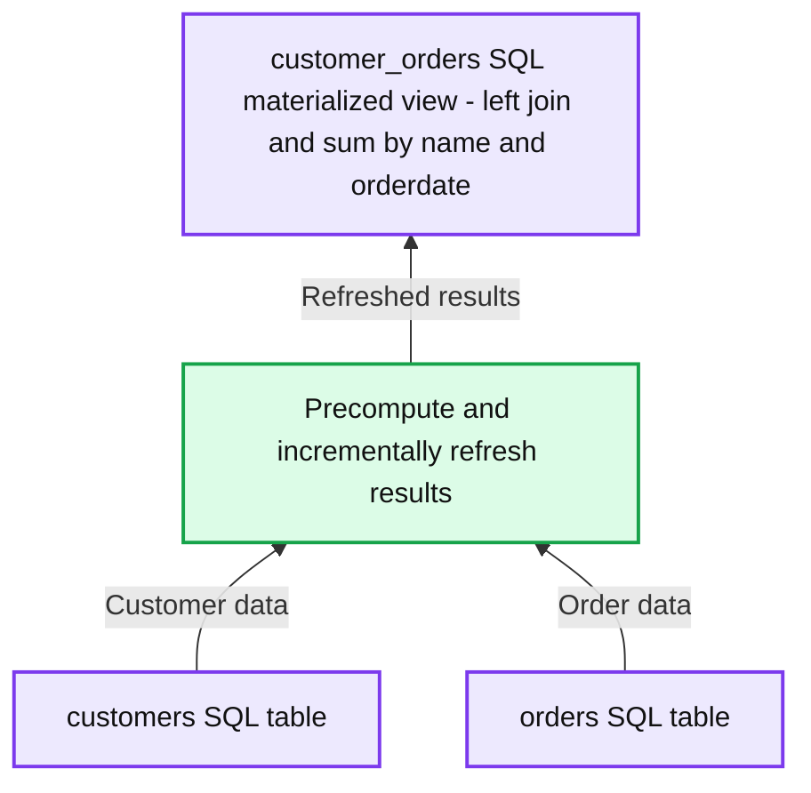
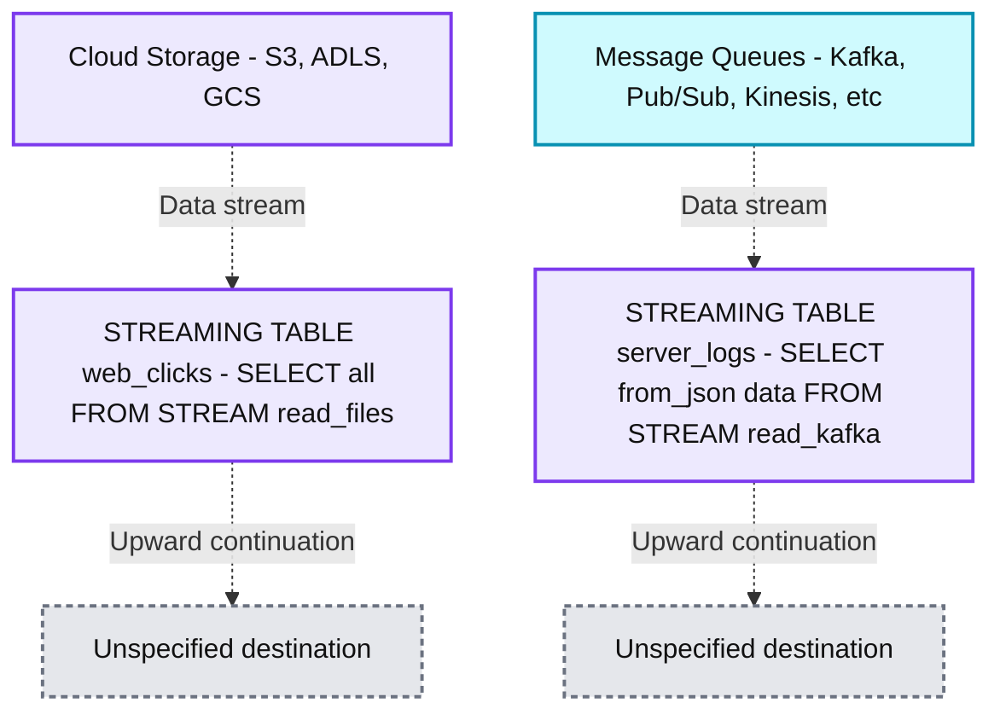

# Introducing Materialized Views and Streaming Tables for Databricks SQL

*Empower data analysts to ingest, transform and deliver fresh data entirely in SQL*

- Source: https://www.databricks.com/blog/introducing-materialized-views-and-streaming-tables-databricks-sql
- Published: 2023-06-28
- Authors: Paul Lappas, Michael Armbrust, Yannis Papakonstantinou, Nitin Sharma, Andreas Neumann
- Categories: platform, announcements, platform-and-products-and-announcements, engineering, data-warehousing
- Images: 5 total, 3 extracted as architecture

We are thrilled to announce that materialized views and streaming tables are now publicly available in [Databricks SQL](https://www.databricks.com/product/databricks-sql) on AWS and Azure. Streaming tables provide incremental ingest from cloud storage and message queues. Materialized views are automatically and incrementally updated as new data arrives. Together, these two capabilities enable infrastructure-free data pipelines that are simple to set up and deliver fresh data to the business. In this blog post, we will explore how these new capabilities empower analysts and analytics engineers to deliver data and analytics applications more effectively in the data warehouse.

## Background

Data warehousing and data engineering are crucial for any data-driven organization. Data warehouses serve as the primary location for analytics and reporting, while data engineering involves creating data pipelines to ingest and transform data.

However, traditional data warehouses are not designed for streaming ingestion and transformation. Ingesting large volumes of data with low latency in a traditional data warehouse is expensive and complex because legacy data warehouses were designed for batch processing. As a result, teams have had to implement clumsy solutions that required configurations outside of the warehouse and needed to use cloud storage as an intermediate staging location. Managing these systems is costly, prone to errors, and complex to maintain.

The [Databricks Lakehouse Platform](https://www.databricks.com/product/data-lakehouse) disrupts this traditional paradigm by providing a unified solution. [Delta Live Tables (DLT)](https://www.databricks.com/product/delta-live-tables) is the best place to do data engineering and streaming, and [Databricks SQL](https://www.databricks.com/product/databricks-sql) provides up to [12x better price/performance](https://www.databricks.com/blog/2021/11/02/databricks-sets-official-data-warehousing-performance-record.html) for analytics workloads on existing data lakes.

Additionally, now partners like dbt can integrate with these native capabilities which we describe in more detail later in this announcement.

## Common challenges faced by data warehouse users

Data warehouses serve as the primary location for analytics and data delivery for internal reporting through business intelligence (BI) applications. Organizations face several challenges in adopting data warehouses:

- **Self-service:** SQL analysts often face the challenge of being dependent on other resources and tools to fix data issues, slowing down the pace at which business needs can be addressed.
- **Slow BI dashboards:** BI dashboards built with large volumes of data tend to return results slowly, hindering interactivity and usability when answering various questions.
- **Stale data:** BI dashboards often present stale data, such as yesterday's data, due to ETL jobs running only at night.

## Use SQL to ingest and transform data without 3rd party tools

Streaming tables and materialized views empower SQL analysts with data engineering best practices. Consider an example of continuously ingesting newly arrived files from an S3 location and preparing a simple reporting table. With Databricks SQL the analyst can quickly discover and preview the files in S3 and set up a simple ETL pipeline in minutes, using only a few lines of code as in the following example:

1- Discover and preview data in S3

2- Ingest data in a streaming fashion

3- Aggregate data incrementally using a materialized view

## What are materialized views?

Materialized views reduce cost and improve query latency by pre-computing slow queries and frequently used computations. In a data engineering context, they are used for transforming data. But they are also valuable for analyst teams in a data warehousing context because they can be used to (1) speed up end-user queries and BI dashboards, and (2) securely share data. Built on top of Delta Live Tables, MVs reduce query latency by pre-computing otherwise slow queries and frequently used computations.

**Summary:** The customer_orders materialized view precomputes customer order totals from the customers and orders tables and refreshes results incrementally.

**Components:**
- customers: source SQL table.
- orders: source SQL table.
- Refresh operation: precomputes and incrementally refreshes results.
- customer_orders: SQL materialized view using a left join on orders.custkey = customers.c_custkey, summing orders.amount and grouping by name and orderdate.

**Flows:**
- customers -> Refresh operation: customer data for the materialized view.
- orders -> Refresh operation: order data for the materialized view.
- Refresh operation -> customer_orders: precomputed and incrementally refreshed results.

**Numbers:** none

source image: https://www.databricks.com/sites/default/files/inline-images/db-675-blog-img-1.png

Benefits of materialized views:

- Accelerate BI dashboards. Because MVs precompute data, end users' queries are much faster because they don’t have to re-process the data by querying the base tables directly.
- Reduce data processing costs. MVs results are refreshed incrementally avoiding the need to completely rebuild the view when new data arrives.
- Improve data access control for secure sharing. More tightly govern what data can be seen by consumers by controlling access to base tables.

## What are streaming tables?

Ingestion in DBSQL is accomplished with streaming tables (STs). You can think of STs as ideal for bringing data into “bronze” tables. STs enable continuous, scalable ingestion from any data source including cloud storage, message buses (EventHub, Apache Kafka) and more.

**Summary:** Cloud storage and message queues feed SQL streaming tables through incremental data streams.

**Components:**

- Cloud Storage: S3, ADLS, and GCS.
- `web_clicks`: SQL streaming table created with `SELECT * FROM STREAM read_files('s3://mybucket')`.
- Message Queues: Kafka, Pub/Sub, Kinesis, and other messaging services.
- `server_logs`: SQL streaming table created with `SELECT from_json(...) data FROM STREAM read_kafka(...)`.

**Flows:**

- Cloud Storage -> `web_clicks`: Data stream from cloud files.
- Message Queues -> `server_logs`: Streaming messages read through Kafka and parsed from JSON.
- `web_clicks` -> Unspecified destination: Dashed upward continuation.
- `server_logs` -> Unspecified destination: Dashed upward continuation.

**Numbers:** none

source image: https://www.databricks.com/sites/default/files/inline-images/db-675-blog-img-2.png

Benefits of streaming tables:

- Unlock real-time use cases. Ability to support real-time analytics/BI, machine learning, and operational use cases with streaming data.
- Better scalability. More efficiently handle high volumes of data via incremental processing vs large batches.
- Enable more practitioners. Simple SQL syntax makes data streaming accessible to all data engineers and analysts.

## Customer story: how Adobe and Danske Spil accelerate dashboard queries with materialized views

**Summary:** Cloud storage and message queues feed Bronze streaming tables, which supply a Silver materialized view and then a Gold materialized view.

**Components:**
- Cloud Storage: S3, ADLS, GCS.
- Message Queues: Kafka, Pub/Sub, Kinesis, etc.
- Bronze Layer: contains `customers` and `orders` streaming tables.
- `customers`: streaming table.
- `orders`: streaming table.
- First circular-arrow symbol: refresh between Bronze and Silver.
- Silver Layer: contains the `customer_orders` materialized view.
- `customer_orders`: materialized view.
- Second circular-arrow symbol: refresh between Silver and Gold.
- Gold Layer: contains the `daily_orders` materialized view.
- `daily_orders`: materialized view.

**Flows:**
- Cloud Storage -> customers: source data ingestion.
- Message Queues -> orders: message ingestion.
- customers -> first refresh: customer data.
- orders -> first refresh: order data.
- First refresh -> customer_orders: materialized view refresh.
- customer_orders -> second refresh: customer order data.
- Second refresh -> daily_orders: materialized view refresh.

**Numbers:** none

source image: https://www.databricks.com/sites/default/files/inline-images/db-675-blog-img-3.png

```mermaid
%% Cloud sources feed Bronze streaming tables and Silver and Gold materialized views
flowchart LR
    CS[Cloud Storage - S3, ADLS, GCS]
    MQ[Message Queues - Kafka, Pub/Sub, Kinesis, etc.]

    subgraph Bronze Layer
        C[customers - Streaming Table]
        O[orders - Streaming Table]
    end

    R1[Refresh]

    subgraph Silver Layer
        CO[customer_orders - Materialized View]
    end

    R2[Refresh]

    subgraph Gold Layer
        DO[daily_orders - Materialized View]
    end

    CS -.->|Source data ingestion| C
    MQ -.->|Message ingestion| O
    C -->|Customer data| R1
    O -->|Order data| R1
    R1 -->|Refresh| CO
    CO -->|Customer order data| R2
    R2 -->|Refresh| DO

    classDef client fill:#dbeafe,stroke:#2563eb,stroke-width:2px,color:#111
    classDef service fill:#dcfce7,stroke:#16a34a,stroke-width:2px,color:#111
    classDef store fill:#ede9fe,stroke:#7c3aed,stroke-width:2px,color:#111
    classDef cache fill:#fef3c7,stroke:#d97706,stroke-width:2px,color:#111
    classDef queue fill:#cffafe,stroke:#0891b2,stroke-width:2px,color:#111
    classDef critical fill:#fee2e2,stroke:#dc2626,stroke-width:4px,color:#111
    classDef external fill:#e5e7eb,stroke:#6b7280,stroke-width:2px,color:#111,stroke-dasharray:4 3
    classDef decision fill:#fce7f3,stroke:#db2777,stroke-width:2px,color:#111

    class CS external
    class MQ queue
    class C,O,CO,DO store
    class R1,R2 service
```

Databricks SQL empowers SQL and data analysts to easily ingest, clean, and enrich data to meet the needs of the business without relying on third-party tools. Everything can be done entirely in SQL, streamlining the workflow.

By leveraging materialized views and streaming tables, you can:

- **Empower your analysts:** SQL and data analysts can easily ingest, clean, and enrich data to quickly meet the needs of your business. Because everything can be done entirely in SQL, no 3rd party tools are needed.
- **Speed up BI dashboards:** Create MV’s to accelerate SQL analytics and BI reports by pre-computing results ahead of time.
- **Move to real-time analytics:** Combine MV’s with streaming tables to create incremental data pipelines for real-time use cases. You can set up streaming data pipelines to do ingestion and transformation directly in the Databricks SQL warehouse.

Adobe has an advanced approach to AI, with a mission of making the world more creative, productive, and personalized with artificial intelligence as a co-pilot that amplifies human ingenuity. As a leading preview customer of Materialized Views on Databricks SQL, they have seen enormous technical and business benefits that help them deliver on this mission:

> “The conversion to Materialized Views has resulted in a drastic improvement in query performance, with the execution time decreasing from 8 minutes to just 3 seconds. This enables our team to work more efficiently and make quicker decisions based on the insights gained from the data. Plus, the added cost savings have really helped.” —Karthik Venkatesan, Security Software Engineering Sr. Manager, Adobe

Founded in 1948, Danske Spil is Denmark’s national lottery and was one of our early preview customers for DB SQL Materialized Views. Søren Klein, Data Engineering Team Lead, shares his perspective on what makes Materialized Views so valuable for the organization:

> “At Danske Spil we use Materialized Views to speed up the performance of our website tracking data. With this feature we avoid the creation of unnecessary tables and added complexity, while getting the speed of a persisted view that accelerates the end user reporting solution.” —Søren Klein, Data Engineering Team Lead, Danske Spil

## Easy streaming ingestion and transformation with dbt

Databricks and dbt Labs collaborate to simplify real-time analytics engineering on the lakehouse architecture. The combination of dbt's highly popular analytics engineering framework with the Databricks Lakehouse Platform provides powerful capabilities:

- **dbt + Streaming Tables:** Streaming ingestion from any source is now built-in to dbt projects. Using SQL, analytics engineers can define and ingest cloud/streaming data directly within their dbt pipelines.
- **dbt + Materialized Views:** Building efficient pipelines becomes easier with dbt, leveraging Databricks' powerful incremental refresh capabilities. Users can use dbt to build and run pipelines backed by MVs, reducing infrastructure costs with efficient, incremental computation.

## Takeaways

Data warehousing and data engineering are critical components of any data-driven company. However, managing separate solutions for each aspect is costly, error-prone, and challenging to maintain. The Databricks Lakehouse Platform brings the best data engineering capabilities natively into Databricks SQL, empowering SQL users with a unified solution. Additionally, our integration with partners like dbt empowers our joint customers to leverage these unique capabilities to deliver faster insights, real-time analytics, and streamlined data engineering workflows.

You can get started today with [Databricks](https://www.databricks.com/try-databricks) and [Databricks SQL](https://www.databricks.com/product/databricks-sql), or review the documentation for [materialized views](https://docs.databricks.com/sql/user/materialized-views.html?_gl=1*1jtun0f*rs_ga*OTI3OTkzMjMtYTQ3Yi00Y2E3LWJjNzctZGYzMTZkNjYxYTcy*rs_ga_PQSEQ3RZQC*MTY4Nzk1NzcxNzgxOS4xNjIuMS4xNjg3OTU4OTczLjU2LjAuMA..*_gcl_aw*R0NMLjE2ODc4MTU0MDkuQ2owS0NRanc3dVNrQmhER0FSSXNBTUNaTkp1bzZ0MXpZc0RQYTczdnhWcUhkYlZHNTljMnB4SFZpVTNUYnhOTFJpUVFQQ3JwXzBDV21JMGFBbUZsRUFMd193Y0I.*_gcl_au*MTM5NzkxMjc4MC4xNjg2NzYxNTEx&_ga=2.51163177.1076429778.1687804663-1653206497.1670536773&_gac=1.190296281.1687815410.Cj0KCQjw7uSkBhDGARIsAMCZNJuo6t1zYsDPa73vxVqHdbVG59c2pxHViU3TbxNLRiQQPCrp_0CWmI0aAmFlEALw_wcB) and [streaming tables.](https://docs.databricks.com/sql/load-data-streaming-table.html)
