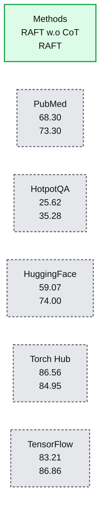

# Introducing Meta Llama 3.2 on Databricks: faster language models and powerful multi-modal models

*Tune new Llama 3.2 models to achieve high quality and speed for enterprise use cases*

- Source: https://www.databricks.com/blog/introducing-meta-llama-32-databricks-faster-language-models-and-powerful-multi-modal-models
- Published: 2024-09-25
- Authors: Daniel King, Hanlin Tang, Patrick Wendell
- Categories: data-science-machine-learning, databricks-ai
- Images: 1 total, 1 extracted as architecture

We are excited to partner with Meta to launch the latest models in the Llama 3 series on the [Databricks Data + AI Platform](https://www.databricks.com/product/data-intelligence-platform). The small textual models in this Llama 3.2 release enable customers to build fast real-time systems, and the larger multi-modal models mark the first time the Llama models gain visual understanding. Both provide key components for customers on Databricks to build [compound AI systems](https://www.databricks.com/glossary/compound-ai-systems) that enable data intelligence – connecting these models to their enterprise data. 

As with the rest of the Llama series, Llama 3.2 models are available today in Databricks, allowing you to tune them securely and efficiently on your data, and easily plug them into your GenAI applications with [Agent Bricks AI Gateway](https://docs.databricks.com/en/ai-gateway/index.html) and [Agent Framework](https://docs.databricks.com/en/generative-ai/retrieval-augmented-generation.html). 

*Start using Llama 3.2 on Databricks today! *[*Deploy the model*](https://docs.databricks.com/en/machine-learning/foundation-models/deploy-prov-throughput-foundation-model-apis.html#requirements)* and use it in the *[*Agent Bricks AI Playground*](https://docs.databricks.com/en/large-language-models/ai-playground.html)*, and use *[*Databricks Model Training*](https://docs.databricks.com/en/large-language-models/foundation-model-training/index.html)* to customize the models on your data. Sign up to this *[*webinar*](https://www.databricks.com/resources/webinar/shift-general-data-intelligence)* for a deep dive on Llama 3.2 from Meta and Databricks.*

> This year, Llama has achieved 10x growth further supporting our belief that open source models drive innovation. Together with Databricks solutions, our new Llama 3.2 models will help organizations build Data Intelligence by accurately and securely working on an enterprise’s proprietary data. We’re thrilled to continue working with Databricks to help enterprises customize their AI systems with their enterprise data. - Ahmad Al-Dahle, Head of GenAI, Meta

## **What's New in Llama 3.2?**

The Llama 3.2 series includes smaller models for use cases requiring super low latency, and multimodal models to enable new visual understanding use cases.

- **Llama-3.2-1B-Instruct **and **Llama-3.2-3B-Instruct** are purpose built for low-latency and low-cost enterprise use cases. They excel at “simpler” tasks, like entity extraction, multilingual translation, summarization, and RAG. With tuning on your data, these models are a fast and cheap alternative for specific tasks relevant to your business.
- **Llama-3.2-11B-Vision-Instruct **and **Llama-3.2-90B-Vision-Instruct** enable enterprises to use the powerful and open Llama series for visual understanding tasks, like document parsing and product description generation.
- The multimodal models also come with a new Llama guard safety model, **Llama-Guard-3-11B-Vision**, enabling responsible deployment of multimodal applications.
- All models support the expanded 128k context length of the Llama 3.1 series, to handle super long documents. Long context simplifies and improves the quality of RAG and agentic applications by reducing the reliance on chunking and retrieval.

Additionally, Meta is releasing the [Llama Stack](https://github.com/meta-llama/llama-stack), a software layer to make building applications easier. Databricks looks forward to integrating its APIs into the Llama Stack.

## **Faster and cheaper**

The new small models in the Llama 3.2 series provide an excellent new option for latency and cost sensitive use cases. There are many generative AI use cases that don’t require the full power of a general purpose AI model, and coupled with data intelligence on your data, smaller, task-specific models can open up new use cases that require low latency or cost, like code completion, real-time summarization, and high volume entity extraction. Accessible in [Unity Catalog](https://docs.databricks.com/en/generative-ai/pretrained-models.html), you can easily swap the new models into your applications built on Databricks. To enhance the quality of the models on your specific task, you can use a more powerful model, like Meta Llama 3.1 405B, to [generate synthetic training data](https://docs.databricks.com/en/large-language-models/foundation-model-training/create-fine-tune-run.html#generate-synthetic-data-using-llama-31-405b-instruct-notebook) from a small set of seed examples, and then use the synthetic training data to fine-tune Llama 3.2 1B or 3B to achieve high quality and low latency on your data. All of this is accessible in a unified experience on Databricks.

Fine-tuning Llama 3.2 on your data in Databricks is just one simple command:  

See the Databricks Model Training [docs](https://docs.databricks.com/en/large-language-models/foundation-model-training/index.html) for more information and tutorials!

## **New open multimodal models**

The Llama 3.2 series includes powerful, open multimodal models, allowing both visual and textual input. Multimodal models open many new use cases for enterprise data intelligence. In document processing, they can be used to analyze scanned documents alongside textual input to provide more complete and accurate analysis. In e-commerce, they enable visual search where users can upload a photo of a product to find similar items based on generated descriptions. For marketing teams, these models streamline tasks like generating social media captions based on images. We are excited to offer usage of these models [on Databricks](https://docs.databricks.com/en/_extras/notebooks/source/machine-learning/large-language-models/llama-3.2-multimodal.html), and stay tuned for more on this front!

Here is an example of asking Llama 3.2 to parse a table into JSON representation:

Image (Table 2 from the [RAFT paper](https://arxiv.org/pdf/2403.10131)):

**Summary:** RAFT outperforms RAFT w.o CoT on PubMed, HotpotQA, HuggingFace, and TensorFlow, while scoring lower on Torch Hub.

**Components:**
- RAFT w.o CoT: evaluated method without CoT.
- RAFT: evaluated method.
- PubMed: evaluation column.
- HotpotQA: evaluation column.
- HuggingFace: evaluation column.
- Torch Hub: evaluation column.
- TensorFlow: evaluation column.

**Flows:**
- none. No arrows are visible.

**Numbers:**

| Method | PubMed | HotpotQA | HuggingFace | Torch Hub | TensorFlow |
|---|---:|---:|---:|---:|---:|
| RAFT w.o CoT | 68.30 | 25.62 | 59.07 | **86.56** | 83.21 |
| RAFT | **73.30** | **35.28** | **74.00** | 84.95 | **86.86** |

No units are shown. Bold formatting reproduces the image.

source image: https://www.databricks.com/sites/default/files/inline-images/image1_36.png

Prompt: Parse the table into a JSON representation.

Output: 

## **Customers Innovate with Databricks and Open Models**

Many Databricks customers are already leveraging Llama 3 models to drive their GenAI initiatives. We’re all looking forward to seeing what they will do with Llama 3.2.

- “Databricks’ scalable model management capabilities enable us to seamlessly integrate advanced open source LLMs like Meta Llama into our productivity engine, allowing us to bring new AI technologies to our customers quickly.” - **Bryan McCann, Co-Founder/CTO, You.com**
- “Databricks enables us to deliver enhanced services to our clients that demonstrate the powerful relationship between advanced AI and effective data management while making it easy for us to integrate cutting-edge GenAI technologies like Meta Llama that future-proof our services." - **Colin Wenngatz, Vice President of Data Analytics, MNP**
- “The Databricks Data + AI Platform allows us to securely deploy state-of-the-art AI models like Meta Llama within our own environment without exposing sensitive data. This level of control is essential for maintaining data privacy and meeting healthcare standards." - **Navdeep Alam, Chief Technology Officer, Abacus Insights**
- "Thanks to Databricks, we are able to orchestrate prompt optimization and instruction fine-tuning for open source LLMs like Meta Llama that ingest domain-specific language from a proprietary corpus, improving the performance  of behavioral simulation analysis and increasing our operational efficiency." - **Chris Coughlin, Senior Manager, DDI**

## **Getting started with Llama 3.2 on Databricks**

Follow the [deployment instructions](https://docs.databricks.com/en/machine-learning/foundation-models/deploy-prov-throughput-foundation-model-apis.html#requirements) to try Llama 3.2 directly from your workspace. For more information, please refer to the following resources:

- Read Meta’s [Llama 3.2 launch blog post](https://ai.meta.com/blog/llama-3-2-connect-2024-vision-edge-mobile-devices/)
- View and run the [multimodal notebook](https://docs.databricks.com/en/_extras/notebooks/source/machine-learning/large-language-models/llama-3.2-multimodal.html)
- Explore the Foundation Model [Getting Started Guide](https://docs.databricks.com/en/large-language-models/llm-serving-intro.html)
- Visit the Databricks Model Training [docs](https://docs.databricks.com/en/large-language-models/foundation-model-training/index.html) to get started fine-tuning on your data
- Apply LLMs on large batches of data with [AI functions](https://docs.databricks.com/en/large-language-models/ai-functions.html)
- Build Production-quality Agentic and RAG Apps with [Agent Framework and Evaluation](https://www.databricks.com/blog/announcing-mosaic-ai-agent-framework-and-agent-evaluation)
- View the [fine-tuning](https://www.databricks.com/product/pricing/mosaic-foundation-model-training) and [serving](https://www.databricks.com/product/pricing/foundation-model-serving) pricing pages

Attend the next [Databricks GenAI Webinar](https://www.databricks.com/resources/webinar/shift-general-data-intelligence)on 10/8/24: The Shift to Data Intelligence where Ash Jhaveri, VP at Meta will discuss Open Source AI and the future of Meta Llama models
